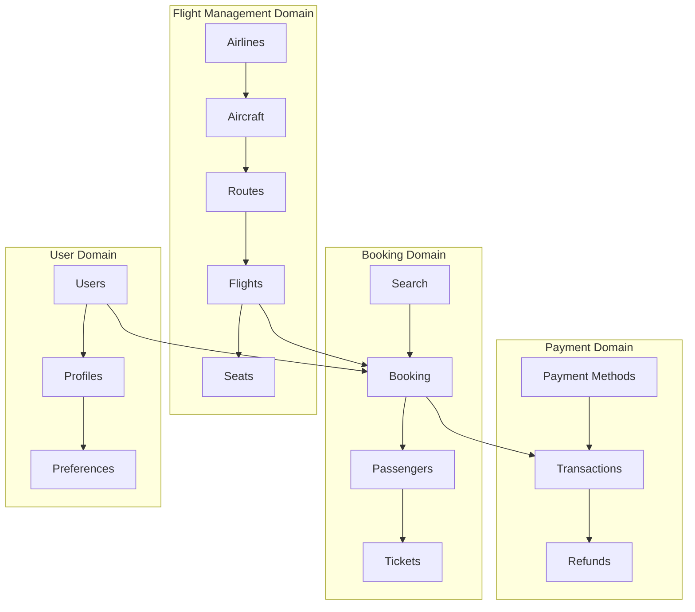
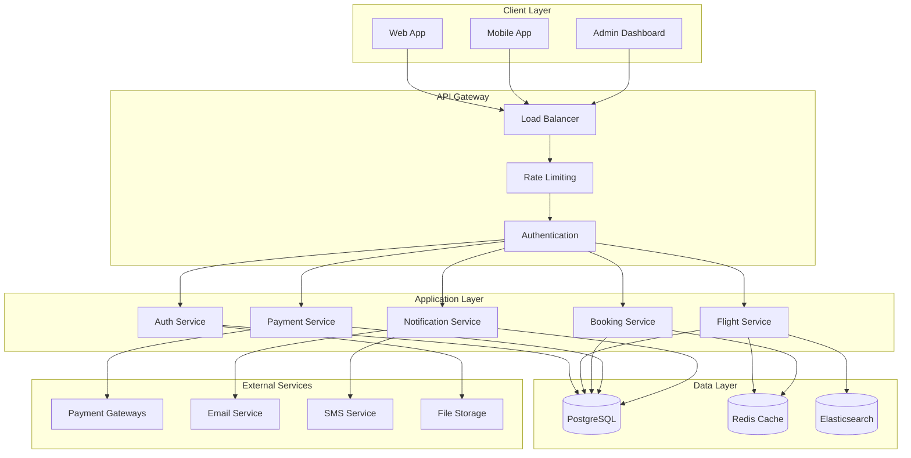

# 🛫 Hệ Thống Booking Máy Bay - Thiết Kế Hoàn Chỉnh

> **Mục tiêu**: Xây dựng hệ thống đặt vé máy bay có thể xử lý lưu lượng truy cập đồng thời cao với NestJS, TypeScript, PostgreSQL và Drizzle ORM

---

## 📋 Mục Lục

1. [Tổng Quan Hệ Thống](#1-tổng-quan-hệ-thống)
2. [Phân Tích Codebase Hiện Tại](#2-phân-tích-codebase-hiện-tại)
3. [Thiết Kế Database Schema](#3-thiết-kế-database-schema)
4. [Các Phase Phát Triển](#4-các-phase-phát-triển)
5. [API Endpoints Structure](#5-api-endpoints-structure)
6. [Technical Architecture](#6-technical-architecture)
7. [Performance & Scalability](#7-performance--scalability)
8. [Security & Best Practices](#8-security--best-practices)

---

## 1. Tổng Quan Hệ Thống

### 🎯 Vision & Scope

**Hệ Thống Booking Máy Bay** - Một platform đặt vé máy bay trực tuyến với khả năng xử lý:

- **10,000+ concurrent users**
- **Real-time seat availability**
- **Multiple airlines management**
- **Complex pricing strategies**
- **International routes**
- **Multi-currency support**

### 🏗️ Core Domains



### 🚀 Key Features

#### **Core Features**

- ✈️ **Flight Search & Filtering** (Route, Date, Price, Duration)
- 🎫 **Real-time Booking** with seat selection
- 💳 **Multiple Payment Methods** (Card, Bank Transfer, E-wallet)
- 👥 **Passenger Management** (Adult, Child, Infant)
- 📱 **Mobile-First Design** with PWA support

#### **Advanced Features**

- 🔄 **Multi-city & Round-trip** booking
- 💺 **Seat Maps** với real-time availability
- ⚡ **Dynamic Pricing** theo demand
- 🌍 **Multi-currency** support
- 📧 **Smart Notifications** (SMS, Email, Push)
- 🎯 **Loyalty Program** integration

---

## 2. Phân Tích Codebase Hiện Tại

### 📊 Strengths của Codebase

#### **✅ Kiến Trúc Tốt**

- **Domain-Driven Design** với modules tách biệt rõ ràng
- **Clean Architecture** layers (Controller → Service → Repository)
- **Global Guards & Pipes** cho security & validation
- **Prisma ORM** với schema migrations

#### **✅ Security Implementation**

- **JWT-based Authentication** với refresh tokens
- **Role-Based Access Control (RBAC)**
- **API Rate Limiting** với Throttler
- **Input Validation** với Zod schemas

#### **✅ Scalable Features**

- **WebSocket Support** cho real-time features
- **Queue System** với BullMQ cho background jobs
- **Internationalization (i18n)** support
- **File Upload** với S3 integration

### 🔄 Patterns Có Thể Reuse

#### **1. Authentication System**

```typescript
// Có thể reuse hoàn toàn
src/routes/auth/          // JWT, OAuth, 2FA
src/shared/guards/        // Guards cho API protection
src/shared/decorators/    // Custom decorators
```

#### **2. Database Patterns**

```typescript
// Audit trails pattern
createdBy, updatedBy, deletedBy fields
Soft delete với deletedAt
Prisma schema với relations
```

#### **3. API Structure**

```typescript
// Controller → Service → Repository pattern
Zod validation cho input/output
Standardized error handling
Internationalization support
```

---

## 3. Thiết Kế Database Schema

### 🛢️ Core Tables Design

#### **Airlines Management**

```sql
-- Airlines (Hãng Máy Bay)
CREATE TABLE airlines (
    id SERIAL PRIMARY KEY,
    iata_code VARCHAR(3) UNIQUE NOT NULL,     -- VN, VJ, QH
    icao_code VARCHAR(4) UNIQUE NOT NULL,     -- HVN, VJC, BBV
    name VARCHAR(255) NOT NULL,               -- Vietnam Airlines
    logo_url VARCHAR(500),
    country_code VARCHAR(3) NOT NULL,         -- VNM, USA, SGP
    status airline_status DEFAULT 'ACTIVE',  -- ACTIVE, SUSPENDED, INACTIVE
    created_at TIMESTAMP DEFAULT NOW(),
    updated_at TIMESTAMP DEFAULT NOW(),
    created_by INTEGER REFERENCES users(id),
    updated_by INTEGER REFERENCES users(id),
    deleted_at TIMESTAMP,
    deleted_by INTEGER REFERENCES users(id)
);

-- Aircraft Types (Loại Máy Bay)
CREATE TABLE aircraft_types (
    id SERIAL PRIMARY KEY,
    airline_id INTEGER REFERENCES airlines(id),
    model VARCHAR(100) NOT NULL,              -- A320, B737, A350
    manufacturer VARCHAR(100) NOT NULL,       -- Airbus, Boeing
    total_seats INTEGER NOT NULL,
    seat_configuration JSONB NOT NULL,       -- Layout chi tiết ghế
    created_at TIMESTAMP DEFAULT NOW(),
    updated_at TIMESTAMP DEFAULT NOW()
);

-- Airports (Sân Bay)
CREATE TABLE airports (
    id SERIAL PRIMARY KEY,
    iata_code VARCHAR(3) UNIQUE NOT NULL,     -- SGN, HAN, DAD
    icao_code VARCHAR(4) UNIQUE NOT NULL,     -- VVTS, VVNB, VVDN
    name VARCHAR(255) NOT NULL,
    city VARCHAR(100) NOT NULL,
    country_code VARCHAR(3) NOT NULL,
    timezone VARCHAR(50) NOT NULL,            -- Asia/Ho_Chi_Minh
    coordinates POINT,                        -- GPS coordinates
    status airport_status DEFAULT 'ACTIVE',
    created_at TIMESTAMP DEFAULT NOW(),
    updated_at TIMESTAMP DEFAULT NOW()
);
```

#### **Flight Management**

```sql
-- Routes (Tuyến Bay)
CREATE TABLE routes (
    id SERIAL PRIMARY KEY,
    airline_id INTEGER REFERENCES airlines(id),
    origin_airport_id INTEGER REFERENCES airports(id),
    destination_airport_id INTEGER REFERENCES airports(id),
    flight_number VARCHAR(10) NOT NULL,       -- VN210, VJ123
    distance_km INTEGER NOT NULL,
    estimated_duration INTEGER NOT NULL,      -- Phút
    status route_status DEFAULT 'ACTIVE',
    created_at TIMESTAMP DEFAULT NOW(),
    updated_at TIMESTAMP DEFAULT NOW(),

    UNIQUE(airline_id, flight_number)
);

-- Flights (Chuyến Bay Cụ Thể)
CREATE TABLE flights (
    id SERIAL PRIMARY KEY,
    route_id INTEGER REFERENCES routes(id),
    aircraft_type_id INTEGER REFERENCES aircraft_types(id),

    -- Schedule
    departure_time TIMESTAMP NOT NULL,
    arrival_time TIMESTAMP NOT NULL,
    departure_terminal VARCHAR(10),
    arrival_terminal VARCHAR(10),

    -- Status & Pricing
    status flight_status DEFAULT 'SCHEDULED',  -- SCHEDULED, BOARDING, DEPARTED, ARRIVED, CANCELLED, DELAYED
    base_price DECIMAL(12,2) NOT NULL,
    available_seats INTEGER NOT NULL,
    total_seats INTEGER NOT NULL,

    -- Operational
    gate VARCHAR(10),
    check_in_start TIMESTAMP,
    check_in_end TIMESTAMP,
    boarding_start TIMESTAMP,

    created_at TIMESTAMP DEFAULT NOW(),
    updated_at TIMESTAMP DEFAULT NOW(),

    INDEX idx_flights_route_departure (route_id, departure_time),
    INDEX idx_flights_status (status),
    INDEX idx_flights_departure_time (departure_time)
);

-- Seat Classes (Hạng Ghế)
CREATE TABLE seat_classes (
    id SERIAL PRIMARY KEY,
    name VARCHAR(50) NOT NULL,                -- Economy, Business, First
    code VARCHAR(10) NOT NULL,                -- Y, C, F
    description TEXT,
    amenities JSONB,                          -- Meal, Baggage, etc.
    created_at TIMESTAMP DEFAULT NOW()
);

-- Flight Seat Pricing (Giá Ghế Theo Chuyến Bay)
CREATE TABLE flight_seat_pricing (
    id SERIAL PRIMARY KEY,
    flight_id INTEGER REFERENCES flights(id),
    seat_class_id INTEGER REFERENCES seat_classes(id),
    price DECIMAL(12,2) NOT NULL,
    available_seats INTEGER NOT NULL,

    UNIQUE(flight_id, seat_class_id)
);

-- Seats (Ghế Cụ Thể)
CREATE TABLE seats (
    id SERIAL PRIMARY KEY,
    aircraft_type_id INTEGER REFERENCES aircraft_types(id),
    seat_number VARCHAR(10) NOT NULL,         -- 12A, 15F
    seat_class_id INTEGER REFERENCES seat_classes(id),
    row_number INTEGER NOT NULL,
    seat_letter VARCHAR(2) NOT NULL,          -- A, B, C, D, E, F
    is_window BOOLEAN DEFAULT false,
    is_aisle BOOLEAN DEFAULT false,
    is_emergency_exit BOOLEAN DEFAULT false,

    UNIQUE(aircraft_type_id, seat_number)
);
```

#### **Booking System**

```sql
-- Bookings (Đặt Chỗ)
CREATE TABLE bookings (
    id SERIAL PRIMARY KEY,
    booking_reference VARCHAR(10) UNIQUE NOT NULL,  -- PNR: ABC123
    user_id INTEGER REFERENCES users(id),

    -- Contact Information
    contact_email VARCHAR(255) NOT NULL,
    contact_phone VARCHAR(20) NOT NULL,

    -- Booking Details
    total_amount DECIMAL(12,2) NOT NULL,
    currency_code VARCHAR(3) DEFAULT 'VND',
    payment_status payment_status DEFAULT 'PENDING',
    booking_status booking_status DEFAULT 'CONFIRMED',

    -- Timestamps
    booked_at TIMESTAMP DEFAULT NOW(),
    expires_at TIMESTAMP NOT NULL,            -- Thời hạn thanh toán
    cancelled_at TIMESTAMP,

    created_at TIMESTAMP DEFAULT NOW(),
    updated_at TIMESTAMP DEFAULT NOW(),

    INDEX idx_bookings_user_id (user_id),
    INDEX idx_bookings_reference (booking_reference),
    INDEX idx_bookings_status (booking_status, payment_status)
);

-- Passengers (Hành Khách)
CREATE TABLE passengers (
    id SERIAL PRIMARY KEY,
    booking_id INTEGER REFERENCES bookings(id),

    -- Personal Information
    title VARCHAR(10) NOT NULL,               -- Mr, Ms, Mrs, Master, Miss
    first_name VARCHAR(100) NOT NULL,
    last_name VARCHAR(100) NOT NULL,
    date_of_birth DATE NOT NULL,
    gender passenger_gender NOT NULL,         -- MALE, FEMALE, OTHER
    nationality VARCHAR(3) NOT NULL,          -- Country code

    -- Documents
    passport_number VARCHAR(50),
    passport_expiry DATE,
    passport_country VARCHAR(3),

    -- Passenger Type
    passenger_type passenger_type NOT NULL,   -- ADULT, CHILD, INFANT

    created_at TIMESTAMP DEFAULT NOW(),
    updated_at TIMESTAMP DEFAULT NOW()
);

-- Flight Bookings (Ghế Đã Đặt)
CREATE TABLE flight_bookings (
    id SERIAL PRIMARY KEY,
    booking_id INTEGER REFERENCES bookings(id),
    flight_id INTEGER REFERENCES flights(id),
    passenger_id INTEGER REFERENCES passengers(id),
    seat_id INTEGER REFERENCES seats(id),
    seat_class_id INTEGER REFERENCES seat_classes(id),

    -- Pricing Information
    base_price DECIMAL(12,2) NOT NULL,
    taxes_fees DECIMAL(12,2) NOT NULL DEFAULT 0,
    total_price DECIMAL(12,2) NOT NULL,

    -- Booking Details
    booking_status flight_booking_status DEFAULT 'CONFIRMED',
    check_in_status check_in_status DEFAULT 'NOT_CHECKED_IN',

    created_at TIMESTAMP DEFAULT NOW(),
    updated_at TIMESTAMP DEFAULT NOW(),

    UNIQUE(flight_id, seat_id),               -- Một ghế chỉ có thể được đặt một lần
    INDEX idx_flight_bookings_booking (booking_id),
    INDEX idx_flight_bookings_flight (flight_id),
    INDEX idx_flight_bookings_passenger (passenger_id)
);
```

#### **Payment System**

```sql
-- Payment Methods
CREATE TABLE payment_methods (
    id SERIAL PRIMARY KEY,
    user_id INTEGER REFERENCES users(id),
    type payment_method_type NOT NULL,        -- CREDIT_CARD, BANK_TRANSFER, E_WALLET
    provider VARCHAR(50) NOT NULL,            -- VISA, MASTERCARD, MOMO, ZALOPAY

    -- Card Information (Encrypted)
    card_last_four VARCHAR(4),
    card_brand VARCHAR(20),
    expiry_month INTEGER,
    expiry_year INTEGER,

    -- Other Method Info
    account_info JSONB,                       -- Bank account, e-wallet info

    is_default BOOLEAN DEFAULT false,
    is_active BOOLEAN DEFAULT true,

    created_at TIMESTAMP DEFAULT NOW(),
    updated_at TIMESTAMP DEFAULT NOW()
);

-- Payment Transactions
CREATE TABLE payment_transactions (
    id SERIAL PRIMARY KEY,
    booking_id INTEGER REFERENCES bookings(id),
    payment_method_id INTEGER REFERENCES payment_methods(id),

    -- Transaction Details
    transaction_reference VARCHAR(100) UNIQUE NOT NULL,
    amount DECIMAL(12,2) NOT NULL,
    currency_code VARCHAR(3) NOT NULL,

    -- Status & Processing
    status transaction_status DEFAULT 'PENDING',
    payment_gateway VARCHAR(50) NOT NULL,     -- STRIPE, VNPAY, MOMO
    gateway_transaction_id VARCHAR(100),

    -- Metadata
    metadata JSONB,                           -- Gateway-specific data
    failure_reason TEXT,

    processed_at TIMESTAMP,
    created_at TIMESTAMP DEFAULT NOW(),
    updated_at TIMESTAMP DEFAULT NOW(),

    INDEX idx_transactions_booking (booking_id),
    INDEX idx_transactions_status (status),
    INDEX idx_transactions_reference (transaction_reference)
);
```

### 📊 Enums Definition

```sql
-- Enums cho các trạng thái
CREATE TYPE airline_status AS ENUM ('ACTIVE', 'SUSPENDED', 'INACTIVE');
CREATE TYPE airport_status AS ENUM ('ACTIVE', 'CLOSED', 'UNDER_MAINTENANCE');
CREATE TYPE route_status AS ENUM ('ACTIVE', 'SUSPENDED', 'SEASONAL');
CREATE TYPE flight_status AS ENUM (
    'SCHEDULED', 'BOARDING', 'DEPARTED', 'ARRIVED',
    'CANCELLED', 'DELAYED', 'DIVERTED'
);
CREATE TYPE payment_status AS ENUM ('PENDING', 'PAID', 'FAILED', 'REFUNDED', 'CANCELLED');
CREATE TYPE booking_status AS ENUM (
    'CONFIRMED', 'CANCELLED', 'EXPIRED', 'CHECKED_IN', 'COMPLETED'
);
CREATE TYPE passenger_gender AS ENUM ('MALE', 'FEMALE', 'OTHER');
CREATE TYPE passenger_type AS ENUM ('ADULT', 'CHILD', 'INFANT');
CREATE TYPE flight_booking_status AS ENUM ('CONFIRMED', 'CANCELLED', 'NO_SHOW');
CREATE TYPE check_in_status AS ENUM ('NOT_CHECKED_IN', 'CHECKED_IN', 'BOARDING_PASS_ISSUED');
CREATE TYPE payment_method_type AS ENUM ('CREDIT_CARD', 'DEBIT_CARD', 'BANK_TRANSFER', 'E_WALLET');
CREATE TYPE transaction_status AS ENUM ('PENDING', 'SUCCESS', 'FAILED', 'CANCELLED', 'REFUNDED');
```

---

## 4. Các Phase Phát Triển

### 🚀 Phase 1: Foundation & Core Setup (4-6 tuần)

#### **Week 1-2: Project Setup & Database**

- ✅ **Setup NestJS Project** với TypeScript, Eslint, Prettier
- ✅ **Database Setup** với PostgreSQL và Drizzle ORM
- ✅ **Migration System** setup
- ✅ **Environment Configuration** cho development/staging/production
- ✅ **Docker Setup** cho development environment

#### **Week 3-4: Core Authentication**

- 🔐 **User Management System** (Register, Login, Profile)
- 🔐 **JWT Authentication** với Access/Refresh tokens
- 🔐 **Role-Based Access Control** (Admin, Staff, Customer)
- 🔐 **Password Reset** và **Email Verification**

#### **Week 5-6: Basic Data Management**

- ✈️ **Airlines Management** (CRUD operations)
- 🏢 **Airports Management** với location data
- ✈️ **Aircraft Types** configuration
- 🛣️ **Routes Management** setup

**Deliverables:**

- ✅ Working authentication system
- ✅ Admin panel cho data management
- ✅ API documentation với Swagger
- ✅ Unit tests cho core modules

---

### 🔄 Phase 2: Flight Management System (6-8 tuần)

#### **Week 1-3: Flight Core Features**

- ✈️ **Flight Scheduling** system
- 💺 **Seat Configuration** management
- 💰 **Dynamic Pricing** engine basics
- 📊 **Inventory Management** (Available seats tracking)

#### **Week 4-6: Search & Filtering**

- 🔍 **Flight Search API** với complex filtering
- 📍 **Multi-city & Round-trip** support
- ⚡ **Caching Strategy** cho search performance
- 📱 **Search Suggestions** và autocomplete

#### **Week 7-8: Advanced Features**

- 🎯 **Price Alerts** system
- 📈 **Fare Comparison** tools
- 🌍 **Multi-currency** support
- ⏰ **Schedule Changes** notification

**Deliverables:**

- ✅ Complete flight search functionality
- ✅ Real-time inventory updates
- ✅ Performance optimized APIs
- ✅ Mobile-responsive search interface

---

### 🎫 Phase 3: Booking & Payment System (8-10 tuần)

#### **Week 1-4: Booking Engine**

- 🎫 **Booking Creation** với seat selection
- 👥 **Passenger Management** (Multiple passengers)
- ⏰ **Booking Timeout** mechanism
- 📧 **Booking Confirmation** system

#### **Week 5-8: Payment Integration**

- 💳 **Payment Gateway** integration (Stripe, VNPay)
- 💰 **Multiple Payment Methods** support
- 🔄 **Transaction Management** với retry logic
- 💸 **Refund & Cancellation** handling

#### **Week 9-10: Advanced Booking Features**

- 🎟️ **Group Bookings** support
- 🔄 **Booking Modifications** (Date change, Upgrades)
- 💺 **Seat Preferences** system
- 📱 **Mobile Boarding Pass** generation

**Deliverables:**

- ✅ End-to-end booking flow
- ✅ Secure payment processing
- ✅ Automated confirmation emails
- ✅ Booking management dashboard

---

### 📱 Phase 4: User Experience & Mobile (6-8 tuần)

#### **Week 1-3: Frontend Development**

- 🎨 **Responsive Web Design** với modern UI/UX
- 📱 **Progressive Web App** (PWA) setup
- ⚡ **Performance Optimization** (Lazy loading, Code splitting)
- 🌍 **Internationalization** (Multiple languages)

#### **Week 4-6: Real-time Features**

- 🔄 **WebSocket Integration** cho real-time updates
- 🔔 **Push Notifications** system
- 💬 **Live Chat Support** integration
- 📊 **Real-time Dashboard** cho admins

#### **Week 7-8: Mobile Optimization**

- 📱 **Mobile-first Design** optimization
- 🖼️ **Offline Support** với service workers
- 📲 **App Store Deployment** preparation
- 🔍 **Mobile Search Experience** enhancement

**Deliverables:**

- ✅ Modern, responsive web application
- ✅ PWA với offline capabilities
- ✅ Real-time user experience
- ✅ Mobile app ready codebase

---

### 🚀 Phase 5: Advanced Features & Scalability (8-10 tuần)

#### **Week 1-4: Performance & Scalability**

- ⚡ **Caching Strategy** (Redis, CDN)
- 🔄 **Database Optimization** (Indexing, Query optimization)
- 📈 **Load Balancing** setup
- 🔍 **Search Engine** optimization (Elasticsearch)

#### **Week 5-8: Advanced Business Logic**

- 🎯 **Loyalty Program** integration
- 🎁 **Promotional Codes** & discounts
- 📊 **Analytics & Reporting** system
- 🤖 **Machine Learning** price prediction

#### **Week 9-10: Enterprise Features**

- 🏢 **Corporate Booking** management
- 📋 **Bulk Operations** support
- 🔐 **Advanced Security** features
- 📊 **Business Intelligence** dashboard

**Deliverables:**

- ✅ Highly scalable system architecture
- ✅ Advanced booking features
- ✅ Comprehensive analytics
- ✅ Enterprise-ready platform

---

### 🛡️ Phase 6: Production & Monitoring (4-6 tuần)

#### **Week 1-3: Production Setup**

- 🚀 **Production Deployment** (AWS/GCP/Azure)
- 🔍 **Monitoring & Logging** (ELK Stack, Prometheus)
- 🔒 **Security Hardening** & penetration testing
- 📊 **Performance Monitoring** setup

#### **Week 4-6: Maintenance & Support**

- 🛠️ **CI/CD Pipeline** optimization
- 📈 **Capacity Planning** & auto-scaling
- 🆘 **Incident Response** procedures
- 📚 **Documentation** & training materials

**Deliverables:**

- ✅ Production-ready system
- ✅ Comprehensive monitoring
- ✅ Maintenance procedures
- ✅ Team training completed

---

## 5. API Endpoints Structure

### 🔐 Authentication APIs

```typescript
// Authentication & Authorization
POST / api / v1 / auth / register // User registration
POST / api / v1 / auth / login // User login
POST / api / v1 / auth / refresh // Refresh tokens
POST / api / v1 / auth / logout // User logout
POST / api / v1 / auth / forgot - password // Password reset request
POST / api / v1 / auth / reset - password // Password reset confirm
GET / api / v1 / auth / profile // Get user profile
PUT / api / v1 / auth / profile // Update user profile
POST / api / v1 / auth / verify - email // Email verification
```

### ✈️ Flight Management APIs

```typescript
// Airlines Management
GET    /api/v1/airlines                // List airlines
POST   /api/v1/airlines                // Create airline (Admin)
GET    /api/v1/airlines/:id            // Get airline details
PUT    /api/v1/airlines/:id            // Update airline (Admin)
DELETE /api/v1/airlines/:id            // Delete airline (Admin)

// Airports Management
GET    /api/v1/airports                // List airports
POST   /api/v1/airports                // Create airport (Admin)
GET    /api/v1/airports/:id            // Get airport details
PUT    /api/v1/airports/:id            // Update airport (Admin)
GET    /api/v1/airports/search         // Search airports by city/name

// Flight Search & Management
GET    /api/v1/flights/search          // Search flights
GET    /api/v1/flights/:id             // Get flight details
GET    /api/v1/flights/:id/seats       // Get available seats
POST   /api/v1/flights                 // Create flight (Admin)
PUT    /api/v1/flights/:id             // Update flight (Admin)
DELETE /api/v1/flights/:id             // Cancel flight (Admin)

// Routes Management (Admin)
GET    /api/v1/routes                  // List routes
POST   /api/v1/routes                  // Create route
GET    /api/v1/routes/:id              // Get route details
PUT    /api/v1/routes/:id              // Update route
DELETE /api/v1/routes/:id              // Delete route
```

### 🎫 Booking Management APIs

```typescript
// Booking Operations
GET    /api/v1/bookings               // List user bookings
POST   /api/v1/bookings               // Create new booking
GET    /api/v1/bookings/:reference    // Get booking by PNR
PUT    /api/v1/bookings/:reference    // Modify booking
DELETE /api/v1/bookings/:reference    // Cancel booking

// Seat Selection
GET    /api/v1/flights/:id/seat-map   // Get seat map
POST   /api/v1/bookings/:id/seats     // Select/change seats
GET    /api/v1/bookings/:id/seats     // Get selected seats

// Passenger Management
GET    /api/v1/bookings/:id/passengers     // List passengers
POST   /api/v1/bookings/:id/passengers     // Add passenger
PUT    /api/v1/bookings/:id/passengers/:pid // Update passenger
DELETE /api/v1/bookings/:id/passengers/:pid // Remove passenger

// Check-in Process
POST   /api/v1/bookings/:id/check-in        // Web check-in
GET    /api/v1/bookings/:id/boarding-pass   // Get boarding pass
PUT    /api/v1/bookings/:id/check-in        // Update check-in info
```

### 💳 Payment APIs

```typescript
// Payment Processing
POST   /api/v1/payments/create         // Create payment intent
POST   /api/v1/payments/confirm        // Confirm payment
GET    /api/v1/payments/:id            // Get payment status
POST   /api/v1/payments/:id/refund     // Process refund

// Payment Methods
GET    /api/v1/payment-methods         // List user payment methods
POST   /api/v1/payment-methods         // Add payment method
PUT    /api/v1/payment-methods/:id     // Update payment method
DELETE /api/v1/payment-methods/:id     // Delete payment method

// Webhooks
POST   /api/v1/webhooks/stripe         // Stripe webhook
POST   /api/v1/webhooks/vnpay          // VNPay webhook
POST   /api/v1/webhooks/momo           // MoMo webhook
```

### 📊 Admin & Analytics APIs

```typescript
// Dashboard & Analytics (Admin)
GET    /api/v1/admin/dashboard         // Admin dashboard data
GET    /api/v1/admin/analytics/bookings    // Booking analytics
GET    /api/v1/admin/analytics/revenue     // Revenue analytics
GET    /api/v1/admin/analytics/flights     // Flight performance

// User Management (Admin)
GET    /api/v1/admin/users             // List users
GET    /api/v1/admin/users/:id         // Get user details
PUT    /api/v1/admin/users/:id         // Update user
POST   /api/v1/admin/users/:id/block   // Block/unblock user

// System Configuration (Admin)
GET    /api/v1/admin/config            // System configuration
PUT    /api/v1/admin/config            // Update configuration
GET    /api/v1/admin/logs              // System logs
```

### 🔄 Real-time APIs & WebSocket Events

```typescript
// WebSocket Events
'flight-update'          // Flight status changes
'seat-availability'      // Real-time seat updates
'price-change'           // Dynamic pricing updates
'booking-confirmation'   // Booking status updates
'payment-status'         // Payment processing updates
'notification'           // General notifications

// Real-time REST APIs
GET    /api/v1/real-time/flights/:id/status    // Real-time flight status
GET    /api/v1/real-time/seats/:flightId       // Real-time seat availability
GET    /api/v1/real-time/prices/:routeId       // Real-time pricing
```

---

## 6. Technical Architecture

### 🏗️ System Architecture



### 🛠️ Technology Stack

#### **Backend Framework**

- **NestJS** với TypeScript cho application framework
- **Drizzle ORM** cho database operations (type-safe, performant)
- **PostgreSQL** cho primary database
- **Redis** cho caching và session management

#### **Authentication & Security**

- **JWT** với Access/Refresh tokens
- **bcrypt** cho password hashing
- **Helmet** cho security headers
- **Rate Limiting** với @nestjs/throttler

#### **External Integrations**

- **Stripe/VNPay** cho payment processing
- **AWS S3** cho file storage
- **Resend/SendGrid** cho email service
- **Twilio** cho SMS notifications

#### **Performance & Monitoring**

- **BullMQ** cho background job processing
- **Elasticsearch** cho advanced search
- **Prometheus** với Grafana cho monitoring
- **Winston** cho logging

---

## 7. Performance & Scalability

### ⚡ Performance Optimization

#### **Database Optimization**

```sql
-- Critical Indexes cho performance
CREATE INDEX CONCURRENTLY idx_flights_search
    ON flights (departure_time, route_id, status, available_seats);

CREATE INDEX CONCURRENTLY idx_bookings_user_status
    ON bookings (user_id, booking_status, created_at);

CREATE INDEX CONCURRENTLY idx_flight_bookings_flight_seat
    ON flight_bookings (flight_id, seat_id);

-- Partitioning cho large tables
CREATE TABLE flights_2024 PARTITION OF flights
    FOR VALUES FROM ('2024-01-01') TO ('2025-01-01');
```

#### **Caching Strategy**

```typescript
// Redis caching cho flight search
@CacheKey('flight-search')
@CacheTTL(300) // 5 minutes
async searchFlights(searchParams: FlightSearchDto) {
  // Implementation
}

// In-memory caching cho seat maps
@Injectable()
export class SeatMapCache {
  private cache = new Map<string, SeatMap>();

  async getSeatMap(flightId: string): Promise<SeatMap> {
    if (this.cache.has(flightId)) {
      return this.cache.get(flightId);
    }
    // Load and cache
  }
}
```

#### **Background Job Processing**

```typescript
// Queue processing cho heavy operations
@Processor('booking-processing')
export class BookingProcessor {
  @Process('send-confirmation')
  async sendBookingConfirmation(job: Job<BookingData>) {
    // Send emails, SMS, generate tickets
  }

  @Process('update-inventory')
  async updateSeatInventory(job: Job<InventoryData>) {
    // Real-time seat availability updates
  }
}
```

### 📈 Scalability Features

#### **Horizontal Scaling**

- **Stateless Services** design
- **Load Balancer** distribution
- **Database Read Replicas** cho read operations
- **Microservices** separation cho high-traffic modules

#### **Real-time Updates**

```typescript
// WebSocket cho real-time seat updates
@WebSocketGateway({ namespace: 'flights' })
export class FlightGateway {
  @SubscribeMessage('join-flight')
  async joinFlightRoom(client: Socket, flightId: string) {
    await client.join(`flight:${flightId}`)
  }

  async broadcastSeatUpdate(flightId: string, seatUpdate: SeatUpdate) {
    this.server.to(`flight:${flightId}`).emit('seat-update', seatUpdate)
  }
}
```

---

## 8. Security & Best Practices

### 🔒 Security Implementation

#### **Data Protection**

```typescript
// Sensitive data encryption
@Entity()
export class PaymentMethod {
  @Column({ type: 'varchar', transformer: new EncryptionTransformer() })
  cardNumber: string

  @Column({ type: 'varchar', transformer: new EncryptionTransformer() })
  cvv: string
}

// PII data handling
@Injectable()
export class DataMaskingService {
  maskCreditCard(cardNumber: string): string {
    return cardNumber.replace(/\d(?=\d{4})/g, '*')
  }

  maskEmail(email: string): string {
    const [name, domain] = email.split('@')
    return `${name[0]}***@${domain}`
  }
}
```

#### **API Security**

```typescript
// Rate limiting cho critical endpoints
@Controller('bookings')
@UseGuards(JwtAuthGuard)
export class BookingController {
  @Post()
  @Throttle({ default: { limit: 5, ttl: 60000 } }) // 5 requests per minute
  async createBooking(@Body() bookingData: CreateBookingDto) {
    // Implementation
  }
}

// Input validation với custom decorators
@IsValidFlightDate()
@IsValidPassengerCount()
export class BookingDto {
  @IsDateString()
  departureDate: string

  @IsInt({ min: 1, max: 9 })
  passengerCount: number
}
```

#### **Payment Security**

```typescript
// PCI DSS compliance
@Injectable()
export class PaymentService {
  async processPayment(paymentData: PaymentDto): Promise<PaymentResult> {
    // Never store raw card data
    const tokenizedCard = await this.tokenizeCard(paymentData.card)

    // Use payment gateway SDK
    const result = await this.stripe.charges.create({
      amount: paymentData.amount,
      currency: paymentData.currency,
      source: tokenizedCard.token,
    })

    return result
  }
}
```

### 📋 Best Practices

#### **Code Quality**

```typescript
// Domain-driven design structure
src/
├── domains/
│   ├── flight/
│   │   ├── entities/
│   │   ├── repositories/
│   │   ├── services/
│   │   └── dto/
│   ├── booking/
│   └── payment/
├── shared/
│   ├── guards/
│   ├── interceptors/
│   ├── validators/
│   └── utils/
└── infrastructure/
    ├── database/
    ├── cache/
    └── external-apis/
```

#### **Testing Strategy**

```typescript
// Unit testing với comprehensive coverage
describe('BookingService', () => {
  it('should create booking with valid data', async () => {
    // Test implementation
  })

  it('should handle concurrent bookings correctly', async () => {
    // Race condition testing
  })

  it('should rollback on payment failure', async () => {
    // Transaction rollback testing
  })
})

// Integration testing
describe('Flight Search API', () => {
  it('should return flights within date range', async () => {
    // API integration test
  })
})

// E2E testing
describe('Complete Booking Flow', () => {
  it('should complete end-to-end booking process', async () => {
    // Full user journey test
  })
})
```

---

## 🎯 Conclusion & Next Steps

### ✅ Key Success Factors

1. **Phased Development** - Chia nhỏ thành các phase rõ ràng
2. **Performance First** - Tối ưu hóa từ đầu, không phải sau này
3. **Security by Design** - Bảo mật được tích hợp từ architecture level
4. **Real-time Features** - WebSocket cho user experience tốt
5. **Scalable Architecture** - Thiết kế cho millions of users

### 🚀 Immediate Action Items

1. **Setup Development Environment** (Week 1)
   - Initialize NestJS project với TypeScript
   - Setup PostgreSQL với Docker
   - Configure Drizzle ORM
   - Setup basic CI/CD pipeline

2. **Start with Phase 1** (Foundation)
   - Implement authentication system
   - Create basic database schema
   - Setup admin panel basics
   - Write initial unit tests

3. **Continuous Learning & Adaptation**
   - Monitor performance metrics từ đầu
   - Gather user feedback sớm
   - Iterate based on real usage data
   - Stay updated với aviation industry standards

### 📚 Recommended Reading

- **NestJS Documentation** - Official docs cho best practices
- **PostgreSQL Performance** - Optimization guides
- **Payment Processing** - PCI DSS compliance guides
- **Aviation Industry** - IATA standards and regulations

---

**Chúc bạn thành công với dự án Booking System! 🚀✈️**

> Hệ thống này được thiết kế để handle high-traffic, real-time requirements của industry. Hãy bắt đầu với Phase 1 và gradually build up theo roadmap đã được thiết kế chi tiết.
