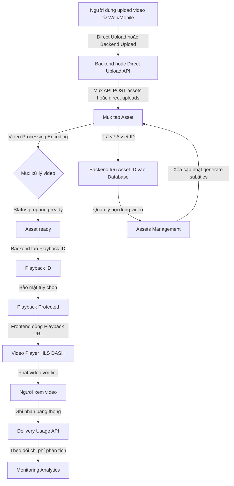
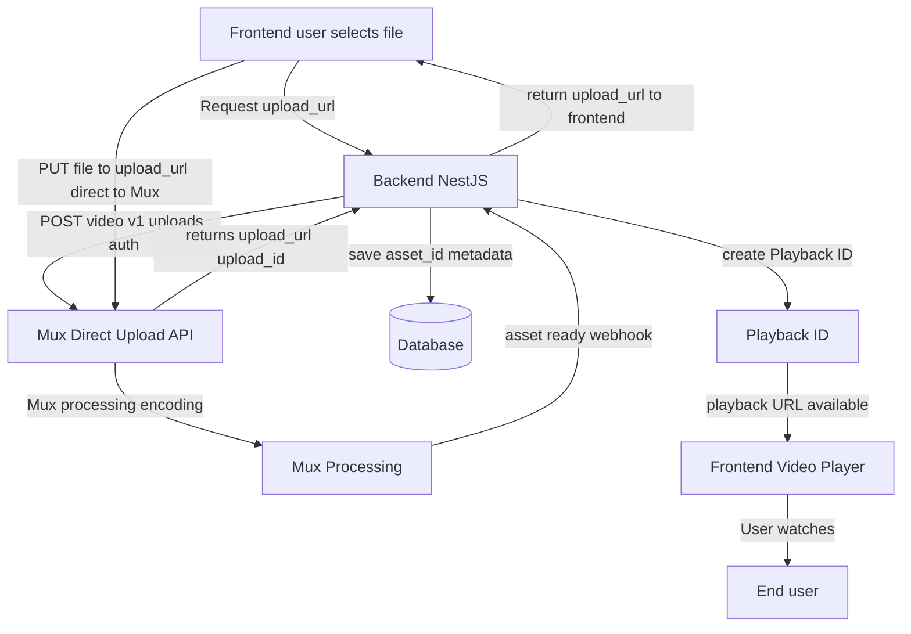

# Diagram

```mermaid
flowchart TD
    A["Người dùng upload video từ Web/Mobile"] -->|"Direct Upload hoặc Backend Upload"| B["Backend hoặc Direct Upload API"]
    B -->|"Mux API POST assets hoặc direct-uploads"| C["Mux tạo Asset"]
    C -->|"Trả về Asset ID"| D["Backend lưu Asset ID vào Database"]

    C -->|"Video Processing Encoding"| E{"Mux xử lý video"}
    E -->|"Status preparing ready"| F["Asset ready"]

    F -->|"Backend tạo Playback ID"| G["Playback ID"]

    G -->|"Bảo mật tùy chọn"| H["Playback Protected"]

    H -->|"Frontend dùng Playback URL"| I["Video Player HLS DASH"]
    I -->|"Phát video với link"| J["Người xem video"]

    J -->|"Ghi nhận băng thông"| K["Delivery Usage API"]
    K -->|"Theo dõi chi phí phân tích"| L["Monitoring Analytics"]

    D -->|"Quản lý nội dung video"| M["Assets Management"]
    M -->|"Xóa cập nhật generate subtitles"| C
```

```mermaid
flowchart TD
    A["Frontend user selects file"] -->|"Request upload_url"| B["Backend NestJS"]
    B -->|"POST video v1 uploads auth"| C["Mux Direct Upload API"]
    C -->|"returns upload_url upload_id"| B
    B -->|"return upload_url to frontend"| A
    A -->|"PUT file to upload_url direct to Mux"| C
    C -->|"Mux processing encoding"| D["Mux Processing"]
    D -->|"asset ready webhook"| B
    B -->|"save asset_id metadata"| DB[("Database")]
    B -->|"create Playback ID"| E["Playback ID"]
    E -->|"playback URL available"| F["Frontend Video Player"]
    F -->|"User watches"| G["End user"]
```
