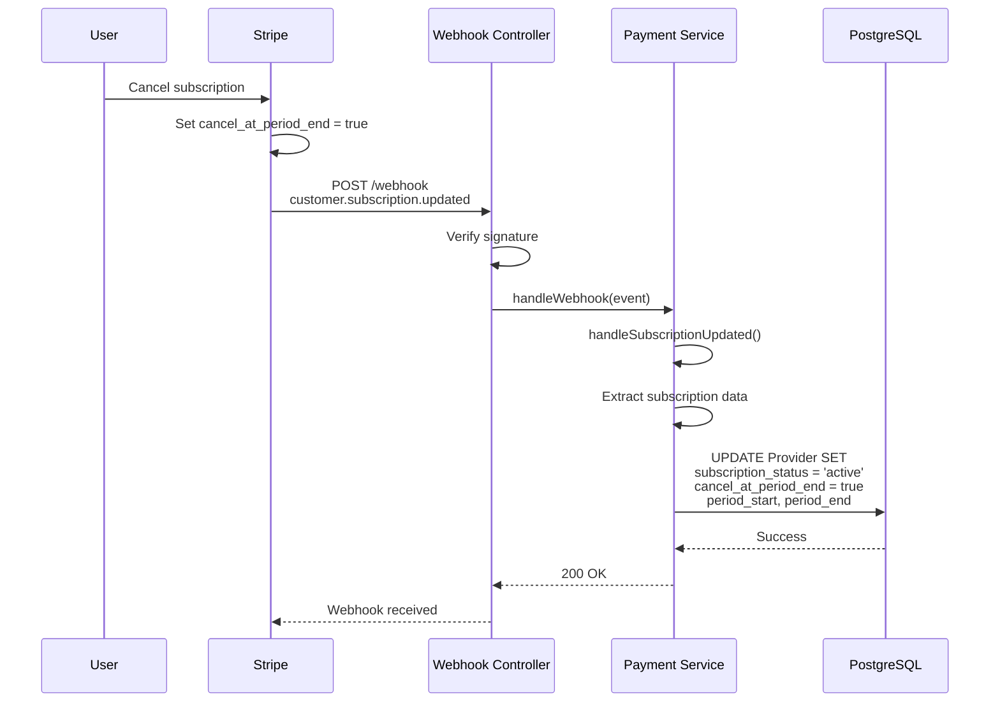
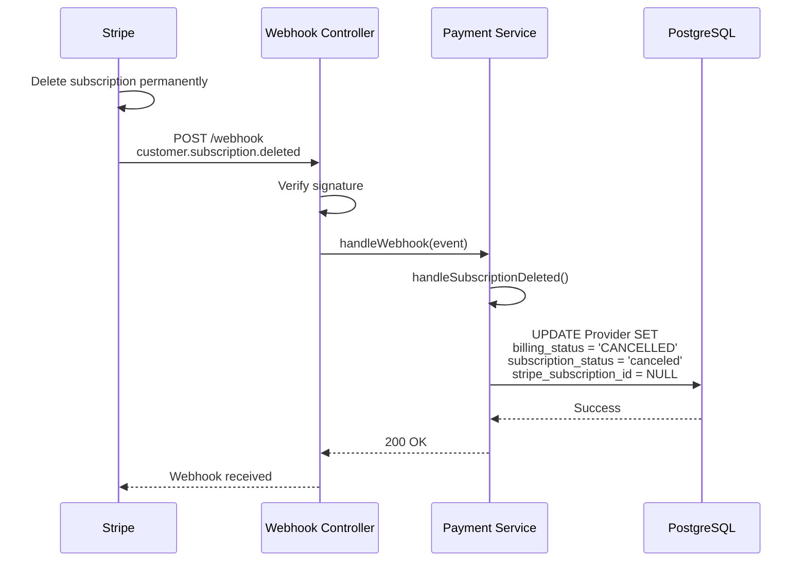
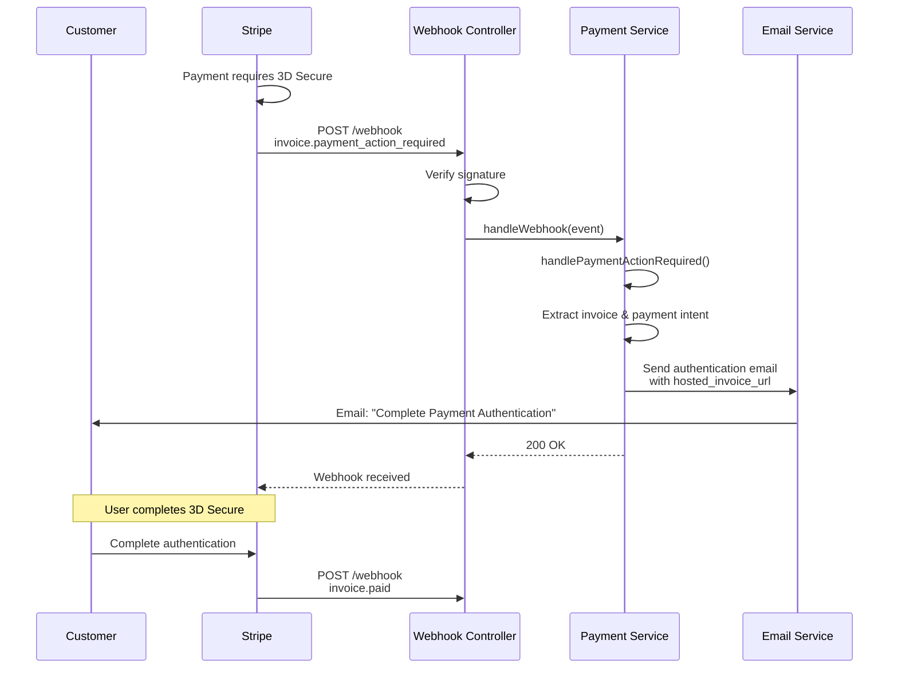
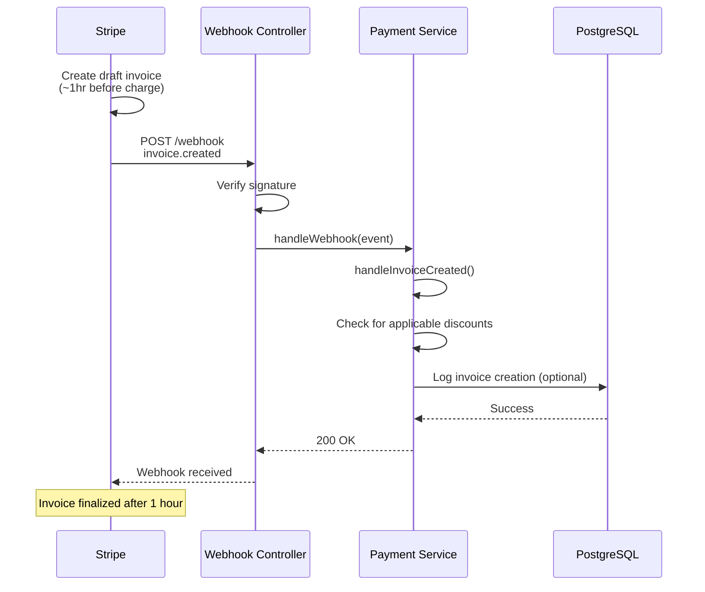
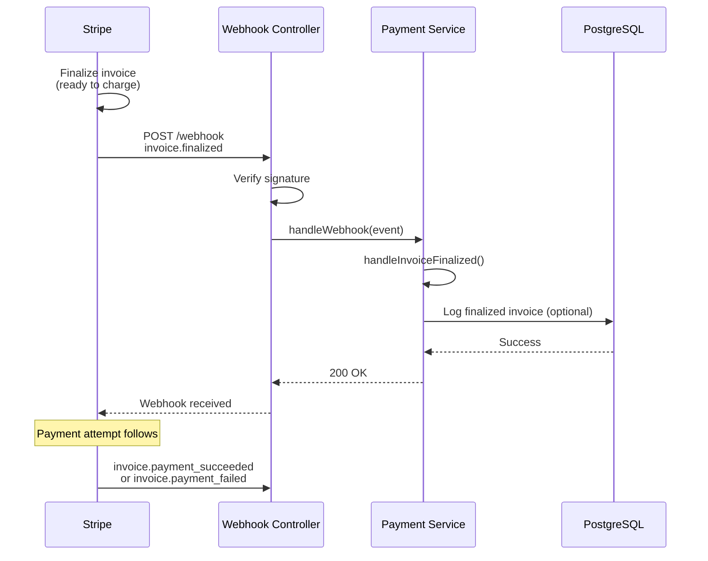
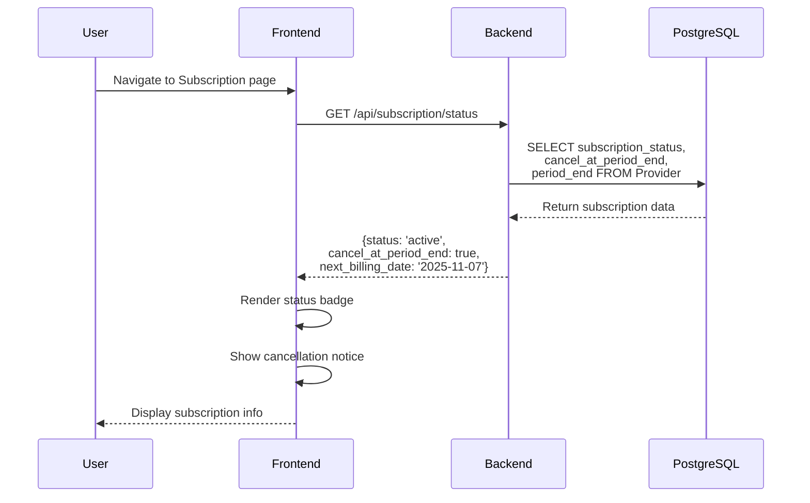
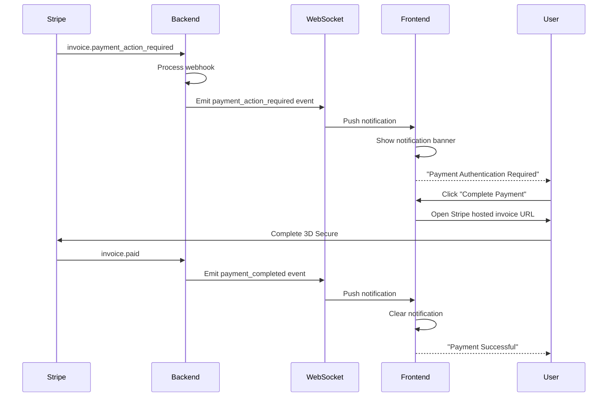
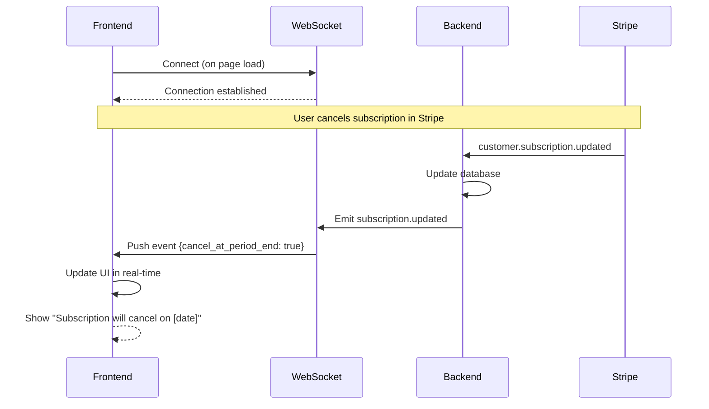

# Missing Stripe Webhooks - Implementation Proposal

## 1. Context

The current Stripe integration relies on webhook events to synchronize subscription and payment data between Stripe and our platform. Based on analysis of the existing implementation and Stripe documentation, **5 critical webhook handlers are missing** that are essential for proper subscription lifecycle management.

Without these webhooks, the system cannot track important subscription state changes, leading to data inconsistency and potential revenue loss.

### Missing / Required Webhooks

- **`customer.subscription.updated`** (critical for tracking subscription status changes, renewal dates, and cancellation schedules)
- **`customer.subscription.deleted`** (to handle permanent subscription deletion)
- **`invoice.payment_action_required`** (to notify users when payment requires 3D Secure authentication)
- **`invoice.created`** (to apply discounts or credits before invoice finalization)
- **`invoice.finalized`** (for audit trail and logging before payment attempt)

---

## 2. Current Implementation Status

Our system currently handles **3 webhook events** for payment processing:

**Implemented Webhooks:**

- `invoice.paid` / `invoice.payment_succeeded` → Updates billing status to DONE
- `invoice.payment_failed` → Updates billing status to PAST_DUE

**Missing Webhooks:**

- `customer.subscription.updated` → No handler (HIGH PRIORITY)
- `customer.subscription.deleted` → No handler (MEDIUM PRIORITY)
- `invoice.payment_action_required` → No handler (MEDIUM-HIGH PRIORITY)
- `invoice.created` → No handler (LOW PRIORITY)
- `invoice.finalized` → No handler (LOW PRIORITY)

## 3. Problem Analysis

### Problem 1: Cannot Track Subscription Status Changes

**Current Gap:**
The system doesn't receive notifications when subscription status changes (active → past_due → canceled) or when users schedule cancellations.

**Business Impact:**

- Customer support cannot answer "When does my subscription renew?"
- No visibility when user schedules subscription cancellation
- Billing status may be out of sync with Stripe
- Risk of charging customers after they've cancelled

**Example Scenario:**
User clicks "Cancel Subscription" in Stripe Customer Portal → Stripe sets `cancel_at_period_end = true` → Our system doesn't know about it → User expects cancellation but we keep charging → Chargeback dispute and customer churn.

### Problem 2: No Cleanup When Subscription is Deleted

**Current Gap:**
The system doesn't know when a subscription is permanently deleted from Stripe.

**Business Impact:**

- Users may retain access after subscription deletion
- Database contains stale subscription IDs
- No proper cleanup of subscription-related data

### Problem 3: Users Not Notified for Payment Authentication

**Current Gap:**
When payment requires 3D Secure authentication (common for European customers), the system doesn't notify users to complete the authentication.

**Business Impact:**

- Lost revenue from incomplete payments (estimated 5-10% of European transactions)
- Poor user experience - payment stuck without guidance
- Subscription may be cancelled due to failed authentication after 24 hours

---

## 4. Integration Plan - Backend

Assuming all required webhook events are available from Stripe, there are two main options to handle the missing webhooks:

### Option 1 - Real-time Webhook Processing (Recommended)

- Process webhook events immediately when received from Stripe
- Update database in real-time to maintain synchronization
- Emit events to frontend via WebSocket for live updates

### Option 2 - Scheduled Processing + Event Queue

- Queue webhook events for batch processing
- Process events periodically via cron job
- Suitable for high-volume scenarios with rate limiting concerns

### Recommendation

We should prefer **Option 1 (Real-time Webhook Processing)** because:

- It maintains real-time data synchronization with Stripe
- It allows us to provide immediate feedback to users
- It provides flexibility to implement our own **notification and alerting system**

### Webhook Processing Flow (Option 1)

```
┌─────────────┐
│   Stripe    │
│   Platform  │
└──────┬──────┘
       │ Webhook Event
       │ (customer.subscription.updated)
       ▼
┌──────────────────────────────────────────────────────────┐
│ NestJS Backend - Webhook Controller                     │
│ POST /practice-payment/webhook                           │
└──────┬───────────────────────────────────────────────────┘
       │ 1. Verify Stripe signature
       │ 2. Parse event payload
       ▼
┌──────────────────────────────────────────────────────────┐
│ Practice Payment Service - handleWebhook()              │
└──────┬───────────────────────────────────────────────────┘
       │ Route to specific handler
       ▼
┌──────────────────────────────────────────────────────────┐
│ Handler Method (e.g., handleSubscriptionUpdated)        │
│ - Extract subscription data                             │
│ - Map to database fields                                │
│ - Update billing status based on subscription status    │
└──────┬───────────────────────────────────────────────────┘
       │ Update database
       ▼
┌──────────────────────────────────────────────────────────┐
│ PostgreSQL - Provider Table                             │
│ - subscription_status                                    │
│ - cancel_at_period_end                                   │
│ - subscription_current_period_start                      │
│ - subscription_current_period_end                        │
│ - billing_status                                         │
└──────┬───────────────────────────────────────────────────┘
       │ Emit event (optional)
       ▼
┌──────────────────────────────────────────────────────────┐
│ WebSocket Gateway - Notify Frontend                     │
└──────────────────────────────────────────────────────────┘
```

---

## 5. Missing Webhook Handlers - Detailed Analysis

Based on the current implementation analysis and Stripe documentation, the system is missing **5 critical webhook handlers**:

### 5.1. `customer.subscription.updated` (HIGH PRIORITY 🔴)

**When Triggered:**

- Subscription status changes (active → past_due → canceled)
- User schedules cancellation (`cancel_at_period_end` changes)
- Subscription renewal (billing cycle dates update)
- Subscription metadata changes

**Why Critical:**

- Cannot track when user schedules subscription cancellation
- No visibility into next billing cycle dates
- Billing status may be out of sync with Stripe
- Risk of charging customers after they've cancelled

**Sequence Diagram:**



**Database Impact:**

- Updates `subscription_status`, `cancel_at_period_end`, `subscription_current_period_start`, `subscription_current_period_end`
- Updates `billing_status` based on subscription status

---

### 5.2. `customer.subscription.deleted` (MEDIUM PRIORITY 🟡)

**When Triggered:**

- Subscription is permanently deleted from Stripe
- After subscription ends and retention period expires

**Why Important:**

- Users may retain access after subscription deletion
- Database contains stale subscription IDs
- No proper cleanup of subscription-related data

**Sequence Diagram:**



**Database Impact:**

- Sets `billing_status` to `CANCELLED`
- Clears `stripe_subscription_id`
- Sets `subscription_status` to `canceled`

---

### 5.3. `invoice.payment_action_required` (MEDIUM-HIGH PRIORITY 🟡)

**When Triggered:**

- Payment requires 3D Secure authentication (SCA)
- Common for European customers
- Payment is stuck pending user action

**Why Important:**

- Lost revenue from incomplete payments (5-10% of European transactions)
- Poor user experience - payment stuck without guidance
- Subscription may be cancelled after 24 hours if not completed

**Sequence Diagram:**



**Database Impact:**

- No direct database changes
- Triggers email notification to user

---

### 5.4. `invoice.created` (LOW PRIORITY ⚪)

**When Triggered:**

- Draft invoice is created (~1 hour before finalization)
- Happens before invoice is finalized and charged

**Why Useful:**

- Apply discounts or credits before charge
- Modify invoice line items if needed
- Add metadata or custom fields

**Sequence Diagram:**



**Database Impact:**

- Optional logging only
- No billing status changes

---

### 5.5. `invoice.finalized` (LOW PRIORITY ⚪)

**When Triggered:**

- Invoice is finalized and ready to be charged
- Happens after `invoice.created` and before payment attempt

**Why Useful:**

- Logging and tracking purposes
- Last chance to review invoice before charge
- Audit trail for billing operations

**Sequence Diagram:**



**Database Impact:**

- Optional logging only
- No billing status changes

---

## 6. Integration Plan - Frontend

To support the new webhook integration, several updates are required on the frontend to display subscription information and handle user notifications.

### 6.1. Subscription Status Display

**Requirements:**

- Display current subscription status to users (Active, Past Due, Cancelled, Unpaid)
- Show next billing date from `subscription_current_period_end`
- Show cancellation schedule if `cancel_at_period_end = true`
- Display warning when subscription is scheduled for cancellation

**UI Components Needed:**

- Subscription status badge (color-coded by status)
- Billing cycle information panel
- Cancellation notice banner (when applicable)

**Sequence Diagram:**



---

### 6.2. Payment Action Required Notification

**Requirements:**

- Display notification when payment requires 3D Secure authentication
- Provide "Complete Payment" button linking to Stripe hosted invoice
- Show countdown timer (payment expires in 24 hours)
- Clear notification after successful payment

**UI Components Needed:**

- Notification banner/modal for payment action required
- "Complete Payment Authentication" button
- Timer component showing time remaining

**Sequence Diagram:**



---

### 6.3. Real-time Updates via WebSocket

**Requirements:**

- Establish WebSocket connection for real-time subscription updates
- Listen for subscription status changes
- Update UI immediately when webhook events are processed
- Handle reconnection and error states

**Events to Listen For:**

- `subscription.updated` - Update subscription status and billing dates
- `subscription.deleted` - Show subscription cancelled message
- `payment.action_required` - Show payment authentication notification
- `payment.succeeded` - Clear notifications and update status

**Sequence Diagram:**



---

_This proposal is based on analysis of current implementation and Stripe documentation. Detailed implementation code is available in supporting documentation._
