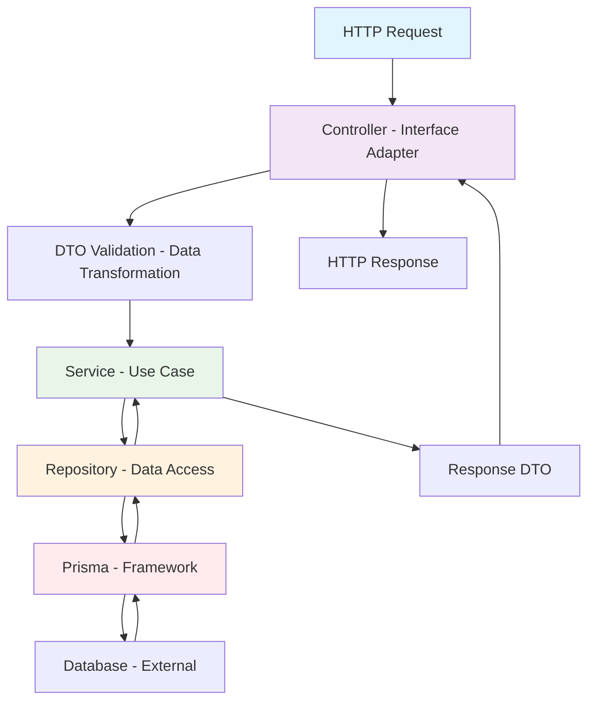

# 🏗️ Clean Architecture trong NestJS - Hướng dẫn Toàn diện

## 📋 Mục lục

1. [Tổng quan về Clean Architecture](#1-tổng-quan-về-clean-architecture)
2. [Nguyên tắc cốt lõi của Clean Architecture](#2-nguyên-tắc-cốt-lõi-của-clean-architecture)
3. [Cấu trúc Clean Architecture trong NestJS](#3-cấu-trúc-clean-architecture-trong-nestjs)
4. [Phân tích Implementation trong dự án](#4-phân-tích-implementation-trong-dự-án)
5. [Các Pattern được áp dụng](#5-các-pattern-được-áp-dụng)
6. [Dependency Injection và IoC Container](#6-dependency-injection-và-ioc-container)
7. [Tách biệt Concerns với Guards, Interceptors, Filters](#7-tách-biệt-concerns-với-guards-interceptors-filters)
8. [Repository Pattern và Data Access Layer](#8-repository-pattern-và-data-access-layer)
9. [CQRS Pattern Implementation](#9-cqrs-pattern-implementation)
10. [Best Practices và Lợi ích](#10-best-practices-và-lợi-ích)
11. [Kết luận](#11-kết-luận)

---

## 1. Tổng quan về Clean Architecture

### 🎯 Clean Architecture là gì?

**Clean Architecture** là một kiến trúc phần mềm được đề xuất bởi Robert C. Martin (Uncle Bob), tập trung vào việc tạo ra các hệ thống phần mềm:

- **Độc lập với Framework**: Business logic không phụ thuộc vào framework cụ thể
- **Testable**: Dễ dàng test mà không cần UI, database, web server
- **Độc lập với UI**: UI có thể thay đổi mà không ảnh hưởng business logic
- **Độc lập với Database**: Business logic không quan tâm đến loại database
- **Độc lập với External Services**: Business logic không phụ thuộc vào external services

### 🔄 Dependency Rule

Nguyên tắc cốt lõi của Clean Architecture:

> **Dependencies chỉ được point inward** - từ outer layers về inner layers, không được ngược lại.

```
┌─────────────────────────────────────────────────┐
│                 Frameworks & Drivers            │  ← Outer Layer
│  ┌─────────────────────────────────────────────┐│
│  │           Interface Adapters               ││
│  │  ┌─────────────────────────────────────────┐││
│  │  │         Application Business Rules     │││
│  │  │  ┌─────────────────────────────────────┐│││
│  │  │  │    Enterprise Business Rules       ││││  ← Inner Layer
│  │  │  └─────────────────────────────────────┘│││
│  │  └─────────────────────────────────────────┘││
│  └─────────────────────────────────────────────┘│
└─────────────────────────────────────────────────┘
```

---

## 2. Nguyên tắc cốt lõi của Clean Architecture

### 🏛️ Các Layer trong Clean Architecture

#### **1. Enterprise Business Rules (Entities)**

- **Mục đích**: Chứa business logic cốt lõi của enterprise
- **Đặc điểm**: Ít thay đổi nhất, không phụ thuộc vào bất kỳ layer nào khác
- **Trong NestJS**: Domain models, business entities

#### **2. Application Business Rules (Use Cases)**

- **Mục đích**: Chứa application-specific business logic
- **Đặc điểm**: Orchestrate entities để thực hiện use cases
- **Trong NestJS**: Services, Command/Query handlers

#### **3. Interface Adapters**

- **Mục đích**: Convert data giữa use cases và external world
- **Đặc điểm**: Controllers, Presenters, Gateways
- **Trong NestJS**: Controllers, DTOs, Repositories

#### **4. Frameworks & Drivers**

- **Mục đích**: External concerns như database, web framework
- **Đặc điểm**: Thay đổi nhiều nhất, chỉ chứa glue code
- **Trong NestJS**: Prisma, Express, external APIs

### 🎯 Mục đích của Clean Architecture

#### **1. Maintainability (Khả năng bảo trì)**

- **Tách biệt concerns**: Mỗi layer có trách nhiệm riêng biệt
- **Loose coupling**: Các layer ít phụ thuộc lẫn nhau
- **High cohesion**: Code related được nhóm lại với nhau

#### **2. Testability (Khả năng test)**

- **Unit testing**: Dễ dàng test từng layer riêng biệt
- **Mock dependencies**: Dễ dàng mock external dependencies
- **Integration testing**: Test interaction giữa các layer

#### **3. Flexibility (Tính linh hoạt)**

- **Technology agnostic**: Dễ dàng thay đổi technology stack
- **Scalability**: Dễ dàng scale từng layer riêng biệt
- **Feature addition**: Thêm feature mới không ảnh hưởng code cũ

#### **4. Business Focus**

- **Domain-driven**: Tập trung vào business logic
- **Framework independence**: Business logic không phụ thuộc framework
- **Long-term stability**: Business logic ổn định qua thời gian

---

## 3. Cấu trúc Clean Architecture trong NestJS

### 🏗️ Cấu trúc thư mục theo Clean Architecture

```
src/
├── shared/                          # Framework & Infrastructure Layer
│   ├── config.ts                   # Configuration
│   ├── services/                   # Infrastructure Services
│   │   ├── prisma.service.ts      # Database Service
│   │   ├── hashing.service.ts     # Hashing Service
│   │   ├── token.service.ts       # JWT Service
│   │   ├── email.service.ts       # Email Service
│   │   └── s3.service.ts          # File Storage Service
│   ├── guards/                     # Security Guards
│   │   ├── authentication.guard.ts
│   │   ├── access-token.guard.ts
│   │   └── api-key.guard.ts
│   ├── filters/                    # Exception Filters
│   ├── interceptors/              # Cross-cutting Concerns
│   ├── pipes/                     # Validation Pipes
│   └── repositories/              # Data Access Layer
│       ├── shared-user.repo.ts
│       └── shared-role.repo.ts
│
├── routes/                         # Interface Adapters Layer
│   ├── auth/                      # Authentication Domain
│   │   ├── auth.controller.ts     # REST Controller
│   │   ├── auth.service.ts        # Application Service
│   │   ├── auth.repo.ts          # Repository
│   │   ├── auth.dto.ts           # Data Transfer Objects
│   │   └── auth.model.ts         # Domain Models
│   ├── user/                      # User Domain
│   ├── role/                      # Role Domain
│   ├── permission/               # Permission Domain
│   └── payment/                   # Payment Domain (CQRS)
│       ├── commands/             # Write Operations
│       ├── queries/              # Read Operations
│       ├── decorators/           # Cross-cutting Concerns
│       └── interfaces/           # Contracts
│
└── app.module.ts                  # Application Root Module
```

### 🔄 Mapping Clean Architecture Layers

| Clean Architecture Layer | NestJS Implementation            | Ví dụ trong dự án                                |
| ------------------------ | -------------------------------- | ------------------------------------------------ |
| **Entities**             | Domain Models, Business Logic    | `auth.model.ts`, `user.model.ts`                 |
| **Use Cases**            | Services, Command/Query Handlers | `auth.service.ts`, `CreatePaymentCommandHandler` |
| **Interface Adapters**   | Controllers, DTOs, Repositories  | `auth.controller.ts`, `auth.repo.ts`             |
| **Frameworks & Drivers** | Prisma, Express, External APIs   | `prisma.service.ts`, `email.service.ts`          |

---

## 4. Phân tích Implementation trong dự án

### 🎯 Domain Organization

Dự án được tổ chức theo **Domain-Driven Design** với các domain riêng biệt:

```typescript
// Mỗi domain có structure nhất quán
routes/
├── auth/           # Authentication & Authorization
├── user/           # User Management
├── role/           # Role Management
├── permission/     # Permission Management
├── brand/          # Brand Management
├── language/       # Language Management
├── media/          # Media Management
└── payment/        # Payment Processing (CQRS)
```

### 🏗️ Module Architecture

#### **1. Shared Module - Infrastructure Layer**

```typescript
// src/shared/shared.module.ts
@Global()
@Module({
  providers: [
    // Infrastructure Services
    PrismaService,
    HashingService,
    TokenService,
    EmailService,
    S3Service,

    // Security Guards
    AccessTokenGuard,
    APIKeyGuard,

    // Global Guards
    {
      provide: APP_GUARD,
      useClass: AuthenticationGuard,
    },
  ],
  exports: [PrismaService, HashingService, TokenService, EmailService, S3Service],
})
export class SharedModule {}
```

**Đặc điểm:**

- **@Global()**: Các service được shared toàn ứng dụng
- **Infrastructure Services**: Database, hashing, token, email
- **Cross-cutting Concerns**: Guards, filters, interceptors

#### **2. Domain Modules - Application Layer**

```typescript
// src/routes/auth/auth.module.ts
@Module({
  providers: [
    AuthService, // Application Service
    AuthRepository, // Data Access
    GoogleService, // External Service
  ],
  controllers: [AuthController],
})
export class AuthModule {}
```

**Đặc điểm:**

- **Single Responsibility**: Mỗi module chỉ quản lý một domain
- **Dependency Injection**: Tự động inject dependencies
- **Encapsulation**: Logic domain được encapsulate trong module

### 🔄 Request Flow trong Clean Architecture



---

## 5. Các Pattern được áp dụng

### 🎯 Repository Pattern

#### **Mục đích:**

- Tách biệt business logic và data access logic
- Dễ dàng test và mock data layer
- Có thể thay đổi ORM mà không ảnh hưởng business logic

#### **Implementation:**

```typescript
// src/shared/repositories/shared-user.repo.ts
@Injectable()
export class SharedUserRepository {
  constructor(private readonly prismaService: PrismaService) {}

  findUnique(uniqueObject: WhereUniqueUserType): Promise<UserType | null> {
    return this.prismaService.user.findFirst({
      where: {
        ...uniqueObject,
        deletedAt: null,
      },
    })
  }

  findUniqueIncludeRolePermissions(uniqueObject: WhereUniqueUserType): Promise<UserIncludeRolePermissionsType | null> {
    return this.prismaService.user.findFirst({
      where: {
        ...uniqueObject,
        deletedAt: null,
      },
      include: {
        role: {
          include: {
            permissions: {
              where: { deletedAt: null },
            },
          },
        },
      },
    })
  }
}
```

**Lợi ích:**

- **Abstraction**: Ẩn chi tiết implementation của data access
- **Testability**: Dễ dàng mock repository cho unit tests
- **Flexibility**: Có thể thay đổi ORM mà không ảnh hưởng service layer

### 🏗️ Service Layer Pattern

#### **Mục đích:**

- Chứa business logic và use cases
- Orchestrate các operations giữa repositories
- Xử lý business rules và validation

#### **Implementation:**

```typescript
// src/routes/auth/auth.service.ts
@Injectable()
export class AuthService {
  constructor(
    private readonly hashingService: HashingService,
    private readonly authRepository: AuthRepository,
    private readonly tokenService: TokenService,
    private readonly emailService: EmailService,
    private readonly twoFactorService: TwoFactorService,
  ) {}

  async register(body: RegisterBodyType) {
    // 1. Validate verification code
    await this.validateVerificationCode({
      code: body.code,
      email: body.email,
      type: TypeOfVerificationCode.REGISTER,
    })

    // 2. Get client role
    const clientRoleId = await this.sharedRoleRepository.getClientRoleId()

    // 3. Hash password
    const hashedPassword = await this.hashingService.hash(body.password)

    // 4. Create user and delete verification code
    const [user] = await Promise.all([
      this.authRepository.createUser({
        email: body.email,
        name: body.name,
        phoneNumber: body.phoneNumber,
        password: hashedPassword,
        roleId: clientRoleId,
      }),
      this.authRepository.deleteVerificationCode({
        email_code_type: {
          email: body.email,
          code: body.code,
          type: TypeOfVerificationCode.REGISTER,
        },
      }),
    ])

    return user
  }
}
```

**Đặc điểm:**

- **Business Logic**: Chứa toàn bộ business rules
- **Transaction Management**: Quản lý các operations phức tạp
- **Error Handling**: Xử lý errors và exceptions

### 🎭 DTO Pattern

#### **Mục đích:**

- Validate input data
- Transform data giữa layers
- Type safety cho API contracts

#### **Implementation:**

```typescript
// src/routes/auth/auth.dto.ts
export const RegisterBodyDTO = z.object({
  email: z.string().email(),
  name: z.string().min(1).max(500),
  phoneNumber: z.string().min(1).max(50),
  password: z.string().min(6),
  code: z.string().min(6).max(6),
})

export const LoginBodyDTO = z.object({
  email: z.string().email(),
  password: z.string().min(1),
  totpCode: z.string().optional(),
  code: z.string().optional(),
})
```

**Lợi ích:**

- **Validation**: Tự động validate input data
- **Type Safety**: Đảm bảo type safety với TypeScript
- **Documentation**: Tự động generate API documentation

---

## 6. Dependency Injection và IoC Container

### 🔄 Dependency Injection trong NestJS

#### **Mục đích:**

- **Loose Coupling**: Giảm sự phụ thuộc giữa các components
- **Testability**: Dễ dàng inject mock dependencies
- **Flexibility**: Dễ dàng thay đổi implementations

#### **Implementation:**

```typescript
// src/app.module.ts
@Module({
  imports: [
    SharedModule, // Global services
    AuthModule, // Authentication domain
    UserModule, // User management
    RoleModule, // Role management
    PermissionModule, // Permission management
  ],
  providers: [
    // Global Pipes
    {
      provide: APP_PIPE,
      useClass: CustomZodValidationPipe,
    },
    // Global Interceptors
    {
      provide: APP_INTERCEPTOR,
      useClass: ZodSerializerInterceptor,
    },
    // Global Filters
    {
      provide: APP_FILTER,
      useClass: HttpExceptionFilter,
    },
  ],
})
export class AppModule {}
```

### 🏗️ IoC Container Benefits

#### **1. Automatic Dependency Resolution**

```typescript
@Injectable()
export class UserService {
  constructor(
    private userRepo: UserRepo, // Injected
    private hashingService: HashingService, // Injected from SharedModule
    private sharedUserRepository: SharedUserRepository, // Injected from SharedModule
    private sharedRoleRepository: SharedRoleRepository, // Injected from SharedModule
  ) {}
}
```

#### **2. Singleton Pattern**

- Các service được tạo một lần và reuse
- Efficient memory usage
- Consistent state across application

#### **3. Scope Management**

- **Default Scope**: Singleton across entire application
- **Request Scope**: New instance per request
- **Transient Scope**: New instance every time

---

## 7. Tách biệt Concerns với Guards, Interceptors, Filters

### 🛡️ Guards - Authentication & Authorization

#### **Mục đích:**

- Xác thực người dùng (Authentication)
- Phân quyền truy cập (Authorization)
- Bảo vệ routes khỏi unauthorized access

#### **Implementation:**

```typescript
// src/shared/guards/authentication.guard.ts
@Injectable()
export class AuthenticationGuard implements CanActivate {
  private readonly authTypeGuardMap: Record<string, CanActivate>

  constructor(
    private readonly reflector: Reflector,
    private readonly accessTokenGuard: AccessTokenGuard,
    private readonly apiKeyGuard: APIKeyGuard,
  ) {
    this.authTypeGuardMap = {
      [AuthType.Bearer]: this.accessTokenGuard,
      [AuthType.APIKey]: this.apiKeyGuard,
      [AuthType.None]: { canActivate: () => true },
    }
  }

  async canActivate(context: ExecutionContext): Promise<boolean> {
    const authTypeValue = this.getAuthTypeValue(context)
    const guards = authTypeValue.authTypes.map((authType) => this.authTypeGuardMap[authType])

    return authTypeValue.options.condition === ConditionGuard.And
      ? this.handleAndCondition(guards, context)
      : this.handleOrCondition(guards, context)
  }
}
```

#### **Access Token Guard:**

```typescript
// src/shared/guards/access-token.guard.ts
@Injectable()
export class AccessTokenGuard implements CanActivate {
  async canActivate(context: ExecutionContext): Promise<boolean> {
    const request = context.switchToHttp().getRequest()

    // 1. Extract and validate token
    const decodedAccessToken = await this.extractAndValidateToken(request)

    // 2. Check user permissions
    await this.validateUserPermission(decodedAccessToken, request)

    return true
  }

  private async validateUserPermission(decodedAccessToken: AccessTokenPayload, request: any): Promise<void> {
    const roleId = decodedAccessToken.roleId
    const path = request.route.path
    const method = request.method

    const role = await this.prismaService.role.findUniqueOrThrow({
      where: { id: roleId, deletedAt: null, isActive: true },
      include: {
        permissions: {
          where: { deletedAt: null, path, method },
        },
      },
    })

    const canAccess = role.permissions.length > 0
    if (!canAccess) {
      throw new ForbiddenException('Error.PermissionDenied')
    }

    request[REQUEST_ROLE_PERMISSIONS] = role
  }
}
```

### 🔄 Interceptors - Cross-cutting Concerns

#### **Mục đích:**

- Transform request/response data
- Logging và monitoring
- Caching
- Error handling

#### **Implementation:**

```typescript
// src/shared/interceptor/transform.interceptor.ts
@Injectable()
export class TransformInterceptor<T> implements NestInterceptor<T, Response<T>> {
  intercept(context: ExecutionContext, next: CallHandler): Observable<Response<T>> {
    return next.handle().pipe(
      map((data) => {
        const ctx = context.switchToHttp()
        const response = ctx.getResponse()
        const statusCode = response.statusCode
        return { data, statusCode }
      }),
    )
  }
}
```

### 🚨 Exception Filters - Error Handling

#### **Mục đích:**

- Centralized error handling
- Consistent error response format
- Logging errors

#### **Implementation:**

```typescript
// src/shared/filters/http-exception.filter.ts
@Catch(HttpException)
export class HttpExceptionFilter extends BaseExceptionFilter {
  private readonly logger = new Logger(HttpExceptionFilter.name)

  catch(exception: HttpException, host: ArgumentsHost) {
    if (exception instanceof ZodSerializationException) {
      const zodError = exception.getZodError()
      this.logger.error(`ZodSerializationException: ${zodError.message}`)
    }

    super.catch(exception, host)
  }
}
```

---

## 8. Repository Pattern và Data Access Layer

### 🗃️ Database Schema Design

#### **Audit Trail Pattern:**

```sql
-- prisma/schema.prisma
model User {
  id          Int      @id @default(autoincrement())
  email       String
  name        String   @db.VarChar(500)

  // Audit fields
  createdById Int?
  createdBy   User? @relation("UserCreatedBy", fields: [createdById], references: [id])
  updatedById Int?
  updatedBy   User? @relation("UserUpdatedBy", fields: [updatedById], references: [id])
  deletedById Int?
  deletedBy   User? @relation("UserDeletedBy", fields: [deletedById], references: [id])

  deletedAt DateTime?
  createdAt DateTime  @default(now())
  updatedAt DateTime  @updatedAt

  // Soft delete index
  @@index([deletedAt])
}
```

#### **Soft Delete Pattern:**

```typescript
// Tất cả queries đều filter deletedAt: null
findUnique(uniqueObject: WhereUniqueUserType): Promise<UserType | null> {
  return this.prismaService.user.findFirst({
    where: {
      ...uniqueObject,
      deletedAt: null,  // Soft delete filter
    },
  })
}

// Soft delete implementation
deleteUser({ id, deletedById }: { id: number; deletedById: number }, isHard?: boolean) {
  return isHard
    ? this.prismaService.user.delete({ where: { id } })
    : this.prismaService.user.update({
        where: { id },
        data: {
          deletedAt: new Date(),
          deletedById,
        },
      })
}
```

### 🔄 Repository Abstraction

#### **Shared Repository:**

```typescript
// src/shared/repositories/shared-user.repo.ts
@Injectable()
export class SharedUserRepository {
  constructor(private readonly prismaService: PrismaService) {}

  // Generic methods cho common operations
  findUnique(uniqueObject: WhereUniqueUserType): Promise<UserType | null>
  findUniqueIncludeRolePermissions(uniqueObject: WhereUniqueUserType): Promise<UserIncludeRolePermissionsType | null>
  updateUser(uniqueObject: { id: number }, data: Partial<UserType>): Promise<UserType | null>
}
```

#### **Domain-specific Repository:**

```typescript
// src/routes/auth/auth.repo.ts
@Injectable()
export class AuthRepository {
  constructor(private readonly prismaService: PrismaService) {}

  // Domain-specific methods
  createUser(
    user: Pick<UserType, 'email' | 'name' | 'password' | 'phoneNumber' | 'roleId'>,
  ): Promise<Omit<UserType, 'password' | 'totpSecret'>>
  findUniqueUserIncludeRole(uniqueObject: WhereUniqueUserType): Promise<(UserType & { role: RoleType }) | null>
  createVerificationCode(data: CreateVerificationCodeType): Promise<VerificationCodeType>
  deleteVerificationCode(uniqueObject: UniqueVerificationCodeType): Promise<VerificationCodeType>
}
```

---

## 9. CQRS Pattern Implementation

### 🔄 Command Query Responsibility Segregation

#### **Mục đích:**

- Tách biệt read và write operations
- Optimize performance cho từng loại operation
- Scalability và maintainability

#### **Architecture:**

```
Write Side (Commands):
HTTP Request → Controller → Command → CommandHandler → Repository → Database

Read Side (Queries):
HTTP Request → Controller → Query → QueryHandler → ReadRepository → Database
```

### 💳 Payment Module - CQRS Implementation

#### **Command Structure:**

```typescript
// src/routes/payment/interfaces/command.interface.ts
export interface ICommand<TResponse = void> {
  readonly _commandBrand?: never
}

export interface ICommandHandler<TCommand extends ICommand<TResponse>, TResponse = void> {
  handle(command: TCommand): Promise<Result<TResponse>>
}
```

#### **Command Implementation:**

```typescript
// src/routes/payment/commands/create-payment.command.ts
export class CreatePaymentCommand implements ICommand<Payment> {
  constructor(
    public readonly userId: number,
    public readonly orderId: string,
    public readonly amount: number,
    public readonly currency: string,
    public readonly method: string,
    public readonly metadata?: Record<string, any>,
  ) {}
}

@Injectable()
export class CreatePaymentCommandHandler implements ICommandHandler<CreatePaymentCommand, Payment> {
  async handle(command: CreatePaymentCommand): Promise<Result<Payment>> {
    try {
      // 1. Validate business rules
      if (command.amount <= 0) {
        return Result.failure(new Error('Amount must be greater than 0'))
      }

      // 2. Create payment entity
      const payment: Payment = {
        id: uuidv4(),
        userId: command.userId,
        orderId: command.orderId,
        amount: command.amount,
        currency: command.currency,
        status: PaymentStatus.PENDING,
        method: command.method,
        metadata: command.metadata,
        createdAt: new Date(),
        updatedAt: new Date(),
      }

      // 3. Persist to database
      // const savedPayment = await this.paymentRepository.create(payment)

      // 4. Publish domain event
      // await this.eventBus.publish(new PaymentCreatedEvent(payment))

      return Result.success(payment)
    } catch (error) {
      return Result.failure(error as Error)
    }
  }
}
```

#### **Query Implementation:**

```typescript
// src/routes/payment/queries/get-payment.query.ts
export class GetPaymentQuery implements IQuery<Payment | null> {
  constructor(
    public readonly paymentId: string,
    public readonly userId: number,
  ) {}
}

@Injectable()
export class GetPaymentQueryHandler implements IQueryHandler<GetPaymentQuery, Payment | null> {
  async handle(query: GetPaymentQuery): Promise<Payment | null> {
    // 1. Check cache first
    // const cached = await this.cacheService.get(`payment:${query.paymentId}`)

    // 2. Query from read database
    const payment = await this.findPaymentById(query.paymentId)

    // 3. Check authorization
    if (payment && payment.userId !== query.userId) {
      return null
    }

    // 4. Cache result
    // await this.cacheService.set(`payment:${query.paymentId}`, JSON.stringify(payment))

    return payment
  }
}
```

### 🎭 Decorator Pattern cho Cross-cutting Concerns

#### **Logging Decorator:**

```typescript
// src/routes/payment/decorators/logging.decorator.ts
@Injectable()
export class LoggingCommandDecorator<TCommand extends ICommand<TResponse>, TResponse>
  implements ICommandHandler<TCommand, TResponse>
{
  private readonly logger = new Logger(LoggingCommandDecorator.name)

  constructor(private readonly innerHandler: ICommandHandler<TCommand, TResponse>) {}

  async handle(command: TCommand): Promise<Result<TResponse>> {
    const commandName = command.constructor.name
    const startTime = Date.now()

    this.logger.log(`[COMMAND] Starting execution: ${commandName}`)

    try {
      const result = await this.innerHandler.handle(command)
      const duration = Date.now() - startTime

      if (Result.isSuccess(result)) {
        this.logger.log(`[COMMAND] Successfully completed: ${commandName} (${duration}ms)`)
      } else {
        this.logger.error(`[COMMAND] Failed: ${commandName} (${duration}ms)`)
      }

      return result
    } catch (error) {
      const duration = Date.now() - startTime
      this.logger.error(`[COMMAND] Exception in ${commandName} (${duration}ms)`, error)
      throw error
    }
  }
}
```

#### **Validation Decorator:**

```typescript
// src/routes/payment/decorators/validation.decorator.ts
@Injectable()
export class ValidationCommandDecorator<TCommand extends ICommand<TResponse>, TResponse>
  implements ICommandHandler<TCommand, TResponse>
{
  constructor(
    private readonly innerHandler: ICommandHandler<TCommand, TResponse>,
    private readonly validators: IValidator<TCommand>[] = [],
  ) {}

  async handle(command: TCommand): Promise<Result<TResponse>> {
    // 1. Validate command
    const validationFailures = await this.validateCommand(command)

    if (validationFailures.length > 0) {
      const errorMessage = validationFailures.map((v) => `${v.field}: ${v.message}`).join(', ')
      return Result.failure(new Error(`Validation failed: ${errorMessage}`))
    }

    // 2. Call inner handler
    return await this.innerHandler.handle(command)
  }
}
```

---

## 10. Best Practices và Lợi ích

### ✅ Best Practices

#### **1. Dependency Direction**

```typescript
// ✅ Good: Inner layer không phụ thuộc outer layer
@Injectable()
export class AuthService {
  constructor(
    private readonly authRepository: AuthRepository, // Interface
    private readonly hashingService: HashingService, // Abstraction
  ) {}
}

// ❌ Bad: Business logic phụ thuộc vào framework
@Injectable()
export class AuthService {
  constructor(
    private readonly prismaService: PrismaService, // Framework dependency
  ) {}
}
```

#### **2. Single Responsibility**

```typescript
// ✅ Good: Mỗi service có một trách nhiệm
@Injectable()
export class AuthService {
  // Chỉ handle authentication logic
  async login(credentials: LoginBodyType) { ... }
  async register(userData: RegisterBodyType) { ... }
  async logout(userId: number) { ... }
}

@Injectable()
export class UserService {
  // Chỉ handle user management
  async createUser(userData: CreateUserBodyType) { ... }
  async updateUser(id: number, userData: UpdateUserBodyType) { ... }
  async deleteUser(id: number) { ... }
}
```

#### **3. Interface Segregation**

```typescript
// ✅ Good: Specific interfaces
interface IUserRepository {
  findById(id: number): Promise<User | null>
  create(user: CreateUserData): Promise<User>
  update(id: number, user: UpdateUserData): Promise<User>
}

interface IAuthRepository {
  createVerificationCode(data: CreateVerificationCodeType): Promise<VerificationCodeType>
  validateVerificationCode(data: ValidateVerificationCodeType): Promise<boolean>
}
```

#### **4. Error Handling**

```typescript
// ✅ Good: Consistent error handling
try {
  const user = await this.authRepository.createUser(userData)
  return user
} catch (error) {
  if (isUniqueConstraintPrismaError(error)) {
    throw EmailAlreadyExistsException
  }
  throw error
}
```

### 🎯 Lợi ích của Clean Architecture

#### **1. Maintainability**

- **Tách biệt concerns**: Mỗi layer có trách nhiệm rõ ràng
- **Loose coupling**: Thay đổi một layer không ảnh hưởng layer khác
- **High cohesion**: Code related được nhóm lại

#### **2. Testability**

```typescript
// Unit test dễ dàng với mock dependencies
describe('AuthService', () => {
  let authService: AuthService
  let mockAuthRepository: jest.Mocked<AuthRepository>
  let mockHashingService: jest.Mocked<HashingService>

  beforeEach(() => {
    mockAuthRepository = createMockAuthRepository()
    mockHashingService = createMockHashingService()

    authService = new AuthService(
      mockAuthRepository,
      mockHashingService,
    )
  })

  it('should register user successfully', async () => {
    // Arrange
    const userData = { email: 'test@example.com', ... }
    mockAuthRepository.createUser.mockResolvedValue(expectedUser)

    // Act
    const result = await authService.register(userData)

    // Assert
    expect(result).toEqual(expectedUser)
    expect(mockAuthRepository.createUser).toHaveBeenCalledWith(userData)
  })
})
```

#### **3. Scalability**

- **Horizontal scaling**: Mỗi layer có thể scale riêng biệt
- **Microservices ready**: Dễ dàng tách thành microservices
- **Performance optimization**: Optimize từng layer riêng biệt

#### **4. Flexibility**

- **Technology agnostic**: Dễ dàng thay đổi database, framework
- **Feature addition**: Thêm feature mới không ảnh hưởng code cũ
- **Refactoring**: Dễ dàng refactor từng layer

#### **5. Business Focus**

- **Domain-driven**: Tập trung vào business logic
- **Framework independence**: Business logic không phụ thuộc NestJS
- **Long-term stability**: Business logic ổn định qua thời gian

---

## 11. Kết luận

### 🎯 Tổng kết Clean Architecture trong NestJS

Clean Architecture trong NestJS không chỉ là một pattern thiết kế mà là một **philosophy** giúp tạo ra những hệ thống phần mềm:

#### **1. Bền vững (Sustainable)**

- Code dễ maintain và extend
- Business logic tách biệt khỏi technical concerns
- Ít technical debt

#### **2. Linh hoạt (Flexible)**

- Dễ dàng thay đổi technology stack
- Adapt với business requirements mới
- Scale theo nhu cầu

#### **3. Đáng tin cậy (Reliable)**

- Comprehensive testing strategy
- Consistent error handling
- Predictable behavior

### 🚀 Roadmap Implementation

#### **Phase 1: Foundation**

1. **Setup module structure** theo domain-driven approach
2. **Implement shared services** và infrastructure layer
3. **Setup dependency injection** và IoC container

#### **Phase 2: Core Features**

1. **Implement repository pattern** cho data access
2. **Create service layer** với business logic
3. **Setup guards, filters, interceptors** cho cross-cutting concerns

#### **Phase 3: Advanced Patterns**

1. **Implement CQRS** cho complex domains
2. **Add event-driven architecture** với domain events
3. **Optimize performance** với caching và monitoring

#### **Phase 4: Production Ready**

1. **Comprehensive testing** strategy
2. **Monitoring và logging** implementation
3. **Security hardening** và performance optimization

### 💡 Key Takeaways

1. **Clean Architecture không phải là silver bullet** - cần cân nhắc complexity vs benefits
2. **Start simple** - implement gradually, không cần over-engineer từ đầu
3. **Focus on business value** - architecture phải serve business needs
4. **Embrace change** - architecture phải flexible để adapt với requirements mới
5. **Invest in testing** - good architecture enables good testing

Clean Architecture trong NestJS giúp tạo ra những hệ thống phần mềm không chỉ hoạt động tốt hôm nay mà còn dễ dàng maintain và extend trong tương lai. Đây là foundation quan trọng cho bất kỳ dự án enterprise nào muốn sustainable growth.
