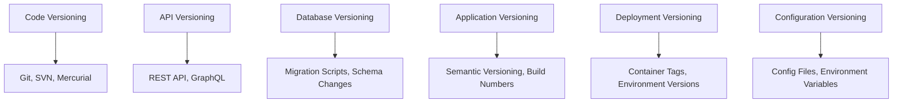

# 🔄 Quản lý Versioning trong Phát triển Phần mềm - Hướng dẫn Toàn diện

## 📋 Mục lục

1. [Tổng quan về Versioning](#1-tổng-quan-về-versioning)
2. [Các loại Versioning](#2-các-loại-versioning)
3. [Semantic Versioning (SemVer)](#3-semantic-versioning-semver)
4. [Git Versioning Strategies](#4-git-versioning-strategies)
5. [API Versioning](#5-api-versioning)
6. [Database Versioning](#6-database-versioning)
7. [Deployment Versioning](#7-deployment-versioning)
8. [Versioning trong Microservices](#8-versioning-trong-microservices)
9. [Tools và Automation](#9-tools-và-automation)
10. [Best Practices từ các Công ty Lớn](#10-best-practices-từ-các-công-ty-lớn)
11. [Kết luận](#11-kết-luận)

---

## 1. Tổng quan về Versioning

### 🎯 Versioning là gì?

**Versioning** (quản lý phiên bản) là quá trình theo dõi, quản lý và kiểm soát các thay đổi trong phần mềm qua thời gian. Đây là một phần quan trọng trong Software Development Life Cycle (SDLC).

### 🔄 Tại sao Versioning quan trọng?

#### **1. Traceability (Khả năng truy vết)**

- Theo dõi được các thay đổi qua thời gian
- Biết được ai đã thực hiện thay đổi gì và khi nào
- Rollback về version trước khi có lỗi

#### **2. Collaboration (Hợp tác)**

- Nhiều developer có thể làm việc cùng lúc
- Merge code từ nhiều nguồn khác nhau
- Conflict resolution

#### **3. Release Management (Quản lý phát hành)**

- Kiểm soát việc phát hành các version mới
- Hotfix và patch management
- Feature flag và gradual rollout

#### **4. Compliance & Audit (Tuân thủ & Kiểm tra)**

- Đáp ứng yêu cầu compliance
- Audit trail cho các thay đổi
- Documentation và changelog

### 🏗️ Các cấp độ Versioning



---

## 2. Các loại Versioning

### 📝 Code Versioning

#### **Git - Distributed Version Control**

```bash
# Basic Git workflow
git init
git add .
git commit -m "Initial commit"
git branch feature/user-authentication
git checkout feature/user-authentication
git merge main
git tag v1.0.0
```

#### **Branching Strategies:**

**Git Flow:**

```
main (production)
├── develop (integration)
├── feature/user-auth
├── feature/payment
├── release/v1.2.0
└── hotfix/critical-bug
```

**GitHub Flow:**

```
main (production)
├── feature/user-auth
├── feature/payment
└── hotfix/critical-bug
```

### 🔢 Application Versioning

#### **Version Number Formats:**

1. **Semantic Versioning**: `MAJOR.MINOR.PATCH` (1.2.3)
2. **Calendar Versioning**: `YYYY.MM.DD` (2024.12.28)
3. **Build Numbers**: `1.0.0.1234`
4. **Hybrid**: `1.2.3-alpha.1+build.456`

### 🌐 API Versioning

#### **URL Path Versioning:**

```typescript
// v1
GET / api / v1 / users
POST / api / v1 / users

// v2
GET / api / v2 / users
POST / api / v2 / users
```

#### **Header Versioning:**

```typescript
// Request headers
Accept: application/vnd.api+json;version=1
API-Version: 2024-01-01
```

#### **Query Parameter Versioning:**

```typescript
GET /api/users?version=1
GET /api/users?api-version=2024-01-01
```

### 🗄️ Database Versioning

#### **Migration Scripts:**

```sql
-- Migration: 001_create_users_table.sql
CREATE TABLE users (
    id SERIAL PRIMARY KEY,
    email VARCHAR(255) UNIQUE NOT NULL,
    created_at TIMESTAMP DEFAULT NOW()
);

-- Migration: 002_add_phone_to_users.sql
ALTER TABLE users ADD COLUMN phone VARCHAR(20);
```

#### **Version Tracking:**

```sql
-- Schema version table
CREATE TABLE schema_versions (
    version VARCHAR(50) PRIMARY KEY,
    applied_at TIMESTAMP DEFAULT NOW(),
    description TEXT
);
```

---

## 3. Semantic Versioning (SemVer)

### 📊 SemVer Format: MAJOR.MINOR.PATCH

```
Version: 2.1.3
         │ │ │
         │ │ └── PATCH: Bug fixes
         │ └──── MINOR: New features (backward compatible)
         └────── MAJOR: Breaking changes
```

### 🔄 Version Increment Rules

#### **MAJOR Version (Breaking Changes)**

```typescript
// v1.x.x
interface User {
  id: number
  name: string
}

// v2.0.0 - Breaking change
interface User {
  id: string // Changed from number to string
  firstName: string // Split name into firstName/lastName
  lastName: string
}
```

#### **MINOR Version (New Features)**

```typescript
// v1.1.0 - Added new optional field
interface User {
  id: number;
  name: string;
  email?: string;  // New optional field
}

// v1.2.0 - Added new method
class UserService {
  getUser(id: number): User { ... }
  getUserByEmail(email: string): User { ... }  // New method
}
```

#### **PATCH Version (Bug Fixes)**

```typescript
// v1.1.1 - Fixed bug in existing method
class UserService {
  getUser(id: number): User {
    // Fixed: Handle null case properly
    if (!id) {
      throw new Error('User ID is required')
    }
    return this.repository.findById(id)
  }
}
```

### 🏷️ Pre-release và Build Metadata

```
1.0.0-alpha.1      # Alpha release
1.0.0-beta.2       # Beta release
1.0.0-rc.1         # Release candidate
1.0.0+build.123    # Build metadata
1.0.0-beta.1+exp.sha.5114f85  # Combined
```

### 📋 SemVer Implementation trong NestJS

```typescript
// package.json
{
  "name": "nestjs-ecommerce-api",
  "version": "1.2.3",
  "scripts": {
    "version:patch": "npm version patch",
    "version:minor": "npm version minor",
    "version:major": "npm version major",
    "version:prerelease": "npm version prerelease --preid=beta"
  }
}

// main.ts - API versioning
import { VersioningType } from '@nestjs/common';

async function bootstrap() {
  const app = await NestFactory.create(AppModule);

  app.enableVersioning({
    type: VersioningType.URI,
    prefix: 'v',
    defaultVersion: '1',
  });

  await app.listen(3000);
}
```

---

## 4. Git Versioning Strategies

### 🌳 Git Flow Strategy

#### **Branch Structure:**

```
main                    # Production-ready code
├── develop             # Integration branch
├── feature/user-auth   # Feature development
├── feature/payment     # Feature development
├── release/v1.2.0      # Release preparation
└── hotfix/security-fix # Critical fixes
```

#### **Workflow:**

```bash
# Feature development
git checkout develop
git checkout -b feature/user-authentication
# ... development work ...
git checkout develop
git merge feature/user-authentication

# Release preparation
git checkout -b release/v1.2.0 develop
# ... final testing and bug fixes ...
git checkout main
git merge release/v1.2.0
git tag v1.2.0

# Hotfix
git checkout -b hotfix/critical-bug main
# ... fix the bug ...
git checkout main
git merge hotfix/critical-bug
git tag v1.2.1
```

### 🚀 GitHub Flow Strategy

#### **Simplified Workflow:**

```bash
# Create feature branch
git checkout -b feature/user-authentication

# Make changes and commit
git add .
git commit -m "Add user authentication"

# Push and create PR
git push origin feature/user-authentication
# Create Pull Request on GitHub

# After review and approval
git checkout main
git merge feature/user-authentication
git tag v1.2.0
```

### 🔄 GitLab Flow Strategy

#### **Environment Branches:**

```
main                    # Latest development
├── pre-production     # Staging environment
├── production         # Production environment
└── feature/new-api    # Feature development
```

### 📊 Conventional Commits

```bash
# Format: <type>[optional scope]: <description>
feat(auth): add user authentication
fix(api): resolve payment processing bug
docs(readme): update installation instructions
style(css): fix button alignment
refactor(service): optimize user query
test(unit): add user service tests
chore(deps): update dependencies
```

#### **Automated Versioning với Conventional Commits:**

```json
// .releaserc.js
module.exports = {
  "branches": ["main"],
  "plugins": [
    "@semantic-release/commit-analyzer",
    "@semantic-release/release-notes-generator",
    "@semantic-release/changelog",
    "@semantic-release/npm",
    "@semantic-release/github"
  ]
}
```

---

## 5. API Versioning

### 🔗 URL Path Versioning

#### **Implementation trong NestJS:**

```typescript
// app.module.ts
@Module({
  imports: [
    // V1 modules
    AuthModuleV1,
    UserModuleV1,

    // V2 modules
    AuthModuleV2,
    UserModuleV2,
  ],
})
export class AppModule {}

// auth.controller.v1.ts
@Controller({ path: 'auth', version: '1' })
export class AuthControllerV1 {
  @Post('login')
  async login(@Body() loginDto: LoginDtoV1) {
    // V1 implementation
  }
}

// auth.controller.v2.ts
@Controller({ path: 'auth', version: '2' })
export class AuthControllerV2 {
  @Post('login')
  async login(@Body() loginDto: LoginDtoV2) {
    // V2 implementation with enhanced security
  }
}
```

#### **DTO Versioning:**

```typescript
// auth.dto.v1.ts
export class LoginDtoV1 {
  @IsEmail()
  email: string

  @IsString()
  password: string
}

// auth.dto.v2.ts
export class LoginDtoV2 {
  @IsEmail()
  email: string

  @IsString()
  password: string

  @IsOptional()
  @IsString()
  totpCode?: string // Added 2FA support

  @IsOptional()
  @IsString()
  deviceId?: string // Added device tracking
}
```

### 📱 Header Versioning

```typescript
// version.interceptor.ts
@Injectable()
export class VersionInterceptor implements NestInterceptor {
  intercept(context: ExecutionContext, next: CallHandler): Observable<any> {
    const request = context.switchToHttp().getRequest()
    const version = request.headers['api-version'] || '1'

    // Set version context
    request.apiVersion = version

    return next.handle()
  }
}

// auth.controller.ts
@Controller('auth')
@UseInterceptors(VersionInterceptor)
export class AuthController {
  @Post('login')
  async login(@Req() request: Request, @Body() loginDto: any) {
    const version = request.apiVersion

    if (version === '1') {
      return this.authServiceV1.login(loginDto)
    } else if (version === '2') {
      return this.authServiceV2.login(loginDto)
    }
  }
}
```

### 🔄 Backward Compatibility Strategy

```typescript
// auth.service.ts
@Injectable()
export class AuthService {
  async login(loginDto: LoginDtoV1 | LoginDtoV2, version: string) {
    // Handle both versions
    if (version === '1') {
      return this.loginV1(loginDto as LoginDtoV1)
    }

    // V2 with enhanced features
    const v2Dto = loginDto as LoginDtoV2
    const result = await this.loginV2(v2Dto)

    // Transform response for backward compatibility if needed
    return this.transformResponse(result, version)
  }

  private transformResponse(data: any, version: string) {
    if (version === '1') {
      // Remove V2-specific fields for V1 clients
      const { deviceId, ...v1Response } = data
      return v1Response
    }
    return data
  }
}
```

### 📊 API Deprecation Strategy

```typescript
// deprecated.decorator.ts
export function Deprecated(version: string, message?: string) {
  return applyDecorators(
    ApiHeader({
      name: 'X-API-Warning',
      description: `This endpoint is deprecated since version ${version}`,
    }),
    UseInterceptors(DeprecationInterceptor),
  )
}

// auth.controller.v1.ts
@Controller({ path: 'auth', version: '1' })
export class AuthControllerV1 {
  @Post('login')
  @Deprecated('2.0.0', 'Use /v2/auth/login instead')
  async login(@Body() loginDto: LoginDtoV1) {
    // Add deprecation warning to response
    return this.authService.login(loginDto)
  }
}
```

---

## 6. Database Versioning

### 🗄️ Migration-based Versioning

#### **Prisma Migrations:**

```typescript
// prisma/migrations/20241228_init/migration.sql
-- CreateTable
CREATE TABLE "User" (
    "id" SERIAL NOT NULL,
    "email" TEXT NOT NULL,
    "name" TEXT NOT NULL,
    "createdAt" TIMESTAMP(3) NOT NULL DEFAULT CURRENT_TIMESTAMP,

    CONSTRAINT "User_pkey" PRIMARY KEY ("id")
);

-- CreateIndex
CREATE UNIQUE INDEX "User_email_key" ON "User"("email");
```

#### **Migration Management:**

```bash
# Generate migration
npx prisma migrate dev --name add_user_phone

# Apply migrations
npx prisma migrate deploy

# Reset database
npx prisma migrate reset
```

#### **Schema Evolution:**

```typescript
// Migration: 001_create_users.sql
CREATE TABLE users (
    id SERIAL PRIMARY KEY,
    email VARCHAR(255) UNIQUE NOT NULL,
    name VARCHAR(255) NOT NULL,
    created_at TIMESTAMP DEFAULT NOW()
);

// Migration: 002_add_phone_to_users.sql
ALTER TABLE users ADD COLUMN phone VARCHAR(20);

// Migration: 003_add_user_preferences.sql
CREATE TABLE user_preferences (
    id SERIAL PRIMARY KEY,
    user_id INTEGER REFERENCES users(id),
    theme VARCHAR(50) DEFAULT 'light',
    language VARCHAR(10) DEFAULT 'en',
    created_at TIMESTAMP DEFAULT NOW()
);
```

### 🔄 Rollback Strategy

```typescript
// migration.service.ts
@Injectable()
export class MigrationService {
  async rollback(targetVersion: string) {
    const currentVersion = await this.getCurrentVersion()
    const migrations = await this.getMigrationsBetween(targetVersion, currentVersion)

    for (const migration of migrations.reverse()) {
      await this.executeRollback(migration)
    }
  }

  private async executeRollback(migration: Migration) {
    // Execute rollback script
    await this.prisma.$executeRaw`${migration.rollbackScript}`

    // Update version table
    await this.prisma.schemaVersion.delete({
      where: { version: migration.version },
    })
  }
}
```

### 📊 Zero-downtime Migrations

```typescript
// Blue-green deployment with database versioning
class DatabaseVersionManager {
  async migrateWithZeroDowntime(newVersion: string) {
    // 1. Create new database schema version
    await this.createSchemaVersion(newVersion)

    // 2. Run backward-compatible migrations
    await this.runBackwardCompatibleMigrations()

    // 3. Deploy new application version
    await this.deployApplication(newVersion)

    // 4. Remove old schema components
    await this.cleanupOldSchema()
  }
}
```

---

## 7. Deployment Versioning

### 🐳 Container Versioning

#### **Docker Image Tagging:**

```dockerfile
# Dockerfile
FROM node:18-alpine
WORKDIR /app
COPY package*.json ./
RUN npm ci --only=production
COPY . .
EXPOSE 3000
CMD ["npm", "start"]
```

```bash
# Build và tag images
docker build -t nestjs-ecommerce:1.2.3 .
docker build -t nestjs-ecommerce:latest .

# Multi-stage tagging
docker tag nestjs-ecommerce:1.2.3 nestjs-ecommerce:1.2
docker tag nestjs-ecommerce:1.2.3 nestjs-ecommerce:1
```

#### **Container Registry Management:**

```yaml
# docker-compose.yml
version: '3.8'
services:
  api:
    image: nestjs-ecommerce:${VERSION:-latest}
    ports:
      - '3000:3000'
    environment:
      - NODE_ENV=production
      - DATABASE_URL=${DATABASE_URL}
    labels:
      - 'version=${VERSION}'
      - 'build-date=${BUILD_DATE}'
      - 'git-commit=${GIT_COMMIT}'
```

### ☸️ Kubernetes Deployment Versioning

```yaml
# k8s/deployment.yaml
apiVersion: apps/v1
kind: Deployment
metadata:
  name: nestjs-ecommerce
  labels:
    app: nestjs-ecommerce
    version: '1.2.3'
spec:
  replicas: 3
  selector:
    matchLabels:
      app: nestjs-ecommerce
  template:
    metadata:
      labels:
        app: nestjs-ecommerce
        version: '1.2.3'
    spec:
      containers:
        - name: api
          image: nestjs-ecommerce:1.2.3
          ports:
            - containerPort: 3000
          env:
            - name: VERSION
              value: '1.2.3'
```

#### **Rolling Updates:**

```bash
# Update deployment với version mới
kubectl set image deployment/nestjs-ecommerce api=nestjs-ecommerce:1.2.4

# Rollback về version trước
kubectl rollout undo deployment/nestjs-ecommerce

# Check rollout status
kubectl rollout status deployment/nestjs-ecommerce
```

### 🔄 Blue-Green Deployment

```yaml
# blue-green-deployment.yaml
apiVersion: argoproj.io/v1alpha1
kind: Rollout
metadata:
  name: nestjs-ecommerce
spec:
  replicas: 5
  strategy:
    blueGreen:
      activeService: nestjs-ecommerce-active
      previewService: nestjs-ecommerce-preview
      autoPromotionEnabled: false
      scaleDownDelaySeconds: 30
      prePromotionAnalysis:
        templates:
          - templateName: success-rate
        args:
          - name: service-name
            value: nestjs-ecommerce-preview
  selector:
    matchLabels:
      app: nestjs-ecommerce
  template:
    metadata:
      labels:
        app: nestjs-ecommerce
    spec:
      containers:
        - name: api
          image: nestjs-ecommerce:1.2.4
```

### 📊 Canary Deployment

```yaml
# canary-deployment.yaml
apiVersion: argoproj.io/v1alpha1
kind: Rollout
metadata:
  name: nestjs-ecommerce-canary
spec:
  replicas: 10
  strategy:
    canary:
      steps:
        - setWeight: 10 # 10% traffic to new version
        - pause: { duration: 1h }
        - setWeight: 50 # 50% traffic to new version
        - pause: { duration: 30m }
        - setWeight: 100 # 100% traffic to new version
      canaryService: nestjs-ecommerce-canary
      stableService: nestjs-ecommerce-stable
```

---

## 8. Versioning trong Microservices

### 🔄 Service Versioning Strategy

#### **Independent Service Versioning:**

```yaml
# docker-compose.microservices.yml
version: '3.8'
services:
  auth-service:
    image: auth-service:2.1.0
    environment:
      - SERVICE_VERSION=2.1.0

  user-service:
    image: user-service:1.5.2
    environment:
      - SERVICE_VERSION=1.5.2

  payment-service:
    image: payment-service:3.0.1
    environment:
      - SERVICE_VERSION=3.0.1
```

#### **Service Contract Versioning:**

```typescript
// auth-service/contracts/v1/auth.contract.ts
export interface AuthContractV1 {
  login(credentials: LoginCredentials): Promise<AuthResult>
  logout(token: string): Promise<void>
  validate(token: string): Promise<UserInfo>
}

// auth-service/contracts/v2/auth.contract.ts
export interface AuthContractV2 extends AuthContractV1 {
  refreshToken(refreshToken: string): Promise<AuthResult>
  enable2FA(userId: string): Promise<TwoFactorSetup>
}
```

### 🌐 API Gateway Versioning

```typescript
// api-gateway/routes/auth.routes.ts
@Controller('auth')
export class AuthGatewayController {
  constructor(
    @Inject('AUTH_SERVICE_V1') private authServiceV1: ClientProxy,
    @Inject('AUTH_SERVICE_V2') private authServiceV2: ClientProxy,
  ) {}

  @Post('login')
  async login(@Body() loginDto: any, @Headers('api-version') version = '1') {
    const service = version === '2' ? this.authServiceV2 : this.authServiceV1
    return service.send('auth.login', loginDto)
  }
}
```

### 📊 Event Versioning

```typescript
// events/user.events.ts
export class UserCreatedEventV1 {
  constructor(
    public readonly userId: string,
    public readonly email: string,
    public readonly name: string,
  ) {}
}

export class UserCreatedEventV2 {
  constructor(
    public readonly userId: string,
    public readonly email: string,
    public readonly profile: UserProfile,
    public readonly metadata: UserMetadata,
  ) {}
}

// event-handler.ts
@EventHandler(UserCreatedEventV1)
export class UserCreatedHandlerV1 {
  handle(event: UserCreatedEventV1) {
    // Handle V1 event
  }
}

@EventHandler(UserCreatedEventV2)
export class UserCreatedHandlerV2 {
  handle(event: UserCreatedEventV2) {
    // Handle V2 event
  }
}
```

### 🔄 Service Mesh Versioning

```yaml
# istio/virtual-service.yaml
apiVersion: networking.istio.io/v1alpha3
kind: VirtualService
metadata:
  name: auth-service
spec:
  http:
    - match:
        - headers:
            api-version:
              exact: '2'
      route:
        - destination:
            host: auth-service
            subset: v2
    - route:
        - destination:
            host: auth-service
            subset: v1
```

---

## 9. Tools và Automation

### 🛠️ Version Management Tools

#### **Semantic Release:**

```json
// package.json
{
  "scripts": {
    "semantic-release": "semantic-release"
  },
  "devDependencies": {
    "semantic-release": "^19.0.0",
    "@semantic-release/changelog": "^6.0.0",
    "@semantic-release/git": "^10.0.0"
  }
}

// .releaserc.json
{
  "branches": ["main"],
  "plugins": [
    "@semantic-release/commit-analyzer",
    "@semantic-release/release-notes-generator",
    "@semantic-release/changelog",
    "@semantic-release/npm",
    [
      "@semantic-release/git",
      {
        "assets": ["CHANGELOG.md", "package.json"],
        "message": "chore(release): ${nextRelease.version} [skip ci]\n\n${nextRelease.notes}"
      }
    ]
  ]
}
```

#### **Conventional Changelog:**

```bash
# Install
npm install -g conventional-changelog-cli

# Generate changelog
conventional-changelog -p angular -i CHANGELOG.md -s

# Generate for specific version
conventional-changelog -p angular -i CHANGELOG.md -s -r 0
```

### 🔄 CI/CD Pipeline Versioning

```yaml
# .github/workflows/release.yml
name: Release
on:
  push:
    branches: [main]

jobs:
  release:
    runs-on: ubuntu-latest
    steps:
      - uses: actions/checkout@v3
        with:
          fetch-depth: 0

      - name: Setup Node.js
        uses: actions/setup-node@v3
        with:
          node-version: '18'

      - name: Install dependencies
        run: npm ci

      - name: Run tests
        run: npm test

      - name: Build application
        run: npm run build

      - name: Semantic Release
        run: npx semantic-release
        env:
          GITHUB_TOKEN: ${{ secrets.GITHUB_TOKEN }}
          NPM_TOKEN: ${{ secrets.NPM_TOKEN }}

      - name: Build Docker image
        run: |
          VERSION=$(node -p "require('./package.json').version")
          docker build -t nestjs-ecommerce:$VERSION .
          docker tag nestjs-ecommerce:$VERSION nestjs-ecommerce:latest

      - name: Deploy to production
        run: |
          VERSION=$(node -p "require('./package.json').version")
          kubectl set image deployment/nestjs-ecommerce api=nestjs-ecommerce:$VERSION
```

### 📊 Monitoring và Tracking

```typescript
// version.middleware.ts
@Injectable()
export class VersionMiddleware implements NestMiddleware {
  use(req: any, res: any, next: () => void) {
    // Add version info to response headers
    res.setHeader('X-API-Version', process.env.VERSION || '1.0.0')
    res.setHeader('X-Build-Number', process.env.BUILD_NUMBER || 'unknown')
    res.setHeader('X-Git-Commit', process.env.GIT_COMMIT || 'unknown')

    next()
  }
}

// health.controller.ts
@Controller('health')
export class HealthController {
  @Get('version')
  getVersion() {
    return {
      version: process.env.VERSION || '1.0.0',
      buildNumber: process.env.BUILD_NUMBER || 'unknown',
      gitCommit: process.env.GIT_COMMIT || 'unknown',
      buildDate: process.env.BUILD_DATE || 'unknown',
      environment: process.env.NODE_ENV || 'development',
    }
  }
}
```

---

## 10. Best Practices từ các Công ty Lớn

### 🏢 Google - Semantic Versioning + Feature Flags

#### **Strategy:**

- Sử dụng Semantic Versioning cho tất cả services
- Feature flags để kiểm soát rollout
- Canary deployment cho production

```typescript
// feature-flag.service.ts
@Injectable()
export class FeatureFlagService {
  async isEnabled(feature: string, userId?: string): Promise<boolean> {
    const flag = await this.getFeatureFlag(feature)

    if (flag.rolloutPercentage === 100) return true
    if (flag.rolloutPercentage === 0) return false

    // Gradual rollout based on user ID
    if (userId) {
      const hash = this.hashUserId(userId)
      return hash % 100 < flag.rolloutPercentage
    }

    return false
  }
}
```

### 🔵 Microsoft - Branch-based Versioning

#### **Strategy:**

- Git Flow với release branches
- Automated testing trên mỗi branch
- Hotfix branches cho critical issues

```yaml
# azure-pipelines.yml
trigger:
  branches:
    include:
      - main
      - develop
      - release/*
      - hotfix/*

variables:
  - name: version
    value: $[counter(variables['Build.SourceBranchName'], 1)]

stages:
  - stage: Build
    jobs:
      - job: BuildAndTest
        steps:
          - task: NodeTool@0
            inputs:
              versionSpec: '18.x'

          - script: |
              npm ci
              npm run test
              npm run build
            displayName: 'Build and Test'

          - task: Docker@2
            inputs:
              command: 'buildAndPush'
              repository: 'nestjs-ecommerce'
              tags: |
                $(Build.BuildId)
                $(version)
```

### 🟢 Spotify - Microservices Versioning

#### **Strategy:**

- Independent service versioning
- Contract-first development
- Backward compatibility requirements

```typescript
// service-registry.ts
@Injectable()
export class ServiceRegistry {
  private services = new Map<string, ServiceInfo>()

  registerService(name: string, version: string, endpoint: string) {
    const key = `${name}:${version}`
    this.services.set(key, {
      name,
      version,
      endpoint,
      registeredAt: new Date(),
    })
  }

  getService(name: string, version?: string): ServiceInfo | null {
    if (version) {
      return this.services.get(`${name}:${version}`) || null
    }

    // Return latest version if no version specified
    const latestVersion = this.getLatestVersion(name)
    return this.services.get(`${name}:${latestVersion}`) || null
  }
}
```

### 🔴 Netflix - Chaos Engineering + Versioning

#### **Strategy:**

- Multiple versions chạy song song
- Chaos engineering để test compatibility
- Automated rollback mechanisms

```typescript
// chaos-testing.service.ts
@Injectable()
export class ChaosTestingService {
  async testVersionCompatibility(oldVersion: string, newVersion: string) {
    // Test backward compatibility
    const backwardTest = await this.testBackwardCompatibility(oldVersion, newVersion)

    // Test forward compatibility
    const forwardTest = await this.testForwardCompatibility(oldVersion, newVersion)

    // Chaos testing
    const chaosTest = await this.runChaosTests(newVersion)

    return {
      backward: backwardTest,
      forward: forwardTest,
      chaos: chaosTest,
      recommendation: this.getRecommendation(backwardTest, forwardTest, chaosTest),
    }
  }
}
```

### 🟡 Amazon - API Gateway Versioning

#### **Strategy:**

- API Gateway để manage multiple versions
- Gradual traffic shifting
- Comprehensive monitoring

```typescript
// api-gateway.config.ts
export const apiGatewayConfig = {
  versions: {
    v1: {
      weight: 20, // 20% traffic
      endpoints: ['auth', 'users', 'orders'],
      deprecationDate: '2025-06-01',
    },
    v2: {
      weight: 80, // 80% traffic
      endpoints: ['auth', 'users', 'orders', 'analytics'],
      isDefault: true,
    },
  },
  routing: {
    strategy: 'weighted',
    fallback: 'v1',
  },
}
```

---

## 11. Kết luận

### 🎯 Tổng kết Versioning Strategy

Quản lý versioning hiệu quả đòi hỏi một **comprehensive approach** bao gồm:

#### **1. Code Versioning**

- **Git workflow** phù hợp với team size và project complexity
- **Conventional commits** cho automated versioning
- **Branch protection** và code review process

#### **2. Application Versioning**

- **Semantic Versioning** cho predictable releases
- **Feature flags** cho gradual rollout
- **Backward compatibility** strategy

#### **3. API Versioning**

- **Multiple versioning strategies** (URL, header, content negotiation)
- **Deprecation timeline** và migration path
- **Contract testing** giữa versions

#### **4. Database Versioning**

- **Migration-based** approach với rollback capability
- **Zero-downtime** deployment strategies
- **Schema evolution** planning

#### **5. Deployment Versioning**

- **Container tagging** strategy
- **Blue-green** hoặc **canary** deployment
- **Rollback mechanisms** cho production issues

### 🚀 Implementation Roadmap

#### **Phase 1: Foundation (Tuần 1-2)**

1. Setup Git workflow (Git Flow hoặc GitHub Flow)
2. Implement Semantic Versioning
3. Setup automated changelog generation
4. Create version endpoint cho monitoring

#### **Phase 2: API Versioning (Tuần 3-4)**

1. Implement API versioning strategy
2. Create backward compatibility layer
3. Setup deprecation warnings
4. Document migration guides

#### **Phase 3: Database & Deployment (Tuần 5-6)**

1. Setup database migration system
2. Implement blue-green deployment
3. Create rollback procedures
4. Setup monitoring và alerting

#### **Phase 4: Advanced Features (Tuần 7-8)**

1. Implement feature flags
2. Setup chaos engineering tests
3. Create automated compatibility testing
4. Optimize performance monitoring

### 💡 Key Takeaways

1. **Consistency is key** - Áp dụng versioning strategy một cách consistent across toàn bộ system
2. **Automation first** - Automate versioning process để giảm human errors
3. **Backward compatibility** - Luôn maintain backward compatibility khi có thể
4. **Monitoring và alerting** - Setup comprehensive monitoring cho version-related issues
5. **Documentation** - Maintain clear documentation về versioning strategy và migration paths

### 🔮 Future Considerations

- **GitOps** approach cho deployment versioning
- **Service mesh** integration cho microservices versioning
- **AI-powered** compatibility testing
- **Immutable infrastructure** với version-aware deployments

Versioning không chỉ là technical concern mà còn là **business strategy** giúp đảm bảo system stability, user experience, và long-term maintainability. Đầu tư vào versioning strategy tốt sẽ pay off trong long run bằng cách giảm downtime, improve developer productivity, và enhance customer satisfaction.
