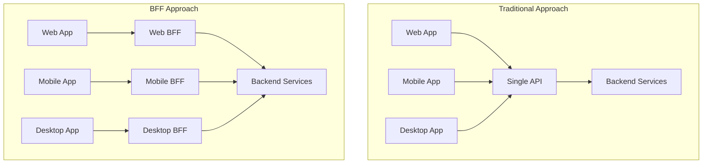
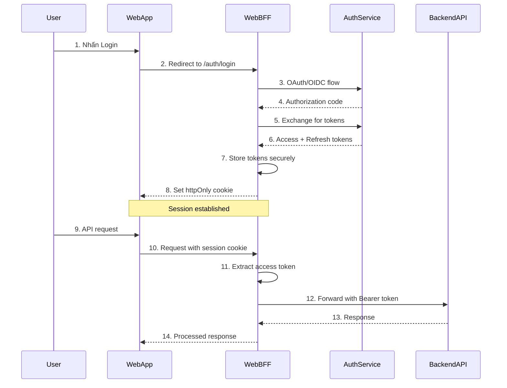

# 🛡️ Backend-for-Frontend (BFF) Pattern: Secure Auth Implementation

> **Nguồn**: [The Backend-for-Frontend (BFF) Pattern: Secure Auth Done Right](https://app.daily.dev/posts/the-backend-for-frontend-bff-pattern-secure-auth-done-right-dh1nx5sor)  
> **Tác giả**: Hamza Idhmad (@hamzaidhmad)  
> **Ngày**: May 10, 2024

---

## 📋 Mục Lục

1. [Tổng Quan BFF Pattern](#tổng-quan-bff-pattern)
2. [Vấn Đề Authentication Truyền Thống](#vấn-đề-authentication-truyền-thống)
3. [BFF Pattern Giải Quyết Như Thế Nào](#bff-pattern-giải-quyết-như-thế-nào)
4. [Architecture Components](#architecture-components)
5. [Security Benefits](#security-benefits)
6. [Implementation Considerations](#implementation-considerations)
7. [Best Practices](#best-practices)
8. [Ứng Dụng Vào NestJS Project](#ứng-dụng-vào-nestjs-project)

---

## 🎯 Tổng Quan BFF Pattern

### Định Nghĩa

**Backend-for-Frontend (BFF)** là một architectural pattern trong đó mỗi frontend client có một backend service riêng biệt được thiết kế đặc biệt để phục vụ nhu cầu của client đó.

### Khái Niệm Cốt Lõi



### Lợi Ích Chính

✅ **Client-Specific Optimization**: Mỗi BFF được tối ưu cho một loại client cụ thể  
✅ **Security Isolation**: Mỗi client có authentication layer riêng  
✅ **Independent Evolution**: Client và BFF có thể phát triển độc lập  
✅ **Performance**: Giảm over-fetching và under-fetching

---

## 🚨 Vấn Đề Authentication Truyền Thống

### Single API Approach Issues

#### 1️⃣ Security Vulnerabilities

```typescript
// ❌ Vấn đề: Token exposure trong browser
class TraditionalAuth {
  // JWT được lưu trong localStorage/sessionStorage
  storeToken(token: string) {
    localStorage.setItem('access_token', token) // ❌ XSS vulnerable
  }

  // Token được gửi qua JavaScript
  makeRequest(url: string) {
    return fetch(url, {
      headers: {
        Authorization: `Bearer ${localStorage.getItem('access_token')}`, // ❌ Exposed
      },
    })
  }
}
```

#### 2️⃣ Cross-Platform Complexity

```typescript
// ❌ Same API cho nhiều platforms khác nhau
interface ApiResponse {
  // Web cần data này
  userProfile: UserProfile
  permissions: Permission[]
  preferences: UserPreferences

  // Mobile không cần, nhưng vẫn phải fetch
  detailedAnalytics: Analytics[]
  fullAuditLog: AuditLog[]
  adminMetadata: AdminData[]
}
```

#### 3️⃣ Token Management Challenges

- **Web**: Cookies vs localStorage vs sessionStorage
- **Mobile**: Secure storage vs keychain
- **Desktop**: File system vs encrypted storage
- **IoT**: Limited storage và processing power

---

## 🛡️ BFF Pattern Giải Quyết Như Thế Nào

### Authentication Flow với BFF



### Key Security Improvements

#### 1️⃣ Token Isolation

```typescript
// ✅ BFF giữ tokens an toàn
class WebBFF {
  private tokenStore = new Map<string, TokenData>()

  // Tokens không bao giờ expose ra client
  async handleLogin(req: Request, res: Response) {
    const { code } = req.query

    // Exchange authorization code for tokens
    const tokens = await this.authService.exchangeCode(code)

    // Store trong BFF, không gửi về client
    const sessionId = generateSecureId()
    this.tokenStore.set(sessionId, {
      accessToken: tokens.access_token,
      refreshToken: tokens.refresh_token,
      expiresAt: Date.now() + tokens.expires_in * 1000,
    })

    // Chỉ gửi session cookie về client
    res.cookie('session_id', sessionId, {
      httpOnly: true, // ✅ JavaScript không access được
      secure: true, // ✅ Chỉ HTTPS
      sameSite: 'strict', // ✅ CSRF protection
    })

    res.redirect('/dashboard')
  }
}
```

#### 2️⃣ Client-Specific Data Shaping

```typescript
// ✅ BFF reshape data cho từng client
class WebBFF {
  async getUserDashboard(req: Request) {
    const sessionId = req.cookies.session_id
    const tokens = this.tokenStore.get(sessionId)

    // Fetch data từ multiple services
    const [profile, permissions, analytics] = await Promise.all([
      this.userService.getProfile(tokens.accessToken),
      this.permissionService.getUserPermissions(tokens.accessToken),
      this.analyticsService.getUserAnalytics(tokens.accessToken),
    ])

    // Shape data specifically cho web client
    return {
      user: {
        id: profile.id,
        name: profile.displayName,
        avatar: profile.avatar?.large, // Web muốn large avatar
        role: permissions.primaryRole,
      },
      navigation: this.buildNavigationForRole(permissions),
      dashboard: {
        widgets: this.selectWidgetsForWeb(analytics),
        quickActions: this.getWebQuickActions(permissions),
      },
    }
  }
}

class MobileBFF {
  async getUserDashboard(req: Request) {
    // Same data sources, nhưng shape khác
    return {
      user: {
        id: profile.id,
        name: profile.firstName, // Mobile prefer short name
        avatar: profile.avatar?.small, // Mobile muốn small avatar
        unreadCount: notifications.unread.length,
      },
      homeScreen: {
        cards: this.selectCardsForMobile(analytics),
        quickActions: this.getMobileQuickActions(permissions),
      },
    }
  }
}
```

---

## 🏗️ Architecture Components

### 1️⃣ Web BFF Implementation

```typescript
@Controller('/api')
export class WebBFFController {
  constructor(
    private authService: AuthService,
    private sessionService: SessionService,
    private backendProxy: BackendProxyService,
  ) {}

  // Authentication endpoints
  @Get('/auth/login')
  async initiateLogin(@Res() res: Response) {
    const authUrl = await this.authService.getAuthorizationUrl({
      scope: 'openid profile email',
      redirect_uri: `${process.env.WEB_BFF_URL}/auth/callback`,
    })
    res.redirect(authUrl)
  }

  @Get('/auth/callback')
  async handleCallback(@Query('code') code: string, @Res() res: Response) {
    const tokens = await this.authService.exchangeCode(code)
    const sessionId = await this.sessionService.createSession(tokens)

    res.cookie('session_id', sessionId, {
      httpOnly: true,
      secure: process.env.NODE_ENV === 'production',
      maxAge: 24 * 60 * 60 * 1000, // 24 hours
    })

    res.redirect('/dashboard')
  }

  // API proxy với automatic token injection
  @All('/backend/*')
  async proxyToBackend(@Req() req: Request, @Res() res: Response) {
    const session = await this.sessionService.getSession(req.cookies.session_id)
    if (!session) {
      throw new UnauthorizedException()
    }

    // Inject access token vào request
    const backendPath = req.path.replace('/api/backend', '')
    return this.backendProxy.forward(backendPath, {
      ...req,
      headers: {
        ...req.headers,
        Authorization: `Bearer ${session.accessToken}`,
      },
    })
  }
}
```

### 2️⃣ Mobile BFF Implementation

```typescript
@Controller('/mobile-api')
export class MobileBFFController {
  // Mobile-specific authentication
  @Post('/auth/login')
  async mobileLogin(@Body() credentials: MobileLoginDto) {
    // Mobile có thể dùng biometric, device-specific auth
    const deviceInfo = await this.deviceService.validateDevice(credentials.deviceId)
    const tokens = await this.authService.authenticateDevice(credentials, deviceInfo)

    // Mobile BFF có thể return tokens directly (vì mobile app secure hơn)
    return {
      accessToken: tokens.access_token,
      refreshToken: tokens.refresh_token,
      expiresIn: tokens.expires_in,
      deviceSession: deviceInfo.sessionId,
    }
  }

  // Mobile-optimized data endpoints
  @Get('/dashboard')
  async getMobileDashboard(@Headers('authorization') auth: string) {
    const user = await this.getUserFromToken(auth)

    // Mobile cần data lightweight và optimized
    return {
      user: {
        id: user.id,
        name: user.firstName,
        avatar: user.avatar?.thumbnail,
        notificationBadge: await this.getUnreadCount(user.id),
      },
      homeCards: await this.getMobileHomeCards(user),
      quickActions: await this.getMobileQuickActions(user),
    }
  }
}
```

### 3️⃣ Session Management Service

```typescript
@Injectable()
export class SessionService {
  constructor(
    private redis: RedisService,
    private tokenService: TokenService,
  ) {}

  async createSession(tokens: TokenResponse): Promise<string> {
    const sessionId = crypto.randomUUID()
    const sessionData: SessionData = {
      accessToken: tokens.access_token,
      refreshToken: tokens.refresh_token,
      expiresAt: Date.now() + tokens.expires_in * 1000,
      createdAt: Date.now(),
    }

    // Store session trong Redis với TTL
    await this.redis.setex(`session:${sessionId}`, tokens.expires_in, JSON.stringify(sessionData))

    return sessionId
  }

  async getSession(sessionId: string): Promise<SessionData | null> {
    const data = await this.redis.get(`session:${sessionId}`)
    if (!data) return null

    const session: SessionData = JSON.parse(data)

    // Auto-refresh token nếu gần expire
    if (this.shouldRefreshToken(session)) {
      const newTokens = await this.tokenService.refreshToken(session.refreshToken)
      return this.updateSession(sessionId, newTokens)
    }

    return session
  }

  private shouldRefreshToken(session: SessionData): boolean {
    const timeUntilExpiry = session.expiresAt - Date.now()
    const fiveMinutes = 5 * 60 * 1000
    return timeUntilExpiry < fiveMinutes
  }
}
```

---

## 🔒 Security Benefits

### 1️⃣ Token Security

| Aspect                | Traditional SPA                           | BFF Pattern                      |
| --------------------- | ----------------------------------------- | -------------------------------- |
| **Token Storage**     | Client-side (localStorage/sessionStorage) | Server-side (BFF memory/Redis)   |
| **XSS Vulnerability** | ❌ High risk                              | ✅ Protected                     |
| **Token Exposure**    | ❌ Visible in DevTools                    | ✅ Hidden                        |
| **CSRF Protection**   | ❌ Manual implementation                  | ✅ Built-in với httpOnly cookies |

### 2️⃣ Attack Surface Reduction

```typescript
// ❌ Traditional: Token exposed in client
class TraditionalClient {
  makeAPICall() {
    const token = localStorage.getItem('token') // ❌ Vulnerable to XSS
    return fetch('/api/data', {
      headers: { Authorization: `Bearer ${token}` },
    })
  }
}

// ✅ BFF: Token hidden in server-side
class BFFClient {
  makeAPICall() {
    // Chỉ gửi cookie, không có token nào visible
    return fetch('/api/data', {
      credentials: 'include', // ✅ Secure httpOnly cookie
    })
  }
}
```

### 3️⃣ Fine-grained Access Control

```typescript
class WebBFF {
  // Web-specific permissions
  @UseGuards(WebPermissionGuard)
  @RequirePermissions(['admin.users.read', 'admin.dashboard.access'])
  async getAdminDashboard() {
    // Web có full admin interface
  }
}

class MobileBFF {
  // Mobile-specific permissions (restricted)
  @UseGuards(MobilePermissionGuard)
  @RequirePermissions(['mobile.basic.read'])
  async getBasicData() {
    // Mobile chỉ có basic access
  }
}
```

---

## ⚡ Implementation Considerations

### 1️⃣ Performance Implications

#### Pros

- **Reduced Payload**: Client chỉ nhận data cần thiết
- **Caching**: BFF có thể cache data từ multiple services
- **Parallel Requests**: BFF fetch từ nhiều services đồng thời

#### Cons

- **Additional Hop**: Extra network call qua BFF
- **Resource Usage**: Mỗi BFF cần infrastructure riêng
- **Latency**: Potential increased latency

```typescript
// Optimization strategies
class OptimizedBFF {
  @Cacheable({ ttl: 300 }) // Cache 5 minutes
  async getUserDashboard(userId: string) {
    // Parallel fetch để giảm latency
    const [profile, permissions, notifications] = await Promise.all([
      this.userService.getProfile(userId),
      this.permissionService.getPermissions(userId),
      this.notificationService.getRecent(userId),
    ])

    return this.assembleResponse(profile, permissions, notifications)
  }
}
```

### 2️⃣ Scaling Challenges

```typescript
// Horizontal scaling với session stickiness
class ScalableBFF {
  constructor(
    private sessionStore: RedisClusterService, // ✅ Shared session store
    private loadBalancer: LoadBalancerService,
  ) {}

  // Session không tied với specific BFF instance
  async handleRequest(req: Request) {
    const sessionId = req.cookies.session_id
    const session = await this.sessionStore.get(sessionId) // ✅ Any BFF instance có thể handle
    // ...
  }
}
```

### 3️⃣ Development Complexity

```typescript
// Shared interfaces để maintain consistency
interface BFFResponse<T> {
  data: T
  meta: {
    timestamp: number
    version: string
    client: 'web' | 'mobile' | 'desktop'
  }
}

// Code reuse qua shared services
@Injectable()
export class SharedAuthService {
  async validateToken(token: string): Promise<User> {
    // Common validation logic
  }
}

// BFF-specific implementations
@Injectable()
export class WebBFFService extends SharedAuthService {
  async formatUserForWeb(user: User): Promise<WebUserResponse> {
    // Web-specific formatting
  }
}
```

---

## 📋 Best Practices

### 1️⃣ Security Best Practices

```typescript
// ✅ Secure session configuration
const sessionConfig = {
  cookie: {
    httpOnly: true, // Prevent XSS
    secure: true, // HTTPS only
    sameSite: 'strict', // CSRF protection
    maxAge: 24 * 60 * 60 * 1000, // 24 hours
    domain: '.yourdomain.com', // Subdomain sharing nếu cần
  },
  secret: process.env.SESSION_SECRET, // Strong secret
  resave: false,
  saveUninitialized: false,
}

// ✅ Token refresh strategy
class TokenManager {
  async refreshTokenIfNeeded(session: SessionData): Promise<SessionData> {
    const timeLeft = session.expiresAt - Date.now()
    const refreshThreshold = 5 * 60 * 1000 // 5 minutes

    if (timeLeft < refreshThreshold) {
      try {
        const newTokens = await this.authService.refreshToken(session.refreshToken)
        return this.updateSession(session.id, newTokens)
      } catch (error) {
        // Refresh failed, force re-login
        throw new UnauthorizedException('Please login again')
      }
    }

    return session
  }
}
```

### 2️⃣ Error Handling

```typescript
@Injectable()
export class BFFErrorHandler {
  handleAuthError(error: any, clientType: ClientType) {
    if (error.code === 'TOKEN_EXPIRED') {
      if (clientType === 'web') {
        // Web: Redirect to login page
        throw new UnauthorizedException({
          redirect: '/login',
          message: 'Session expired',
        })
      } else {
        // Mobile: Return error cho client handle
        throw new UnauthorizedException({
          code: 'SESSION_EXPIRED',
          message: 'Please login again',
        })
      }
    }
  }
}
```

### 3️⃣ Monitoring và Logging

```typescript
@Injectable()
export class BFFMetrics {
  @Timer('bff_request_duration')
  @Counter('bff_requests_total')
  async logRequest(req: Request, res: Response) {
    const startTime = Date.now()

    res.on('finish', () => {
      const duration = Date.now() - startTime

      this.logger.log({
        method: req.method,
        path: req.path,
        statusCode: res.statusCode,
        duration,
        userAgent: req.headers['user-agent'],
        sessionId: req.cookies.session_id ? 'present' : 'missing',
        clientType: this.detectClientType(req),
      })
    })
  }
}
```

---

## 🚀 Ứng Dụng Vào NestJS Project

### 1️⃣ Project Structure

```
src/
├── bff/
│   ├── web/
│   │   ├── web-bff.controller.ts
│   │   ├── web-bff.service.ts
│   │   └── web-bff.module.ts
│   ├── mobile/
│   │   ├── mobile-bff.controller.ts
│   │   ├── mobile-bff.service.ts
│   │   └── mobile-bff.module.ts
│   └── shared/
│       ├── session.service.ts
│       ├── proxy.service.ts
│       └── auth.service.ts
├── routes/
│   ├── user/
│   ├── product/
│   └── order/
└── shared/
    ├── guards/
    ├── services/
    └── dto/
```

### 2️⃣ Integration với Existing Auth System

```typescript
// Extend existing auth system
@Injectable()
export class BFFAuthService extends AuthService {
  constructor(
    @Inject('EXISTING_AUTH_SERVICE') private authService: AuthService,
    private sessionService: SessionService,
  ) {
    super()
  }

  // Override để add BFF session handling
  async login(credentials: LoginDto, clientType: ClientType) {
    const tokens = await this.authService.login(credentials)

    if (clientType === 'web') {
      // Web: Create session, return cookie
      const sessionId = await this.sessionService.createSession(tokens)
      return { sessionId, requiresCookie: true }
    } else {
      // Mobile/API: Return tokens directly
      return tokens
    }
  }
}
```

### 3️⃣ Middleware Integration

```typescript
@Injectable()
export class BFFAuthMiddleware implements NestMiddleware {
  constructor(private sessionService: SessionService) {}

  async use(req: Request, res: Response, next: NextFunction) {
    const clientType = this.detectClientType(req)

    if (clientType === 'web') {
      // Web client: Check session cookie
      const sessionId = req.cookies.session_id
      if (sessionId) {
        const session = await this.sessionService.getSession(sessionId)
        if (session) {
          req.user = session.user
          req.accessToken = session.accessToken
        }
      }
    } else {
      // Mobile/API client: Check Bearer token
      const authHeader = req.headers.authorization
      if (authHeader?.startsWith('Bearer ')) {
        const token = authHeader.substring(7)
        req.user = await this.validateToken(token)
        req.accessToken = token
      }
    }

    next()
  }
}
```

### 4️⃣ Guards và Decorators

```typescript
@Injectable()
export class BFFAuthGuard implements CanActivate {
  canActivate(context: ExecutionContext): boolean {
    const request = context.switchToHttp().getRequest()
    const clientType = this.getClientType(context)

    if (clientType === 'web') {
      return !!request.user && !!request.cookies.session_id
    } else {
      return !!request.user && !!request.accessToken
    }
  }
}

// Decorator để detect client type
export const ClientType = createParamDecorator((data: unknown, ctx: ExecutionContext): ClientType => {
  const request = ctx.switchToHttp().getRequest()

  // Detect based on User-Agent, path, hoặc headers
  if (request.path.startsWith('/api/mobile')) return 'mobile'
  if (request.path.startsWith('/api/web')) return 'web'

  const userAgent = request.headers['user-agent'] || ''
  if (userAgent.includes('Mobile')) return 'mobile'

  return 'web'
})
```

---

## 🎉 Kết Luận

BFF Pattern mang lại **security và flexibility** cao cho modern applications:

### ✅ Key Benefits

- **Enhanced Security**: Tokens ẩn khỏi client-side
- **Client Optimization**: Mỗi client có API riêng optimized
- **Independent Evolution**: Client và backend develop độc lập
- **Better UX**: Faster loading với optimized data

### ⚠️ Considerations

- **Increased Complexity**: Cần maintain multiple BFFs
- **Infrastructure Cost**: More services để deploy
- **Development Overhead**: Code duplication cần manage

### 🎯 When to Use BFF Pattern

**✅ Nên dùng khi**:

- Multiple client types (web, mobile, desktop)
- High security requirements
- Different data needs per client
- Independent team development

**❌ Không nên dùng khi**:

- Simple single-client application
- Limited development resources
- Performance not critical
- Rapid prototyping phase

BFF Pattern đặc biệt phù hợp cho **enterprise applications** với multiple clients và **strict security requirements** như hệ thống ecommerce hiện tại! 🚀
