# 🔐 Microservices Authentication & Authorization: Deep Dive Analysis

> **Nguồn**: [Microservices Authentication and Authorization - Part 2: Authentication](https://microservices.io/post/architecture/2025/05/28/microservices-authn-authz-part-2-authentication.html?ref=dailydev)  
> **Tác giả**: Chris Richardson  
> **Series**: Microservices Authentication & Authorization  
> **Ngày**: May 28, 2025

---

## 📋 Mục Lục

1. [Tổng Quan Microservices Auth](#tổng-quan-microservices-auth)
2. [Authentication Patterns](#authentication-patterns)
3. [Token-Based Authentication](#token-based-authentication)
4. [API Gateway Authentication](#api-gateway-authentication)
5. [Service-to-Service Authentication](#service-to-service-authentication)
6. [Session Management](#session-management)
7. [Security Considerations](#security-considerations)
8. [Implementation Examples](#implementation-examples)
9. [Ứng Dụng Thực Tế](#ứng-dụng-thực-tế)

---

## 🎯 Tổng Quan Microservices Auth

### Challenges trong Microservices Authentication

Trong monolithic applications, authentication thường được handle bởi một component duy nhất. Nhưng trong microservices, chúng ta đối mặt với những thách thức:

- **Distributed Nature**: Services chạy trên multiple processes/machines
- **Service Communication**: Làm sao services authenticate với nhau
- **User Context Propagation**: Truyền user identity qua service calls
- **Centralized vs Decentralized**: Authentication ở đâu trong architecture

### Core Principles

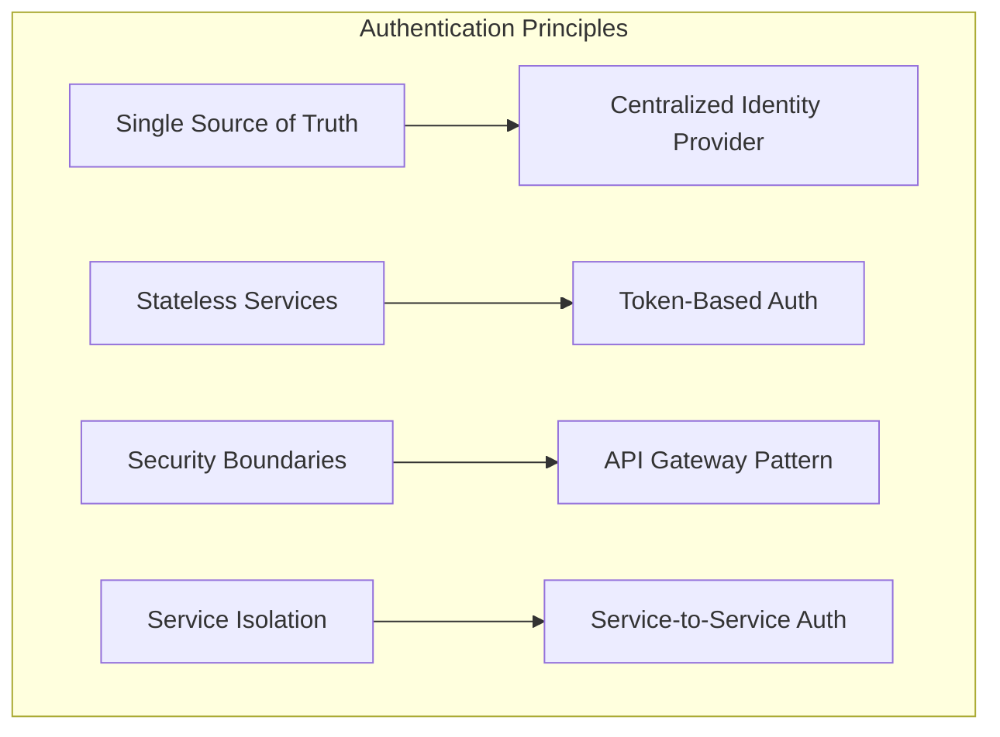

---

## 🔑 Authentication Patterns

### 1️⃣ Centralized Authentication

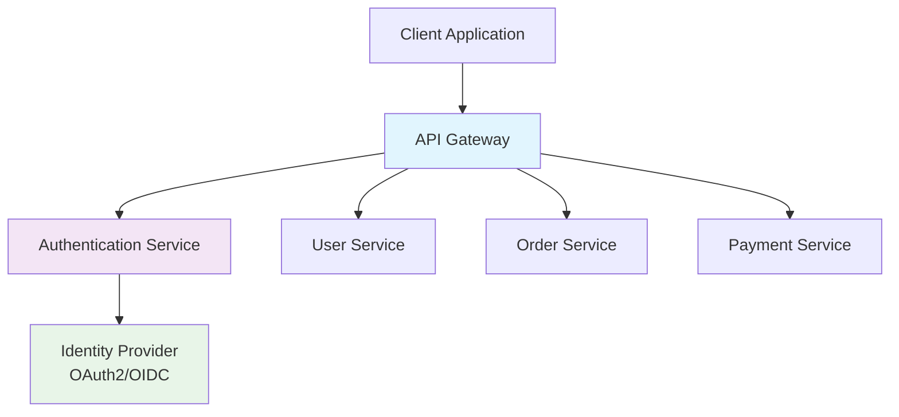

**Ưu điểm**:

- Single point of authentication
- Consistent security policies
- Easier to manage và audit
- Centralized user management

**Nhược điểm**:

- Single point of failure
- Potential bottleneck
- Network latency

### 2️⃣ Decentralized Authentication

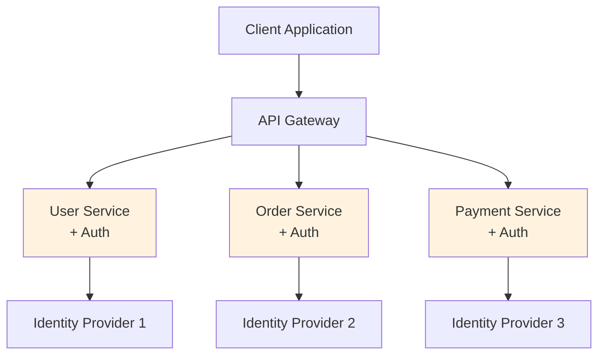

**Ưu điểm**:

- No single point of failure
- Service autonomy
- Technology diversity

**Nhược điểm**:

- Complexity tăng cao
- Inconsistent security policies
- Duplicate authentication logic

### 3️⃣ Hybrid Approach (Recommended)

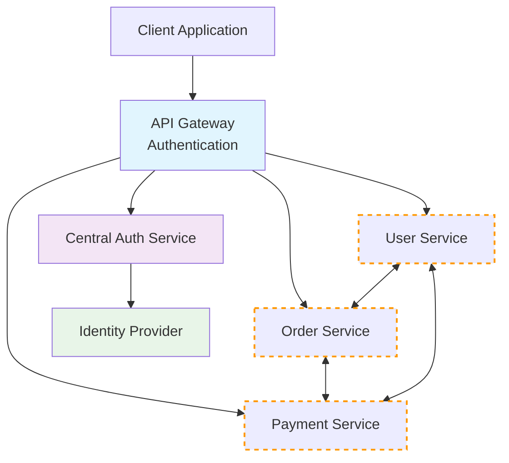

---

## 🎫 Token-Based Authentication

### JWT (JSON Web Tokens) Flow

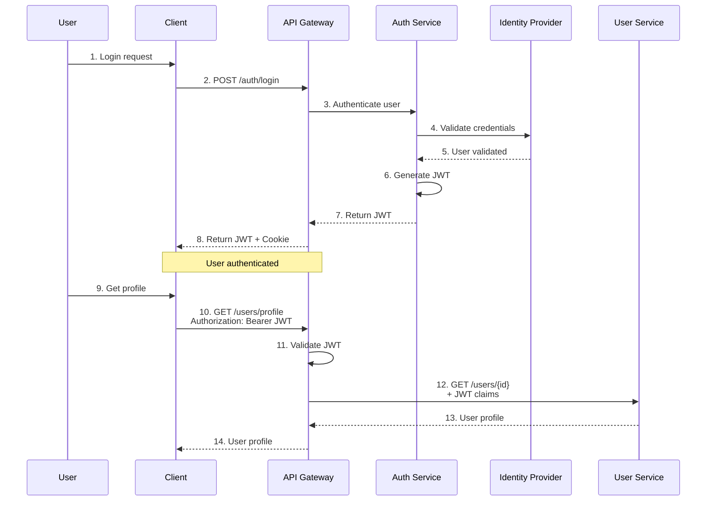

### JWT Structure & Claims

```typescript
// JWT Header
interface JWTHeader {
  alg: 'RS256' | 'HS256' // Signing algorithm
  typ: 'JWT' // Token type
  kid?: string // Key ID
}

// JWT Payload (Claims)
interface JWTPayload {
  // Standard claims
  iss: string // Issuer
  sub: string // Subject (user ID)
  aud: string // Audience
  exp: number // Expiration time
  iat: number // Issued at
  jti: string // JWT ID

  // Custom claims
  email: string
  roles: string[]
  permissions: string[]
  tenant_id?: string

  // Context for microservices
  scope: string[]
  client_id: string
}

// Example JWT
const exampleJWT = {
  header: {
    alg: 'RS256',
    typ: 'JWT',
    kid: 'auth-key-1',
  },
  payload: {
    iss: 'https://auth.yourapp.com',
    sub: 'user_12345',
    aud: 'https://api.yourapp.com',
    exp: 1677649200,
    iat: 1677645600,
    jti: 'jwt_abc123',
    email: 'user@example.com',
    roles: ['customer', 'premium'],
    permissions: ['read:profile', 'write:orders'],
    scope: ['api:read', 'api:write'],
  },
}
```

### Token Validation Architecture

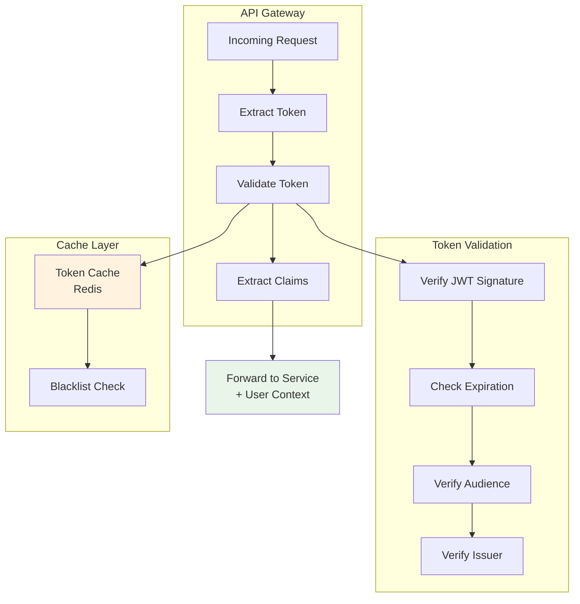

---

## 🚪 API Gateway Authentication

### Gateway as Security Perimeter

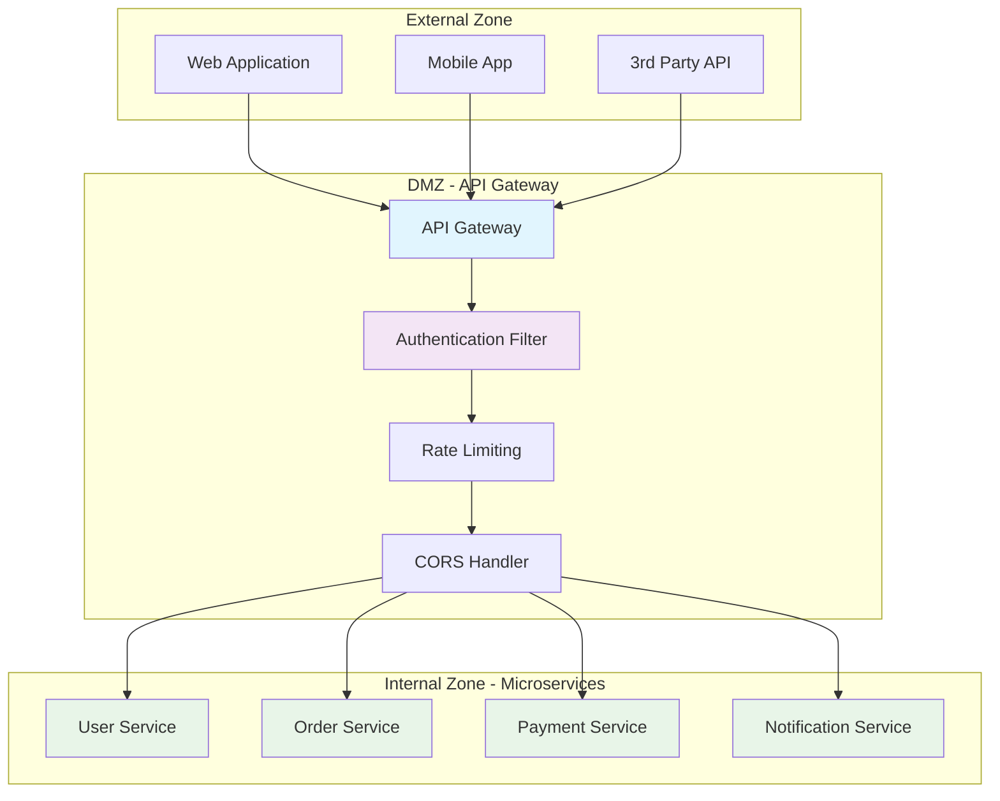

### Gateway Authentication Middleware

```typescript
@Injectable()
export class GatewayAuthMiddleware implements NestMiddleware {
  constructor(
    private jwtService: JwtService,
    private cacheService: CacheService,
    private blacklistService: BlacklistService,
  ) {}

  async use(req: Request, res: Response, next: NextFunction) {
    try {
      // 1. Extract token from request
      const token = this.extractToken(req)
      if (!token) {
        throw new UnauthorizedException('No token provided')
      }

      // 2. Check token blacklist
      if (await this.blacklistService.isBlacklisted(token)) {
        throw new UnauthorizedException('Token has been revoked')
      }

      // 3. Validate JWT
      const payload = await this.validateJWT(token)

      // 4. Extract user context
      const userContext = this.extractUserContext(payload)

      // 5. Add context to request headers for downstream services
      req.headers['x-user-id'] = userContext.userId
      req.headers['x-user-email'] = userContext.email
      req.headers['x-user-roles'] = JSON.stringify(userContext.roles)
      req.headers['x-user-permissions'] = JSON.stringify(userContext.permissions)
      req.headers['x-tenant-id'] = userContext.tenantId

      // 6. Cache validated token for performance
      await this.cacheService.set(`token:${token}`, userContext, 300) // 5 mins

      next()
    } catch (error) {
      return res.status(401).json({
        error: 'Unauthorized',
        message: error.message,
      })
    }
  }

  private extractToken(req: Request): string | null {
    // Check Authorization header
    const authHeader = req.headers.authorization
    if (authHeader?.startsWith('Bearer ')) {
      return authHeader.substring(7)
    }

    // Check cookie for web clients
    if (req.cookies?.access_token) {
      return req.cookies.access_token
    }

    return null
  }

  private async validateJWT(token: string): Promise<JWTPayload> {
    // Check cache first
    const cached = await this.cacheService.get(`token:${token}`)
    if (cached) {
      return cached
    }

    // Verify JWT signature và claims
    const payload = await this.jwtService.verifyAsync(token, {
      secret: process.env.JWT_SECRET,
      issuer: process.env.JWT_ISSUER,
      audience: process.env.JWT_AUDIENCE,
    })

    return payload
  }
}
```

### Multi-Tenant Authentication

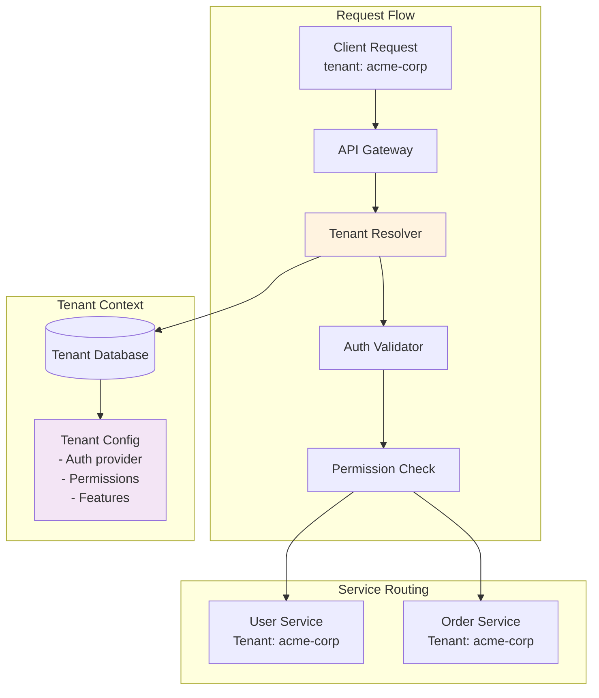

---

## 🔗 Service-to-Service Authentication

### Mutual TLS (mTLS)

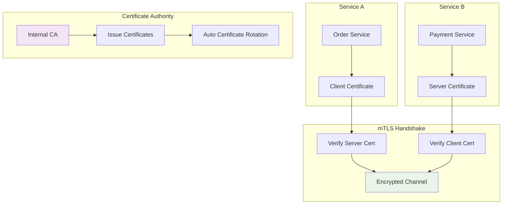

### Service Token Pattern

```typescript
@Injectable()
export class ServiceAuthService {
  constructor(
    private jwtService: JwtService,
    private httpService: HttpService,
  ) {}

  // Generate service-to-service token
  async generateServiceToken(serviceId: string, targetService: string): Promise<string> {
    const payload = {
      iss: 'service-auth',
      sub: serviceId,
      aud: targetService,
      iat: Math.floor(Date.now() / 1000),
      exp: Math.floor(Date.now() / 1000) + 300, // 5 minutes
      scope: ['service:internal'],
      service_type: 'microservice',
    }

    return this.jwtService.signAsync(payload, {
      secret: process.env.SERVICE_JWT_SECRET,
      algorithm: 'HS256',
    })
  }

  // Make authenticated service call
  async callService(targetService: string, endpoint: string, data?: any) {
    const serviceToken = await this.generateServiceToken(process.env.SERVICE_ID, targetService)

    return this.httpService
      .request({
        method: 'POST',
        url: `${targetService}${endpoint}`,
        headers: {
          Authorization: `Bearer ${serviceToken}`,
          'X-Service-ID': process.env.SERVICE_ID,
          'Content-Type': 'application/json',
        },
        data,
      })
      .toPromise()
  }
}

// Service authentication guard
@Injectable()
export class ServiceAuthGuard implements CanActivate {
  constructor(private jwtService: JwtService) {}

  async canActivate(context: ExecutionContext): Promise<boolean> {
    const request = context.switchToHttp().getRequest()
    const token = this.extractToken(request)

    if (!token) {
      return false
    }

    try {
      const payload = await this.jwtService.verifyAsync(token, {
        secret: process.env.SERVICE_JWT_SECRET,
      })

      // Verify it's a service token
      if (payload.scope?.includes('service:internal')) {
        request.serviceContext = {
          serviceId: payload.sub,
          targetService: payload.aud,
        }
        return true
      }

      return false
    } catch {
      return false
    }
  }
}
```

### Circuit Breaker Pattern cho Service Auth

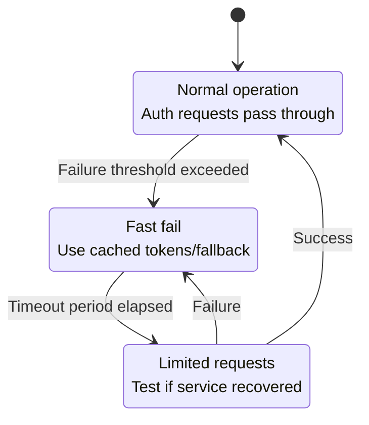

---

## 🗄️ Session Management

### Distributed Session Architecture

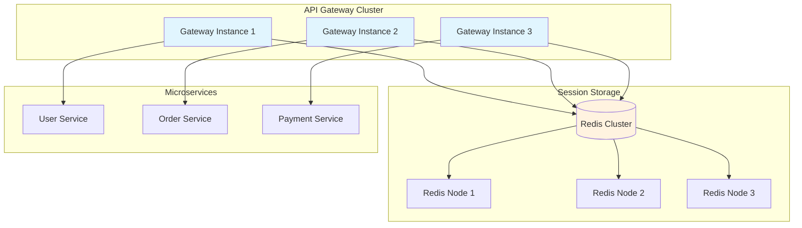

### Session Data Structure

```typescript
interface SessionData {
  sessionId: string
  userId: string
  email: string
  roles: string[]
  permissions: string[]
  tenantId?: string

  // Authentication info
  accessToken: string
  refreshToken: string
  tokenExpiration: number

  // Session metadata
  createdAt: number
  lastAccessedAt: number
  ipAddress: string
  userAgent: string
  deviceId?: string

  // Security context
  loginMethod: 'password' | 'oauth' | 'sso' | 'biometric'
  mfaVerified: boolean
  riskScore: number
}

@Injectable()
export class DistributedSessionService {
  constructor(
    private redis: RedisService,
    private encryptionService: EncryptionService,
  ) {}

  async createSession(userInfo: UserInfo, authInfo: AuthInfo): Promise<string> {
    const sessionId = crypto.randomUUID()
    const sessionData: SessionData = {
      sessionId,
      userId: userInfo.id,
      email: userInfo.email,
      roles: userInfo.roles,
      permissions: userInfo.permissions,
      tenantId: userInfo.tenantId,

      accessToken: authInfo.accessToken,
      refreshToken: authInfo.refreshToken,
      tokenExpiration: authInfo.expiresAt,

      createdAt: Date.now(),
      lastAccessedAt: Date.now(),
      ipAddress: authInfo.ipAddress,
      userAgent: authInfo.userAgent,
      deviceId: authInfo.deviceId,

      loginMethod: authInfo.method,
      mfaVerified: authInfo.mfaVerified,
      riskScore: this.calculateRiskScore(authInfo),
    }

    // Encrypt sensitive data
    const encryptedData = await this.encryptionService.encrypt(JSON.stringify(sessionData))

    // Store trong Redis với TTL
    const ttl = 24 * 60 * 60 // 24 hours
    await this.redis.setex(`session:${sessionId}`, ttl, encryptedData)

    // Index by user ID để có thể list sessions
    await this.redis.sadd(`user_sessions:${userInfo.id}`, sessionId)
    await this.redis.expire(`user_sessions:${userInfo.id}`, ttl)

    return sessionId
  }

  async getSession(sessionId: string): Promise<SessionData | null> {
    const encryptedData = await this.redis.get(`session:${sessionId}`)
    if (!encryptedData) {
      return null
    }

    const decryptedData = await this.encryptionService.decrypt(encryptedData)
    const sessionData: SessionData = JSON.parse(decryptedData)

    // Update last accessed time
    sessionData.lastAccessedAt = Date.now()
    await this.updateSession(sessionId, sessionData)

    return sessionData
  }

  async revokeSession(sessionId: string): Promise<void> {
    const session = await this.getSession(sessionId)
    if (session) {
      // Remove from Redis
      await this.redis.del(`session:${sessionId}`)

      // Remove from user's session list
      await this.redis.srem(`user_sessions:${session.userId}`, sessionId)

      // Add to blacklist để prevent replay attacks
      await this.redis.setex(
        `blacklist:${sessionId}`,
        24 * 60 * 60, // 24 hours
        'revoked',
      )
    }
  }

  async revokeAllUserSessions(userId: string): Promise<void> {
    const sessionIds = await this.redis.smembers(`user_sessions:${userId}`)

    const pipeline = this.redis.pipeline()
    for (const sessionId of sessionIds) {
      pipeline.del(`session:${sessionId}`)
      pipeline.setex(`blacklist:${sessionId}`, 24 * 60 * 60, 'revoked')
    }
    pipeline.del(`user_sessions:${userId}`)

    await pipeline.exec()
  }
}
```

---

## 🔒 Security Considerations

### Token Security Best Practices

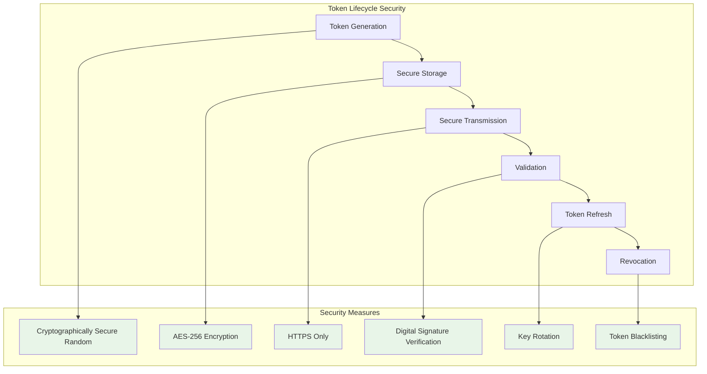

### Attack Vectors và Mitigation

#### 1️⃣ Token Theft Protection

```typescript
@Injectable()
export class TokenSecurityService {
  // Token binding để prevent token theft
  async bindTokenToContext(token: string, context: SecurityContext): Promise<string> {
    const binding = {
      ipAddress: context.ipAddress,
      userAgent: context.userAgent,
      deviceFingerprint: context.deviceFingerprint,
      timestamp: Date.now(),
    }

    const boundToken = {
      originalToken: token,
      binding: binding,
      bindingHash: await this.hashBinding(binding),
    }

    return this.encryptionService.encrypt(JSON.stringify(boundToken))
  }

  // Verify token binding
  async verifyTokenBinding(boundToken: string, currentContext: SecurityContext): Promise<boolean> {
    const decrypted = await this.encryptionService.decrypt(boundToken)
    const tokenData = JSON.parse(decrypted)

    const currentBinding = {
      ipAddress: currentContext.ipAddress,
      userAgent: currentContext.userAgent,
      deviceFingerprint: currentContext.deviceFingerprint,
    }

    const currentHash = await this.hashBinding(currentBinding)

    // Allow some tolerance cho mobile devices (IP có thể thay đổi)
    if (currentContext.isMobile) {
      return this.compareBindingWithTolerance(tokenData.binding, currentBinding)
    }

    return currentHash === tokenData.bindingHash
  }
}
```

#### 2️⃣ Rate Limiting và DDoS Protection

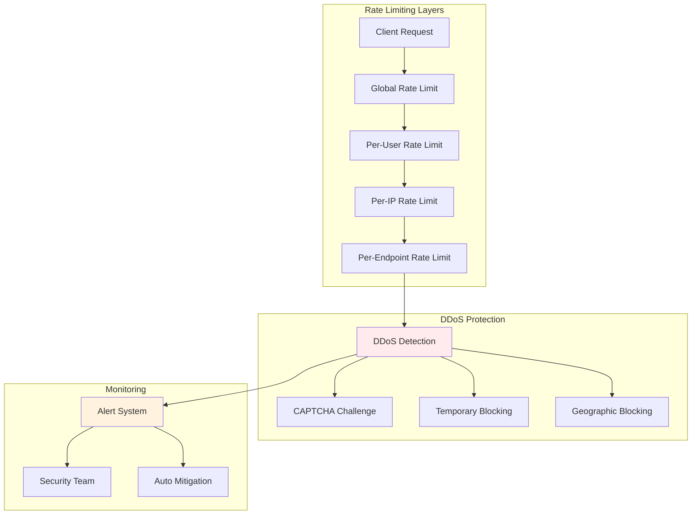

#### 3️⃣ JWT Security Headers

```typescript
// Secure JWT configuration
const jwtConfig = {
  // Signing options
  algorithm: 'RS256', // ✅ Asymmetric algorithm
  issuer: 'https://auth.yourapp.com',
  audience: 'https://api.yourapp.com',
  expiresIn: '15m', // ✅ Short-lived access tokens

  // Security headers
  header: {
    typ: 'JWT',
    alg: 'RS256',
    kid: 'key-id-2024-01', // ✅ Key rotation support
  },

  // Claims validation
  clockTolerance: 30, // 30 seconds tolerance
  maxAge: '15m',

  // Additional security
  notBefore: Math.floor(Date.now() / 1000), // ✅ Not valid before now
  jwtid: () => crypto.randomUUID(), // ✅ Unique JWT ID
}

// Secure cookie options
const cookieOptions = {
  httpOnly: true, // ✅ Prevent XSS
  secure: true, // ✅ HTTPS only
  sameSite: 'strict', // ✅ CSRF protection
  domain: '.yourapp.com',
  path: '/',
  maxAge: 24 * 60 * 60 * 1000, // 24 hours
  signed: true, // ✅ Cookie integrity
}
```

---

## 🚀 Implementation Examples

### Complete Authentication Flow

```typescript
@Controller('/auth')
export class AuthController {
  constructor(
    private authService: AuthService,
    private sessionService: SessionService,
    private tokenService: TokenService,
    private auditService: AuditService,
  ) {}

  @Post('/login')
  async login(
    @Body() loginDto: LoginDto,
    @Req() req: Request,
    @Res() res: Response,
    @UserAgent() userAgent: string,
    @IP() ipAddress: string,
  ) {
    try {
      // 1. Validate credentials
      const user = await this.authService.validateCredentials(loginDto)

      // 2. Check for suspicious activity
      const riskAssessment = await this.authService.assessLoginRisk({
        userId: user.id,
        ipAddress,
        userAgent,
        timestamp: new Date(),
      })

      if (riskAssessment.requiresMFA) {
        return this.handleMFAChallenge(user, riskAssessment)
      }

      // 3. Generate tokens
      const tokens = await this.tokenService.generateTokens(user, {
        ipAddress,
        userAgent,
        deviceId: loginDto.deviceId,
      })

      // 4. Create session
      const sessionId = await this.sessionService.createSession(user, tokens)

      // 5. Set secure cookies
      res.cookie('session_id', sessionId, {
        httpOnly: true,
        secure: process.env.NODE_ENV === 'production',
        sameSite: 'strict',
        maxAge: 24 * 60 * 60 * 1000,
      })

      // 6. Audit log
      await this.auditService.logEvent({
        type: 'USER_LOGIN',
        userId: user.id,
        ipAddress,
        userAgent,
        success: true,
        metadata: {
          loginMethod: 'password',
          riskScore: riskAssessment.score,
        },
      })

      // 7. Return response
      return {
        user: {
          id: user.id,
          email: user.email,
          roles: user.roles,
          permissions: user.permissions,
        },
        // Tokens chỉ return cho mobile clients
        ...(this.isMobileClient(req) && {
          accessToken: tokens.accessToken,
          refreshToken: tokens.refreshToken,
          expiresIn: tokens.expiresIn,
        }),
      }
    } catch (error) {
      await this.auditService.logEvent({
        type: 'LOGIN_FAILED',
        ipAddress,
        userAgent,
        error: error.message,
        metadata: { email: loginDto.email },
      })

      throw new UnauthorizedException('Invalid credentials')
    }
  }

  @Post('/refresh')
  @UseGuards(RefreshTokenGuard)
  async refreshToken(@Req() req: Request) {
    const refreshToken = this.extractRefreshToken(req)
    const newTokens = await this.tokenService.refreshTokens(refreshToken)

    return {
      accessToken: newTokens.accessToken,
      expiresIn: newTokens.expiresIn,
    }
  }

  @Post('/logout')
  @UseGuards(AuthGuard)
  async logout(@Req() req: Request, @Res() res: Response) {
    const sessionId = req.cookies.session_id
    await this.sessionService.revokeSession(sessionId)

    res.clearCookie('session_id')
    return { message: 'Logged out successfully' }
  }
}
```

### Microservice Authentication Decorator

```typescript
// Custom decorator cho microservice authentication
export function MicroserviceAuth(options?: {
  requiredRoles?: string[]
  requiredPermissions?: string[]
  allowServiceTokens?: boolean
}) {
  return applyDecorators(UseGuards(MicroserviceAuthGuard), SetMetadata('auth_options', options))
}

@Injectable()
export class MicroserviceAuthGuard implements CanActivate {
  constructor(
    private jwtService: JwtService,
    private permissionService: PermissionService,
  ) {}

  async canActivate(context: ExecutionContext): Promise<boolean> {
    const request = context.switchToHttp().getRequest()
    const options = this.reflector.get('auth_options', context.getHandler()) || {}

    // Extract token from multiple sources
    const token = this.extractToken(request)
    if (!token) {
      throw new UnauthorizedException('No authentication token')
    }

    try {
      // Validate JWT
      const payload = await this.jwtService.verifyAsync(token)

      // Check if it's a service token
      if (payload.scope?.includes('service:internal')) {
        if (options.allowServiceTokens) {
          request.serviceContext = payload
          return true
        } else {
          throw new UnauthorizedException('Service tokens not allowed')
        }
      }

      // Check user permissions
      request.user = payload

      if (options.requiredRoles?.length) {
        const hasRole = options.requiredRoles.some((role) => payload.roles?.includes(role))
        if (!hasRole) {
          throw new ForbiddenException('Insufficient role')
        }
      }

      if (options.requiredPermissions?.length) {
        const hasPermission = await this.permissionService.checkPermissions(payload.sub, options.requiredPermissions)
        if (!hasPermission) {
          throw new ForbiddenException('Insufficient permissions')
        }
      }

      return true
    } catch (error) {
      throw new UnauthorizedException('Invalid token')
    }
  }
}

// Usage examples
@Controller('/users')
export class UserController {
  @Get('/profile')
  @MicroserviceAuth({ requiredPermissions: ['read:profile'] })
  async getProfile(@User() user: JWTPayload) {
    return this.userService.getProfile(user.sub)
  }

  @Post('/admin/users')
  @MicroserviceAuth({
    requiredRoles: ['admin'],
    requiredPermissions: ['create:users'],
  })
  async createUser(@Body() userData: CreateUserDto) {
    return this.userService.create(userData)
  }

  @Get('/internal/stats')
  @MicroserviceAuth({ allowServiceTokens: true })
  async getInternalStats(@ServiceContext() context: any) {
    return this.analyticsService.getStats(context.serviceId)
  }
}
```

---

## 🎯 Ứng Dụng Thực Tế

### Integration với NestJS Ecommerce Project

#### 1️⃣ Cập Nhật Auth Module

```typescript
// src/routes/auth/auth.module.ts
@Module({
  imports: [
    JwtModule.registerAsync({
      useFactory: (configService: ConfigService) => ({
        secret: configService.get('JWT_SECRET'),
        signOptions: {
          expiresIn: '15m',
          issuer: configService.get('JWT_ISSUER'),
          audience: configService.get('JWT_AUDIENCE'),
          algorithm: 'RS256',
        },
      }),
      inject: [ConfigService],
    }),
    RedisModule,
    PassportModule,
  ],
  providers: [AuthService, SessionService, TokenService, MicroserviceAuthGuard, JwtStrategy, RefreshTokenStrategy],
  controllers: [AuthController],
  exports: [AuthService, SessionService, MicroserviceAuthGuard],
})
export class AuthModule {}
```

#### 2️⃣ Session-based Authentication cho Web

```typescript
// src/routes/auth/strategies/session.strategy.ts
@Injectable()
export class SessionStrategy extends PassportStrategy(Strategy, 'session') {
  constructor(private sessionService: SessionService) {
    super()
  }

  async validate(sessionId: string): Promise<any> {
    const session = await this.sessionService.getSession(sessionId)
    if (!session) {
      throw new UnauthorizedException('Invalid session')
    }

    return {
      userId: session.userId,
      email: session.email,
      roles: session.roles,
      permissions: session.permissions,
    }
  }
}
```

#### 3️⃣ API Gateway Implementation

```typescript
// src/gateway/gateway.module.ts
@Module({
  imports: [AuthModule, ProxyModule, RateLimitModule],
  providers: [GatewayAuthMiddleware, ServiceProxyService, RateLimitService],
  controllers: [GatewayController],
})
export class GatewayModule implements NestModule {
  configure(consumer: MiddlewareConsumer) {
    consumer.apply(GatewayAuthMiddleware).forRoutes({ path: '/api/*', method: RequestMethod.ALL })
  }
}
```

#### 4️⃣ Service-to-Service Communication

```typescript
// src/shared/services/service-client.service.ts
@Injectable()
export class ServiceClientService {
  constructor(
    private httpService: HttpService,
    private tokenService: TokenService,
  ) {}

  async callUserService(endpoint: string, data?: any) {
    const serviceToken = await this.tokenService.generateServiceToken('order-service', 'user-service')

    return this.httpService
      .request({
        method: 'POST',
        url: `${process.env.USER_SERVICE_URL}${endpoint}`,
        headers: {
          Authorization: `Bearer ${serviceToken}`,
          'X-Service-ID': 'order-service',
          'Content-Type': 'application/json',
        },
        data,
      })
      .pipe(
        catchError(this.handleServiceError.bind(this)),
        timeout(5000), // 5 second timeout
      )
  }

  private handleServiceError(error: any) {
    if (error.response?.status === 401) {
      // Service token expired, regenerate và retry
      return this.retryWithNewToken()
    }

    throw error
  }
}
```

### Performance Monitoring

```typescript
@Injectable()
export class AuthMetricsService {
  constructor(@Inject('PROMETHEUS_REGISTRY') private registry: Registry) {
    this.setupMetrics()
  }

  private setupMetrics() {
    // Authentication latency
    this.authLatency = new Histogram({
      name: 'auth_request_duration_seconds',
      help: 'Authentication request duration',
      labelNames: ['method', 'status'],
      registers: [this.registry],
    })

    // Token validation rate
    this.tokenValidations = new Counter({
      name: 'token_validations_total',
      help: 'Total token validation attempts',
      labelNames: ['result', 'token_type'],
      registers: [this.registry],
    })

    // Session metrics
    this.activeSessions = new Gauge({
      name: 'active_sessions_count',
      help: 'Number of active user sessions',
      registers: [this.registry],
    })
  }

  recordAuthLatency(method: string, status: string, duration: number) {
    this.authLatency.labels(method, status).observe(duration)
  }

  incrementTokenValidation(result: 'success' | 'failure', tokenType: string) {
    this.tokenValidations.labels(result, tokenType).inc()
  }
}
```

---

## 🎉 Kết Luận

### Key Takeaways

1. **Centralized Authentication**: API Gateway làm single point of authentication
2. **Token-Based Security**: JWT với proper validation và security practices
3. **Service-to-Service Auth**: mTLS hoặc service tokens cho internal communication
4. **Session Management**: Distributed sessions với Redis clustering
5. **Security Layers**: Multiple layers of protection từ gateway đến services

### Architecture Decision Matrix

| Requirement     | Monolithic | Microservices + API Gateway | Pure Microservices |
| --------------- | ---------- | --------------------------- | ------------------ |
| **Complexity**  | ✅ Low     | ⚠️ Medium                   | ❌ High            |
| **Security**    | ⚠️ Medium  | ✅ High                     | ⚠️ Medium          |
| **Scalability** | ❌ Limited | ✅ High                     | ✅ Very High       |
| **Maintenance** | ✅ Easy    | ⚠️ Medium                   | ❌ Complex         |
| **Performance** | ✅ Fast    | ⚠️ Good                     | ⚠️ Variable        |

### Recommended Implementation Strategy

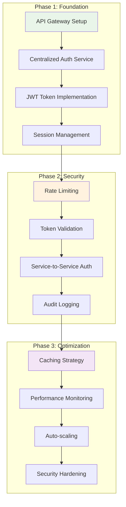

**Microservices authentication đòi hỏi careful planning và implementation**, nhưng mang lại **significant benefits** về security, scalability và maintainability cho large-scale applications! 🚀
