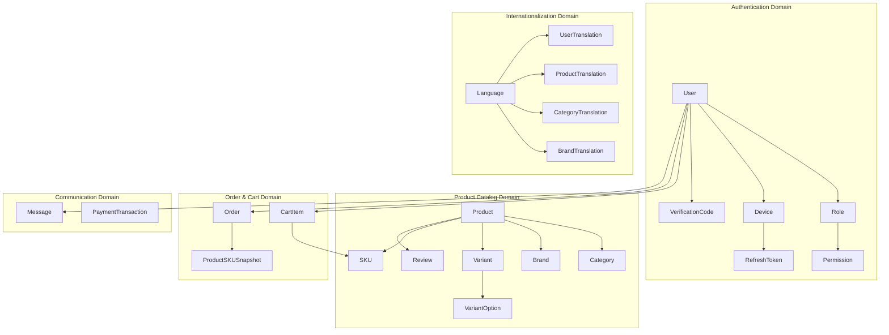

# 📊 Giải Thích Chi Tiết Schema.prisma - NestJS E-commerce API

> **Mục tiêu**: Phân tích đầy đủ thiết kế database, mối quan hệ, và lý do thiết kế của hệ thống E-commerce

---

## 📋 Mục Lục

1. [Tổng Quan Thiết Kế](#1-tổng-quan-thiết-kế)
2. [Hệ Thống Authentication & Authorization](#2-hệ-thống-authentication--authorization)
3. [Hệ Thống Đa Ngôn Ngữ (i18n)](#3-hệ-thống-đa-ngôn-ngữ-i18n)
4. [Hệ Thống Sản Phẩm & Catalog](#4-hệ-thống-sản-phẩm--catalog)
5. [Hệ Thống Giỏ Hàng & Đơn Hàng](#5-hệ-thống-giỏ-hàng--đơn-hàng)
6. [Hệ Thống Thanh Toán & Giao Dịch](#6-hệ-thống-thanh-toán--giao-dịch)
7. [Hệ Thống Nhắn Tin & Review](#7-hệ-thống-nhắn-tin--review)
8. [Audit Trail & Soft Delete](#8-audit-trail--soft-delete)
9. [Indexes & Performance](#9-indexes--performance)
10. [Kết Luận & Đánh Giá](#10-kết-luận--đánh-giá)

---

## 1. Tổng Quan Thiết Kế

### 🎯 Kiến Trúc Database

Schema này được thiết kế theo **Domain-Driven Design (DDD)** với các domain chính:



### 🔧 Cấu Hình Cơ Bản

```prisma
generator client {
  provider = "prisma-client-js"
}

datasource db {
  provider = "postgresql"
  url      = env("DATABASE_URL")
}
```

**Lý do chọn PostgreSQL:**

- ✅ **ACID compliance** đầy đủ cho e-commerce
- ✅ **JSON support** cho dữ liệu flexible
- ✅ **Array support** cho images, variants
- ✅ **Advanced indexing** cho performance
- ✅ **Full-text search** cho product search

---

## 2. Hệ Thống Authentication & Authorization

### 👤 Model User - Trung Tâm Hệ Thống

```prisma
model User {
  id          Int      @id @default(autoincrement())
  email       String
  name        String   @db.VarChar(500)
  password    String   @db.VarChar(500)
  phoneNumber String   @db.VarChar(50)
  avatar      String?  @db.VarChar(1000)

  // 2FA & Security
  totpSecret  String?  @db.VarChar(1000)
  status      UserStatus @default(INACTIVE)

  // Role-Based Access Control
  roleId      Int
  role        Role     @relation(fields: [roleId], references: [id])

  // Device & Session Management
  device      Device[]
  refreshTokens RefreshToken[]

  // Business Relations
  carts       CartItem[]
  orders      Order[]
  reviews     Review[]

  // Audit Trail (Self-referencing)
  createdById Int?
  createdBy   User? @relation("CreatorUsers", fields: [createdById], references: [id])
  createdUsers User[] @relation("CreatorUsers")

  // ... extensive audit relations ...

  deletedAt   DateTime?
  createdAt   DateTime @default(now())
  updatedAt   DateTime @updatedAt
}
```

#### 🔍 Phân Tích Chi Tiết User Model

**1. Basic Information Fields:**

- `email`, `name`, `phoneNumber`: Thông tin cơ bản
- `avatar`: Optional profile picture (URL)
- `password`: Hashed password (không bao giờ plain text)

**2. Security & 2FA:**

```prisma
totpSecret String? @db.VarChar(1000)
status     UserStatus @default(INACTIVE)
```

- `totpSecret`: Lưu secret key cho TOTP (Time-based One-Time Password)
- `status`: ACTIVE/INACTIVE/BLOCKED - quản lý trạng thái user
- **Default INACTIVE**: User mới cần verify email trước khi active

**3. Role-Based Access Control:**

```prisma
roleId Int
role   Role @relation(fields: [roleId], references: [id], onDelete: NoAction)
```

- **Many-to-One** với Role
- `onDelete: NoAction`: Không cho phép xóa Role nếu có User đang sử dụng
- **Lý do**: Bảo đảm data integrity và audit trail

**4. Device & Session Management:**

```prisma
device        Device[]
refreshTokens RefreshToken[]
```

- **One-to-Many** với Device: Track multiple devices per user
- **One-to-Many** với RefreshToken: Multiple active sessions
- **Use case**: User có thể login từ phone, laptop, tablet cùng lúc

### 🔐 Model Role - Phân Quyền Linh Hoạt

```prisma
model Role {
  id          Int          @id @default(autoincrement())
  name        String       @db.VarChar(500)
  description String       @default("")
  isActive    Boolean      @default(true)

  // Many-to-Many với Permission
  permissions Permission[]
  users       User[]

  // Audit Trail
  createdById Int?
  createdBy   User? @relation("RoleCreatedBy", fields: [createdById], references: [id])
  // ... other audit fields ...

  deletedAt DateTime?
  createdAt DateTime @default(now())
  updatedAt DateTime @updatedAt

  @@index([deletedAt])
}
```

#### 🔍 Phân Tích Role System

**1. Flexible Role Management:**

- `name`: Tên role (Admin, Manager, Customer, etc.)
- `isActive`: Có thể deactivate role mà không xóa
- `description`: Mô tả chi tiết role

**2. Many-to-Many với Permission:**

```prisma
permissions Permission[]
```

- **Implicit Many-to-Many**: Prisma tự tạo junction table
- **Flexible**: Role có thể có nhiều permissions, permission có thể thuộc nhiều roles

### 🛡️ Model Permission - Granular Access Control

```prisma
model Permission {
  id          Int        @id @default(autoincrement())
  name        String     @db.VarChar(500)
  description String     @default("")
  path        String     @db.VarChar(1000)
  method      HTTPMethod
  module      String     @default("") @db.VarChar(500)

  roles       Role[]

  // Audit trail...

  @@index([deletedAt])
}
```

#### 🔍 Phân Tích Permission System

**1. API-Based Permissions:**

- `path`: API endpoint path (e.g., `/api/users`)
- `method`: HTTP method (GET, POST, PUT, DELETE)
- **Combination**: path + method = unique permission

**2. Module Grouping:**

- `module`: Nhóm permissions theo module (User, Product, Order)
- **Use case**: Dễ quản lý và assign permissions theo module

**3. HTTPMethod Enum:**

```prisma
enum HTTPMethod {
  GET
  POST
  PUT
  DELETE
  PATCH
  OPTIONS
  HEAD
}
```

### 📱 Model Device - Multi-Device Support

```prisma
model Device {
  id            Int            @id @default(autoincrement())
  userId        Int
  user          User           @relation(fields: [userId], references: [id], onDelete: Cascade)
  userAgent     String
  ip            String
  lastActive    DateTime       @updatedAt
  createdAt     DateTime       @default(now())
  isActive      Boolean        @default(true)
  refreshTokens RefreshToken[]
}
```

#### 🔍 Phân Tích Device Management

**1. Device Tracking:**

- `userAgent`: Browser/App information
- `ip`: IP address cho security
- `lastActive`: Track user activity
- `isActive`: Có thể logout device remotely

**2. Security Benefits:**

- **Session Management**: Biết user login từ device nào
- **Security Monitoring**: Detect unusual login patterns
- **Remote Logout**: Admin có thể logout device specific

### 🔄 Model RefreshToken - JWT Security

```prisma
model RefreshToken {
  token     String @unique @db.VarChar(1000)
  userId    Int
  user      User   @relation(fields: [userId], references: [id], onDelete: Cascade)
  deviceId  Int
  device    Device @relation(fields: [deviceId], references: [id], onDelete: Cascade)

  expiresAt DateTime
  createdAt DateTime @default(now())

  @@index([expiresAt])
}
```

#### 🔍 Phân Tích Token Management

**1. Token-Device Binding:**

- Mỗi refresh token bound với specific device
- **Security**: Ngăn token hijacking across devices

**2. Expiration Management:**

- `expiresAt`: Automatic token expiry
- `@@index([expiresAt])`: Index cho cleanup expired tokens

### 🔢 Model VerificationCode - OTP System

```prisma
model VerificationCode {
  id        Int                  @id @default(autoincrement())
  email     String               @db.VarChar(500)
  code      String               @db.VarChar(50)
  type      VerificationCodeType

  expiresAt DateTime
  createdAt DateTime @default(now())

  @@unique([email, code, type])
  @@index([expiresAt])
}

enum VerificationCodeType {
  REGISTER
  FORGOT_PASSWORD
  LOGIN
  DISABLE_2FA
}
```

#### 🔍 Phân Tích OTP System

**1. Multi-Purpose OTP:**

- `type`: Khác nhau cho register, forgot password, 2FA
- **Flexible**: Có thể extend thêm types

**2. Security Design:**

- `@@unique([email, code, type])`: Prevent duplicate codes
- `expiresAt`: Time-limited codes
- **Cleanup**: Index cho việc cleanup expired codes

---

## 3. Hệ Thống Đa Ngôn Ngữ (i18n)

### 🌍 Model Language - Ngôn Ngữ Hệ Thống

```prisma
model Language {
  id                   String                @id @db.VarChar(10)
  name                 String                @db.VarChar(500)

  // Translation Relations
  userTranslations     UserTranslation[]
  productTranslations  ProductTranslation[]
  categoryTranslations CategoryTranslation[]
  brandTranslations    BrandTranslation[]

  // Audit trail...

  @@index([deletedAt])
}
```

#### 🔍 Phân Tích i18n Design

**1. Language Identifier:**

- `id`: String (e.g., "en", "vi", "zh-CN")
- **ISO 639-1**: Standard language codes
- `name`: Display name ("English", "Tiếng Việt")

**2. Translation Pattern:**

- **One-to-Many** với tất cả translation tables
- **Consistent Pattern**: Mọi entity có thể translate

### 🔤 Translation Models - Content Localization

```prisma
model UserTranslation {
  id          Int      @id @default(autoincrement())
  userId      Int
  user        User     @relation("User", fields: [userId], references: [id], onDelete: Cascade)
  languageId  String
  language    Language @relation(fields: [languageId], references: [id], onDelete: Cascade)

  // Localized Content
  address     String?  @db.VarChar(500)
  description String?

  // Audit trail...

  @@index([deletedAt])
}
```

#### 🔍 Phân Tích Translation Pattern

**1. Composite Key Pattern:**

- `userId + languageId`: Unique combination
- **One translation per language per entity**

**2. Cascade Delete:**

- `onDelete: Cascade`: Khi xóa User/Language → xóa translations
- **Data Consistency**: Không có orphaned translations

**3. Flexible Content:**

- Chỉ translate các fields cần thiết
- `nullable`: Không bắt buộc có translation cho mọi language

---

## 4. Hệ Thống Sản Phẩm & Catalog

### 🏷️ Model Brand - Thương Hiệu

```prisma
model Brand {
  id                Int                @id @default(autoincrement())
  logo              String             @db.VarChar(1000)
  name              String             @db.VarChar(500)

  products          Product[]
  brandTranslations BrandTranslation[]

  // Audit trail...

  @@index([deletedAt])
}
```

#### 🔍 Phân Tích Brand System

**1. Brand Information:**

- `logo`: Brand logo URL
- `name`: Brand name (có thể có translation)

**2. Relations:**

- **One-to-Many** với Product
- **One-to-Many** với BrandTranslation

### 📂 Model Category - Phân Loại Sản Phẩm

```prisma
model Category {
  id                   Int                   @id @default(autoincrement())

  // Self-Referencing (Tree Structure)
  parentCategoryId     Int?
  parentCategory       Category?             @relation("ParentCategoryCategories", fields: [parentCategoryId], references: [id])
  childrenCategories   Category[]            @relation("ParentCategoryCategories")

  // Relations
  products             Product[]
  categoryTranslations CategoryTranslation[]

  // Audit trail...

  @@index([deletedAt])
}
```

#### 🔍 Phân Tích Category Tree

**1. Hierarchical Structure:**

```
Electronics
├── Smartphones
│   ├── iPhone
│   └── Android
└── Laptops
    ├── Gaming
    └── Business
```

**2. Self-Referencing Relations:**

- `parentCategoryId`: Optional parent
- **Tree Structure**: Unlimited depth categories
- **Flexible**: Có thể tạo nested categories

**3. Many-to-Many với Product:**

- Product có thể thuộc nhiều categories
- Category có thể có nhiều products

### 📦 Model Product - Sản Phẩm Chính

```prisma
model Product {
  id                  Int                  @id @default(autoincrement())
  base_price          Float
  virtual_price       Float

  // Relations
  brandId             Int
  brand               Brand                @relation(fields: [brandId], references: [id])
  images              String[]
  categories          Category[]
  variants            Variant[]
  skus                SKU[]
  reviews             Review[]
  productTranslations ProductTranslation[]

  // Audit trail...

  @@index([deletedAt])
}
```

#### 🔍 Phân Tích Product Design

**1. Pricing Strategy:**

- `base_price`: Giá gốc
- `virtual_price`: Giá ảo (cho marketing, strike-through price)
- **Use case**: Show "Was $100, Now $80"

**2. Image Storage:**

- `images String[]`: Array of image URLs
- **PostgreSQL Array**: Native support, efficient

**3. Complex Relations:**

- **Many-to-One** với Brand
- **Many-to-Many** với Category
- **One-to-Many** với Variant, SKU, Review

### 🎨 Model Variant & VariantOption - Biến Thể Sản Phẩm

```prisma
model Variant {
  id             Int             @id @default(autoincrement())
  name           String          @db.VarChar(500)
  productId      Int
  product        Product         @relation(fields: [productId], references: [id], onDelete: Cascade)
  variantOptions VariantOption[]

  // Audit trail...
}

model VariantOption {
  id        Int     @id @default(autoincrement())
  value     String  @db.VarChar(500)
  variantId Int
  variant   Variant @relation(fields: [variantId], references: [id], onDelete: Cascade)
  skus      SKU[]

  // Audit trail...
}
```

#### 🔍 Phân Tích Variant System

**1. Variant Structure:**

```
Product: iPhone 15
├── Color (Variant)
│   ├── Black (VariantOption)
│   ├── White (VariantOption)
│   └── Blue (VariantOption)
└── Storage (Variant)
    ├── 128GB (VariantOption)
    ├── 256GB (VariantOption)
    └── 512GB (VariantOption)
```

**2. SKU Generation:**

- Combination of VariantOptions = SKU
- **Example**: iPhone 15 Black 128GB = SKU_001

### 📊 Model SKU - Stock Keeping Unit

```prisma
model SKU {
  id                  Int                  @id @default(autoincrement())
  value               String               @db.VarChar(500)
  price               Float
  stock               Int
  images              String[]

  productId           Int
  product             Product              @relation(fields: [productId], references: [id], onDelete: Cascade)
  variantOptions      VariantOption[]
  cartItems           CartItem[]
  productSKUSnapshots ProductSKUSnapshot[]

  // Audit trail...
}
```

#### 🔍 Phân Tích SKU System

**1. SKU Attributes:**

- `value`: SKU identifier (e.g., "IPH15-BLK-128")
- `price`: Specific price for this variant combination
- `stock`: Available inventory
- `images`: Specific images for this SKU

**2. Relations:**

- **Many-to-Many** với VariantOption: SKU = combination of options
- **One-to-Many** với CartItem: Items in cart reference SKU
- **One-to-Many** với ProductSKUSnapshot: Order history

---

## 5. Hệ Thống Giỏ Hàng & Đơn Hàng

### 🛒 Model CartItem - Giỏ Hàng Đơn Giản

```prisma
model CartItem {
  id       Int  @id @default(autoincrement())
  quantity Int

  skuId    Int
  sku      SKU  @relation(fields: [skuId], references: [id], onDelete: NoAction)
  userId   Int
  user     User @relation(fields: [userId], references: [id], onDelete: Cascade)

  createdAt DateTime @default(now())
  updatedAt DateTime @updatedAt
}
```

#### 🔍 Phân Tích Cart Design

**1. Simplified Cart:**

- **Trực tiếp User → CartItem**: Không có Cart table riêng
- **Simple**: Mỗi user có list CartItems

**2. Relations:**

- **Many-to-One** với SKU: `onDelete: NoAction` (bảo vệ cart khi SKU thay đổi)
- **Many-to-One** với User: `onDelete: Cascade` (xóa cart khi xóa user)

**3. Thiếu sót của thiết kế hiện tại:**

- ❌ Không support guest cart
- ❌ Không có price snapshot
- ❌ Không có cart expiration
- ❌ Không có unique constraint (user + sku)

### 📋 Model Order - Đơn Hàng

```prisma
model Order {
  id     Int                  @id @default(autoincrement())
  userId Int
  user   User                 @relation(fields: [userId], references: [id], onDelete: NoAction)
  status OrderStatus
  items  ProductSKUSnapshot[]

  // Audit trail...

  @@index([deletedAt])
}

enum OrderStatus {
  PENDING_CONFIRMATION
  PENDING_PICKUP
  PENDING_DELIVERY
  DELIVERED
  RETURNED
  CANCELLED
}
```

#### 🔍 Phân Tích Order System

**1. Order States:**

- **Comprehensive workflow**: Từ pending → delivered
- **Trackable**: Clear order lifecycle

**2. Order Items:**

- **One-to-Many** với ProductSKUSnapshot
- **Snapshot Pattern**: Lưu thông tin sản phẩm tại thời điểm order

### 📸 Model ProductSKUSnapshot - Order History Protection

```prisma
model ProductSKUSnapshot {
  id          Int      @id @default(autoincrement())
  productName String   @db.VarChar(500)
  price       Float
  images      String[]
  skuValue    String   @db.VarChar(500)

  skuId       Int?
  sku         SKU?     @relation(fields: [skuId], references: [id], onDelete: SetNull)
  orderId     Int?
  order       Order?   @relation(fields: [orderId], references: [id], onDelete: SetNull)

  createdAt DateTime @default(now())
}
```

#### 🔍 Phân Tích Snapshot Pattern

**1. Immutable Order History:**

- **Denormalized Data**: Lưu thông tin sản phẩm tại thời điểm mua
- **Price Protection**: Giá không thay đổi khi sản phẩm update
- **Legal Compliance**: Hóa đơn chính xác theo thời điểm giao dịch

**2. Flexible References:**

- `skuId?`: Optional reference (có thể null nếu SKU bị xóa)
- `orderId?`: Optional reference (có thể dùng cho multiple purposes)

**3. Event Sourcing:**

- **Audit Trail**: Có thể trace lại lịch sử thay đổi giá
- **Analytics**: Phân tích pricing history

---

## 6. Hệ Thống Thanh Toán & Giao Dịch

### 💳 Model PaymentTransaction - Giao Dịch Thanh Toán

```prisma
model PaymentTransaction {
  id                 Int      @id @default(autoincrement())
  gateway            String   @db.VarChar(100)
  transactionDate    DateTime @default(now())
  accountNumber      String   @db.VarChar(100)
  subAccount         String?  @db.VarChar(250)
  amountIn           Int      @default(0)
  amountOut          Int      @default(0)
  accumulated        Int      @default(0)
  code               String?  @db.VarChar(250)
  transactionContent String?  @db.Text
  referenceNumber    String?  @db.VarChar(255)
  body               String?  @db.Text

  createdAt DateTime @default(now())
}
```

#### 🔍 Phân Tích Payment System

**1. Multi-Gateway Support:**

- `gateway`: VNPay, MoMo, ZaloPay, etc.
- **Flexible**: Support multiple payment providers

**2. Transaction Tracking:**

- `amountIn/amountOut`: Money flow direction
- `accumulated`: Running balance
- `referenceNumber`: External transaction ID

**3. Audit & Reconciliation:**

- `transactionContent`: Transaction description
- `body`: Raw webhook data
- **Complete Audit**: Full transaction history

**4. Thiếu sót:**

- ❌ Không link với Order
- ❌ Không có status field
- ❌ Không có currency field

---

## 7. Hệ Thống Nhắn Tin & Review

### 💬 Model Message - Hệ Thống Tin Nhắn

```prisma
model Message {
  id         Int    @id @default(autoincrement())
  fromUserId Int
  fromUser   User   @relation("FromUser", fields: [fromUserId], references: [id], onDelete: Cascade)
  toUserId   Int
  toUser     User   @relation("ToUser", fields: [toUserId], references: [id], onDelete: Cascade)
  content    String

  readAt    DateTime?
  createdAt DateTime  @default(now())
}
```

#### 🔍 Phân Tích Messaging System

**1. Direct Messaging:**

- **User-to-User**: Simple P2P messaging
- **Named Relations**: "FromUser", "ToUser" để tránh ambiguity

**2. Read Status:**

- `readAt`: Track message read status
- **Nullable**: null = unread, DateTime = read

**3. Limitations:**

- ❌ Không support group chat
- ❌ Không có message types (text, image, file)
- ❌ Không có delete/edit functionality

### ⭐ Model Review - Đánh Giá Sản Phẩm

```prisma
model Review {
  id        Int     @id @default(autoincrement())
  content   String
  rating    Int
  productId Int
  product   Product @relation(fields: [productId], references: [id], onDelete: NoAction)
  userId    Int
  user      User    @relation(fields: [userId], references: [id], onDelete: NoAction)

  createdAt DateTime @default(now())
  updatedAt DateTime @updatedAt
}
```

#### 🔍 Phân Tích Review System

**1. Simple Rating:**

- `rating`: Numeric rating (1-5 stars)
- `content`: Text review

**2. Relations:**

- **Many-to-One** với Product và User
- `onDelete: NoAction`: Bảo vệ reviews khi user/product bị xóa

**3. Missing Features:**

- ❌ Không có helpful votes
- ❌ Không có review images
- ❌ Không có verified purchase check
- ❌ Không có reply system

---

## 8. Audit Trail & Soft Delete

### 🔍 Audit Trail Pattern

Mọi entity quan trọng đều có audit trail:

```prisma
// Common Audit Fields
createdById Int?
createdBy   User? @relation("EntityCreatedBy", fields: [createdById], references: [id], onDelete: SetNull)
updatedById Int?
updatedBy   User? @relation("EntityUpdatedBy", fields: [updatedById], references: [id], onDelete: SetNull)
deletedById Int?
deletedBy   User? @relation("EntityDeletedBy", fields: [deletedById], references: [id], onDelete: SetNull)

deletedAt DateTime?
createdAt DateTime @default(now())
updatedAt DateTime @updatedAt
```

#### 🔍 Phân Tích Audit System

**1. Complete Audit Trail:**

- **WHO**: createdBy, updatedBy, deletedBy
- **WHEN**: createdAt, updatedAt, deletedAt
- **WHAT**: Implicit từ entity changes

**2. Soft Delete:**

- `deletedAt`: null = active, DateTime = deleted
- **Data Recovery**: Có thể restore deleted records
- **Compliance**: Meet audit requirements

**3. Self-Referencing:**

- User audit User: Track admin actions
- **Hierarchical**: Manager tạo employee

### 📊 Index Strategy

```prisma
@@index([deletedAt])
```

**Performance Optimization:**

- **Filtered Queries**: WHERE deletedAt IS NULL
- **Fast Lookups**: Index trên deletedAt
- **Cleanup Jobs**: Find expired records

---

## 9. Indexes & Performance

### 🚀 Index Analysis

```prisma
// Language
@@index([deletedAt])

// User
@@index([deletedAt])

// RefreshToken
@@index([expiresAt])

// VerificationCode
@@unique([email, code, type])
@@index([expiresAt])

// Permission
@@index([deletedAt])

// Role
@@index([deletedAt])

// All other entities...
@@index([deletedAt])
```

#### 🔍 Phân Tích Index Strategy

**1. Soft Delete Optimization:**

- **Every Entity**: Index trên deletedAt
- **Common Query**: WHERE deletedAt IS NULL
- **Performance**: Fast filtering active records

**2. Expiration Indexes:**

- `RefreshToken.expiresAt`: Cleanup expired tokens
- `VerificationCode.expiresAt`: Cleanup expired codes
- **Maintenance**: Efficient cleanup jobs

**3. Unique Constraints:**

- `RefreshToken.token`: Prevent duplicate tokens
- `[email, code, type]`: Prevent duplicate OTP codes

**4. Missing Indexes:**

- ❌ User.email (for login queries)
- ❌ Product.brandId (for brand filtering)
- ❌ CartItem.[userId, skuId] (for cart queries)
- ❌ Order.userId (for user orders)

---

## 10. Kết Luận & Đánh Giá

### ✅ Điểm Mạnh của Schema

**1. Comprehensive Audit Trail:**

- Complete WHO/WHEN tracking
- Soft delete cho data recovery
- Self-referencing audit

**2. Flexible i18n System:**

- Consistent translation pattern
- Support multiple languages
- Extensible design

**3. Security-First Design:**

- Multi-device session management
- JWT + Refresh token
- 2FA support
- RBAC with granular permissions

**4. Product Catalog Flexibility:**

- Complex variant system
- Multi-category support
- Brand management
- Review system

**5. Order History Protection:**

- Snapshot pattern
- Immutable order data
- Price protection

### ⚠️ Điểm Cần Cải Thiện

**1. Cart System:**

- Thiếu guest cart support
- Không có price snapshot
- Missing unique constraints
- Không có cart expiration

**2. Payment Integration:**

- PaymentTransaction không link với Order
- Thiếu payment status
- Không có refund tracking

**3. Performance:**

- Thiếu indexes quan trọng
- Không có pagination strategy
- Thiếu caching strategy

**4. Advanced Features:**

- Inventory management
- Promotion/Coupon system
- Wishlist functionality
- Advanced search

### 🚀 Đề Xuất Cải Thiện

**1. Enhanced Cart System:**

```prisma
model Cart {
  id        Int    @id @default(autoincrement())
  userId    Int?
  sessionId String?
  expiresAt DateTime?
  items     CartItem[]
}

model CartItem {
  cartId    Int
  skuId     Int
  quantity  Int
  unitPrice Float  // Price snapshot

  @@unique([cartId, skuId])
}
```

**2. Improved Payment:**

```prisma
model Payment {
  id      Int     @id @default(autoincrement())
  orderId Int
  amount  Float
  status  PaymentStatus
  gateway String
}
```

**3. Additional Indexes:**

```prisma
@@index([email])  // User
@@index([userId]) // Order, CartItem
@@index([brandId, deletedAt]) // Product
```

### 📈 Kết Luận Tổng Quan

Schema này thể hiện một **thiết kế database chín chắn** cho hệ thống E-commerce với:

- ✅ **Security-First Approach**
- ✅ **Audit Trail Complete**
- ✅ **Internationalization Ready**
- ✅ **Scalable Architecture**
- ⚠️ **Cần cải thiện Cart & Payment**
- ⚠️ **Cần optimize Performance**

Đây là một **foundation tốt** để xây dựng hệ thống E-commerce production-ready với một số adjustments cần thiết!

---

_📝 Document này sẽ được update khi schema có thay đổi._
