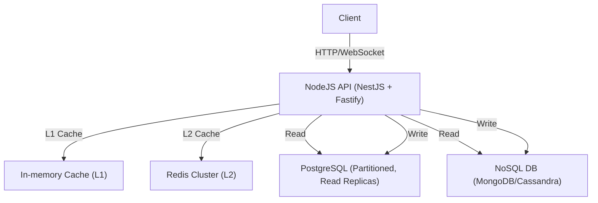

# 🏎️ Giải pháp tối ưu tốc độ đọc cực lớn cho ứng dụng NodeJS (hàng trăm ngàn QPS)

## 1. Tổng quan bài toán

- **Yêu cầu:** Ứng dụng cần tốc độ đọc cực lớn (ví dụ: chat, feed, analytics, dashboard real-time), số lượng request đọc có thể lên tới hàng trăm ngàn QPS.
- **Mục tiêu:** Độ trễ thấp (<10-50ms), khả năng scale ngang, chi phí hợp lý, dễ maintain.
- **Bối cảnh:** Backend sử dụng NodeJS, cần chọn công nghệ database và chiến lược tối ưu phù hợp.

---

## 2. Phân tích các lựa chọn Backend & Database

### 2.1. Backend (NodeJS)

- **NestJS**: Framework mạnh, hỗ trợ DI, module hóa, CQRS, dễ mở rộng, phù hợp microservices.
- **Express/Fastify**: Nếu cần tối giản, Fastify có hiệu năng raw tốt hơn Express.
- **Kết luận:** NestJS + Fastify adapter là lựa chọn tối ưu cho hệ thống lớn, cần maintain lâu dài.

### 2.2. Database

#### a) RDBMS (PostgreSQL, MySQL)

- **Ưu:** ACID, query linh hoạt, join mạnh, partitioning tốt (đặc biệt PostgreSQL).
- **Nhược:** Đọc cực lớn cần partition, index, cache, có thể bottleneck nếu không tối ưu.

#### b) NoSQL (Redis, MongoDB, Cassandra, ScyllaDB)

- **Redis:** In-memory, tốc độ đọc ghi cực nhanh (hàng triệu QPS), phù hợp cache/session/feed/chat.
- **MongoDB:** Document store, scale tốt, query linh hoạt, phù hợp analytics, feed.
- **Cassandra/ScyllaDB:** Phân tán, scale ngang cực mạnh, tối ưu cho write/read throughput lớn, phù hợp chat, log, time-series.

#### c) Kết hợp (Polyglot Persistence)

- **Thực tế:** Hệ thống lớn thường kết hợp nhiều loại DB: PostgreSQL (transactional), Redis (cache/feed), MongoDB/Cassandra (log, message, analytics).

---

## 3. Chiến lược tối ưu tốc độ đọc

### 3.1. Database Partitioning & Indexing

- **Partitioning:** Chia bảng lớn thành nhiều partition nhỏ (theo thời gian, user, status...) để query chỉ scan 1 phần nhỏ dữ liệu.
  - Ví dụ: Partition bảng Order theo tháng, bảng Message theo userId/hash.
- **Indexing:** Đánh index đúng trường truy vấn (userId, createdAt, status...) để tăng tốc độ đọc.
- **Denormalization:** Lưu dữ liệu dư thừa (counter, snapshot, redundant fields) để giảm join, tăng tốc độ đọc.

### 3.2. Caching (Redis, In-memory, Multi-level)

- **Redis cache:** Lưu các dữ liệu đọc nhiều (profile, permission, feed, chat history, session...) vào Redis, giảm tải DB chính.
- **In-memory cache (L1):** Sử dụng cache trong process NodeJS (Map, LRU), TTL ngắn, cho hot data.
- **Multi-level cache:** Kết hợp L1 (in-memory) + L2 (Redis) + L3 (DB), kiểm soát TTL, invalidation.
- **Cache-aside pattern:** Ứng dụng tự kiểm tra cache trước, nếu miss thì lấy DB và update cache.

### 3.3. CQRS & Read Replicas

- **CQRS:** Tách riêng read/write, tối ưu hóa model đọc (denormalized, indexed, cache mạnh), có thể dùng DB riêng cho đọc.
- **Read Replicas:** Dùng nhiều replica DB chỉ để đọc, scale ngang, giảm tải DB chính.

### 3.4. Batch & Streaming

- **Batch read:** Gom nhiều request thành 1 query lớn (DataLoader, batch API) để giảm số lần truy vấn.
- **Streaming:** Trả dữ liệu theo stream (WebSocket, SSE) cho các ứng dụng real-time.

### 3.5. Best Practices khác

- **Connection pooling:** Tối ưu pool DB/Redis để tránh quá tải connection.
- **Query optimization:** Tránh N+1 query, dùng select/include hợp lý, phân trang bằng cursor.
- **Monitoring:** Theo dõi cache hit/miss, query time, QPS, alert khi có bottleneck.

---

## 4. Đề xuất kiến trúc thực tế cho NodeJS ứng dụng đọc lớn

### 4.1. Kiến trúc tổng thể



### 4.2. Ví dụ luồng đọc tối ưu

1. **Client gửi request đọc (ví dụ: lấy 1000 message chat):**
2. **API kiểm tra L1 cache (in-memory):** Nếu có, trả về ngay (1-2ms).
3. **Nếu miss, kiểm tra Redis (L2):** Nếu có, trả về (1-3ms).
4. **Nếu tiếp tục miss, query DB (PostgreSQL partitioned hoặc NoSQL):**
   - Query chỉ scan partition nhỏ, index tốt, trả về nhanh (5-20ms).
   - Kết quả được cache lại vào Redis và L1.
5. **Nếu cần real-time, dùng WebSocket/SSE để push data mới cho client.**

### 4.3. Cấu hình thực tế (trích từ dự án)

- **Redis:**
  - Docker Compose: `redis:7-alpine`, port 6379.
  - Sử dụng cho cache session, permission, feed, chat, payment summary...
- **PostgreSQL:**
  - Partition bảng lớn (Order, Message, PaymentTransaction) theo thời gian/user.
  - Đánh index composite (userId, createdAt, status...)
  - Sử dụng read replica cho API đọc.
- **NodeJS:**
  - NestJS + Prisma, kết nối pool tối ưu.
  - Module cache (CacheModule) hỗ trợ Redis/in-memory, TTL linh hoạt.
  - CQRS pattern cho các module cần throughput lớn.

### 4.4. Đoạn code mẫu (NestJS + Redis cache)

```typescript
@Injectable()
export class PermissionCacheService {
  constructor(
    private readonly cacheService: CacheService, // Redis
    private readonly prisma: PrismaService,
  ) {}

  async getUserPermissions(userId: number): Promise<Permission[]> {
    const cacheKey = `user:${userId}:permissions`
    let permissions = await this.cacheService.get<Permission[]>(cacheKey)
    if (permissions) return permissions
    // Nếu miss cache, query DB
    const user = await this.prisma.user.findUnique({
      where: { id: userId },
      include: { role: { include: { permissions: true } } },
    })
    permissions = user?.role.permissions || []
    await this.cacheService.set(cacheKey, permissions, 900) // TTL 15 phút
    return permissions
  }
}
```

---

## 5. Kết luận & lưu ý quan trọng

- **Không có 1 giải pháp duy nhất:** Hệ thống lớn cần kết hợp nhiều công nghệ (RDBMS, NoSQL, Redis, cache, partition, CQRS...)
- **Luôn đo lường thực tế:** Benchmark từng giải pháp với data volume thật, theo dõi cache hit, query time, QPS.
- **Đừng quên cache invalidation:** Cache sai còn nguy hiểm hơn không cache, cần chiến lược clear/invalidate hợp lý.
- **Tối ưu query, index, partition trước khi scale DB:** Đa số bottleneck do query/index kém, không phải do DB yếu.
- **Đọc tài liệu, best practice:** Tham khảo thêm các tài liệu trong dự án về partitioning, caching, CQRS, system design.

---

**Tài liệu tham khảo:**

- [docs/ZZ_26_DATABASE_PARTITIONING_COMPLETE_GUIDE.md]
- [docs/ZZ_6_OPTIMIZATION_ROADMAP.md]
- [docs/ZZ_25_NESTJS_INTERVIEW_COMPLETE_GUIDE.md]
- [docs/ZZ_2_NESTJS_INTERVIEW_QUESTIONS_PART2.md]
- [docs/ZZ_22_DATABASE_NORMALIZATION_DENORMALIZATION_GUIDE_CHI_TIET.md]
- [docs/ZZ_24_MICROSERVICES_AUTHENTICATION_AUTHORIZATION.md]
- [docs/ZZ_10_E_LEARNING_SYSTEM_DESIGN.md]
