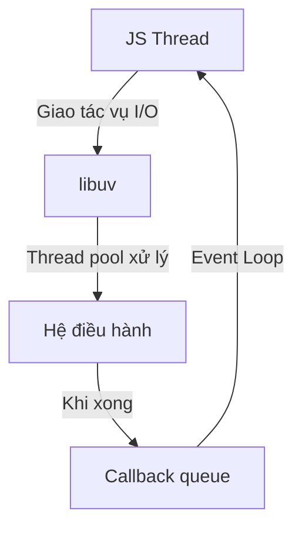

# NodeJS: Single Thread nhưng vẫn "Song Song"? Giải Thích Chuyên Sâu

## 1. NodeJS là Single Thread ở đâu?

- **JavaScript Runtime** trong NodeJS chỉ có **một Call Stack** để thực thi code JS. Tức là, mọi đoạn code JS đồng bộ đều chạy nối tiếp, không thực sự "song song" như multi-thread truyền thống.
- Khi bạn viết:

```js
console.log('A')
console.log('B')
```

Thì luôn luôn ra A rồi B, không bao giờ đảo ngược.

## 2. Vậy tại sao NodeJS vẫn xử lý được nhiều tác vụ "song song"?

### a. Cơ chế Event Loop

- **Event Loop** là "trái tim" của NodeJS. Nó liên tục kiểm tra các hàng đợi (queue) để xem có tác vụ nào cần thực thi không.
- Khi gặp các tác vụ bất đồng bộ (I/O, timer, network...), NodeJS **không chờ** mà "đẩy" chúng ra ngoài (giao cho hệ thống khác xử lý), rồi tiếp tục chạy code khác.

### b. Libuv: "Bí mật" phía sau

- NodeJS sử dụng **libuv** (một thư viện C++) để quản lý I/O bất đồng bộ, thread pool, timer, v.v.
- Khi bạn gọi `fs.readFile`, `http.request`, `setTimeout`... NodeJS sẽ giao cho libuv xử lý.
- **libuv** sẽ dùng các kỹ thuật:
  - **Non-blocking I/O**: Hệ điều hành hỗ trợ đọc/ghi file, network... không cần chờ.
  - **Thread Pool**: Một số tác vụ (như mã hóa, nén, truy cập file hệ thống) sẽ được xử lý bởi một nhóm thread phụ (mặc định 4 thread, có thể tăng lên).

### c. Quy trình thực tế

1. **JS Thread** nhận lệnh bất đồng bộ (ví dụ: đọc file lớn).
2. Giao cho **libuv** xử lý.
3. **libuv** dùng thread pool hoặc API hệ điều hành để xử lý.
4. Khi xong, callback được đẩy vào queue.
5. **Event Loop** kiểm tra queue, thấy callback, đưa vào Call Stack để thực thi tiếp.

### d. Minh họa bằng code

```js
const fs = require('fs')

console.log('Start')
fs.readFile('bigfile.txt', () => {
  console.log('Done reading file')
})
console.log('End')
```

**Output:**

```
Start
End
Done reading file
```

- `fs.readFile` không chặn luồng chính, NodeJS tiếp tục chạy các lệnh khác.
- Khi đọc file xong (có thể do thread pool hoặc OS xử lý), callback mới được thực thi.

### e. So sánh với Multi-thread truyền thống

| NodeJS (Event Loop)          | Multi-thread truyền thống (Java, C#...) |
| ---------------------------- | --------------------------------------- |
| 1 thread chính cho JS        | Nhiều thread thực thi code song song    |
| I/O, nặng: thread pool/libuv | I/O, nặng: tạo thread mới               |
| Không cần lock/phức tạp      | Dễ deadlock, race condition             |
| Dễ scale I/O                 | Tốn RAM, context switch                 |

- **NodeJS** cực mạnh với I/O bound (nhiều request, ít CPU), ví dụ: web server, API, chat...
- **Multi-thread** mạnh với CPU bound (tính toán nặng, xử lý song song thực sự).

## 3. Các loại tác vụ trong NodeJS

- **I/O Bound**: Đọc/ghi file, network, DB... → NodeJS cực mạnh, "song song" hàng ngàn request.
- **CPU Bound**: Tính toán nặng (hash, nén, AI...) → NodeJS sẽ bị nghẽn vì chỉ 1 thread JS chính. Có thể dùng `worker_threads` để xử lý song song thật sự.

## 4. Ví dụ thực tế: Web Server

```js
const http = require('http')

http
  .createServer((req, res) => {
    fs.readFile('bigfile.txt', (err, data) => {
      res.end(data)
    })
  })
  .listen(3000)
```

- 1000 client cùng request: NodeJS vẫn phục vụ được vì mỗi request đọc file là bất đồng bộ, không chặn thread chính.
- Nếu code đồng bộ (ví dụ: vòng lặp lớn), NodeJS sẽ bị "đơ".

## 5. Tổng kết: Tại sao NodeJS single thread mà vẫn "song song"?

- **Vì NodeJS chỉ single thread ở JS runtime, nhưng nhờ event loop + libuv + thread pool, nó có thể xử lý hàng ngàn tác vụ I/O cùng lúc mà không block.**
- **Tác vụ nặng CPU thì vẫn bị nghẽn, cần worker_threads hoặc tách service.**
- **Ưu điểm:** Đơn giản, ít bug race condition, scale tốt với I/O.
- **Nhược điểm:** Không phù hợp cho xử lý song song CPU nặng.

## 6. Hình minh họa (pseudo-code)



## 7. Tham khảo thêm

- [docs/ZZ_28_TRA_LOI_CAU_HOI_DATABASE_ECOMMERCE.md](./ZZ_28_TRA_LOI_CAU_HOI_DATABASE_ECOMMERCE.md) (phần Event Loop)
- [NodeJS Docs: Event Loop, Timers, and process.nextTick()](https://nodejs.org/en/docs/guides/event-loop-timers-and-nexttick/)
- [Libuv official site](https://libuv.org/)
