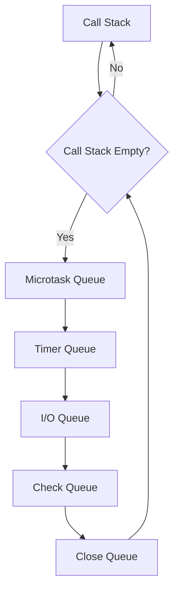

# 🚀 Blocking vs Non-Blocking trong NodeJS: Giải Thích Chi Tiết và Sâu Sắc

## 📋 MỤC LỤC

1. [Khái Niệm Cơ Bản](#1-khái-niệm-cơ-bản)
2. [Blocking Operations - Tác Vụ Chặn](#2-blocking-operations---tác-vụ-chặn)
3. [Non-Blocking Operations - Tác Vụ Không Chặn](#3-non-blocking-operations---tác-vụ-không-chặn)
4. [Event Loop và Cơ Chế Hoạt Động](#4-event-loop-và-cơ-chế-hoạt-động)
5. [Libuv - Trái Tim của Non-Blocking I/O](#5-libuv---trái-tim-của-non-blocking-io)
6. [So Sánh Chi Tiết](#6-so-sánh-chi-tiết)
7. [Ví Dụ Thực Tế](#7-ví-dụ-thực-tế)
8. [Best Practices](#8-best-practices)
9. [Tình Huống Thực Tế](#9-tình-huống-thực-tế)
10. [Kết Luận](#10-kết-luận)

---

## 1. Khái Niệm Cơ Bản

### 🤔 Blocking là gì?

**Blocking** (chặn) là khi một tác vụ được thực thi và **chặn** (block) thread chính, khiến cho các tác vụ khác phải **chờ đợi** cho đến khi tác vụ đó hoàn thành.

```javascript
// ❌ Blocking operation - Đọc file đồng bộ
const fs = require('fs')

console.log('Bắt đầu đọc file...')
const data = fs.readFileSync('bigfile.txt') // ⚠️ CHẶN thread chính
console.log('Đã đọc xong file')
console.log('Tiếp tục các tác vụ khác...')
```

**Kết quả:**

```
Bắt đầu đọc file...
[CHỜ ĐỢI 2-3 giây... không làm gì được]
Đã đọc xong file
Tiếp tục các tác vụ khác...
```

### 🚀 Non-Blocking là gì?

**Non-Blocking** (không chặn) là khi một tác vụ được thực thi nhưng **không chặn** thread chính, cho phép các tác vụ khác tiếp tục thực hiện song song.

```javascript
// ✅ Non-blocking operation - Đọc file bất đồng bộ
const fs = require('fs')

console.log('Bắt đầu đọc file...')
fs.readFile('bigfile.txt', (err, data) => {
  // ✅ KHÔNG chặn thread chính
  console.log('Đã đọc xong file')
})
console.log('Tiếp tục các tác vụ khác...')
```

**Kết quả:**

```
Bắt đầu đọc file...
Tiếp tục các tác vụ khác...
[Sau 2-3 giây]
Đã đọc xong file
```

---

## 2. Blocking Operations - Tác Vụ Chặn

### 🔴 Đặc Điểm của Blocking Operations

1. **Chặn thread chính**: Không thể làm gì khác trong lúc chờ
2. **Đồng bộ (Synchronous)**: Thực hiện tuần tự, từng bước một
3. **Dễ hiểu**: Code chạy từ trên xuống dưới
4. **Hiệu năng kém**: Lãng phí tài nguyên CPU khi chờ I/O

### 📝 Các Loại Blocking Operations Phổ Biến

#### a) File System Operations

```javascript
const fs = require('fs')

// ❌ Blocking - Đọc file
const data = fs.readFileSync('data.txt')

// ❌ Blocking - Ghi file
fs.writeFileSync('output.txt', 'Hello World')

// ❌ Blocking - Kiểm tra file tồn tại
const exists = fs.existsSync('config.json')
```

#### b) CPU-Intensive Operations

```javascript
// ❌ Blocking - Tính toán nặng
function fibonacci(n) {
  if (n < 2) return n
  return fibonacci(n - 1) + fibonacci(n - 2)
}

console.log('Bắt đầu tính toán...')
const result = fibonacci(40) // ⚠️ Chặn thread ~2-3 giây
console.log('Kết quả:', result)
console.log('Tiếp tục...')
```

#### c) Synchronous Network Calls (Hiếm)

```javascript
// ❌ Blocking - HTTP request đồng bộ (deprecated)
const http = require('http')

// Đây là ví dụ conceptual - thực tế Node.js không có sync HTTP
// nhưng nếu có thì sẽ chặn thread như thế này:
// const response = http.getSync('https://api.example.com')
```

### ⚠️ Vấn Đề của Blocking Operations

```javascript
// 🚨 VÍ DỤ VỀ VẤN ĐỀ BLOCKING
const fs = require('fs')
const http = require('http')

const server = http.createServer((req, res) => {
  console.log('Nhận request từ:', req.url)

  // ❌ ĐỌC FILE ĐỒNG BỘ - CHẶN SERVER!
  const data = fs.readFileSync('bigfile.txt') // 2-3 giây

  res.end(data)
})

server.listen(3000)
```

**Vấn đề:**

- User A request → Server đọc file (chặn 3 giây)
- User B request trong lúc đó → **PHẢI CHỜ** User A xong
- User C, D, E... → **TẤT CẢ PHẢI CHỜ THEO HÀNG**
- **Kết quả**: Server chỉ xử lý được 1 request/3s thay vì hàng nghìn request/s

---

## 3. Non-Blocking Operations - Tác Vụ Không Chặn

### 🟢 Đặc Điểm của Non-Blocking Operations

1. **Không chặn thread chính**: Có thể làm việc khác trong lúc chờ
2. **Bất đồng bộ (Asynchronous)**: Sử dụng callback, Promise, async/await
3. **Hiệu năng cao**: Tận dụng tối đa tài nguyên
4. **Phức tạp hơn**: Cần hiểu về callback, Promise, Event Loop

### 📝 Các Loại Non-Blocking Operations

#### a) File System Operations

```javascript
const fs = require('fs')

// ✅ Non-blocking - Đọc file với callback
fs.readFile('data.txt', (err, data) => {
  if (err) throw err
  console.log('Đã đọc xong file')
})

// ✅ Non-blocking - Đọc file với Promise
const fsPromises = require('fs').promises
fsPromises
  .readFile('data.txt')
  .then((data) => console.log('Đã đọc xong file'))
  .catch((err) => console.error(err))

// ✅ Non-blocking - Đọc file với async/await
async function readFileAsync() {
  try {
    const data = await fsPromises.readFile('data.txt')
    console.log('Đã đọc xong file')
  } catch (err) {
    console.error(err)
  }
}
```

#### b) Network Operations

```javascript
const http = require('http')
const https = require('https')

// ✅ Non-blocking - HTTP request
http.get('http://api.example.com/data', (res) => {
  let data = ''
  res.on('data', (chunk) => (data += chunk))
  res.on('end', () => console.log('Dữ liệu:', data))
})

// ✅ Non-blocking - HTTPS request với Promise
const fetch = require('node-fetch')
fetch('https://api.example.com/data')
  .then((res) => res.json())
  .then((data) => console.log('Dữ liệu:', data))
```

#### c) Database Operations

```javascript
// ✅ Non-blocking - Database query với Prisma
const prisma = new PrismaClient()

// Với Promise
prisma.user
  .findMany()
  .then((users) => console.log('Users:', users))
  .catch((err) => console.error(err))

// Với async/await
async function getUsers() {
  try {
    const users = await prisma.user.findMany()
    console.log('Users:', users)
  } catch (err) {
    console.error(err)
  }
}
```

#### d) Timer Operations

```javascript
// ✅ Non-blocking - Timers
setTimeout(() => {
  console.log('Sau 2 giây')
}, 2000)

setInterval(() => {
  console.log('Mỗi 1 giây')
}, 1000)

console.log('Chạy ngay lập tức')
```

### 🚀 Ưu Điểm của Non-Blocking Operations

```javascript
// ✅ VÍ DỤ VỀ ƯU ĐIỂM NON-BLOCKING
const fs = require('fs')
const http = require('http')

const server = http.createServer((req, res) => {
  console.log('Nhận request từ:', req.url)

  // ✅ ĐỌC FILE BẤT ĐỒNG BỘ - KHÔNG CHẶN SERVER!
  fs.readFile('bigfile.txt', (err, data) => {
    if (err) {
      res.statusCode = 500
      res.end('Lỗi đọc file')
      return
    }
    res.end(data)
  })

  // Server tiếp tục nhận request khác ngay lập tức!
})

server.listen(3000)
```

**Ưu điểm:**

- User A request → Server bắt đầu đọc file (không chặn)
- User B request → Server **NGAY LẬP TỨC** xử lý (không cần chờ A)
- User C, D, E... → **TẤT CẢ** được xử lý song song
- **Kết quả**: Server xử lý được hàng nghìn request/s

---

## 4. Event Loop và Cơ Chế Hoạt Động

### 🔄 Event Loop là gì?

**Event Loop** là cơ chế cốt lõi của NodeJS, cho phép xử lý các tác vụ bất đồng bộ mà không cần tạo nhiều thread.

```javascript
// Minh họa Event Loop
console.log('1. Synchronous')

setTimeout(() => {
  console.log('3. Timer (Macrotask)')
}, 0)

Promise.resolve().then(() => {
  console.log('2. Promise (Microtask)')
})

console.log('1. Synchronous')
```

**Output:**

```
1. Synchronous
1. Synchronous
2. Promise (Microtask)
3. Timer (Macrotask)
```

### 📊 Các Phases của Event Loop



#### 1. **Call Stack** (Ngăn xếp gọi hàm)

- Chứa các hàm JavaScript đang thực thi
- LIFO (Last In, First Out)
- Chỉ có **1 Call Stack** duy nhất

#### 2. **Microtask Queue** (Hàng đợi tác vụ nhỏ)

- `Promise.then/catch/finally`
- `async/await`
- `queueMicrotask()`
- **Ưu tiên cao nhất** sau Call Stack

#### 3. **Timer Queue** (Hàng đợi bộ đếm thời gian)

- `setTimeout()`
- `setInterval()`

#### 4. **I/O Queue** (Hàng đợi I/O)

- File operations
- Network requests
- Database queries

#### 5. **Check Queue** (Hàng đợi kiểm tra)

- `setImmediate()`

#### 6. **Close Queue** (Hàng đợi đóng)

- Close events
- Cleanup operations

### 🔍 Ví Dụ Chi Tiết Event Loop

```javascript
console.log('=== BẮT ĐẦU ===')

// 1. Synchronous - vào Call Stack ngay
console.log('1. Sync')

// 2. Timer - vào Timer Queue
setTimeout(() => console.log('4. Timer 0ms'), 0)

// 3. I/O - vào I/O Queue
const fs = require('fs')
fs.readFile('small.txt', () => console.log('6. File read'))

// 4. Promise - vào Microtask Queue
Promise.resolve().then(() => console.log('3. Promise'))

// 5. setImmediate - vào Check Queue
setImmediate(() => console.log('5. Immediate'))

// 6. Synchronous - vào Call Stack ngay
console.log('2. Sync')

console.log('=== KẾT THÚC SYNC ===')
```

**Output (thứ tự thực thi):**

```
=== BẮT ĐẦU ===
1. Sync
2. Sync
=== KẾT THÚC SYNC ===
3. Promise          (Microtask - ưu tiên cao nhất)
4. Timer 0ms        (Timer Queue)
5. Immediate        (Check Queue)
6. File read        (I/O Queue - tùy thuộc vào tốc độ đọc file)
```

---

## 5. Libuv - Trái Tim của Non-Blocking I/O

### 🛠️ Libuv là gì?

**Libuv** là thư viện C++ mà NodeJS sử dụng để xử lý:

- **Non-blocking I/O** (file, network, DNS...)
- **Thread Pool** (cho các tác vụ không thể non-blocking)
- **Event Loop** implementation
- **Cross-platform** support (Windows, Linux, macOS)

### 🧵 Thread Pool trong Libuv

Mặc dù NodeJS là single-thread, nhưng **Libuv** sử dụng **Thread Pool** để xử lý một số tác vụ:

```javascript
// Các tác vụ SỬ DỤNG Thread Pool:
const fs = require('fs')
const crypto = require('crypto')

// 1. File operations (một số loại)
fs.readFile('bigfile.txt', callback)

// 2. DNS lookups
require('dns').lookup('google.com', callback)

// 3. CPU-intensive crypto operations
crypto.pbkdf2('secret', 'salt', 100000, 64, 'sha512', callback)

// 4. Some zlib operations
require('zlib').gzip(data, callback)
```

```javascript
// Các tác vụ KHÔNG sử dụng Thread Pool (native OS):
const net = require('net')
const http = require('http')

// 1. Network operations
http.get('http://example.com', callback)

// 2. TCP/UDP sockets
net.createConnection(80, 'example.com')

// 3. Timers
setTimeout(callback, 1000)
```

### ⚙️ Cấu Hình Thread Pool

```javascript
// Mặc định: 4 threads
// Có thể tăng lên bằng environment variable
process.env.UV_THREADPOOL_SIZE = 8

// Kiểm tra số lượng CPU cores
console.log('CPU cores:', require('os').cpus().length)

// Thường set UV_THREADPOOL_SIZE = số CPU cores
```

### 🔍 Minh Họa Hoạt Động của Libuv

```javascript
const fs = require('fs')
const crypto = require('crypto')

console.log('Bắt đầu...')

// Tác vụ 1: File I/O (Thread Pool)
fs.readFile('file1.txt', () => {
  console.log('File 1 đọc xong')
})

// Tác vụ 2: File I/O (Thread Pool)
fs.readFile('file2.txt', () => {
  console.log('File 2 đọc xong')
})

// Tác vụ 3: Crypto (Thread Pool)
crypto.pbkdf2('secret1', 'salt', 100000, 64, 'sha512', () => {
  console.log('Crypto 1 xong')
})

// Tác vụ 4: Crypto (Thread Pool)
crypto.pbkdf2('secret2', 'salt', 100000, 64, 'sha512', () => {
  console.log('Crypto 2 xong')
})

// Tác vụ 5: Network (OS, không dùng Thread Pool)
require('http').get('http://httpbin.org/delay/1', () => {
  console.log('HTTP request xong')
})

console.log('Kết thúc sync code')
```

**Kết quả có thể:**

```
Bắt đầu...
Kết thúc sync code
HTTP request xong        (Network - OS handle)
File 1 đọc xong         (Thread Pool - thread 1)
File 2 đọc xong         (Thread Pool - thread 2)
Crypto 1 xong           (Thread Pool - thread 3)
Crypto 2 xong           (Thread Pool - thread 4)
```

---

## 6. So Sánh Chi Tiết

### 📊 Bảng So Sánh Blocking vs Non-Blocking

| Tiêu Chí            | Blocking                   | Non-Blocking                     |
| ------------------- | -------------------------- | -------------------------------- |
| **Thread chính**    | Bị chặn, không làm gì được | Tiếp tục hoạt động               |
| **Hiệu năng**       | Kém (1 tác vụ/lần)         | Cao (hàng nghìn tác vụ/s)        |
| **Độ phức tạp**     | Đơn giản, dễ hiểu          | Phức tạp hơn (callback, Promise) |
| **Memory usage**    | Thấp                       | Cao hơn (callback queue)         |
| **CPU utilization** | Kém (chờ I/O)              | Tốt (không chờ I/O)              |
| **Scalability**     | Kém                        | Rất tốt                          |
| **Error handling**  | Dễ (try/catch)             | Phức tạp hơn                     |
| **Debugging**       | Dễ                         | Khó hơn                          |
| **Use case**        | Script đơn giản, tool CLI  | Web server, API, real-time app   |

### 💡 Khi Nào Dùng Blocking?

```javascript
// ✅ Phù hợp với Blocking:

// 1. CLI tools / Scripts
const fs = require('fs')
const config = fs.readFileSync('config.json') // OK cho CLI
console.log('Config:', JSON.parse(config))

// 2. App initialization (chạy 1 lần)
const express = require('express')
const app = express()

// Load config đồng bộ khi khởi động app - OK
const appConfig = fs.readFileSync('app-config.json')
app.locals.config = JSON.parse(appConfig)

// 3. Simple data processing scripts
const data = fs.readFileSync('input.csv')
const processed = processData(data)
fs.writeFileSync('output.csv', processed)
```

### 🚀 Khi Nào Dùng Non-Blocking?

```javascript
// ✅ Phù hợp với Non-Blocking:

// 1. Web servers
const express = require('express')
const app = express()

app.get('/users', async (req, res) => {
  // ✅ Non-blocking database query
  const users = await prisma.user.findMany()
  res.json(users)
})

// 2. API endpoints
app.post('/upload', (req, res) => {
  // ✅ Non-blocking file upload
  fs.writeFile('uploads/file.txt', req.body, (err) => {
    if (err) return res.status(500).send('Error')
    res.send('Uploaded successfully')
  })
})

// 3. Real-time applications
const io = require('socket.io')(server)
io.on('connection', (socket) => {
  socket.on('message', async (data) => {
    // ✅ Non-blocking message processing
    await processMessage(data)
    socket.emit('response', 'Message processed')
  })
})
```

---

## 7. Ví Dụ Thực Tế

### 🌐 Ví Dụ 1: Web Server Processing Files

#### ❌ Blocking Version (Tệ)

```javascript
const express = require('express')
const fs = require('fs')
const app = express()

app.get('/download/:filename', (req, res) => {
  try {
    console.log(`Processing ${req.params.filename}...`)

    // ❌ ĐỌC FILE ĐỒNG BỘ - CHẶN SERVER!
    const data = fs.readFileSync(`files/${req.params.filename}`)

    res.setHeader('Content-Type', 'application/octet-stream')
    res.send(data)

    console.log(`Sent ${req.params.filename}`)
  } catch (err) {
    res.status(404).send('File not found')
  }
})

app.listen(3000)
```

**Vấn đề:**

- File 100MB → mất 2-3 giây đọc
- Trong 2-3 giây đó, **TẤT CẢ** request khác bị chặn
- 1000 users → chỉ 1 user được phục vụ/lần

#### ✅ Non-Blocking Version (Tốt)

```javascript
const express = require('express')
const fs = require('fs')
const app = express()

app.get('/download/:filename', (req, res) => {
  console.log(`Processing ${req.params.filename}...`)

  // ✅ ĐỌC FILE BẤT ĐỒNG BỘ - KHÔNG CHẶN SERVER!
  const filePath = `files/${req.params.filename}`

  // Sử dụng stream để tối ưu memory
  const stream = fs.createReadStream(filePath)

  stream.on('error', (err) => {
    res.status(404).send('File not found')
  })

  stream.on('open', () => {
    res.setHeader('Content-Type', 'application/octet-stream')
    stream.pipe(res)
  })

  stream.on('end', () => {
    console.log(`Sent ${req.params.filename}`)
  })
})

app.listen(3000)
```

**Ưu điểm:**

- File 100MB → không chặn server
- 1000 users → **TẤT CẢ** được phục vụ song song
- Memory efficient (streaming)

### 💾 Ví Dụ 2: Database Operations

#### ❌ Blocking Approach (Giả định)

```javascript
// ❌ Giả sử có database đồng bộ (thực tế không có)
app.get('/users', (req, res) => {
  try {
    // ❌ Giả định: query đồng bộ (CHẶN)
    const users = db.getUsersSync() // 500ms
    const orders = db.getOrdersSync() // 300ms
    const products = db.getProductsSync() // 200ms

    // Tổng: 1000ms = 1 giây CHẶN
    res.json({ users, orders, products })
  } catch (err) {
    res.status(500).send('Error')
  }
})
```

#### ✅ Non-Blocking Approach

```javascript
// ✅ Database bất đồng bộ với Promise.all
app.get('/users', async (req, res) => {
  try {
    // ✅ Chạy SONG SONG, không chặn server
    const [users, orders, products] = await Promise.all([
      db.getUsers(), // 500ms
      db.getOrders(), // 300ms
      db.getProducts(), // 200ms
    ])

    // Hoàn thành sau 500ms (thời gian của query lâu nhất)
    // Thay vì 1000ms như blocking
    res.json({ users, orders, products })
  } catch (err) {
    res.status(500).send('Error')
  }
})
```

### 🔄 Ví Dụ 3: Multiple API Calls

#### ❌ Sequential (Chậm)

```javascript
// ❌ Gọi API tuần tự
async function getUserData(userId) {
  const profile = await fetch(`/api/users/${userId}`)
  const orders = await fetch(`/api/users/${userId}/orders`)
  const reviews = await fetch(`/api/users/${userId}/reviews`)

  // Tổng thời gian: 300ms + 200ms + 150ms = 650ms
  return {
    profile: await profile.json(),
    orders: await orders.json(),
    reviews: await reviews.json(),
  }
}
```

#### ✅ Parallel (Nhanh)

```javascript
// ✅ Gọi API song song
async function getUserData(userId) {
  const [profileRes, ordersRes, reviewsRes] = await Promise.all([
    fetch(`/api/users/${userId}`), // 300ms
    fetch(`/api/users/${userId}/orders`), // 200ms
    fetch(`/api/users/${userId}/reviews`), // 150ms
  ])

  // Tổng thời gian: 300ms (API chậm nhất)
  return {
    profile: await profileRes.json(),
    orders: await ordersRes.json(),
    reviews: await reviewsRes.json(),
  }
}
```

---

## 8. Best Practices

### ✅ DO - Nên Làm

#### 1. **Luôn Sử Dụng Async/Await cho I/O**

```javascript
// ✅ Tốt
async function readConfig() {
  try {
    const data = await fs.promises.readFile('config.json')
    return JSON.parse(data)
  } catch (err) {
    console.error('Config error:', err)
    return null
  }
}

// ❌ Tránh
function readConfig() {
  return fs.readFileSync('config.json') // Blocking!
}
```

#### 2. **Sử Dụng Promise.all cho Parallel Operations**

```javascript
// ✅ Tốt - Song song
async function loadData() {
  const [users, products, orders] = await Promise.all([fetchUsers(), fetchProducts(), fetchOrders()])
  return { users, products, orders }
}

// ❌ Tránh - Tuần tự
async function loadData() {
  const users = await fetchUsers()
  const products = await fetchProducts()
  const orders = await fetchOrders()
  return { users, products, orders }
}
```

#### 3. **Sử Dụng Streams cho Large Data**

```javascript
// ✅ Tốt - Stream
const fs = require('fs')

function processLargeFile(inputPath, outputPath) {
  const readStream = fs.createReadStream(inputPath)
  const writeStream = fs.createWriteStream(outputPath)

  readStream
    .pipe(transformStream) // Transform data
    .pipe(writeStream)

  return new Promise((resolve, reject) => {
    writeStream.on('finish', resolve)
    writeStream.on('error', reject)
  })
}

// ❌ Tránh - Load toàn bộ vào memory
async function processLargeFile(inputPath, outputPath) {
  const data = await fs.promises.readFile(inputPath) // 1GB file!
  const processed = transform(data)
  await fs.promises.writeFile(outputPath, processed)
}
```

#### 4. **Error Handling Proper**

```javascript
// ✅ Tốt
async function safeOperation() {
  try {
    const result = await riskyAsyncOperation()
    return result
  } catch (err) {
    console.error('Operation failed:', err)
    throw err // Re-throw if needed
  }
}

// ✅ Tốt với Promise
function safeOperation() {
  return riskyAsyncOperation().catch((err) => {
    console.error('Operation failed:', err)
    throw err
  })
}
```

### ❌ DON'T - Không Nên Làm

#### 1. **Không Dùng Sync Operations trong Server**

```javascript
// ❌ Rất tệ trong web server
app.get('/users', (req, res) => {
  const data = fs.readFileSync('users.json') // Chặn server!
  res.json(JSON.parse(data))
})

// ✅ Tốt
app.get('/users', async (req, res) => {
  try {
    const data = await fs.promises.readFile('users.json')
    res.json(JSON.parse(data))
  } catch (err) {
    res.status(500).send('Error')
  }
})
```

#### 2. **Không Blocking Event Loop với CPU-intensive Tasks**

```javascript
// ❌ Tệ - Chặn Event Loop
app.get('/calculate', (req, res) => {
  const result = fibonacci(50) // Chặn 10+ giây!
  res.json({ result })
})

// ✅ Tốt - Sử dụng Worker Threads
const { Worker, isMainThread, parentPort } = require('worker_threads')

if (isMainThread) {
  app.get('/calculate', (req, res) => {
    const worker = new Worker(__filename)
    worker.postMessage(50)
    worker.on('message', (result) => {
      res.json({ result })
    })
  })
} else {
  parentPort.on('message', (n) => {
    const result = fibonacci(n)
    parentPort.postMessage(result)
  })
}
```

#### 3. **Không Quên Error Handling**

```javascript
// ❌ Tệ - Không handle error
async function badFunction() {
  const data = await fs.promises.readFile('nonexistent.txt')
  return data
}

// ✅ Tốt
async function goodFunction() {
  try {
    const data = await fs.promises.readFile('nonexistent.txt')
    return data
  } catch (err) {
    if (err.code === 'ENOENT') {
      return null // File không tồn tại
    }
    throw err // Lỗi khác
  }
}
```

---

## 9. Tình Huống Thực Tế

### 🏪 Tình Huống 1: E-commerce API

```javascript
// 🛒 Xử lý đơn hàng - Non-blocking approach
async function processOrder(orderData) {
  try {
    // 1. Validate dữ liệu song song
    const [userValid, productsValid, inventoryValid] = await Promise.all([
      validateUser(orderData.userId),
      validateProducts(orderData.products),
      checkInventory(orderData.products),
    ])

    if (!userValid || !productsValid || !inventoryValid) {
      throw new Error('Validation failed')
    }

    // 2. Tạo order trong database
    const order = await db.order.create({
      data: {
        userId: orderData.userId,
        status: 'PENDING',
        items: {
          create: orderData.products.map((p) => ({
            productId: p.id,
            quantity: p.quantity,
            price: p.price,
          })),
        },
      },
    })

    // 3. Xử lý song song các tác vụ sau khi tạo order
    await Promise.all([
      updateInventory(orderData.products),
      sendOrderConfirmationEmail(order),
      logOrderActivity(order),
      notifyWarehouse(order),
    ])

    return order
  } catch (err) {
    console.error('Order processing failed:', err)
    throw err
  }
}
```

### 📊 Tình Huống 2: Analytics Dashboard

```javascript
// 📈 Load dashboard data - Parallel loading
async function loadDashboardData(userId, dateRange) {
  try {
    // Load tất cả dữ liệu song song
    const [salesData, userStats, productStats, revenueData, topProducts, recentOrders] = await Promise.all([
      getSalesData(dateRange),
      getUserStats(userId, dateRange),
      getProductStats(dateRange),
      getRevenueData(dateRange),
      getTopProducts(dateRange, 10),
      getRecentOrders(userId, 20),
    ])

    // Xử lý dữ liệu song song
    const [processedSales, processedRevenue, chartData] = await Promise.all([
      processSalesData(salesData),
      processRevenueData(revenueData),
      generateChartData(salesData, revenueData),
    ])

    return {
      sales: processedSales,
      users: userStats,
      products: productStats,
      revenue: processedRevenue,
      topProducts,
      recentOrders,
      charts: chartData,
    }
  } catch (err) {
    console.error('Dashboard loading failed:', err)
    throw err
  }
}
```

### 🔄 Tình Huống 3: File Processing Service

```javascript
// 📁 Xử lý nhiều file song song
async function processUploadedFiles(files) {
  const results = []

  // Xử lý song song nhưng giới hạn concurrency
  const BATCH_SIZE = 5 // Xử lý 5 file cùng lúc

  for (let i = 0; i < files.length; i += BATCH_SIZE) {
    const batch = files.slice(i, i + BATCH_SIZE)

    const batchResults = await Promise.all(
      batch.map(async (file) => {
        try {
          // Xử lý từng file
          const processed = await processFile(file)
          const uploaded = await uploadToS3(processed)
          const metadata = await extractMetadata(processed)

          // Lưu thông tin vào database
          await db.file.create({
            data: {
              originalName: file.name,
              s3Url: uploaded.url,
              metadata: metadata,
              size: file.size,
              mimeType: file.mimeType,
            },
          })

          return { success: true, file: file.name }
        } catch (err) {
          console.error(`Failed to process ${file.name}:`, err)
          return { success: false, file: file.name, error: err.message }
        }
      }),
    )

    results.push(...batchResults)
  }

  return results
}
```

---

## 10. Kết Luận

### 🎯 Tóm Tắt Quan Trọng

1. **Blocking Operations**:
   - Chặn thread chính
   - Phù hợp cho CLI tools, scripts đơn giản
   - Tránh sử dụng trong web servers

2. **Non-Blocking Operations**:
   - Không chặn thread chính
   - Cần thiết cho web applications
   - Sử dụng async/await, Promise, callbacks

3. **Event Loop**:
   - Cơ chế cốt lõi của NodeJS
   - Xử lý các tác vụ bất đồng bộ
   - Hiểu thứ tự: Call Stack → Microtasks → Macrotasks

4. **Libuv**:
   - Thư viện C++ xử lý I/O
   - Thread pool cho một số tác vụ
   - Native OS APIs cho network

### 📚 Nguyên Tắc Vàng

1. **"Non-blocking by default"** - Luôn dùng async cho I/O
2. **"Parallel when possible"** - Dùng Promise.all cho tác vụ độc lập
3. **"Handle errors properly"** - Luôn có try/catch hoặc .catch()
4. **"Don't block the Event Loop"** - Tránh CPU-intensive tasks
5. **"Stream for large data"** - Dùng streams cho file/data lớn

### 🚀 Lời Khuyên Cuối

- **Hiểu rõ Event Loop** - Nền tảng của mọi thứ trong NodeJS
- **Practice với async/await** - Cách viết code hiện đại nhất
- **Monitor performance** - Đo lường thực tế, không đoán mò
- **Read documentation** - NodeJS docs rất chi tiết và chính xác
- **Test thoroughly** - Async code dễ có bug hơn sync code

### 📖 Tài Liệu Tham Khảo

- [NodeJS Event Loop Official Guide](https://nodejs.org/en/docs/guides/event-loop-timers-and-nexttick/)
- [Libuv Documentation](https://docs.libuv.org/)
- [docs/ZZ_33_NODEJS_SINGLE_THREAD_VS_CONCURRENCY.md](./ZZ_33_NODEJS_SINGLE_THREAD_VS_CONCURRENCY.md)
- [docs/ZZ_28_TRA_LOI_CAU_HOI_DATABASE_ECOMMERCE.md](./ZZ_28_TRA_LOI_CAU_HOI_DATABASE_ECOMMERCE.md)
- [docs/ZZ_32_GIAI_PHAP_READ_HIEU_NANG_CAO_NODEJS.md](./ZZ_32_GIAI_PHAP_READ_HIEU_NANG_CAO_NODEJS.md)

---

**💡 Lưu ý**: Hiểu sâu về blocking/non-blocking là chìa khóa để xây dựng ứng dụng NodeJS hiệu năng cao và scalable. Hãy thực hành nhiều với các ví dụ trên để nắm vững kiến thức này!
