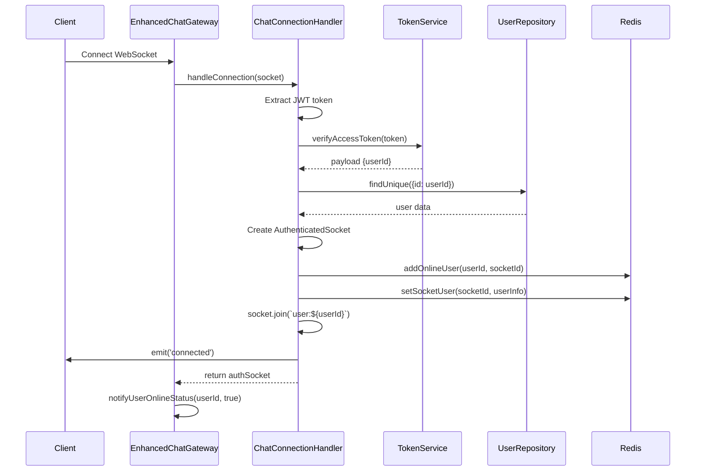

# Hệ Thống Chat Real-time - Phân Tích Chi Tiết

## Tổng Quan Hệ Thống

Hệ thống chat real-time của bạn được xây dựng dựa trên kiến trúc microservices với WebSocket để xử lý real-time và HTTP REST API để xử lý dữ liệu. Hệ thống bao gồm 2 phần chính:

1. **Module Conversation** (`src/routes/conversation/`) - Xử lý logic nghiệp vụ chat
2. **Module WebSockets** (`src/websockets/`) - Xử lý kết nối real-time

## Kiến Trúc Tổng Thể


---

## I. MODULE CONVERSATION - Xử Lý Logic Nghiệp Vụ

### 1. ConversationController (`conversation.controller.ts`)

**Chức năng chính:** API endpoints cho quản lý cuộc trò chuyện và tin nhắn

#### Các nhóm API:

**A. Quản lý Cuộc trò chuyện:**

- `GET /conversations` - Lấy danh sách cuộc trò chuyện của user
- `GET /conversations/stats` - Thống kê cuộc trò chuyện
- `GET /conversations/:id` - Lấy chi tiết cuộc trò chuyện
- `POST /conversations/direct` - Tạo cuộc trò chuyện 1-1
- `POST /conversations/group` - Tạo nhóm chat
- `PUT /conversations/:id` - Cập nhật thông tin cuộc trò chuyện
- `POST/DELETE /conversations/:id/archive|unarchive` - Lưu trữ/khôi phục
- `POST/DELETE /conversations/:id/mute|unmute` - Tắt/bật thông báo

**B. Quản lý Thành viên:**

- `GET /conversations/:id/members` - Danh sách thành viên
- `POST /conversations/:id/members` - Thêm thành viên
- `DELETE /conversations/:id/members/:memberId` - Xóa thành viên
- `PUT /conversations/:id/members/:memberId/role` - Cập nhật vai trò

**C. Quản lý Tin nhắn:**

- `GET /conversations/:id/messages` - Lấy tin nhắn trong cuộc trò chuyện
- `GET /conversations/messages/search` - Tìm kiếm tin nhắn
- `POST /conversations/messages` - Gửi tin nhắn mới
- `PUT /conversations/messages/:id` - Chỉnh sửa tin nhắn
- `DELETE /conversations/messages/:id` - Xóa tin nhắn

**D. Tương tác Tin nhắn:**

- `POST /conversations/messages/read` - Đánh dấu đã đọc
- `POST /conversations/messages/:id/react` - Thêm reaction
- `DELETE /conversations/messages/:id/react` - Xóa reaction

### 2. ConversationService (`conversation.service.ts`)

**Chức năng:** Xử lý business logic cho cuộc trò chuyện

#### Các method chính:

**A. Quản lý Cuộc trò chuyện:**

```typescript
async getUserConversations(userId, options) // Lấy DS cuộc trò chuyện với phân trang, filter
async getConversationById(conversationId, userId) // Chi tiết cuộc trò chuyện
async createDirectConversation(userId, recipientId) // Tạo chat 1-1
async createGroupConversation(ownerId, data) // Tạo nhóm chat
async updateConversation(conversationId, userId, data) // Cập nhật thông tin
async archiveConversation(conversationId, userId) // Lưu trữ
async leaveConversation(conversationId, userId) // Rời nhóm
```

**B. Quản lý Thành viên:**

```typescript
async addMembers(conversationId, userId, memberIds) // Thêm thành viên
async removeMember(conversationId, userId, memberId) // Xóa thành viên
async updateMemberRole(conversationId, userId, memberId, role) // Đổi vai trò
async muteConversation(conversationId, userId, mutedUntil) // Tắt thông báo
```

**C. Utility Methods:**

```typescript
async getConversationMembers(conversationId, userId) // DS thành viên
async getConversationStats(userId) // Thống kê tổng quan
async isUserInConversation(conversationId, userId) // Kiểm tra thành viên
async getUserRoleInConversation(conversationId, userId) // Lấy vai trò
```

### 3. MessageService (`message.service.ts`)

**Chức năng:** Xử lý business logic cho tin nhắn

#### Các method chính:

**A. Quản lý Tin nhắn:**

```typescript
async getConversationMessages(conversationId, userId, options) // Lấy tin nhắn với phân trang
async sendMessage(userId, data) // Gửi tin nhắn mới
async editMessage(messageId, userId, content) // Chỉnh sửa tin nhắn
async deleteMessage(messageId, userId, forEveryone) // Xóa tin nhắn
async getMessageById(messageId, userId) // Chi tiết tin nhắn
```

**B. Tương tác Tin nhắn:**

```typescript
async markAsRead(conversationId, userId, messageId) // Đánh dấu đã đọc
async reactToMessage(messageId, userId, emoji) // Thêm/xóa reaction
async removeReaction(messageId, userId, emoji) // Xóa reaction
```

**C. Tìm kiếm & Thống kê:**

```typescript
async searchMessages(userId, query, options) // Tìm kiếm tin nhắn
async getMessageStats(conversationId, userId) // Thống kê tin nhắn
async getReactionStats(messageId, userId) // Thống kê reactions
async getReadReceiptStats(messageId, userId) // Thống kê đã đọc
```

### 4. ConversationRepository (`conversation.repo.ts`)

**Chức năng:** Data access layer cho cuộc trò chuyện

#### Các method chính:

**A. CRUD Operations:**

```typescript
create(data) // Tạo cuộc trò chuyện mới
findById(id, userId) // Tìm theo ID
findUserConversations(userId, options) // Lấy DS của user
findDirectConversation(userId1, userId2) // Tìm chat 1-1
update(id, data) // Cập nhật thông tin
archive(id, isArchived) // Lưu trữ/khôi phục
```

**B. Member Management:**

```typescript
addMember(conversationId, userId, role) // Thêm thành viên
removeMember(conversationId, userId) // Xóa thành viên
updateMemberRole(conversationId, userId, role) // Đổi vai trò
updateMemberLastRead(conversationId, userId, lastReadAt) // Cập nhật lần đọc cuối
incrementUnreadCount(conversationId, excludeUserId) // Tăng số tin chưa đọc
muteMember / unmuteMember(conversationId, userId) // Tắt/bật thông báo
```

**C. Typing Indicators:**

```typescript
setTypingIndicator(conversationId, userId) // Bắt đầu typing
removeTypingIndicator(conversationId, userId) // Dừng typing
getTypingIndicators(conversationId) // Lấy DS đang typing
cleanupExpiredTypingIndicators() // Dọn dẹp expired
```

**D. Utility Methods:**

```typescript
isUserMember(conversationId, userId) // Kiểm tra thành viên
getUserRole(conversationId, userId) // Lấy vai trò
getConversationMembers(conversationId) // DS thành viên
getConversationStats(userId) // Thống kê
```

### 5. MessageRepository (`message.repo.ts`)

**Chức năng:** Data access layer cho tin nhắn

#### Các method chính:

**A. CRUD Operations:**

```typescript
create(data) // Tạo tin nhắn mới (với attachments)
findById(id) // Tìm theo ID
findConversationMessages(conversationId, options) // Lấy tin nhắn với cursor pagination
searchMessages(conversationIds, query, options) // Tìm kiếm với facets
update(id, data) // Cập nhật tin nhắn
delete (id, forEveryone) // Xóa tin nhắn (soft delete)
```

**B. Reactions:**

```typescript
addReaction(messageId, userId, emoji) // Thêm reaction
removeReaction(messageId, userId, emoji) // Xóa reaction
getMessageReactions(messageId) // Lấy tất cả reactions
getReactionStats(messageId) // Thống kê reactions theo emoji
```

**C. Read Receipts:**

```typescript
markAsRead(messageId, userId) // Đánh dấu tin nhắn đã đọc
markConversationAsRead(conversationId, userId, upToMessageId) // Đánh dấu tất cả
getReadReceipts(messageId) // Lấy DS đã đọc
getReadReceiptStats(messageId) // Thống kê % đã đọc
```

**D. Utility Methods:**

```typescript
getLastMessage(conversationId) // Tin nhắn cuối cùng
getUnreadCount(conversationId, userId, lastReadAt) // Số tin chưa đọc
isMessageAuthor(messageId, userId) // Kiểm tra tác giả
getMessageStats(conversationId) // Thống kê tin nhắn
```

---

## II. MODULE WEBSOCKETS - Xử Lý Real-time

### 1. EnhancedChatGateway (`enhanced-chat.gateway.ts`)

**Chức năng:** WebSocket gateway chính xử lý tất cả events real-time

#### Cấu hình WebSocket:

```typescript
@WebSocketGateway({
  namespace: '/chat',
  cors: { origin: '*', credentials: true },
  transports: ['websocket', 'polling'],
})
```

#### Các WebSocket Events được xử lý:

**A. Connection Management:**

- `handleConnection()` - Xử lý khi client kết nối
- `handleDisconnect()` - Xử lý khi client ngắt kết nối

**B. Conversation Events:**

- `join_conversation` - Tham gia cuộc trò chuyện
- `leave_conversation` - Rời cuộc trò chuyện

**C. Message Events:**

- `send_message` - Gửi tin nhắn
- `edit_message` - Chỉnh sửa tin nhắn
- `delete_message` - Xóa tin nhắn

**D. Typing Events:**

- `typing_start` - Bắt đầu typing
- `typing_stop` - Dừng typing

**E. Interaction Events:**

- `mark_as_read` - Đánh dấu đã đọc
- `react_to_message` - Thêm reaction
- `remove_reaction` - Xóa reaction

#### Public Methods cho External Use:

```typescript
notifyConversationUpdate(conversationId, updateType, data) // Thông báo cập nhật
notifyUser(userId, event, data) // Thông báo cho user cụ thể
isUserOnline(userId) // Kiểm tra user online
getOnlineUsers() // Lấy DS users online
getOnlineUsersInConversation(conversationId) // Users online trong conversation
broadcastSystemMessage(conversationId, content, fromUserId) // Tin nhắn hệ thống
healthCheck() // Kiểm tra sức khỏe hệ thống
```

### 2. ChatConnectionHandler (`chat-connection.handler.ts`)

**Chức năng:** Xử lý kết nối và xác thực WebSocket

#### AuthenticatedSocket Interface:

```typescript
interface AuthenticatedSocket extends Socket {
  userId: number
  user: {
    id: number
    name: string
    email: string
    avatar?: string
    status?: string
  }
}
```

#### Luồng Authentication:

1. **Extract Token:** Lấy JWT token từ headers hoặc auth
2. **Verify Token:** Xác thực token qua TokenService
3. **Get User Info:** Lấy thông tin user từ database
4. **Attach User Data:** Gán thông tin user vào socket
5. **Track Online Status:** Lưu user online vào Redis
6. **Join Personal Room:** Join vào room `user:${userId}` để nhận thông báo cá nhân

#### Methods:

```typescript
async handleConnection(client: Socket): Promise<AuthenticatedSocket | null>
async handleDisconnect(client: AuthenticatedSocket): Promise<boolean>
async isUserOnline(userId: number): Promise<boolean>
async getOnlineUsers(): Promise<number[]>
async getUserSocketIds(userId: number): Promise<string[]>
async getSocketUser(socketId: string): Promise<Record<string, any> | null>
```

### 3. ChatMessageHandler (`chat-message.handler.ts`)

**Chức năng:** Xử lý các events liên quan đến tin nhắn

#### Interfaces:

```typescript
interface SendMessageData {
  conversationId: string
  content?: string
  type?: 'TEXT' | 'IMAGE' | 'VIDEO' | 'AUDIO' | 'FILE' | 'STICKER' | 'LOCATION' | 'CONTACT'
  replyToId?: string
  attachments?: Array<{...}>
  tempId?: string // Client-side deduplication
}
```

#### Luồng gửi tin nhắn (`handleSendMessage`):

1. **Validate & Send:** Gửi tin nhắn qua SharedChatService
2. **Remove Typing:** Xóa user khỏi typing indicators
3. **Broadcast to Room:** Emit `new_message` đến `conversation:${conversationId}`
4. **Send Confirmation:** Emit `message_sent` về client gửi
5. **Offline Notifications:** Gửi push notification cho users offline

#### Luồng chỉnh sửa tin nhắn (`handleEditMessage`):

1. **Validate & Edit:** Chỉnh sửa qua SharedChatService
2. **Broadcast Update:** Emit `message_edited` đến room
3. **Send Confirmation:** Confirm về client

#### Luồng xóa tin nhắn (`handleDeleteMessage`):

1. **Validate & Delete:** Xóa qua SharedChatService
2. **Broadcast Delete:** Emit `message_deleted` đến room
3. **Send Confirmation:** Confirm về client

### 4. ChatTypingHandler (`chat-typing.handler.ts`)

**Chức năng:** Xử lý typing indicators

#### Luồng typing start (`handleTypingStart`):

1. **Verify Membership:** Kiểm tra user là thành viên
2. **Update Redis:** Set typing trong Redis với TTL 10s
3. **Update Database:** Cập nhật typing indicator trong DB
4. **Notify Others:** Emit `user_typing` đến members khác
5. **Auto Remove:** Tự động remove sau 10s

#### Luồng typing stop (`handleTypingStop`):

1. **Remove from Redis:** Xóa khỏi typing list
2. **Remove from Database:** Xóa typing indicator
3. **Notify Others:** Emit `user_stopped_typing`

#### Cleanup Methods:

```typescript
async removeUserFromAllTyping(server, userId) // Xóa user khỏi tất cả typing
async cleanupExpiredTypingIndicators() // Dọn dẹp expired indicators
```

### 5. ChatInteractionHandler (`chat-interaction.handler.ts`)

**Chức năng:** Xử lý các tương tác khác

#### Luồng join conversation (`handleJoinConversation`):

1. **Verify Membership:** Kiểm tra quyền tham gia
2. **Join Room:** Join socket vào `conversation:${conversationId}`
3. **Notify Others:** Emit `user_joined_conversation`
4. **Send Confirmation:** Confirm về client

#### Luồng mark as read (`handleMarkAsRead`):

1. **Mark Messages:** Đánh dấu đã đọc qua SharedChatService
2. **Notify Others:** Emit `messages_read` với thông tin user và số lượng
3. **Send Confirmation:** Confirm về client

#### Luồng react to message (`handleReactToMessage`):

1. **Add/Toggle Reaction:** Thêm hoặc xóa reaction
2. **Get Message Info:** Lấy thông tin tin nhắn để tìm conversation
3. **Broadcast Update:** Emit `message_reaction_updated` đến room
4. **Send Confirmation:** Confirm về client

#### Utility Methods:

```typescript
async notifyUserOnlineStatus(server, userId, isOnline, conversationIds) // Thông báo online/offline
async broadcastSystemMessage(server, conversationId, content, fromUserId) // Tin nhắn hệ thống
notifyConversationUpdate(server, conversationId, updateType, data) // Thông báo cập nhật
notifyUser(server, userId, event, data) // Thông báo cá nhân
```

### 6. ChatRedisService (`chat-redis.service.ts`)

**Chức năng:** Quản lý cache và state trong Redis

#### Redis Key Structure:

```typescript
KEYS = {
  ONLINE_USERS: 'chat:online_users', // Hash: userId -> JSON of socket IDs
  USER_SOCKETS: 'chat:user_sockets', // Hash: socketId -> JSON of user info
  TYPING_USERS: 'chat:typing', // Hash: conversationId -> JSON of user IDs
  USER_CONVERSATIONS: 'chat:user_conversations', // Set: userId -> conversation IDs
}
```

#### Online Users Management:

```typescript
async addOnlineUser(userId, socketId) // Thêm user online
async removeOnlineUser(userId, socketId) // Xóa user offline
async isUserOnline(userId) // Kiểm tra online status
async getOnlineUsers() // Lấy tất cả users online
async getUserSocketIds(userId) // Lấy socket IDs của user
```

#### Socket Management:

```typescript
async setSocketUser(socketId, userInfo) // Lưu thông tin user cho socket
async getSocketUser(socketId) // Lấy thông tin user từ socket
async removeSocket(socketId) // Xóa socket
```

#### Typing Indicators:

```typescript
async setUserTyping(conversationId, userId, expiresInSeconds) // Set typing với TTL
async removeUserTyping(conversationId, userId) // Remove typing
async getTypingUsers(conversationId) // Lấy users đang typing
async removeUserFromAllTyping(userId) // Xóa user khỏi tất cả typing
```

#### Conversations Cache:

```typescript
async cacheUserConversations(userId, conversationIds) // Cache conversations
async getCachedUserConversations(userId) // Lấy cached conversations
async invalidateUserConversations(userId) // Invalidate cache
```

### 7. SharedChatService (`shared/services/chat.service.ts`)

**Chức năng:** Bridge service kết nối WebSocket handlers với Conversation modules

#### Purpose:

- Cung cấp interface thống nhất cho WebSocket handlers
- Gọi đến ConversationService và MessageService
- Xử lý typing indicators
- Quản lý member operations

#### Key Methods:

```typescript
// Conversation Operations
async isUserInConversation(conversationId, userId)
async getConversationById(conversationId, userId)
async getUserConversations(userId, options)

// Message Operations
async sendMessage(userId, data)
async editMessage(messageId, userId, content)
async deleteMessage(messageId, userId, forEveryone)
async markAsRead(conversationId, userId, messageId)
async reactToMessage(messageId, userId, emoji)

// Typing Operations
async setTypingIndicator(conversationId, userId)
async removeTypingIndicator(conversationId, userId)
async cleanupExpiredTypingIndicators()

// Member Operations
async getUserRole(conversationId, userId)
async isUserMember(conversationId, userId)
```

---

## III. LUỒNG HOẠT ĐỘNG CHI TIẾT

### 1. Luồng Kết nối WebSocket



### 2. Luồng Gửi Tin nhắn Real-time


### 3. Luồng Join Conversation


### 4. Luồng Typing Indicators


### 5. Luồng Mark as Read


### 6. Luồng React to Message


---

## IV. ROOM MANAGEMENT VÀ ROUTING

### Socket Rooms Structure

**1. Personal Rooms:**

- `user:${userId}` - Nhận thông báo cá nhân

**2. Conversation Rooms:**

- `conversation:${conversationId}` - Nhận updates cuộc trò chuyện

### Event Routing Strategy

**1. Broadcast to Conversation:**

```typescript
server.to(`conversation:${conversationId}`).emit(event, data)
```

- `new_message` - Tin nhắn mới
- `message_edited` - Tin nhắn đã chỉnh sửa
- `message_deleted` - Tin nhắn đã xóa
- `message_reaction_updated` - Reaction cập nhật
- `user_typing` / `user_stopped_typing` - Typing indicators
- `user_joined_conversation` / `user_left_conversation` - Join/leave
- `messages_read` - Read receipts
- `conversation_updated` - Cập nhật thông tin cuộc trò chuyện

**2. Send to Specific User:**

```typescript
server.to(`user:${userId}`).emit(event, data)
```

- `user_online` / `user_offline` - Online status changes
- Personal notifications
- Direct messages

**3. Send to Sender Only:**

```typescript
client.emit(event, data)
```

- `message_sent` - Confirmation
- `joined_conversation` / `left_conversation` - Action confirmations
- `error` - Error messages

---

## V. ERROR HANDLING VÀ RESILIENCE

### 1. Connection Error Handling

**Authentication Failures:**

```typescript
// Trong ChatConnectionHandler
try {
  // Verify token & user
} catch (error) {
  client.emit('connection_error', {
    message: 'Authentication failed',
    error: error.message,
  })
  client.disconnect(true)
  return null
}
```

**Connection Loss Recovery:**

- Client tự động reconnect với Socket.IO
- Server track online status chính xác
- Cleanup expired typing indicators

### 2. Message Delivery Guarantees

**Delivery Confirmation:**

```typescript
// Client gửi với tempId để deduplication
{
  tempId: "client-generated-uuid",
  content: "Hello world"
}

// Server confirm với cùng tempId
client.emit('message_sent', {
  message: savedMessage,
  tempId: data.tempId
})
```

**Offline Message Handling:**

- Tin nhắn được lưu DB ngay khi gửi
- Push notifications cho users offline
- Client sync lại khi reconnect

### 3. Redis Failure Handling

**Graceful Degradation:**

```typescript
try {
  await this.redisService.addOnlineUser(userId, socketId)
} catch (error) {
  this.logger.error('Redis error:', error)
  // Continue without caching - still functional
}
```

**Cache Miss Handling:**

- Fallback to database queries
- Rebuild cache when Redis recovers
- Health check endpoints

---

## VI. PERFORMANCE OPTIMIZATIONS

### 1. Database Query Optimization

**Conversation Queries:**

- Include necessary relations only
- Pagination with cursor-based approach
- Efficient indexes on frequently queried fields

**Message Queries:**

- Cursor-based pagination for real-time loading
- Batch operations for read receipts
- Search with proper full-text indexing

### 2. Redis Caching Strategy

**Online Users:**

- TTL 1 hour với auto-refresh
- Multiple socket support per user
- Efficient cleanup on disconnect

**Typing Indicators:**

- Short TTL (10 seconds)
- Auto-cleanup expired indicators
- Memory-efficient storage

**Conversation Cache:**

- Cache user's conversation list
- 5-minute TTL with invalidation
- Reduce database load

### 3. WebSocket Optimization

**Room Management:**

- Efficient join/leave operations
- Minimal room proliferation
- Proper cleanup on disconnect

**Event Batching:**

- Group related events when possible
- Reduce redundant emissions
- Smart broadcast targeting

---

## VII. SECURITY MEASURES

### 1. Authentication & Authorization

**WebSocket Authentication:**

- JWT token verification on connect
- User status validation (ACTIVE only)
- Secure token extraction from headers/auth

**Permission Checks:**

- Verify membership before join conversation
- Check user role for admin operations
- Validate message author for edit/delete

### 2. Input Validation

**Message Validation:**

- Content length limits (10,000 characters)
- File size limits (100MB)
- Attachment count limits (10 files)
- XSS prevention through proper encoding

**Rate Limiting:**

- Typing indicators (auto-expire 10s)
- Message frequency limits (có thể implement)
- Connection limits per user

### 3. Data Protection

**Sensitive Data:**

- No password exposure in user objects
- Secure Redis connection
- Database connection encryption

**Message Privacy:**

- Soft delete with proper flags
- Delete for everyone vs personal delete
- Read receipt privacy controls

---

## VIII. MONITORING VÀ DEBUGGING

### 1. Logging Strategy

**Connection Events:**

```typescript
this.logger.log(`User ${userId} connected with socket ${socketId}`)
this.logger.log(`User ${userId} disconnected`)
```

**Message Events:**

```typescript
this.logger.debug(`Message sent by user ${userId} in conversation ${conversationId}`)
this.logger.error(`Send message error: ${error.message}`)
```

**Performance Monitoring:**

- Redis connection health
- Database query performance
- WebSocket connection counts

### 2. Health Checks

**System Health:**

```typescript
async healthCheck(): Promise<{status: string, redis: boolean}> {
  const redisHealthy = await this.redisService.healthCheck()
  return {
    status: redisHealthy ? 'healthy' : 'degraded',
    redis: redisHealthy,
  }
}
```

**Component Health:**

- Database connectivity
- Redis connectivity
- WebSocket server status

### 3. Debugging Tools

**WebSocket Events Debugging:**

- Comprehensive error events
- Detailed error messages
- Request/response correlation with tempId

**State Inspection:**

- Online users count
- Active conversations
- Typing indicators status

---

## IX. KẾT LUẬN

Hệ thống chat real-time của bạn được thiết kế rất chuyên nghiệp với:

### Điểm Mạnh:

1. **Kiến trúc rõ ràng:** Tách biệt logic nghiệp vụ (Conversation) và real-time (WebSocket)
2. **Scalability:** Sử dụng Redis để cache và state management
3. **Real-time features:** Đầy đủ các tính năng chat hiện đại
4. **Error handling:** Xử lý lỗi toàn diện và graceful degradation
5. **Security:** Authentication, authorization, và input validation tốt
6. **Performance:** Optimizations ở nhiều tầng (DB, cache, WebSocket)

### Có thể cải thiện:

1. **Rate limiting:** Thêm rate limiting cho các operations
2. **Message queue:** Sử dụng message queue cho offline notifications
3. **Horizontal scaling:** Setup cho multi-server deployment
4. **Metrics:** Thêm detailed metrics và monitoring
5. **File upload:** Tích hợp file upload service riêng biệt

Tổng thể, đây là một hệ thống chat real-time production-ready với đầy đủ tính năng cần thiết!
