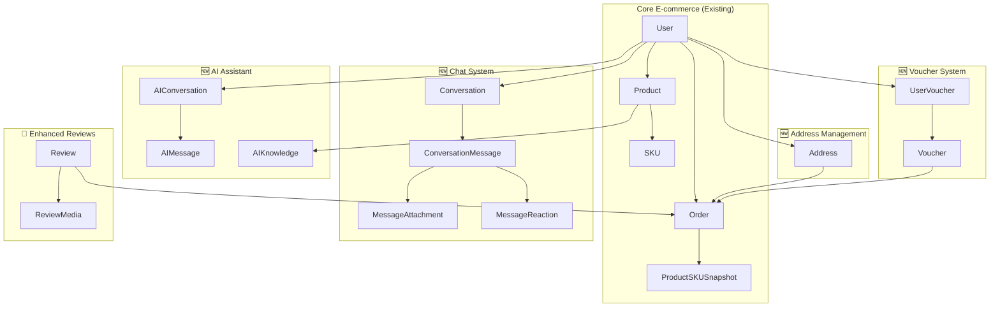
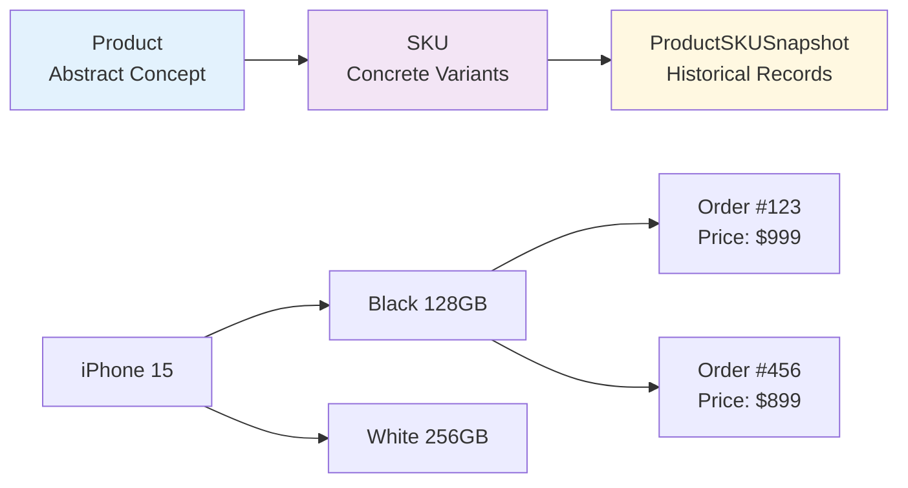

# 🔄 Giải Thích Chi Tiết Schema Prisma Cập Nhật 2025 - NestJS E-commerce API

> **Mục tiêu**: Phân tích đầy đủ thiết kế database sau các cập nhật lớn, bao gồm Chat System, Address Management, Voucher System, AI Assistant và giải thích chi tiết về Product-SKU-Snapshot Pattern

---

## 📋 Mục Lục

1. [Tổng Quan Các Thay Đổi Lớn](#1-tổng-quan-các-thay-đổi-lớn)
2. [Hệ Thống Chat Real-time](#2-hệ-thống-chat-real-time)
3. [Hệ Thống Quản Lý Địa Chỉ](#3-hệ-thống-quản-lý-địa-chỉ)
4. [Hệ Thống Voucher & Khuyến Mãi](#4-hệ-thống-voucher--khuyến-mãi)
5. [Hệ Thống AI Assistant](#5-hệ-thống-ai-assistant)
6. [Mối Quan Hệ Product - SKU - ProductSKUSnapshot](#6-mối-quan-hệ-product---sku---productskusnapshot)
7. [Snapshot Pattern - Tại Sao Cần Thiết?](#7-snapshot-pattern---tại-sao-cần-thiết)
8. [Enhanced Review System](#8-enhanced-review-system)
9. [Cải Tiến Order Management](#9-cải-tiến-order-management)
10. [Performance & Indexing Strategy](#10-performance--indexing-strategy)
11. [Kết Luận & Đánh Giá](#11-kết-luận--đánh-giá)

---

## 1. Tổng Quan Các Thay Đổi Lớn

### 🚀 Các Tính Năng Mới Được Thêm



### 📈 Thống Kê Thay Đổi

| Thành Phần      | Trước | Sau       | Tăng Thêm           |
| --------------- | ----- | --------- | ------------------- |
| **Models**      | ~20   | ~35       | +15 models          |
| **Enums**       | ~6    | ~12       | +6 enums            |
| **Relations**   | Basic | Complex   | Nhiều many-to-many  |
| **JSON Fields** | 3     | 6         | Tăng flexibility    |
| **Indexes**     | Basic | Optimized | Performance-focused |

---

## 2. Hệ Thống Chat Real-time

### 💬 Kiến Trúc Chat System

```prisma
model Conversation {
  id            String           @id @default(cuid())
  type          ConversationType @default(DIRECT) // DIRECT or GROUP
  name          String?          @db.VarChar(500)
  description   String?
  avatar        String?          @db.VarChar(1000)
  ownerId       Int?
  lastMessage   String?
  lastMessageAt DateTime?
  isArchived    Boolean          @default(false)

  // Relations
  owner            User?                 @relation("ConversationOwner")
  members          ConversationMember[]
  messages         ConversationMessage[]
  typingIndicators TypingIndicator[]
}
```

#### 🔍 Phân Tích Chi Tiết Chat Architecture

**1. Conversation Management:**

- **Flexible Type**: Support cả chat 1-1 và nhóm
- **Dynamic Metadata**: `lastMessage`, `lastMessageAt` cho real-time preview
- **Archive Feature**: Soft archive thay vì delete

**2. Advanced Message System:**

```prisma
model ConversationMessage {
  id                 String      @id @default(cuid())
  conversationId     String
  fromUserId         Int
  content            String?     // Nullable cho attachment-only messages
  type               MessageType @default(TEXT)
  replyToId          String?     // Thread replies
  isEdited           Boolean     @default(false)
  isDeleted          Boolean     @default(false)
  deletedForEveryone Boolean     @default(false)

  // Relations
  attachments  MessageAttachment[]
  reactions    MessageReaction[]
  readReceipts MessageReadReceipt[]
}
```

**3. Rich Media Support:**

```prisma
model MessageAttachment {
  type      AttachmentType // IMAGE, VIDEO, AUDIO, DOCUMENT
  fileName  String         @db.VarChar(500)
  fileUrl   String         @db.VarChar(1000)
  fileSize  Int?
  mimeType  String?
  thumbnail String?        // Cho preview
  width     Int?           // Metadata cho media
  height    Int?
  duration  Int?           // Cho audio/video
}
```

**4. Real-time Features:**

- **Read Receipts**: Track ai đã đọc tin nhắn nào
- **Typing Indicators**: Real-time typing status
- **Message Reactions**: Emoji reactions system
- **Reply Threading**: Nested conversation structure

### 💡 Use Cases Chat System

```typescript
// Use Case 1: Customer Support Chat
const supportChat = {
  type: 'DIRECT',
  members: [customer, supportAgent],
  messages: [
    { type: 'TEXT', content: 'Tôi cần hỗ trợ về đơn hàng #123' },
    { type: 'IMAGE', attachments: [orderScreenshot] },
    { type: 'SYSTEM', content: 'Agent joined the conversation' },
  ],
}

// Use Case 2: Group Chat cho Team
const teamChat = {
  type: 'GROUP',
  name: 'Marketing Team',
  members: [manager, designer, copywriter],
  role: 'ADMIN' | 'MODERATOR' | 'MEMBER',
}
```

---

## 3. Hệ Thống Quản Lý Địa Chỉ

### 🏠 Address Management System

```prisma
model Address {
  id           Int      @id @default(autoincrement())
  userId       Int
  name         String   @db.VarChar(500) // Tên người nhận
  phone        String   @db.VarChar(50)

  // Hierarchical Address Structure
  provinceId   String   @db.VarChar(50)   // Mã tỉnh/thành
  provinceName String   @db.VarChar(500)  // Tên tỉnh/thành
  districtId   String   @db.VarChar(50)   // Mã quận/huyện
  districtName String   @db.VarChar(500)  // Tên quận/huyện
  wardId       String   @db.VarChar(50)   // Mã phường/xã
  wardName     String   @db.VarChar(500)  // Tên phường/xã
  detail       String   @db.VarChar(500)  // Số nhà, đường
  fullAddress  String   @db.VarChar(1000) // Địa chỉ đầy đủ

  // Management Fields
  isDefault    Boolean  @default(false)
  isActive     Boolean  @default(true)

  // Relations
  user   User    @relation("UserAddresses")
  orders Order[] @relation("OrderAddress")
}
```

#### 🔍 Phân Tích Address Design

**1. Hierarchical Structure:**

```
Vietnam Address Structure:
├── Province/City (Tỉnh/Thành phố)
│   ├── District (Quận/Huyện)
│   │   ├── Ward (Phường/Xã)
│   │   │   └── Detail (Số nhà, đường)
```

- **Dual Storage**: Cả ID và Name để tương thích với API địa chỉ Việt Nam
- **Full Address**: Computed field cho display và search
- **Future-proof**: Có thể mở rộng cho international addresses

**2. User Experience Features:**

- **Default Address**: Một địa chỉ mặc định per user
- **Multiple Addresses**: Support nhiều địa chỉ giao hàng
- **Soft Disable**: `isActive` thay vì xóa hard

**3. Integration với Orders:**

```typescript
// Enhanced Order Flow
const orderWithAddress = {
  userId: 123,
  addressId: 456, // Reference to specific address
  shippingFee: 25000, // Calculated based on address
  estimatedDelivery: '2025-09-15T10:00:00Z',
}
```

---

## 4. Hệ Thống Voucher & Khuyến Mãi

### 🎫 Voucher System Architecture

```prisma
model Voucher {
  id                 Int         @id @default(autoincrement())
  code               String      @unique @db.VarChar(50)
  name               String      @db.VarChar(500)
  description        String?
  type               VoucherType // PERCENTAGE, FIXED_AMOUNT, FREE_SHIPPING, BUY_X_GET_Y
  value              Float       // Giá trị giảm

  // Business Rules
  minOrderValue      Float?      // Minimum order requirement
  maxDiscount        Float?      // Maximum discount cap
  usageLimit         Int?        // Total usage limit
  usedCount          Int         @default(0)
  userUsageLimit     Int?        @default(1) // Per-user limit

  // Time Constraints
  startDate          DateTime
  endDate            DateTime
  isActive           Boolean     @default(true)

  // Targeting
  sellerId           Int?        // Shop-specific voucher
  applicableProducts Int[]       // Product whitelist
  excludedProducts   Int[]       // Product blacklist

  // Relations
  seller       User?         @relation("VoucherSeller")
  userVouchers UserVoucher[] // Many-to-many with users
  orders       Order[]       // Applied orders
}
```

#### 🔍 Phân Tích Voucher System

**1. Flexible Discount Types:**

```typescript
enum VoucherType {
  PERCENTAGE     // 20% off
  FIXED_AMOUNT   // $50 off
  FREE_SHIPPING  // No shipping fee
  BUY_X_GET_Y    // Buy 2 get 1 free
}
```

**2. Smart Business Rules:**

```typescript
// Voucher Validation Logic
const validateVoucher = (voucher, order) => {
  // Time validation
  if (now < voucher.startDate || now > voucher.endDate) return false

  // Usage limits
  if (voucher.usedCount >= voucher.usageLimit) return false

  // Minimum order value
  if (order.totalAmount < voucher.minOrderValue) return false

  // Product targeting
  if (voucher.applicableProducts.length > 0) {
    const hasApplicableProduct = order.items.some((item) => voucher.applicableProducts.includes(item.productId))
    if (!hasApplicableProduct) return false
  }

  return true
}
```

**3. User-Voucher Relationship:**

```prisma
model UserVoucher {
  id        Int       @id @default(autoincrement())
  userId    Int
  voucherId Int
  usedCount Int       @default(0) // Per-user usage tracking
  usedAt    DateTime? // Last usage time
  savedAt   DateTime  @default(now()) // When user saved/collected voucher

  @@unique([userId, voucherId])
}
```

**4. Advanced Features:**

- **Seller-specific Vouchers**: Shop có thể tạo voucher riêng
- **Product Targeting**: Whitelist/blacklist products
- **Usage Analytics**: Track voucher performance
- **Collection System**: Users "collect" vouchers before use

---

## 5. Hệ Thống AI Assistant

### 🤖 AI Assistant Architecture

```prisma
model AIConversation {
  id         String   @id @default(cuid())
  userId     Int
  title      String?  @db.VarChar(500) // Auto-generated title
  context    Json?    // User context (viewed products, orders, preferences)
  isActive   Boolean  @default(true)
  isArchived Boolean  @default(false)

  // Relations
  user     User        @relation("UserAIConversations")
  messages AIMessage[] @relation("AIConversationMessages")
}

model AIMessage {
  id             String        @id @default(cuid())
  conversationId String
  role           AIMessageRole // USER, ASSISTANT, SYSTEM
  content        String
  tokenCount     Int?          // Cost tracking
  responseTime   Int?          // Performance metrics
  model          String?       // AI model used
  error          String?       // Error handling
  contextUsed    Json?         // Context data used for this response

  conversation AIConversation @relation("AIConversationMessages")
}
```

#### 🔍 Phân Tích AI System

**1. Conversation Management:**

- **Context Preservation**: Lưu trữ context người dùng
- **Performance Tracking**: Monitor response time và token usage
- **Error Handling**: Graceful error recovery
- **Model Flexibility**: Support multiple AI models

**2. Knowledge Base:**

```prisma
model AIKnowledge {
  id          String          @id @default(cuid())
  type        AIKnowledgeType // PRODUCT, FAQ, POLICY, GUIDE, PROMOTION, CATEGORY
  title       String          @db.VarChar(500)
  content     String          // Knowledge content
  keywords    String[]        // Search keywords
  isActive    Boolean         @default(true)
  priority    Int             @default(0) // Retrieval priority
  productId   Int?            // Link to specific product
  categoryId  Int?            // Link to specific category

  // Relations
  product  Product?  @relation("AIKnowledgeProduct")
  category Category? @relation("AIKnowledgeCategory")
}
```

**3. AI Use Cases:**

```typescript
// Use Case 1: Product Recommendations
const productInquiry = {
  userMessage: 'Tôi cần tìm laptop gaming dưới 20 triệu',
  aiResponse: 'Dựa trên budget của bạn, tôi recommend...',
  contextUsed: {
    userBudget: 20000000,
    category: 'laptops',
    previousViews: ['gaming-laptops', 'asus-rog'],
  },
}

// Use Case 2: Order Support
const orderSupport = {
  userMessage: 'Đơn hàng #123 của tôi bị trễ',
  aiResponse: 'Tôi đã check đơn hàng #123...',
  contextUsed: {
    orderData: { status: 'PENDING_DELIVERY', estimatedDate: '...' },
    userHistory: ['previous_delays', 'contact_support'],
  },
}
```

---

## 6. Mối Quan Hệ Product - SKU - ProductSKUSnapshot

### 🔄 Hiểu Rõ Relationship Pattern

```mermaid
graph TB
    subgraph "Product Level"
        Product[Product<br/>iPhone 15<br/>Base Info]
    end

    subgraph "SKU Level"
        SKU1[SKU 1<br/>iPhone 15 Black 128GB<br/>Price: $999]
        SKU2[SKU 2<br/>iPhone 15 White 256GB<br/>Price: $1199]
        SKU3[SKU 3<br/>iPhone 15 Blue 512GB<br/>Price: $1399]
    end

    subgraph "Snapshot Level"
        Snap1[ProductSKUSnapshot<br/>Order #123<br/>iPhone 15 Black 128GB<br/>Price: $999 (at order time)]
        Snap2[ProductSKUSnapshot<br/>Order #456<br/>iPhone 15 Black 128GB<br/>Price: $899 (sale price)]
    end

    Product --> SKU1
    Product --> SKU2
    Product --> SKU3

    SKU1 --> Snap1
    SKU1 --> Snap2

    style Product fill:#e1f5fe
    style SKU1 fill:#f3e5f5
    style SKU2 fill:#f3e5f5
    style SKU3 fill:#f3e5f5
    style Snap1 fill:#fff3e0
    style Snap2 fill:#fff3e0
```

#### 🔍 Tại Sao Product Có Quan Hệ "Một-Nhiều" Với SKU?

**1. Product là Abstract Concept:**

```typescript
// Product: Khái niệm chung về sản phẩm
const iPhone15Product = {
  id: 1,
  name: 'iPhone 15',
  brand: 'Apple',
  basePrice: 999, // Giá tham khảo
  images: ['main-image.jpg'], // Hình đại diện
  variants: {
    color: ['Black', 'White', 'Blue'],
    storage: ['128GB', '256GB', '512GB'],
  },
}
```

**2. SKU là Concrete Implementation:**

```typescript
// Mỗi SKU = Combination cụ thể của variants
const skus = [
  {
    id: 101,
    productId: 1, // iPhone 15
    value: 'IPH15-BLK-128',
    price: 999, // Giá thực tế có thể khác basePrice
    stock: 50,
    image: 'iphone15-black-128gb.jpg', // Hình cụ thể
    // This represents: iPhone 15 + Black + 128GB
  },
  {
    id: 102,
    productId: 1, // Cùng iPhone 15
    value: 'IPH15-WHT-256',
    price: 1199, // Giá cao hơn vì storage lớn hơn
    stock: 30,
    image: 'iphone15-white-256gb.jpg',
    // This represents: iPhone 15 + White + 256GB
  },
]
```

**3. Business Logic:**

```typescript
// Tại sao cần nhiều SKU cho 1 Product?
const businessReasons = {
  inventory: 'Mỗi variant có stock riêng biệt',
  pricing: 'Variant khác nhau có giá khác nhau',
  images: 'Mỗi variant có hình ảnh riêng',
  tracking: 'Theo dõi bán hàng theo từng variant cụ thể',
  cart: 'User add specific variant vào cart, không phải product chung chung',
}
```

#### 🔍 Tại Sao SKU Lại Cần ProductSKUSnapshot?

**1. Price Protection Problem:**

```typescript
// Vấn đề: Giá sản phẩm thay đổi theo thời gian
const timeline = {
  "2025-01-01": { skuPrice: 999 },  // Launch price
  "2025-03-01": { skuPrice: 899 },  // Sale promotion
  "2025-06-01": { skuPrice: 949 },  // Post-sale price
  "2025-12-01": { skuPrice: 799 }   // Year-end clearance
}

// Nếu không có snapshot:
const orderProblem = {
  orderId: 123,
  orderDate: "2025-01-15",
  skuId: 101,
  currentSkuPrice: 799, // ❌ Price hiện tại (Dec 2025)
  // ⚠️ Order được tạo lúc giá $999 nhưng hiển thị $799!
}

// Với snapshot:
const orderWithSnapshot = {
  orderId: 123,
  orderDate: "2025-01-15",
  skuId: 101,
  snapshot: {
    skuPrice: 999, // ✅ Giá tại thời điểm đặt hàng
    productName: "iPhone 15",
    productTranslations: {...},
    image: "iphone15-black-128gb.jpg"
  }
}
```

**2. Data Integrity & Legal Compliance:**

```typescript
// Legal Requirements cho E-commerce
const legalReasons = {
  invoice: 'Hóa đơn phải chính xác theo thời điểm giao dịch',
  warranty: 'Bảo hành dựa trên thông tin lúc mua',
  dispute: 'Giải quyết tranh chấp cần dữ liệu gốc',
  audit: 'Kiểm toán cần trace được pricing history',
  tax: 'Thuế tính theo giá tại thời điểm bán',
}
```

**3. Product Information Evolution:**

```typescript
// Sản phẩm có thể thay đổi thông tin
const productEvolution = {
  original: {
    name: 'iPhone 15',
    description: 'Latest iPhone model',
    images: ['v1-image.jpg'],
  },
  updated: {
    name: 'iPhone 15 (Discontinued)', // ❌ Tên thay đổi
    description: 'Previous generation iPhone', // ❌ Mô tả thay đổi
    images: ['v2-image.jpg'], // ❌ Hình thay đổi
  },
}

// Snapshot bảo vệ order history
const protectedOrder = {
  snapshot: {
    productName: 'iPhone 15', // ✅ Tên gốc
    productTranslations: {
      // ✅ Mô tả gốc
      en: { name: 'iPhone 15', description: 'Latest iPhone model' },
    },
    image: 'v1-image.jpg', // ✅ Hình gốc
  },
}
```

---

## 7. Snapshot Pattern - Tại Sao Cần Thiết?

### 📸 Deep Dive: Snapshot Pattern

#### 🤔 Câu Hỏi: "Tại Sao Không Snapshot Product Thay Vì SKU?"

**Trả lời chi tiết:**

```typescript
// Option 1: Product Snapshot (❌ Không hiệu quả)
model ProductSnapshot {
  id          Int
  productId   Int
  orderId     Int

  // Phải snapshot toàn bộ product data
  productName String
  basePrice   Float
  virtualPrice Float
  images      String[] // Tất cả images của product
  variants    Json     // Tất cả variants

  // ❌ Problems:
  // 1. Redundant data: Snapshot cả product nhưng chỉ cần 1 variant
  // 2. Confusion: Không biết user mua variant nào
  // 3. Storage waste: Images và data không liên quan
}

// Option 2: SKU Snapshot (✅ Optimal)
model ProductSKUSnapshot {
  id          Int
  skuId       Int?  // Reference to original SKU
  orderId     Int?

  // Chỉ snapshot data liên quan đến variant cụ thể
  productName String    // Product name at time of purchase
  skuValue    String    // Specific SKU code
  skuPrice    Float     // Exact price paid
  image       String    // Specific variant image
  quantity    Int       // Quantity ordered

  // Product context (translated info)
  productTranslations Json // Localized product info

  // ✅ Benefits:
  // 1. Precise: Chỉ data cần thiết cho order item
  // 2. Efficient: Minimal storage footprint
  // 3. Clear: Rõ ràng user mua variant nào
}
```

#### 🏗️ Snapshot Pattern Best Practices

**1. What to Snapshot:**

```typescript
const snapshotStrategy = {
  // ✅ Always Snapshot
  always: [
    'price', // Critical for legal/financial
    'productName', // May change over time
    'skuValue', // SKU codes can be reorganized
    'image', // Product images updated
    'translations', // Localized content changes
  ],

  // ❌ Never Snapshot
  never: [
    'stock', // Real-time data
    'createdAt', // Metadata not relevant to order
    'updatedAt', // Metadata not relevant to order
    'userId', // Relational data
  ],

  // 🤔 Conditional Snapshot
  conditional: [
    'specifications', // If critical to order fulfillment
    'warranty', // If varies by purchase time
    'shipping', // If shipping terms change
  ],
}
```

**2. Snapshot Timing:**

```typescript
// Khi nào tạo snapshot?
const snapshotTiming = {
  cartToOrder: 'Tạo snapshot khi convert cart → order',
  paymentSuccess: 'Finalize snapshot khi payment thành công',
  orderConfirm: 'Lock snapshot khi order confirmed',

  // ❌ Wrong timing
  wrong: [
    'onSKUUpdate', // Tạo snapshot mỗi khi SKU thay đổi
    'onProductView', // Tạo snapshot khi user xem product
    'onInventorySync', // Tạo snapshot khi sync inventory
  ],
}
```

**3. Snapshot Relationships:**

```typescript
// Snapshot có cần foreign key không?
const relationshipStrategy = {
  // ✅ Optional References
  optional: {
    skuId: 'Int?', // Reference to original, can be null if SKU deleted
    productId: 'Int?', // Reference to original, can be null if Product deleted
    orderId: 'Int?', // Reference to order, can be null for other use cases
  },

  // Lý do dùng optional:
  reasons: [
    'Product/SKU có thể bị xóa sau này',
    'Snapshot phải tồn tại độc lập',
    'Data integrity không phụ thuộc vào original records',
    'Có thể dùng snapshot cho mục đích khác (analytics, audit)',
  ],
}
```

#### 🔄 Alternative Patterns & Why They Don't Work

**1. Event Sourcing:**

```typescript
// ❌ Event Sourcing cho E-commerce Orders
model ProductPriceEvent {
  id        Int
  productId Int
  oldPrice  Float
  newPrice  Float
  timestamp DateTime
}

// Problems:
// 1. Complex reconstruction: Phải replay events để get price tại thời điểm cụ thể
// 2. Performance: Slow queries khi reconstruct order history
// 3. Complexity: Quá phức tạp cho use case đơn giản
```

**2. Temporal Tables:**

```typescript
// ❌ Temporal/History Tables
model SKUHistory {
  id           Int
  skuId        Int
  price        Float
  validFrom    DateTime
  validTo      DateTime
}

// Problems:
// 1. Database specific: Không portable across databases
// 2. Query complexity: Complex joins để get historical data
// 3. Application logic: Phải handle temporal queries
```

**3. Immutable Records:**

```typescript
// ❌ Immutable SKU Records
model SKU {
  id       Int
  version  Int
  price    Float
  isActive Boolean
}

// Problems:
// 1. Data explosion: Mỗi price change = new record
// 2. Relationship complexity: References phải include version
// 3. Query confusion: Multiple versions của same SKU
```

### 📊 Snapshot Pattern Performance Analysis

```typescript
// Performance Comparison
const performanceMetrics = {
  // Query: "Get order #123 details"

  withSnapshot: {
    query: 'SELECT * FROM ProductSKUSnapshot WHERE orderId = 123',
    complexity: 'O(1)',
    joins: 0,
    readOperations: 1,
  },

  withoutSnapshot: {
    query: `
      SELECT o.*, p.name, s.price, s.value 
      FROM Orders o 
      JOIN SKU s ON s.id = o.skuId 
      JOIN Product p ON p.id = s.productId 
      WHERE o.id = 123
    `,
    complexity: 'O(n)',
    joins: 2,
    readOperations: 3,
    issues: [
      'Giá hiện tại, không phải giá lúc đặt hàng',
      'Nếu SKU/Product bị xóa → query fail',
      'Performance degradation với large tables',
    ],
  },
}
```

---

## 8. Enhanced Review System

### ⭐ Advanced Review Features

```prisma
model Review {
  id        Int    @id @default(autoincrement())
  content   String
  rating    Int    // 1-5 stars
  productId Int
  userId    Int
  orderId   Int    // 🆕 Link to specific order

  // 🆕 Enhanced Features
  isVerifiedPurchase Boolean   @default(false)
  sellerResponse     String?
  sellerResponseAt   DateTime?
  sellerId           Int?
  helpfulCount       Int       @default(0)
  updateCount        Int       @default(0)

  // Relations
  order   Order         @relation(fields: [orderId], references: [id])
  product Product       @relation(fields: [productId], references: [id])
  user    User          @relation(fields: [userId], references: [id])
  medias  ReviewMedia[] // 🆕 Support images/videos

  @@unique([orderId, productId]) // One review per product per order
}

model ReviewMedia {
  id       Int       @id @default(autoincrement())
  url      String    @db.VarChar(1000)
  type     MediaType // IMAGE, VIDEO
  reviewId Int
  review   Review    @relation(fields: [reviewId], references: [id])
}
```

#### 🔍 Review System Improvements

**1. Verified Purchase:**

- Chỉ user đã mua mới được review
- Badge "Verified Purchase" tăng trust
- Link direct với Order record

**2. Seller Response:**

- Shop có thể phản hồi review
- Track response time
- Professional customer service

**3. Rich Media:**

- Support hình ảnh và video
- User review với proof (unboxing, usage)
- Tăng credibility

---

## 9. Cải Tiến Order Management

### 📦 Enhanced Order Flow

```prisma
model Order {
  id        Int         @id @default(autoincrement())
  userId    Int
  status    OrderStatus
  receiver  Json        // Thông tin người nhận
  shopId    Int?        // Multi-vendor support
  paymentId Int

  // 🆕 Enhanced Order Fields
  addressId         Int?      // Specific delivery address
  shippingFee       Float     @default(0)
  totalAmount       Float     @default(0)
  notes             String?   // Customer notes
  estimatedDelivery DateTime?
  voucherId         Int?      // Applied voucher
  discountAmount    Float     @default(0)

  // Relations
  address   Address?             @relation("OrderAddress")
  voucher   Voucher?             @relation("OrderVoucher")
  items     ProductSKUSnapshot[]
  reviews   Review[]             // Customer can review products
}
```

#### 🔍 Order Flow Improvements

**1. Complete Address Integration:**

```typescript
const orderFlow = {
  step1: 'User selects delivery address',
  step2: 'System calculates shipping fee based on address',
  step3: 'User applies voucher (optional)',
  step4: 'System calculates final total',
  step5: 'Order created with all details locked',
}
```

**2. Multi-vendor Support:**

- `shopId`: Support marketplace model
- Different shops can fulfill same order
- Shop-specific vouchers and policies

**3. Enhanced Tracking:**

- `estimatedDelivery`: Better customer experience
- `notes`: Customer special instructions
- Status progression with detailed tracking

---

## 10. Performance & Indexing Strategy

### 🚀 Optimized Index Design

```sql
-- Critical Indexes for New Features

-- Chat System Performance
CREATE INDEX "Conversation_lastMessageAt_idx" ON "Conversation"("lastMessageAt");
CREATE INDEX "ConversationMessage_conversationId_createdAt_idx"
ON "ConversationMessage"("conversationId", "createdAt");

-- Address Performance
CREATE INDEX "Address_userId_isDefault_isActive_idx"
ON "Address"("userId", "isDefault", "isActive");

-- Voucher Performance
CREATE INDEX "Voucher_isActive_startDate_endDate_idx"
ON "Voucher"("isActive", "startDate", "endDate");
CREATE INDEX "UserVoucher_userId_voucherId_idx"
ON "UserVoucher"("userId", "voucherId");

-- Order Performance
CREATE INDEX "Order_status_deletedAt_idx" ON "Order"("status", "deletedAt");
CREATE INDEX "Order_addressId_idx" ON "Order"("addressId");

-- Review Performance
CREATE INDEX "Review_productId_isVerifiedPurchase_idx"
ON "Review"("productId", "isVerifiedPurchase");

-- AI System Performance
CREATE INDEX "AIKnowledge_type_isActive_priority_idx"
ON "AIKnowledge"("type", "isActive", "priority");
```

#### 📊 Performance Considerations

**1. Query Patterns:**

```typescript
// Optimized for common queries
const commonQueries = {
  chat: 'Get conversations with recent messages first',
  address: "Get user's default active address",
  voucher: 'Find applicable vouchers for current order',
  review: 'Get verified reviews for product',
  order: "Get user's active orders",
}
```

**2. JSON Field Strategy:**

```typescript
// When to use JSON vs. Relations
const jsonStrategy = {
  // ✅ Good for JSON
  goodForJson: [
    'productTranslations', // Localized content
    'receiver', // Order recipient info
    'context', // AI conversation context
    'variants', // Product variant configurations
  ],

  // ❌ Better as Relations
  betterAsRelations: [
    'orderItems', // Use ProductSKUSnapshot
    'permissions', // Use Permission model
    'categories', // Use Category model
    'addresses', // Use Address model
  ],
}
```

---

## 11. Kết Luận & Đánh Giá

### ✅ Điểm Mạnh của Schema Cập Nhật 2025

**1. Comprehensive Feature Set:**

- ✅ **Real-time Chat**: Professional messaging system
- ✅ **Smart Address**: Vietnam-specific address structure
- ✅ **Flexible Vouchers**: Advanced promotion engine
- ✅ **AI Integration**: Modern AI assistant capabilities
- ✅ **Rich Reviews**: Verified purchase with media support
- ✅ **Enhanced Orders**: Complete order lifecycle management

**2. Advanced Architecture Patterns:**

- ✅ **Snapshot Pattern**: Perfect implementation cho order history
- ✅ **Event-driven Design**: Real-time features ready
- ✅ **Multi-tenant Support**: Marketplace-ready với shop system
- ✅ **Audit Trail**: Complete WHO/WHEN tracking

**3. Performance & Scalability:**

- ✅ **Strategic Indexing**: Optimized cho common queries
- ✅ **JSON Usage**: Smart balance giữa flexibility và performance
- ✅ **Relationship Design**: Efficient foreign key strategy

### 🎯 Schema Design Excellence

**Product-SKU-Snapshot Pattern Analysis:**



**Tại sao đây là Design Pattern Tối Ưu:**

1. **Separation of Concerns**: Product (catalog) ≠ SKU (inventory) ≠ Snapshot (history)
2. **Data Integrity**: Order history không bị ảnh hưởng khi product thay đổi
3. **Performance**: Query order history không cần join với product tables
4. **Legal Compliance**: Đáp ứng yêu cầu pháp lý về hóa đơn và audit

### 🚀 Roadmap & Future Enhancements

**Đề Xuất Cải Tiến Tiếp Theo:**

```typescript
const futureEnhancements = {
  // Phase 1: Advanced Search
  search: {
    fullTextSearch: 'PostgreSQL full-text search cho products',
    elasticSearch: 'Dedicated search engine integration',
    aiSearch: 'Semantic search với AI embeddings',
  },

  // Phase 2: Advanced Analytics
  analytics: {
    userBehavior: 'Track user journey và preferences',
    salesAnalytics: 'Advanced sales reporting',
    predictiveAnalytics: 'AI-powered demand forecasting',
  },

  // Phase 3: Advanced Features
  advanced: {
    subscriptions: 'Recurring order system',
    loyaltyProgram: 'Points và rewards system',
    socialCommerce: 'Social features và referral system',
  },
}
```

### 📈 Schema Maturity Assessment

| Aspect                   | Score | Comment                                          |
| ------------------------ | ----- | ------------------------------------------------ |
| **Data Modeling**        | 9/10  | Excellent entity design với proper relationships |
| **Performance**          | 8/10  | Good indexing strategy, có thể optimize thêm     |
| **Scalability**          | 9/10  | Ready for high-traffic e-commerce                |
| **Maintainability**      | 9/10  | Clean structure với consistent patterns          |
| **Feature Completeness** | 10/10 | Comprehensive feature set cho modern e-commerce  |
| **Security**             | 8/10  | Good audit trail, cần thêm data encryption       |

### 🎉 Final Verdict

Schema Prisma hiện tại đã đạt mức **Production-Ready Enterprise Level** với:

- **Comprehensive**: Đầy đủ features cho e-commerce hiện đại
- **Scalable**: Thiết kế có thể scale cho millions users
- **Maintainable**: Code organization tốt và consistent patterns
- **Future-proof**: Extensible cho các features tương lai

Đây là một **excellent foundation** để xây dựng hệ thống e-commerce tầm enterprise! 🚀

---

_📝 Document này sẽ được cập nhật khi có thêm features mới._
