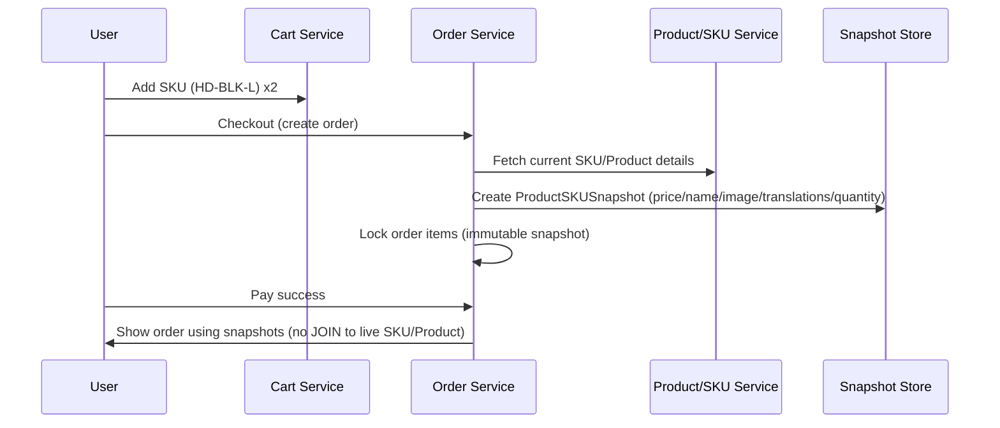

# 📸 Deep Dive Snapshot Pattern trong E‑commerce (Prisma/NestJS)

> Mục tiêu: Giải thích cực kỳ chi tiết, dễ hiểu, kèm ví dụ end‑to‑end về Snapshot Pattern, vì sao hệ thống này snapshot ở cấp SKU (ProductSKUSnapshot), khi nào tạo snapshot, snapshot gồm những gì, và cách dùng trong nghiệp vụ đơn hàng.

---

## ⚡ TL;DR

- **Snapshot = Ảnh chụp dữ liệu tại một thời điểm** để bảo vệ lịch sử giao dịch (giá, tên sản phẩm, hình, nội dung i18n...).
- **Snapshot ở cấp SKU** vì khách mua biến thể cụ thể (màu/size), mỗi biến thể có giá/ảnh/stock riêng.
- **Không join dữ liệu “hiện tại”** khi hiển thị đơn cũ; dùng snapshot để hiển thị đúng dữ liệu “tại thời điểm mua”.
- **Lợi ích**: Chính xác pháp lý, chống trôi giá, tồn tại độc lập khi Product/SKU bị xóa, query nhanh cho hóa đơn/đối soát.

---

## 1. Snapshot Pattern là gì?

Snapshot Pattern lưu lại một bản sao “tối thiểu nhưng đủ dùng” về thực thể liên quan đến giao dịch tại thời điểm diễn ra giao dịch. Với e‑commerce:

- Không lưu lại toàn bộ Product (vì dư thừa), mà snapshot **những trường cần cho hóa đơn**: tên, giá, hình, mã SKU, số lượng, và phần mô tả theo ngôn ngữ.
- Snapshot là bất biến: tạo xong thì không chỉnh sửa (đảm bảo lịch sử chuẩn xác).

---

## 2. Vì sao snapshot là bắt buộc trong đơn hàng?

Nếu chỉ lưu `orderItem.skuId` rồi JOIN sang bảng `SKU`/`Product` để lấy giá/tên/hình khi render đơn cũ:

- Giá và tên sản phẩm đã đổi → hoá đơn hiển thị sai thời điểm mua.
- SKU/Product có thể bị xoá → JOIN thất bại hoặc dữ liệu không còn.
- Các bản dịch i18n có thể cập nhật → nội dung cũ không còn khớp hóa đơn.

Snapshot giải quyết triệt để: giữ nguyên “sự thật tại thời điểm mua”.

---

## 3. Tại sao snapshot ở cấp SKU thay vì Product?

- **Khách mua SKU cụ thể** (ví dụ: iPhone 15, màu Đen, 128GB). Giá/ảnh/stock khác nhau theo biến thể.
- Snapshot Product sẽ dư thừa: chứa cả danh sách biến thể, hình ảnh không liên quan, khó xác định người mua biến thể nào.
- Snapshot SKU tập trung: nhỏ gọn, đúng biến thể đã mua, đủ thông tin cho hóa đơn và đối soát.

---

## 4. Mapping vào schema hiện tại

Trong schema Prisma của dự án, bảng snapshot là `ProductSKUSnapshot` (rút gọn các trường chính):

```prisma
model ProductSKUSnapshot {
  id                  Int      @id @default(autoincrement())
  productName         String   @db.VarChar(500)
  skuPrice            Float
  image               String
  skuValue            String   @db.VarChar(500)
  quantity            Int

  // Optional references để snapshot tồn tại độc lập
  skuId     Int?
  productId Int?
  orderId   Int?

  // Ngữ cảnh nội dung sản phẩm tại thời điểm mua (i18n, mô tả…)
  productTranslations Json

  createdAt DateTime @default(now())
}
```

Ghi chú thiết kế quan trọng:

- `skuId`, `productId`, `orderId` là optional: nếu bản gốc bị xoá, snapshot vẫn hợp lệ.
- `productTranslations` để lưu nội dung hiển thị đa ngôn ngữ đúng thời điểm.
- `skuPrice`, `productName`, `image`, `skuValue`, `quantity` là các trường tối thiểu cần cho hóa đơn.

---

## 5. Ví dụ end‑to‑end (đầy đủ và dễ hình dung)

### Bối cảnh

- Product: "Áo Hoodie Basic"
- Variants: `color = [Black, Beige]`, `size = [M, L]`
- Các SKU:
  - SKU A: `HD-BLK-M` (Đen, M) – giá 390.000đ
  - SKU B: `HD-BLK-L` (Đen, L) – giá 410.000đ
  - SKU C: `HD-BEG-M` (Beige, M) – giá 390.000đ

### Timeline giá

- 2025-01-10: Giá SKU B = 410.000đ (giá ban đầu)
- 2025-02-01: Flash Sale, SKU B = 369.000đ
- 2025-03-01: Kết thúc sale, SKU B = 399.000đ

### Đơn hàng thực tế

Ngày 2025-02-10, khách đặt 2 chiếc `HD-BLK-L` (SKU B) lúc đang sale 369.000đ.

Nếu KHÔNG dùng snapshot và chỉ lưu `skuId`:

- Đến 2025-03-10, bạn mở lại đơn hàng → JOIN sang SKU, giá hiện tại là 399.000đ → hoá đơn hiển thị sai (không còn 369.000đ).

Với snapshot, khi tạo order item, ta lưu bản ghi `ProductSKUSnapshot` như sau:

```json
{
  "productName": "Áo Hoodie Basic",
  "skuValue": "HD-BLK-L",
  "skuPrice": 369000,
  "image": "https://cdn.shop/hoodie-black-l.jpg",
  "quantity": 2,
  "productTranslations": {
    "vi": { "name": "Áo Hoodie Basic", "description": "Hoodie chất cotton, form rộng" },
    "en": { "name": "Basic Hoodie", "description": "Cotton fabric, oversize fit" }
  },
  "skuId": 102, // optional
  "productId": 1, // optional
  "orderId": 5001, // optional
  "createdAt": "2025-02-10T09:15:30.000Z"
}
```

Hệ quả:

- Mọi lúc mọi nơi mở lại đơn #5001, mục hàng này vẫn hiển thị đúng **369.000đ x 2** với tên/hình/mô tả đúng thời điểm mua.
- Kể cả nếu SKU B đổi giá hoặc bị xoá, snapshot vẫn đủ dữ liệu cho hóa đơn, trả hàng, đối soát.

---

## 6. Khi nào tạo snapshot? (Timing chuẩn)

Khuyến nghị quy trình an toàn 2‑pha:

1. Khi chuyển Cart → Order (đặt hàng):

- Tạo trước các `ProductSKUSnapshot` từ dữ liệu hiện tại của SKU/Product.
- Khoá các trường snapshot cho đơn (immutable).

2. Khi thanh toán thành công:

- Giữ nguyên snapshot (không cập nhật giá nữa), chỉ cập nhật trạng thái đơn.

Sai lầm thường gặp (tránh):

- Tạo snapshot… khi SKU thay đổi giá → snapshot bị lệch thời điểm.
- Tạo snapshot… khi user “xem sản phẩm” → không gắn với giao dịch.

---

## 7. Snapshot nên chứa gì và không chứa gì?

Nên snapshot (luôn):

- `skuPrice`, `productName`, `skuValue`, `image`, `quantity`
- `productTranslations` (nếu có i18n)

Không snapshot:

- `stock` (tồn kho là dữ liệu thời gian thực)
- Metadata không cần cho hóa đơn: `createdBy`, `updatedBy`, `updatedAt`…

Có thể cân nhắc snapshot (tùy nghiệp vụ):

- `specifications` kỹ thuật (nếu là tiêu chí mua)
- `warranty`/`returnPolicy` (nếu thay đổi theo thời gian)

---

## 8. Quan hệ và tính bất biến (immutability)

- `skuId`, `productId` để tham chiếu ngược (tiện đối soát), nhưng là optional.
- Không cập nhật snapshot sau khi tạo (bất biến). Nếu cần sửa “hiển thị”, tạo bản ghi snapshot mới kèm audit, KHÔNG thay đổi bản cũ.
- Xoá SKU/Product không ảnh hưởng hóa đơn vì snapshot đã tự đủ dữ liệu.

---

## 9. Truy vấn thường dùng và hiệu năng

Truy vấn order items:

```sql
SELECT productName, skuValue, skuPrice, quantity, image
FROM ProductSKUSnapshot
WHERE orderId = $1
ORDER BY id ASC;
```

Ưu điểm hiệu năng:

- Không JOIN sang SKU/Product khi hiển thị đơn → nhanh, ổn định.
- Ít rủi ro hỏng dữ liệu khi bảng gốc thay đổi cấu trúc.

Index gợi ý:

- `@@index([orderId])` (nếu hiển thị theo đơn thường xuyên)
- `@@index([skuId])` (nếu cần đối soát theo SKU)

---

## 10. FAQ nhanh

**Q1: Tại sao không lưu mỗi `skuId` rồi JOIN lúc hiển thị?**

- Vì giá/tên/hình có thể đổi, SKU/Product có thể bị xoá. Snapshot giữ “sự thật tại thời điểm mua”.

**Q2: Tại sao không snapshot Product mà snapshot SKU?**

- Người mua biến thể cụ thể. Snapshot Product dư dữ liệu và không chỉ ra biến thể nào được mua.

**Q3: i18n thay đổi thì sao?**

- Dùng `productTranslations` trong snapshot để in hóa đơn/biên nhận đúng theo thời điểm.

**Q4: Hoàn tiền/đổi trả có cần sửa snapshot không?**

- Không. Snapshot phản ánh giao dịch gốc. Trạng thái hoàn tiền/đổi trả được lưu ở bảng khác (refund/return), không sửa snapshot.

---

## 11. Checklist triển khai an toàn

- [ ] Tạo snapshot ngay khi tạo order item từ cart
- [ ] Trường snapshot là bất biến (chỉ đọc)
- [ ] Khóa logic: không dùng giá hiện tại để render đơn cũ
- [ ] Optional FK (`skuId`, `productId`) để snapshot độc lập
- [ ] Viết test: "đổi giá SKU sau mua" vẫn hiển thị đúng
- [ ] Viết test: "xóa SKU/Product" vẫn hiển thị đúng

---

## 12. So sánh nhanh với các phương án khác

- Event Sourcing: mạnh nhưng phức tạp, phải “replay” events để tính giá → không cần thiết cho hóa đơn đơn hàng.
- Temporal Tables: phụ thuộc DB, truy vấn phức tạp hơn; snapshot đơn giản, portable và đủ dùng.
- Immutable phiên bản SKU: nổ dữ liệu (mỗi lần đổi giá là một bản), reference phải mang theo version → tăng độ phức tạp.

---

## 13. Mini sequence (minh hoạ quy trình)



---

### Kết luận

Snapshot Pattern ở cấp SKU trong đơn hàng là cách tiếp cận tối ưu để:

- Bảo toàn lịch sử giao dịch (giá/tên/hình/i18n) đúng thời điểm
- Đảm bảo tính pháp lý, chống trôi giá
- Giảm phụ thuộc vào dữ liệu “sống” và tăng hiệu năng hiển thị
- Đơn giản, dễ bảo trì, phù hợp thực tế e‑commerce
