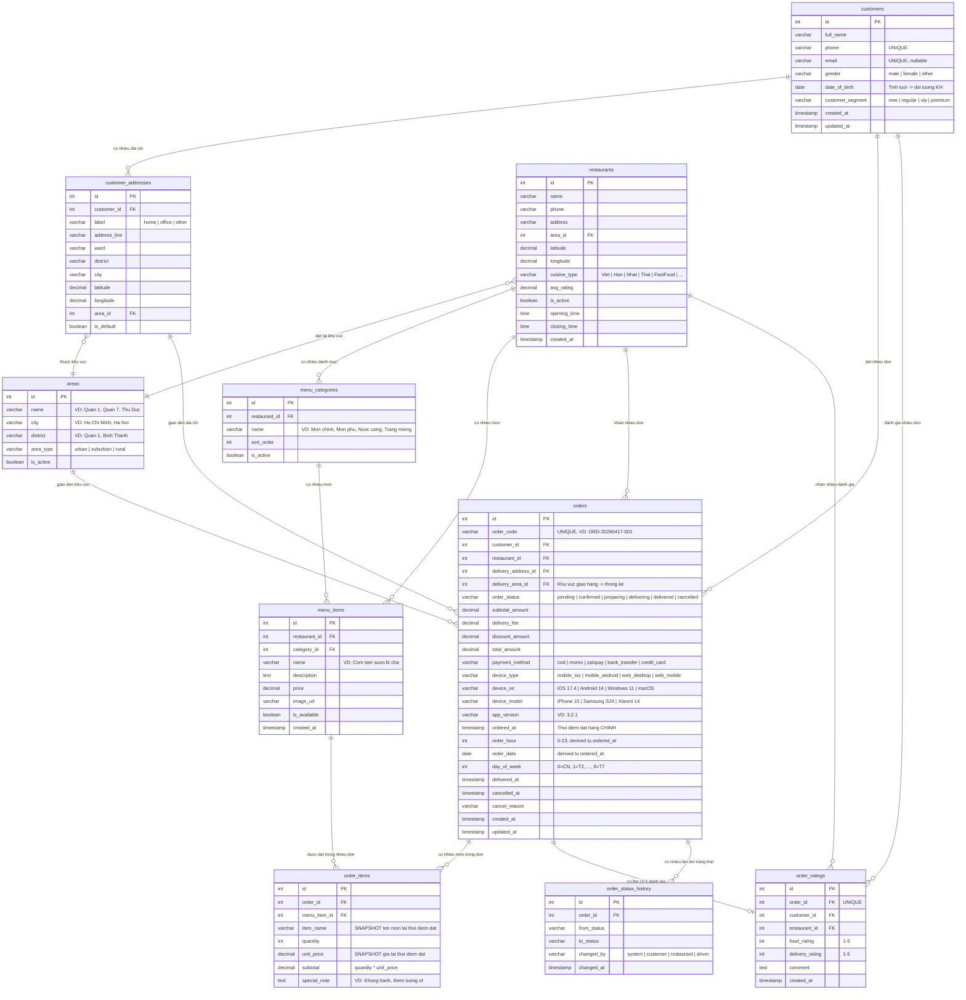

# Thiết Kế Cơ Sở Dữ Liệu - Dịch Vụ Đặt Món Ăn Trực Tuyến

> Tương tự Shopee Food / GrabFood / Baemin
> Mục tiêu: Thống kê được **món nào** được đặt vào **khoảng giờ nào**, trên **hệ máy gì**, bởi **đối tượng khách hàng nào**, tại **khu vực địa điểm nào**.

---

## 1. Tổng Quan Kiến Trúc Database

### 1.1. Các Nhóm Bảng

```
┌─────────────────────────────────────────────────────────────────┐
│                    FOOD ORDERING DATABASE                        │
├──────────────┬──────────────┬──────────────┬───────────────────┤
│  NGƯỜI DÙNG  │   NHÀ HÀNG   │   ĐƠN HÀNG   │   THỐNG KÊ/PHỤ  │
│              │              │              │                   │
│ customers    │ restaurants  │ orders       │ areas             │
│ customer_    │ menu_        │ order_items  │ order_status_     │
│  addresses   │  categories  │ order_       │  history          │
│              │ menu_items   │  ratings     │                   │
│              │              │              │                   │
└──────────────┴──────────────┴──────────────┴───────────────────┘
```

### 1.2. Nguyên Tắc Thiết Kế

| Nguyên tắc                        | Giải thích                                                                                            |
| --------------------------------- | ----------------------------------------------------------------------------------------------------- |
| **Denormalization có chọn lọc**   | Lưu `item_name`, `unit_price` trong `order_items` để giữ lịch sử chính xác khi nhà hàng thay đổi menu |
| **Derived columns cho analytics** | `order_hour`, `order_date`, `day_of_week` trong `orders` — tránh `EXTRACT()` mỗi lần query            |
| **Area-based geography**          | Dùng bảng `areas` thay vì lat/lng thuần — dễ group by khu vực cho thống kê                            |
| **Device info trong orders**      | Gắn thẳng vào đơn hàng thay vì bảng riêng — mỗi đơn = 1 device context                                |
| **Customer demographics**         | `gender`, `date_of_birth`, `customer_segment` — phục vụ thống kê đối tượng                            |

---

## 2. ER Diagram (Mermaid)



---

## 3. Chi Tiết Từng Bảng & Lý Do Thiết Kế

### 3.1. `areas` — Bảng Khu Vực

```sql
CREATE TABLE areas (
    id              SERIAL PRIMARY KEY,
    name            VARCHAR(100) NOT NULL,        -- "Quận 1", "Thủ Đức", "Cầu Giấy"
    city            VARCHAR(100) NOT NULL,        -- "Hồ Chí Minh", "Hà Nội"
    district        VARCHAR(100) NOT NULL,        -- "Quận 1", "Bình Thạnh"
    area_type       VARCHAR(20) DEFAULT 'urban',  -- urban | suburban | rural
    is_active       BOOLEAN DEFAULT TRUE
);
```

**Tại sao cần bảng này?**

Đây là bảng **trung tâm cho yêu cầu thống kê "khu vực địa điểm nào"**. Thay vì lưu tọa độ lat/lng rồi phải tính toán phức tạp để nhóm theo khu vực, ta abstract hóa thành các "area" (quận/huyện/khu vực). Khi query thống kê, chỉ cần `GROUP BY area_id` hoặc `GROUP BY areas.city` là có ngay kết quả.

`area_type` cho phép phân tích thêm: "khách ở khu vực nội thành đặt khác gì ngoại thành?"

---

### 3.2. `customers` — Bảng Khách Hàng

```sql
CREATE TABLE customers (
    id                SERIAL PRIMARY KEY,
    full_name         VARCHAR(255) NOT NULL,
    phone             VARCHAR(20) UNIQUE NOT NULL,
    email             VARCHAR(255) UNIQUE,
    gender            VARCHAR(10),                    -- 'male' | 'female' | 'other'
    date_of_birth     DATE,                           -- Tính tuổi → nhóm đối tượng
    customer_segment  VARCHAR(20) DEFAULT 'new',      -- 'new' | 'regular' | 'vip' | 'premium'
    created_at        TIMESTAMP DEFAULT NOW(),
    updated_at        TIMESTAMP DEFAULT NOW()
);
```

**Tại sao thiết kế như vậy?**

- **`gender`** + **`date_of_birth`**: Đây là 2 trường then chốt cho yêu cầu **"đối tượng khách hàng nào"**. Từ `date_of_birth` có thể tính ra nhóm tuổi (18-24, 25-34, 35-44...). Kết hợp với `gender` ta biết được "nam 25-34 tuổi thích đặt món gì?".

- **`customer_segment`**: Phân loại khách hàng theo mức độ trung thành. Cho phép phân tích: "khách VIP đặt gì khác khách mới?" — đây là thông tin cực kỳ giá trị cho marketing. Segment này có thể được update tự động bởi hệ thống dựa trên số đơn hàng, tổng chi tiêu.

- **`phone` UNIQUE**: Trong ứng dụng đặt đồ ăn, số điện thoại là primary identifier (Shopee Food, Grab đều dùng SĐT để đăng nhập).

---

### 3.3. `customer_addresses` — Địa Chỉ Khách Hàng

```sql
CREATE TABLE customer_addresses (
    id              SERIAL PRIMARY KEY,
    customer_id     INT NOT NULL REFERENCES customers(id),
    label           VARCHAR(50) DEFAULT 'home',     -- 'home' | 'office' | 'other'
    address_line    VARCHAR(500) NOT NULL,
    ward            VARCHAR(100),
    district        VARCHAR(100),
    city            VARCHAR(100),
    latitude        DECIMAL(10, 8),
    longitude       DECIMAL(11, 8),
    area_id         INT REFERENCES areas(id),       -- Liên kết khu vực
    is_default      BOOLEAN DEFAULT FALSE
);
```

**Tại sao tách riêng?**

- 1 khách hàng có thể có nhiều địa chỉ giao hàng (nhà, cơ quan, nhà bạn bè...). Quan hệ 1:N nên phải tách bảng.
- **`area_id`** liên kết với bảng `areas` — mỗi địa chỉ thuộc về 1 khu vực, phục vụ thống kê vùng miền.
- **`latitude`, `longitude`**: Vẫn lưu tọa độ chi tiết cho mục đích tính khoảng cách giao hàng, hiển thị bản đồ. Nhưng `area_id` mới là trường dùng cho thống kê.

---

### 3.4. `restaurants` — Nhà Hàng / Quán Ăn

```sql
CREATE TABLE restaurants (
    id              SERIAL PRIMARY KEY,
    name            VARCHAR(255) NOT NULL,
    phone           VARCHAR(20),
    address         VARCHAR(500) NOT NULL,
    area_id         INT REFERENCES areas(id),
    latitude        DECIMAL(10, 8),
    longitude       DECIMAL(11, 8),
    cuisine_type    VARCHAR(50),                    -- 'Viet' | 'Han' | 'Nhat' | 'FastFood' | ...
    avg_rating      DECIMAL(2, 1) DEFAULT 0.0,
    is_active       BOOLEAN DEFAULT TRUE,
    opening_time    TIME,
    closing_time    TIME,
    created_at      TIMESTAMP DEFAULT NOW()
);
```

**Tại sao thiết kế như vậy?**

- **`area_id`**: Nhà hàng cũng thuộc về 1 khu vực. Cho phép phân tích: "khu vực nào có nhiều nhà hàng nhất?", "nhà hàng khu vực nào bán chạy nhất?"
- **`cuisine_type`**: Phân loại ẩm thực — giúp thống kê chéo: "khách nữ 25-34 tuổi ở Quận 1 thích ẩm thực Hàn vào buổi tối".
- **`opening_time` / `closing_time`**: Để hệ thống biết nhà hàng có mở cửa không khi khách đặt. Cũng giúp phân tích "nhà hàng mở đêm có doanh thu ra sao?"

---

### 3.5. `menu_categories` — Danh Mục Món Ăn

```sql
CREATE TABLE menu_categories (
    id              SERIAL PRIMARY KEY,
    restaurant_id   INT NOT NULL REFERENCES restaurants(id),
    name            VARCHAR(100) NOT NULL,          -- "Món chính", "Nước uống", "Tráng miệng"
    sort_order      INT DEFAULT 0,
    is_active       BOOLEAN DEFAULT TRUE
);
```

**Tại sao cần bảng này?**

- Mỗi nhà hàng có cách phân loại menu riêng. Bảng này giúp tổ chức menu theo nhóm.
- Cho phép thống kê: "Danh mục món nào được đặt nhiều nhất?" (nước uống vs món chính vs tráng miệng).

---

### 3.6. `menu_items` — Món Ăn

```sql
CREATE TABLE menu_items (
    id              SERIAL PRIMARY KEY,
    restaurant_id   INT NOT NULL REFERENCES restaurants(id),
    category_id     INT REFERENCES menu_categories(id),
    name            VARCHAR(255) NOT NULL,          -- "Cơm tấm sườn bì chả"
    description     TEXT,
    price           DECIMAL(12, 2) NOT NULL,
    image_url       VARCHAR(500),
    is_available    BOOLEAN DEFAULT TRUE,
    created_at      TIMESTAMP DEFAULT NOW()
);
```

**Tại sao thiết kế như vậy?**

- Đây là bảng **core** — "món nào" trong yêu cầu thống kê chính là bảng này.
- **`price`** ở đây là giá **hiện tại**. Giá lúc đặt hàng được snapshot vào `order_items.unit_price` (xem bên dưới).
- `restaurant_id` + `category_id`: Một món thuộc về 1 nhà hàng và 1 danh mục.

---

### 3.7. `orders` — Đơn Hàng (BẢNG QUAN TRỌNG NHẤT)

```sql
CREATE TABLE orders (
    id                  SERIAL PRIMARY KEY,
    order_code          VARCHAR(30) UNIQUE NOT NULL,    -- "ORD-20260417-001"
    customer_id         INT NOT NULL REFERENCES customers(id),
    restaurant_id       INT NOT NULL REFERENCES restaurants(id),
    delivery_address_id INT REFERENCES customer_addresses(id),
    delivery_area_id    INT REFERENCES areas(id),       -- ★ Denormalized cho thống kê nhanh

    -- Trạng thái & Thanh toán
    order_status        VARCHAR(20) NOT NULL DEFAULT 'pending',
    subtotal_amount     DECIMAL(12, 2) NOT NULL,
    delivery_fee        DECIMAL(12, 2) DEFAULT 0,
    discount_amount     DECIMAL(12, 2) DEFAULT 0,
    total_amount        DECIMAL(12, 2) NOT NULL,
    payment_method      VARCHAR(30),                    -- 'cod' | 'momo' | 'zalopay' | 'bank_transfer'

    -- ★ DEVICE INFO — phục vụ thống kê "hệ máy gì"
    device_type         VARCHAR(30),                    -- 'mobile_ios' | 'mobile_android' | 'web_desktop' | 'web_mobile'
    device_os           VARCHAR(50),                    -- 'iOS 17.4' | 'Android 14'
    device_model        VARCHAR(100),                   -- 'iPhone 15 Pro Max' | 'Samsung Galaxy S24'
    app_version         VARCHAR(20),                    -- '3.2.1'

    -- ★ TIME ANALYTICS — phục vụ thống kê "khoảng giờ nào"
    ordered_at          TIMESTAMP NOT NULL,             -- Thời điểm đặt hàng chính xác
    order_hour          SMALLINT,                       -- 0-23, extracted từ ordered_at
    order_date          DATE,                           -- extracted từ ordered_at
    day_of_week         SMALLINT,                       -- 0=CN, 1=T2, ..., 6=T7

    -- Thời gian xử lý
    delivered_at        TIMESTAMP,
    cancelled_at        TIMESTAMP,
    cancel_reason       VARCHAR(500),

    created_at          TIMESTAMP DEFAULT NOW(),
    updated_at          TIMESTAMP DEFAULT NOW()
);

-- ★ INDEXES cho các truy vấn thống kê thường gặp
CREATE INDEX idx_orders_customer_id ON orders(customer_id);
CREATE INDEX idx_orders_restaurant_id ON orders(restaurant_id);
CREATE INDEX idx_orders_delivery_area_id ON orders(delivery_area_id);
CREATE INDEX idx_orders_order_hour ON orders(order_hour);
CREATE INDEX idx_orders_order_date ON orders(order_date);
CREATE INDEX idx_orders_device_type ON orders(device_type);
CREATE INDEX idx_orders_ordered_at ON orders(ordered_at);
CREATE INDEX idx_orders_order_status ON orders(order_status);
```

**Tại sao đây là bảng QUAN TRỌNG NHẤT? Phân tích chi tiết:**

#### A. Device Info (Hệ máy gì?)

```
device_type   → Phân loại lớn: iOS / Android / Web Desktop / Web Mobile
device_os     → Chi tiết hệ điều hành: iOS 17.4, Android 14, Windows 11
device_model  → Model cụ thể: iPhone 15, Samsung S24
app_version   → Version app đang dùng
```

**Lý do đặt trong bảng orders (không tách bảng riêng):**

- Mỗi đơn hàng = 1 context thiết bị duy nhất. Khách có thể đặt đơn 1 trên iPhone, đơn 2 trên laptop → mỗi đơn có device info riêng.
- Tách bảng `devices` riêng sẽ tạo quan hệ N:N không cần thiết, tăng complexity mà không có lợi ích thống kê.
- Query thống kê chỉ cần `GROUP BY device_type` trên bảng orders là đủ.

#### B. Time Analytics (Khoảng giờ nào?)

```
ordered_at    → Timestamp gốc, chính xác đến giây
order_hour    → 0-23, derived column
order_date    → DATE, derived column
day_of_week   → 0-6, derived column
```

**Lý do dùng derived columns thay vì chỉ `ordered_at`:**

- Query `WHERE order_hour BETWEEN 11 AND 13` nhanh hơn rất nhiều so với `WHERE EXTRACT(HOUR FROM ordered_at) BETWEEN 11 AND 13`.
- `EXTRACT()` phải tính toán trên mỗi row → full table scan. Derived column + index = index scan.
- `day_of_week` cho phép phân tích pattern theo ngày trong tuần: "Thứ 7 đặt gì khác ngày thường?"
- Các derived columns này được set bởi application layer khi tạo đơn, không cần trigger phức tạp.

#### C. Delivery Area (Khu vực nào?)

```
delivery_address_id  → FK đến địa chỉ cụ thể
delivery_area_id     → FK đến khu vực (DENORMALIZED)
```

**Lý do denormalize `delivery_area_id`:**

- Đúng ra ta có thể JOIN: `orders → customer_addresses → areas`. Nhưng cho query thống kê thường xuyên, 2 lần JOIN chậm hơn 1 lần JOIN.
- `delivery_area_id` được copy từ `customer_addresses.area_id` khi tạo đơn.
- Trade-off: Tốn thêm 1 cột INT (4 bytes/row) nhưng tiết kiệm 1 JOIN trong mọi query thống kê khu vực.

---

### 3.8. `order_items` — Chi Tiết Đơn Hàng

```sql
CREATE TABLE order_items (
    id              SERIAL PRIMARY KEY,
    order_id        INT NOT NULL REFERENCES orders(id),
    menu_item_id    INT NOT NULL REFERENCES menu_items(id),
    item_name       VARCHAR(255) NOT NULL,          -- ★ SNAPSHOT tên món
    quantity        INT NOT NULL DEFAULT 1,
    unit_price      DECIMAL(12, 2) NOT NULL,        -- ★ SNAPSHOT giá tại thời điểm đặt
    subtotal        DECIMAL(12, 2) NOT NULL,         -- quantity * unit_price
    special_note    TEXT                             -- "Không hành, thêm tương ớt"
);

CREATE INDEX idx_order_items_order_id ON order_items(order_id);
CREATE INDEX idx_order_items_menu_item_id ON order_items(menu_item_id);
```

**Tại sao SNAPSHOT `item_name` và `unit_price`?**

Đây là pattern **Snapshot at Order Time** cực kỳ quan trọng:

- Nhà hàng có thể đổi tên món "Cơm tấm đặc biệt" → "Cơm tấm Premium" bất cứ lúc nào.
- Giá có thể tăng từ 45.000đ → 55.000đ.
- Nếu chỉ lưu `menu_item_id` mà không snapshot, khi xem lại đơn hàng cũ sẽ hiển thị tên/giá mới — **sai sự thật**.
- `item_name` snapshot đảm bảo thống kê "món nào" luôn chính xác theo tên tại thời điểm đặt.

---

### 3.9. `order_ratings` — Đánh Giá Đơn Hàng

```sql
CREATE TABLE order_ratings (
    id              SERIAL PRIMARY KEY,
    order_id        INT UNIQUE NOT NULL REFERENCES orders(id),
    customer_id     INT NOT NULL REFERENCES customers(id),
    restaurant_id   INT NOT NULL REFERENCES restaurants(id),
    food_rating     SMALLINT CHECK (food_rating BETWEEN 1 AND 5),
    delivery_rating SMALLINT CHECK (delivery_rating BETWEEN 1 AND 5),
    comment         TEXT,
    created_at      TIMESTAMP DEFAULT NOW()
);
```

**Tại sao cần bảng này?**

- Mỗi đơn hàng chỉ có tối đa 1 đánh giá → `order_id UNIQUE`.
- Tách `food_rating` và `delivery_rating` vì đây là 2 trải nghiệm khác nhau: đồ ăn ngon nhưng giao chậm, hoặc giao nhanh nhưng đồ ăn dở.
- Cho phép phân tích: "món nào có rating cao nhất ở khu vực nào?"

---

### 3.10. `order_status_history` — Lịch Sử Trạng Thái Đơn

```sql
CREATE TABLE order_status_history (
    id              SERIAL PRIMARY KEY,
    order_id        INT NOT NULL REFERENCES orders(id),
    from_status     VARCHAR(20),
    to_status       VARCHAR(20) NOT NULL,
    changed_by      VARCHAR(20),                    -- 'system' | 'customer' | 'restaurant' | 'driver'
    changed_at      TIMESTAMP DEFAULT NOW()
);

CREATE INDEX idx_order_status_history_order_id ON order_status_history(order_id);
```

**Tại sao cần bảng này?**

- `orders.order_status` chỉ lưu trạng thái **hiện tại**. Bảng này lưu **toàn bộ lịch sử** chuyển đổi.
- Cho phép phân tích: "thời gian trung bình từ `confirmed` → `delivered` ở khu vực nào nhanh nhất?"
- Biết ai thay đổi trạng thái (`changed_by`) — hữu ích cho audit trail.

---

## 4. Luồng Dữ Liệu Khi Đặt Hàng

```
Khách hàng mở app (device info được capture)
        │
        ▼
┌─────────────────────────────┐
│  1. Chọn nhà hàng           │ ← restaurants (area_id → khu vực nhà hàng)
│  2. Chọn món ăn             │ ← menu_items (name, price)
│  3. Chọn địa chỉ giao       │ ← customer_addresses (area_id → khu vực giao)
│  4. Chọn thanh toán          │
│  5. Xác nhận đặt hàng       │
└─────────────────────────────┘
        │
        ▼
┌─────────────────────────────────────────────────────────┐
│  TẠO ĐƠN HÀNG (Application Layer)                       │
│                                                          │
│  orders:                                                 │
│    - customer_id ← từ session đăng nhập                  │
│    - restaurant_id ← từ nhà hàng đã chọn                │
│    - delivery_address_id ← từ địa chỉ đã chọn           │
│    - delivery_area_id ← COPY từ customer_addresses.area_id │
│    - device_type, device_os, device_model ← từ User-Agent │
│    - ordered_at ← NOW()                                 │
│    - order_hour ← EXTRACT(HOUR FROM NOW())              │
│    - order_date ← CURRENT_DATE                          │
│    - day_of_week ← EXTRACT(DOW FROM NOW())              │
│                                                          │
│  order_items (cho mỗi món):                              │
│    - menu_item_id ← từ món đã chọn                      │
│    - item_name ← SNAPSHOT từ menu_items.name             │
│    - unit_price ← SNAPSHOT từ menu_items.price           │
│    - quantity ← số lượng khách chọn                      │
│    - subtotal ← quantity * unit_price                    │
└─────────────────────────────────────────────────────────┘
        │
        ▼
  Đơn hàng được xử lý (pending → confirmed → preparing → delivering → delivered)
        │
        ▼
  Mỗi lần đổi trạng thái → INSERT vào order_status_history
```

---

## 5. SQL Queries Thống Kê — Đáp Ứng 4 Yêu Cầu

### 5.1. Món nào được đặt vào khoảng giờ nào?

```sql
-- Top 10 món được đặt nhiều nhất trong khung giờ trưa (11h-13h)
SELECT
    oi.item_name,
    COUNT(*) AS total_orders,
    SUM(oi.quantity) AS total_quantity
FROM order_items oi
JOIN orders o ON oi.order_id = o.id
WHERE o.order_hour BETWEEN 11 AND 13
  AND o.order_status = 'delivered'
GROUP BY oi.item_name
ORDER BY total_quantity DESC
LIMIT 10;

-- Phân bổ đặt hàng theo từng khung giờ trong ngày
SELECT
    o.order_hour,
    COUNT(DISTINCT o.id) AS total_orders,
    COUNT(oi.id) AS total_items
FROM orders o
JOIN order_items oi ON o.id = oi.order_id
WHERE o.order_status = 'delivered'
  AND o.order_date BETWEEN '2026-01-01' AND '2026-03-31'
GROUP BY o.order_hour
ORDER BY o.order_hour;

-- Món phổ biến nhất theo từng khung giờ (giờ cao điểm)
SELECT
    o.order_hour,
    oi.item_name,
    SUM(oi.quantity) AS total_quantity,
    RANK() OVER (PARTITION BY o.order_hour ORDER BY SUM(oi.quantity) DESC) AS rank
FROM orders o
JOIN order_items oi ON o.id = oi.order_id
WHERE o.order_status = 'delivered'
GROUP BY o.order_hour, oi.item_name
HAVING RANK() OVER (PARTITION BY o.order_hour ORDER BY SUM(oi.quantity) DESC) <= 3;
```

### 5.2. Đặt trên hệ máy gì?

```sql
-- Thống kê đơn hàng theo loại thiết bị
SELECT
    o.device_type,
    COUNT(*) AS total_orders,
    SUM(o.total_amount) AS total_revenue,
    ROUND(AVG(o.total_amount), 0) AS avg_order_value
FROM orders o
WHERE o.order_status = 'delivered'
GROUP BY o.device_type
ORDER BY total_orders DESC;

-- Thống kê chi tiết theo hệ điều hành
SELECT
    o.device_type,
    o.device_os,
    COUNT(*) AS total_orders,
    ROUND(COUNT(*) * 100.0 / SUM(COUNT(*)) OVER (), 2) AS percentage
FROM orders o
WHERE o.order_status = 'delivered'
  AND o.order_date >= CURRENT_DATE - INTERVAL '30 days'
GROUP BY o.device_type, o.device_os
ORDER BY total_orders DESC;

-- Món phổ biến theo từng nền tảng
SELECT
    o.device_type,
    oi.item_name,
    SUM(oi.quantity) AS total_quantity
FROM orders o
JOIN order_items oi ON o.id = oi.order_id
WHERE o.order_status = 'delivered'
GROUP BY o.device_type, oi.item_name
ORDER BY o.device_type, total_quantity DESC;
```

### 5.3. Đối tượng khách hàng nào?

```sql
-- Thống kê theo giới tính
SELECT
    c.gender,
    COUNT(DISTINCT o.id) AS total_orders,
    COUNT(DISTINCT c.id) AS total_customers,
    ROUND(AVG(o.total_amount), 0) AS avg_order_value
FROM orders o
JOIN customers c ON o.customer_id = c.id
WHERE o.order_status = 'delivered'
GROUP BY c.gender;

-- Thống kê theo nhóm tuổi
SELECT
    CASE
        WHEN EXTRACT(YEAR FROM AGE(c.date_of_birth)) BETWEEN 18 AND 24 THEN '18-24'
        WHEN EXTRACT(YEAR FROM AGE(c.date_of_birth)) BETWEEN 25 AND 34 THEN '25-34'
        WHEN EXTRACT(YEAR FROM AGE(c.date_of_birth)) BETWEEN 35 AND 44 THEN '35-44'
        WHEN EXTRACT(YEAR FROM AGE(c.date_of_birth)) >= 45 THEN '45+'
        ELSE 'Unknown'
    END AS age_group,
    COUNT(DISTINCT o.id) AS total_orders,
    SUM(o.total_amount) AS total_revenue
FROM orders o
JOIN customers c ON o.customer_id = c.id
WHERE o.order_status = 'delivered'
GROUP BY age_group
ORDER BY total_orders DESC;

-- Thống kê theo phân khúc khách hàng
SELECT
    c.customer_segment,
    COUNT(DISTINCT o.id) AS total_orders,
    COUNT(DISTINCT c.id) AS total_customers,
    SUM(o.total_amount) AS total_revenue,
    ROUND(AVG(o.total_amount), 0) AS avg_order_value
FROM orders o
JOIN customers c ON o.customer_id = c.id
WHERE o.order_status = 'delivered'
GROUP BY c.customer_segment
ORDER BY total_revenue DESC;

-- Nữ 25-34 tuổi thích đặt món gì nhất?
SELECT
    oi.item_name,
    SUM(oi.quantity) AS total_quantity,
    COUNT(DISTINCT o.id) AS total_orders
FROM orders o
JOIN customers c ON o.customer_id = c.id
JOIN order_items oi ON o.id = oi.order_id
WHERE o.order_status = 'delivered'
  AND c.gender = 'female'
  AND EXTRACT(YEAR FROM AGE(c.date_of_birth)) BETWEEN 25 AND 34
GROUP BY oi.item_name
ORDER BY total_quantity DESC
LIMIT 10;
```

### 5.4. Khu vực địa điểm nào?

```sql
-- Top khu vực đặt hàng nhiều nhất
SELECT
    a.name AS area_name,
    a.city,
    a.district,
    COUNT(DISTINCT o.id) AS total_orders,
    SUM(o.total_amount) AS total_revenue
FROM orders o
JOIN areas a ON o.delivery_area_id = a.id
WHERE o.order_status = 'delivered'
GROUP BY a.id, a.name, a.city, a.district
ORDER BY total_orders DESC
LIMIT 10;

-- Món phổ biến nhất tại mỗi khu vực
SELECT
    a.name AS area_name,
    oi.item_name,
    SUM(oi.quantity) AS total_quantity,
    RANK() OVER (PARTITION BY a.id ORDER BY SUM(oi.quantity) DESC) AS rank
FROM orders o
JOIN areas a ON o.delivery_area_id = a.id
JOIN order_items oi ON o.id = oi.order_id
WHERE o.order_status = 'delivered'
GROUP BY a.id, a.name, oi.item_name
HAVING RANK() OVER (PARTITION BY a.id ORDER BY SUM(oi.quantity) DESC) <= 5;

-- So sánh doanh thu theo loại khu vực (nội thành vs ngoại thành)
SELECT
    a.area_type,
    COUNT(DISTINCT o.id) AS total_orders,
    SUM(o.total_amount) AS total_revenue,
    ROUND(AVG(o.total_amount), 0) AS avg_order_value
FROM orders o
JOIN areas a ON o.delivery_area_id = a.id
WHERE o.order_status = 'delivered'
GROUP BY a.area_type;
```

### 5.5. Query Kết Hợp — Sức Mạnh Thực Sự Của Thiết Kế

```sql
-- ★ SUPER QUERY: Món gì, giờ nào, thiết bị gì, khách nào, khu vực nào?
SELECT
    oi.item_name,
    o.order_hour,
    o.device_type,
    c.gender,
    CASE
        WHEN EXTRACT(YEAR FROM AGE(c.date_of_birth)) BETWEEN 18 AND 24 THEN '18-24'
        WHEN EXTRACT(YEAR FROM AGE(c.date_of_birth)) BETWEEN 25 AND 34 THEN '25-34'
        WHEN EXTRACT(YEAR FROM AGE(c.date_of_birth)) BETWEEN 35 AND 44 THEN '35-44'
        ELSE '45+'
    END AS age_group,
    c.customer_segment,
    a.name AS area_name,
    a.area_type,
    COUNT(*) AS order_count,
    SUM(oi.quantity) AS total_quantity,
    SUM(oi.subtotal) AS total_revenue
FROM order_items oi
JOIN orders o ON oi.order_id = o.id
JOIN customers c ON o.customer_id = c.id
JOIN areas a ON o.delivery_area_id = a.id
WHERE o.order_status = 'delivered'
  AND o.order_date BETWEEN '2026-01-01' AND '2026-03-31'
GROUP BY
    oi.item_name,
    o.order_hour,
    o.device_type,
    c.gender,
    age_group,
    c.customer_segment,
    a.name,
    a.area_type
ORDER BY total_quantity DESC
LIMIT 50;
```

Đây chính là **sức mạnh** của thiết kế này: tất cả 4 chiều thống kê (thời gian, thiết bị, khách hàng, khu vực) đều có thể kết hợp trong 1 query duy nhất, chỉ cần tối đa 4 JOINs.

---

## 6. Phân Tích Tổng Quan — Tại Sao Thiết Kế Như Vậy?

### 6.1. Sơ đồ quan hệ giữa các bảng phục vụ thống kê

```
                    ┌──────────┐
                    │  areas   │ ← Khu vực (thống kê địa điểm)
                    └────┬─────┘
                         │
            ┌────────────┼────────────────┐
            │            │                │
    ┌───────▼──────┐  ┌──▼──────────┐  ┌──▼─────────────────┐
    │ restaurants  │  │ customer_   │  │      orders        │
    │              │  │ addresses   │  │                     │
    └───────┬──────┘  └──────┬──────┘  │ ★ device_type      │ ← Hệ máy
            │                │         │ ★ order_hour       │ ← Khoảng giờ
    ┌───────▼──────┐  ┌──────▼──────┐  │ ★ delivery_area_id │ ← Khu vực
    │ menu_items   │  │  customers  │  └──────┬──────────────┘
    └───────┬──────┘  └──────┬──────┘         │
            │         │ ★ gender     │         │
            │         │ ★ age (dob)  │ ← Đối tượng KH
            │         │ ★ segment    │         │
            │         └──────────────┘         │
            │                                  │
            └──────────┐       ┌───────────────┘
                       │       │
                 ┌─────▼───────▼──────┐
                 │    order_items     │
                 │ ★ item_name       │ ← Món nào
                 │ ★ quantity        │
                 │ ★ unit_price      │
                 └────────────────────┘
```

### 6.2. Bảng Tổng Kết Chiều Thống Kê

| Yêu cầu thống kê  | Bảng chính         | Trường then chốt                              | Cách query                          |
| ----------------- | ------------------ | --------------------------------------------- | ----------------------------------- |
| **Món nào?**      | `order_items`      | `item_name`, `menu_item_id`                   | GROUP BY item_name                  |
| **Giờ nào?**      | `orders`           | `order_hour`, `day_of_week`                   | GROUP BY order_hour                 |
| **Hệ máy gì?**    | `orders`           | `device_type`, `device_os`, `device_model`    | GROUP BY device_type                |
| **Đối tượng KH?** | `customers`        | `gender`, `date_of_birth`, `customer_segment` | JOIN customers, GROUP BY gender/age |
| **Khu vực nào?**  | `orders` + `areas` | `delivery_area_id`                            | JOIN areas, GROUP BY area           |

### 6.3. Trade-offs & Quyết Định Thiết Kế

| Quyết định                                    | Ưu điểm                          | Nhược điểm                | Tại sao chọn                                  |
| --------------------------------------------- | -------------------------------- | ------------------------- | --------------------------------------------- |
| Derived columns (`order_hour`, `day_of_week`) | Query nhanh, index được          | Redundant data, cần sync  | Tốc độ query analytics quan trọng hơn storage |
| Snapshot trong `order_items`                  | Dữ liệu lịch sử chính xác        | Tốn storage               | Tính chính xác của báo cáo là bắt buộc        |
| Device info trong `orders`                    | Query đơn giản, 0 JOIN thêm      | Cột có thể NULL           | Mỗi đơn = 1 device, không cần bảng riêng      |
| `delivery_area_id` denormalized               | Bớt 1 JOIN cho mọi query khu vực | Data có thể out-of-sync   | Set đúng khi tạo đơn, không thay đổi sau      |
| `areas` table thay vì geofencing              | Đơn giản, GROUP BY dễ            | Kém linh hoạt hơn polygon | Phù hợp "tương đối tốt, không cần quá tối ưu" |

### 6.4. Khả Năng Mở Rộng (Nếu Cần Sau Này)

Thiết kế này có thể mở rộng thêm mà **không cần thay đổi core schema**:

1. **Bảng `promotions`** — quản lý mã giảm giá, liên kết với `orders`
2. **Bảng `delivery_drivers`** — tài xế giao hàng, liên kết với `orders`
3. **Bảng `restaurant_categories`** — phân loại nhà hàng chi tiết hơn
4. **Materialized Views** — pre-aggregate thống kê theo ngày/tuần/tháng nếu data lớn
5. **Partitioning** — partition bảng `orders` theo `order_date` khi data > vài triệu rows

---

## 7. Kết Luận

Thiết kế này sử dụng **10 bảng** với focus vào khả năng analytics. Bảng `orders` là trung tâm — nó chứa tất cả thông tin cần thiết cho 4 chiều thống kê (thời gian, thiết bị, khu vực) và liên kết với `customers` (đối tượng KH) và `order_items` (món ăn).

Nguyên tắc xuyên suốt: **trade storage cho query speed** — denormalize vừa đủ để mọi query thống kê đều nhanh và đơn giản, không cần JOIN phức tạp.

---

## 8. Giải Thích Đúng Theo Đề Bài (Bản Tóm Tắt Để Nộp)

Đề bài yêu cầu hệ thống phải thống kê được:

1. **Món nào được đặt**
2. **Vào khoảng giờ nào**
3. **Trên hệ máy gì**
4. **Bởi đối tượng khách hàng nào**
5. **Tại khu vực địa điểm nào**

Thiết kế ở trên đáp ứng đầy đủ vì đã gắn mỗi yêu cầu vào đúng nhóm dữ liệu cốt lõi như sau:

### "Món nào được đặt?"

- Dùng bảng `order_items` với các cột: `item_name`, `menu_item_id`, `quantity`.
- `item_name` được lưu theo kiểu **snapshot** tại thời điểm đặt để tránh sai lệch lịch sử khi nhà hàng đổi tên món.
- Khi thống kê chỉ cần `GROUP BY item_name` hoặc `menu_item_id`.

**Lý do thiết kế:** Nếu không snapshot tên món, báo cáo lịch sử có thể sai khi menu thay đổi. Đây là lý do quan trọng nhất cho chiều thống kê "món nào".

### "Vào khoảng giờ nào?"

- Dùng bảng `orders` với các cột thời gian: `ordered_at`, `order_hour`, `order_date`, `day_of_week`.
- `order_hour` (0-23) là cột dẫn xuất (derived) từ `ordered_at`.
- Có index trên `order_hour` để truy vấn khung giờ nhanh.

**Lý do thiết kế:** Truy vấn theo cột `order_hour` nhanh hơn so với gọi hàm `EXTRACT(HOUR FROM ordered_at)` trên toàn bộ dữ liệu.

### "Trên hệ máy gì?"

- Dùng trực tiếp trong bảng `orders`: `device_type`, `device_os`, `device_model`, `app_version`.
- Mỗi đơn hàng lưu đúng ngữ cảnh thiết bị tại thời điểm đặt.

**Lý do thiết kế:** Mỗi đơn tương ứng 1 thiết bị cụ thể, nên gắn vào `orders` giúp thống kê trực tiếp (`GROUP BY device_type`) và giảm độ phức tạp JOIN.

### "Bởi đối tượng khách hàng nào?"

- Dùng bảng `customers`: `gender`, `date_of_birth`, `customer_segment`.
- Từ `date_of_birth` có thể phân nhóm tuổi (18-24, 25-34, ...).
- `customer_segment` hỗ trợ phân tích nhóm khách theo hành vi (new/regular/vip/premium).

**Lý do thiết kế:** Các thuộc tính nhân khẩu học thuộc về khách hàng, không thuộc về từng món hay từng đơn; vì vậy để tại `customers` là đúng chuẩn nghiệp vụ.

### "Tại khu vực địa điểm nào?"

- Dùng bảng `areas` để chuẩn hóa khu vực.
- Bảng `orders` lưu `delivery_area_id` (FK tới `areas`) để thống kê khu vực giao hàng nhanh.
- Ngoài ra vẫn có `delivery_address_id` để truy vết địa chỉ chi tiết.

**Lý do thiết kế:** Tách `areas` giúp group theo khu vực rõ ràng; lưu thêm `delivery_area_id` ngay trong `orders` giảm số JOIN cho hầu hết báo cáo.

### Kết luận ngắn gọn cho phần giải thích

Thiết kế này đúng với đề bài vì:

- Có đủ dữ liệu cho cả 5 chiều thống kê.
- Dữ liệu được đặt ở bảng hợp lý theo nghiệp vụ.
- Có snapshot cho dữ liệu dễ thay đổi (tên món/giá món).
- Có tối ưu vừa đủ cho truy vấn thống kê thường gặp (derived columns + index + denormalization có kiểm soát).

Vì vậy, hệ thống có thể trả lời chính xác các câu hỏi dạng:

- "Món nào bán chạy nhất từ 11h-13h?"
- "Khách nữ 25-34 tuổi ở Quận 1 đặt món gì nhiều nhất bằng iOS?"
- "Nhóm khách VIP ở khu vực nội thành thường đặt món nào vào buổi tối?"
