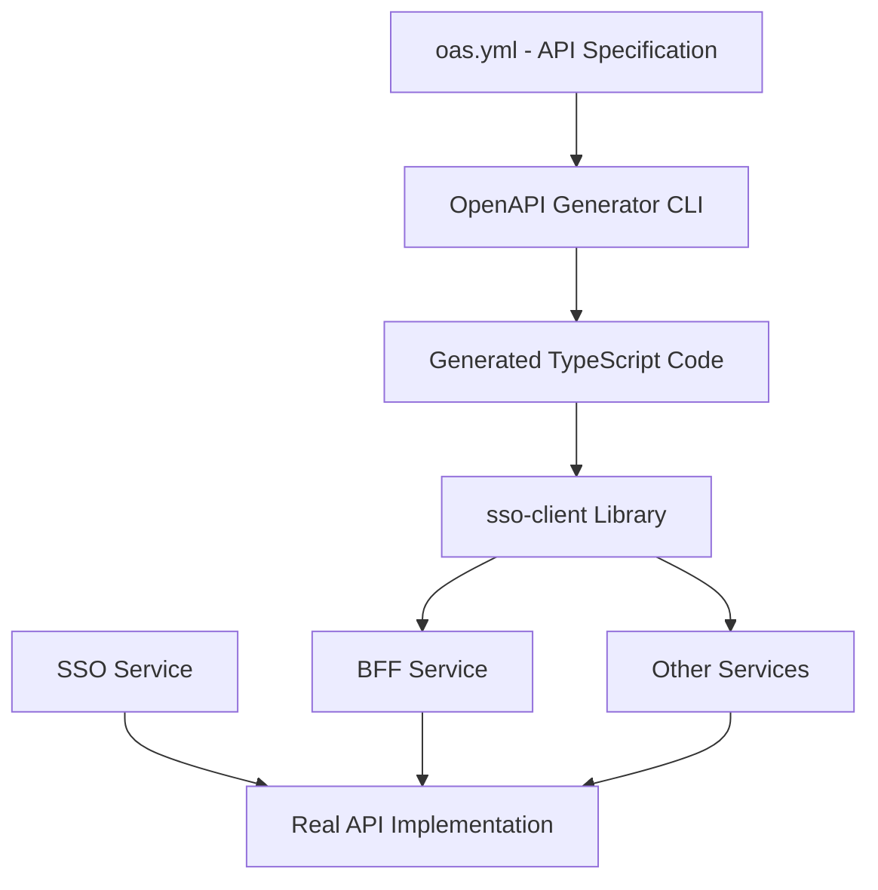

# Giải thích chi tiết về file OAS.yml và hệ thống Code Generation

## 📋 Tổng quan

File `oas.yml` (OpenAPI Specification YAML) trong dự án `talent-backend` là một **đặc tả API** được viết theo chuẩn OpenAPI 3.0.3. Đây là trái tim của hệ thống **Code Generation** tự động, giúp tạo ra các client library để giao tiếp giữa các microservices.

## 🎯 Mục đích chính của file OAS.yml

### 1. **Định nghĩa API Contract**

File `oas.yml` đóng vai trò như một **hợp đồng API** (API Contract) giữa:

- **SSO Service** (cung cấp API)
- **BFF Service** và các service khác (sử dụng API)

### 2. **Tự động sinh code TypeScript Client**

Từ file này, hệ thống sẽ tự động sinh ra:

- **TypeScript interfaces** cho request/response
- **API client classes** với đầy đủ methods
- **Type safety** cho toàn bộ hệ thống

## 🏗️ Kiến trúc hệ thống



## 📁 Cấu trúc thư mục liên quan

```
libs/sso-client/
├── src/
│   ├── client/
│   │   └── generated/           # 🤖 Code được sinh tự động
│   │       ├── api.ts          # API classes và interfaces
│   │       ├── base.ts         # Base classes
│   │       ├── common.ts       # Common utilities
│   │       ├── configuration.ts # Configuration
│   │       └── index.ts        # Export tất cả
│   ├── utils/
│   │   ├── oas.yml            # 📋 API Specification
│   │   └── providers.ts       # NestJS providers
│   ├── sso-client.service.ts  # 🎯 Main service wrapper
│   ├── sso-client.module.ts   # 📦 NestJS module
│   └── index.ts               # Library entry point
```

## 🔍 Phân tích chi tiết file OAS.yml

### 1. **Metadata Section**

```yaml
openapi: 3.0.3
info:
  title: SSOService API
  version: 1.0.0
  description: API for retrieving user information from SSOService
```

- Định nghĩa phiên bản OpenAPI và thông tin cơ bản về API

### 2. **API Endpoints**

File định nghĩa 2 endpoints chính:

#### **POST /api/users** - Tạo user mới

```yaml
/api/users:
  post:
    operationId: createUser
    summary: Create a new user
    requestBody:
      required: true
      content:
        application/json:
          schema:
            $ref: '#/components/schemas/CreateUserRequest'
    responses:
      '201':
        description: User created successfully
        content:
          application/json:
            schema:
              $ref: '#/components/schemas/User'
```

#### **POST /api/auth/login** - Đăng nhập

```yaml
/api/auth/login:
  post:
    operationId: login
    summary: User login
    requestBody:
      required: true
      content:
        application/json:
          schema:
            $ref: '#/components/schemas/LoginRequest'
    responses:
      '200':
        description: Login successful
        content:
          application/json:
            schema:
              $ref: '#/components/schemas/LoginResponse'
```

### 3. **Data Schemas**

Định nghĩa các cấu trúc dữ liệu:

#### **CreateUserRequest**

```yaml
CreateUserRequest:
  type: object
  required:
    - email
    - firstName
    - lastName
    - password
  properties:
    email:
      type: string
      format: email
    firstName:
      type: string
    lastName:
      type: string
    password:
      type: string
      minLength: 6
```

#### **LoginRequest**

```yaml
LoginRequest:
  type: object
  required:
    - email
    - password
  properties:
    email:
      type: string
      format: email
    password:
      type: string
```

#### **User Response**

```yaml
User:
  type: object
  properties:
    id:
      type: integer
    email:
      type: string
    firstName:
      type: string
    lastName:
      type: string
    createdAt:
      type: string
      format: date-time
    updatedAt:
      type: string
      format: date-time
```

## ⚙️ Quy trình Code Generation

### 1. **Cấu hình trong openapitools.json**

```json
{
  "generator-cli": {
    "version": "7.6.0",
    "generators": {
      "sso-client": {
        "generatorName": "typescript-axios",
        "inputSpec": "libs/sso-client/src/utils/oas.yml",
        "output": "libs/sso-client/src/client/generated",
        "additionalProperties": {
          "stringEnums": true,
          "supportsES6": true,
          "typescriptThreePlus": true
        }
      }
    }
  }
}
```

### 2. **Lệnh generation trong package.json**

```json
{
  "scripts": {
    "codegen": "openapi-generator-cli generate",
    "post-codegen": "pnpm lint"
  }
}
```

### 3. **Khi chạy `pnpm codegen`:**

1. OpenAPI Generator CLI đọc file `oas.yml`
2. Sinh ra TypeScript code trong thư mục `generated/`
3. Tự động chạy linter để format code

## 🎯 Code được sinh ra

### 1. **TypeScript Interfaces**

```typescript
// Từ oas.yml sinh ra:
export interface CreateUserRequest {
  email: string;
  firstName: string;
  lastName: string;
  password: string;
}

export interface LoginRequest {
  email: string;
  password: string;
}

export interface User {
  id?: number;
  email?: string;
  firstName?: string;
  lastName?: string;
  createdAt?: string;
  updatedAt?: string;
}
```

### 2. **API Client Classes**

```typescript
// AuthApi class với method login
export class AuthApi extends BaseAPI {
  public login(
    requestParameters: AuthApiLoginRequest,
    options?: RawAxiosRequestConfig,
  ) {
    return AuthApiFp(this.configuration)
      .login(requestParameters.loginRequest, options)
      .then((request) => request(this.axios, this.basePath));
  }
}

// UserApi class với method createUser
export class UserApi extends BaseAPI {
  public createUser(
    requestParameters: UserApiCreateUserRequest,
    options?: RawAxiosRequestConfig,
  ) {
    return UserApiFp(this.configuration)
      .createUser(requestParameters.createUserRequest, options)
      .then((request) => request(this.axios, this.basePath));
  }
}
```

## 🔧 Cách sử dụng trong ứng dụng

### 1. **SsoClientService - Wrapper Layer**

```typescript
@Injectable()
export class SsoClientService {
  constructor(
    private readonly userApi: UserApi,
    private readonly authApi: AuthApi,
  ) {}

  async createUser(data: CreateUserRequest) {
    try {
      const res = await this.userApi.createUser({
        createUserRequest: data,
      });
      return res.data;
    } catch (error: any) {
      if (error.response.status === 400) {
        throw new BadRequestException(error.response.data);
      }
      throw error;
    }
  }

  async login(data: LoginRequest) {
    try {
      const res = await this.authApi.login({
        loginRequest: data,
      });
      return res.data;
    } catch (error: any) {
      if (error.response.status === 401) {
        throw new UnauthorizedException(error.response.data);
      }
      throw error;
    }
  }
}
```

### 2. **NestJS Module Configuration**

```typescript
@Global()
@Module({
  imports: [
    HttpModule.register({
      headers: {
        'Content-Type': 'application/json',
      },
    }),
  ],
  providers: [
    SsoClientService,
    injectApiProvider(UserApi),
    injectApiProvider(AuthApi),
  ],
  exports: [SsoClientService],
})
export class SsoClientModule {}
```

### 3. **Sử dụng trong BFF Service**

```typescript
// apps/bff-service/src/modules/auth/auth.controller.ts
@Controller('auth')
export class AuthController {
  constructor(private readonly ssoClientService: SsoClientService) {}

  @Post('login')
  async login(@Body() body: LoginRequest) {
    return this.ssoClientService.login(body);
  }
}

// apps/bff-service/src/modules/user/user.controller.ts
@Controller('users')
export class UserController {
  constructor(private readonly ssoClientService: SsoClientService) {}

  @Post()
  async register(@Body() body: CreateUserRequest) {
    return this.ssoClientService.createUser(body);
  }
}
```

## 🎉 Lợi ích của hệ thống này

### 1. **Type Safety**

- Tất cả request/response đều có type checking
- Phát hiện lỗi ngay tại compile time
- IntelliSense hỗ trợ đầy đủ

### 2. **Consistency**

- API contract được đồng bộ giữa tất cả services
- Không có sự khác biệt giữa frontend và backend

### 3. **Maintainability**

- Chỉ cần sửa file `oas.yml` một lần
- Tự động sinh lại code cho tất cả clients
- Giảm thiểu manual coding và lỗi

### 4. **Documentation**

- File `oas.yml` vừa là code vừa là documentation
- Có thể generate Swagger UI từ file này

### 5. **Scalability**

- Dễ dàng thêm endpoints mới
- Dễ dàng tạo client cho services khác

## 🔄 Workflow phát triển

### 1. **Khi thêm API mới:**

1. Cập nhật file `oas.yml`
2. Chạy `pnpm codegen`
3. Code TypeScript được sinh tự động
4. Sử dụng trong các services

### 2. **Khi thay đổi API:**

1. Sửa file `oas.yml`
2. Chạy `pnpm codegen`
3. TypeScript compiler sẽ báo lỗi nếu có breaking changes
4. Cập nhật code sử dụng tương ứng

## 🚀 Mở rộng trong tương lai

Dự án có thể mở rộng để tạo thêm:

- `talent-client` library cho Talent Service
- `notification-client` library cho Notification Service
- Tự động sync với API thật từ backend services

## 🔍 So sánh với cách làm truyền thống

### ❌ Cách truyền thống:

```typescript
// Phải tự viết interfaces
interface User {
  id: number;
  email: string;
  // ... có thể sai so với backend
}

// Phải tự viết HTTP calls
async createUser(data: any) {
  return this.httpService.post('/api/users', data);
  // Không có type checking
}
```

### ✅ Với OAS.yml + Code Generation:

```typescript
// Interfaces được sinh tự động, đảm bảo đúng
import { User, CreateUserRequest } from './generated';

// API calls được sinh tự động với full type safety
async createUser(data: CreateUserRequest): Promise<User> {
  return this.userApi.createUser({ createUserRequest: data });
}
```

## 📚 Kết luận

File `oas.yml` không chỉ là một file đặc tả API đơn thuần, mà là **nền tảng của toàn bộ hệ thống microservices communication** trong dự án. Nó đảm bảo:

- **Consistency** - Tính nhất quán
- **Type Safety** - An toàn kiểu dữ liệu
- **Maintainability** - Dễ bảo trì
- **Scalability** - Khả năng mở rộng
- **Developer Experience** - Trải nghiệm phát triển tốt

Đây là một mô hình rất hiện đại và được sử dụng rộng rãi trong các hệ thống microservices lớn, giúp team phát triển hiệu quả và giảm thiểu lỗi.
