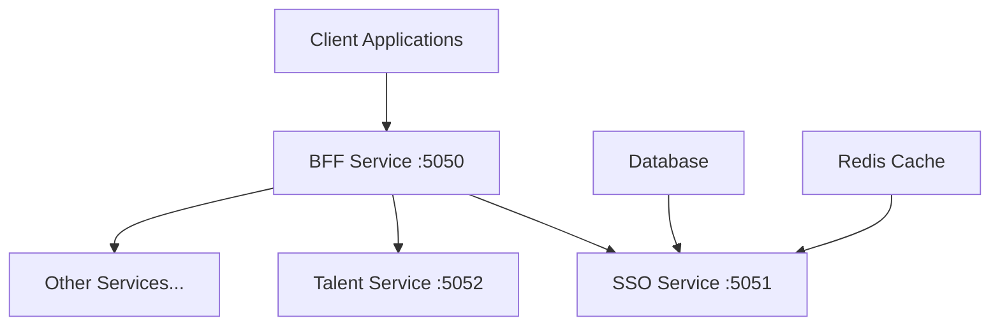
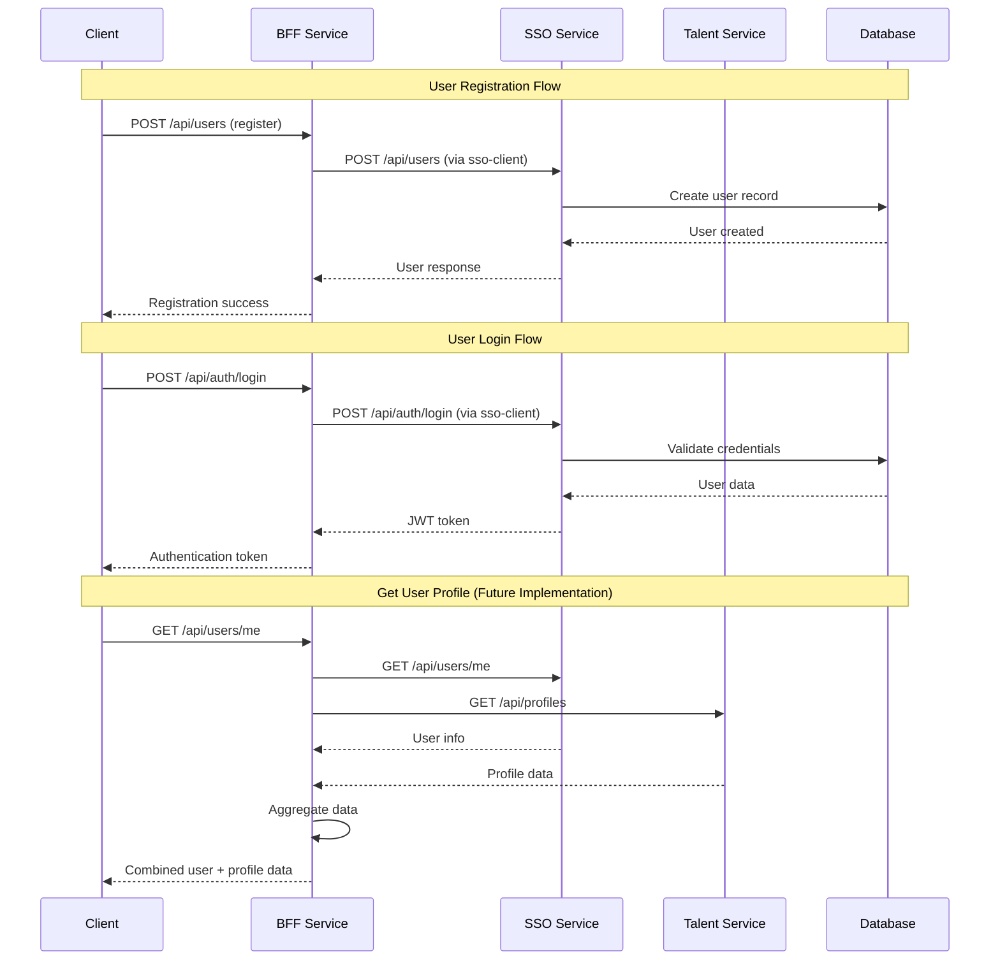

# Backend for Frontend (BFF) Pattern - Giải thích chi tiết

## 📋 Tổng quan về BFF Pattern

**Backend for Frontend (BFF)** là một kiến trúc pattern trong hệ thống microservices, trong đó mỗi frontend application (web, mobile, desktop) sẽ có một backend service riêng biệt được thiết kế đặc biệt để phục vụ nhu cầu của frontend đó.

Trong dự án `talent-backend` này, **BFF Service** đóng vai trò là một lớp trung gian (gateway) giữa client applications và các backend microservices khác như SSO Service và Talent Service.

## 🎯 Vai trò và mục đích của BFF Pattern

### 1. **API Gateway và Aggregation Layer**

BFF Service hoạt động như một **API Gateway** chuyên biệt:


```mermaid
graph TD
    A[Client Applications] --> B[BFF Service :5050]
    B --> C[SSO Service :5051]
    B --> D[Talent Service :5052]
    B --> E[Other Services...]

    F[Database] --> C
    G[Redis Cache] --> C
```

### 2. **Tối ưu hóa cho từng loại Client**

- **Web Application**: Có thể cần dữ liệu tổng hợp từ nhiều services
- **Mobile Application**: Cần payload nhỏ gọn, tối ưu cho bandwidth
- **Admin Dashboard**: Cần quyền truy cập cao và dữ liệu chi tiết

## 🏗️ Kiến trúc hệ thống trong dự án

### 1. **Cấu trúc Services**

```
talent-backend/
├── apps/
│   ├── bff-service/          # 🎯 Backend for Frontend (Port: 5050)
│   ├── sso-service/          # 🔐 Single Sign-On Service (Port: 5051)
│   └── talent-service/       # 👥 Talent Management Service (Port: 5052)
├── libs/
│   └── sso-client/           # 📚 Shared Library for SSO Communication
└── docker-compose.yml        # 🐳 Infrastructure Setup
```

### 2. **Flow giao tiếp giữa các services**


```mermaid
sequenceDiagram
    participant Client
    participant BFF as BFF Service
    participant SSO as SSO Service
    participant Talent as Talent Service
    participant DB as Database

    Note over Client,DB: User Registration Flow
    Client->>BFF: POST /api/users (register)
    BFF->>SSO: POST /api/users (via sso-client)
    SSO->>DB: Create user record
    DB-->>SSO: User created
    SSO-->>BFF: User response
    BFF-->>Client: Registration success

    Note over Client,DB: User Login Flow
    Client->>BFF: POST /api/auth/login
    BFF->>SSO: POST /api/auth/login (via sso-client)
    SSO->>DB: Validate credentials
    DB-->>SSO: User data
    SSO-->>BFF: JWT token
    BFF-->>Client: Authentication token

    Note over Client,DB: Get User Profile (Future Implementation)
    Client->>BFF: GET /api/users/me
    BFF->>SSO: GET /api/users/me
    BFF->>Talent: GET /api/profiles
    SSO-->>BFF: User info
    Talent-->>BFF: Profile data
    BFF->>BFF: Aggregate data
    BFF-->>Client: Combined user + profile data
```

## 🔍 Phân tích chi tiết từng thành phần

### 1. **BFF Service** (`apps/bff-service/`)

#### **Cấu hình cơ bản:**

```typescript
// apps/bff-service/src/main.ts
async function bootstrap() {
  const app = await NestFactory.create(AppModule);
  app.setGlobalPrefix('api');
  await app.listen(process.env.port ?? 5050); // Port 5050
}
```

#### **Module Architecture:**

```typescript
// apps/bff-service/src/app.module.ts
@Module({
  imports: [
    SsoClientModule, // üìö Import shared SSO client library
    AuthModule, // üîê Authentication endpoints
    UserModule, // 👤 User management endpoints
  ],
})
export class AppModule {}
```

#### **Auth Controller - Proxy Layer:**

```typescript
// apps/bff-service/src/modules/auth/auth.controller.ts
@Controller('auth')
export class AuthController {
  constructor(private readonly ssoClientService: SsoClientService) {}

  @Post('login')
  async login(@Body() body: LoginRequest) {
    // BFF chỉ đóng vai trò proxy, forward request đến SSO Service
    return this.ssoClientService.login(body);
  }
}
```

#### **User Controller - Aggregation Layer:**

```typescript
// apps/bff-service/src/modules/user/user.controller.ts
@Controller('users')
export class UserController {
  constructor(private readonly ssoClientService: SsoClientService) {}

  @Post()
  async register(@Body() body: CreateUserRequest) {
    // Simple proxy cho registration
    return this.ssoClientService.createUser(body);
  }

  // 🎯 Đây là nơi BFF thể hiện sức mạnh - Data Aggregation
  // @Get('me')
  // async getMe() {
  //   const me = await this.ssoClientService.getMe();
  //   const profiles = await this.talentClientService.getProfiles();
  //
  //   return {
  //     ...me,        // Dữ liệu từ SSO Service
  //     profiles,     // Dữ liệu từ Talent Service
  //   };
  // }
}
```

### 2. **SSO Service** (`apps/sso-service/`)

#### **Vai trò:** Quản lý authentication và user data

```typescript
// apps/sso-service/src/main.ts
await app.listen(process.env.port ?? 5051); // Port 5051
```

#### **Database Integration:**

```typescript
// apps/sso-service/src/modules/user/user.service.ts
@Injectable()
export class UserService {
  constructor(
    private readonly databaseService: DatabaseService,
    private readonly jwtService: JwtService,
  ) {}

  async register(body: CreateUserDto) {
    // Kiểm tra user đã tồn tại
    const existingUser = await this.databaseService.prisma.user.findUnique({
      where: { email: body.email },
    });

    if (existingUser) {
      throw new BadRequestException('User already exists');
    }

    // T·∫°o user m·ªõi
    const user = await this.databaseService.prisma.user.create({
      data: body,
    });
    return user;
  }

  async login(data: LoginDto) {
    const { email, password } = data;

    const user = await this.databaseService.prisma.user.findUnique({
      where: { email },
    });

    if (!user || user.password !== password) {
      throw new UnauthorizedException('Invalid email or password');
    }

    // T·∫°o JWT token
    const payload = { sub: user.id, email: user.email };
    const token = await this.jwtService.signAsync(payload);

    return { token };
  }
}
```

### 3. **Talent Service** (`apps/talent-service/`)

#### **Vai trò:** Quản lý thông tin profile và skills của users

```typescript
// apps/talent-service/src/main.ts
await app.listen(process.env.port ?? 5052); // Port 5052
```

```typescript
// apps/talent-service/src/modules/profile/profile.controller.ts
@Controller('profiles')
export class ProfileController {
  @Get()
  getProfiles(): Array<any> {
    // Mock data hiện tại - trong thực tế sẽ kết nối database
    return profiles.filter((profile) => profile.userId === userId);
  }
}
```

### 4. **SSO Client Library** (`libs/sso-client/`)

#### **Vai trò:** Shared library để giao tiếp với SSO Service

```typescript
// libs/sso-client/src/sso-client.service.ts
@Injectable()
export class SsoClientService {
  constructor(
    private readonly userApi: UserApi, // Auto-generated t·ª´ OpenAPI
    private readonly authApi: AuthApi, // Auto-generated t·ª´ OpenAPI
  ) {}

  async createUser(data: CreateUserRequest) {
    try {
      const res = await this.userApi.createUser({
        createUserRequest: data,
      });
      return res.data;
    } catch (error: any) {
      // Error handling và transformation
      if (error.response.status === 400) {
        throw new BadRequestException(error.response.data);
      }
      throw error;
    }
  }

  async login(data: LoginRequest) {
    try {
      const res = await this.authApi.login({
        loginRequest: data,
      });
      return res.data;
    } catch (error: any) {
      // Standardized error handling
      if (error.response.status === 401) {
        throw new UnauthorizedException(error.response.data);
      }
      throw error;
    }
  }
}
```

## 🎯 Lợi ích của BFF Pattern trong dự án này

### 1. **Separation of Concerns**

- **SSO Service**: Chỉ tập trung vào authentication và user management
- **Talent Service**: Chỉ tập trung vào profile và skills management
- **BFF Service**: Tập trung vào client-specific logic và data aggregation

### 2. **Client-Optimized APIs**

```typescript
// Thay vì client phải gọi nhiều APIs:
// GET /sso-service/api/users/me
// GET /talent-service/api/profiles

// BFF cung cấp 1 API tổng hợp:
// GET /bff-service/api/users/me
// Response: { user: {...}, profiles: [...] }
```

### 3. **Error Handling và Transformation**

```typescript
// BFF có thể chuẩn hóa error responses từ các services khác nhau
try {
  return await this.ssoClientService.createUser(body);
} catch (error) {
  this.logger.error(error);
  throw error; // Có thể transform error format tại đây
}
```

### 4. **Security Layer**

BFF có thể thêm các lớp security:

- Rate limiting
- Request validation
- Authentication middleware
- Authorization checks

### 5. **Caching và Performance**

BFF có thể implement caching cho các responses từ downstream services:

```typescript
// Pseudo code
@Get('me')
@UseInterceptors(CacheInterceptor)
async getMe() {
  // Cache response để giảm load cho downstream services
  return this.aggregateUserData();
}
```

## 🚀 Ưu điểm của BFF Pattern

### 1. **Reduced Client Complexity**

```typescript
// ‚ùå Without BFF - Client ph·∫£i handle multiple API calls
const user = await fetch('/sso-service/api/users/me');
const profiles = await fetch('/talent-service/api/profiles');
const notifications = await fetch('/notification-service/api/notifications');

// Client ph·∫£i handle error, retry logic, data combining...

// ✅ With BFF - Client chỉ cần 1 API call
const userData = await fetch('/bff-service/api/users/me');
// BFF đã aggregate tất cả data cần thiết
```

### 2. **Optimized Network Usage**

- Giảm số lượng HTTP requests từ client
- Có thể compress và optimize data format
- Batch multiple backend calls

### 3. **Independent Evolution**

- Backend microservices có thể thay đổi mà không ảnh hưởng client
- BFF đóng vai trò abstraction layer
- Client API contract được stable

### 4. **Team Autonomy**

- Frontend team có thể customize BFF theo nhu cầu
- Backend teams có thể phát triển services độc lập
- Clear boundaries và responsibilities

## ⚠️ Những thách thức cần lưu ý

### 1. **Additional Complexity**

- Thêm một layer nữa trong architecture
- Cần maintain thêm service
- Debugging có thể phức tạp hơn

### 2. **Potential Performance Bottleneck**

- BFF có thể trở thành single point of failure
- Cần design cho high availability
- Load balancing và scaling strategy

### 3. **Data Consistency**

```typescript
// Khi aggregate data từ nhiều services
async getMe() {
  const user = await this.ssoService.getUser();     // Service A
  const profile = await this.talentService.getProfile(); // Service B

  // Làm sao đảm bảo data consistency giữa 2 services?
  // Cần implement eventual consistency patterns
}
```

### 4. **Code Duplication**

- Logic có thể bị duplicate giữa BFF và downstream services
- Cần careful design để avoid duplication

## 🔧 Best Practices được áp dụng trong dự án

### 1. **Shared Libraries Pattern**

```typescript
// libs/sso-client/ - Reusable across services
// Tr√°nh code duplication
// Centralized HTTP client logic
```

### 2. **OpenAPI Code Generation**

```yaml
# libs/sso-client/src/utils/oas.yml
# Auto-generate TypeScript interfaces và API clients
# Đảm bảo type safety và consistency
```

### 3. **Standardized Error Handling**

```typescript
// Consistent error transformation across all BFF endpoints
catch (error: any) {
  if (error.response.status === 400) {
    throw new BadRequestException(error.response.data);
  }
  throw error;
}
```

### 4. **Environment-based Configuration**

```typescript
// Configuration cho different environments
const config = new Configuration({
  basePath: 'http://localhost:5051', // Dev environment
  // basePath: 'https://sso-service.production.com', // Production
});
```

## 🎯 Khi nào nên sử dụng BFF Pattern?

### ✅ **Nên sử dụng khi:**

1. **Multiple Client Types**: Web, Mobile, Desktop có nhu cầu khác nhau
2. **Complex Data Aggregation**: Cần combine data từ nhiều services
3. **Different Performance Requirements**: Mobile cần optimize bandwidth
4. **Team Structure**: Frontend và Backend teams work independently
5. **Legacy System Integration**: Cần integrate với legacy systems

### ❌ **Không nên sử dụng khi:**

1. **Simple Applications**: Chỉ có 1 client type đơn giản
2. **Small Team**: Team nhỏ, không cần separation
3. **Direct Service Access**: Services đã được design tốt cho direct client access
4. **Over-engineering**: Complexity không đáng so với benefits

## 🚀 Roadmap và mở rộng trong tương lai

### 1. **Enhanced Data Aggregation**

```typescript
// Implement the commented getMe() method
@Get('me')
async getMe(@Request() req) {
  const userId = this.extractUserIdFromToken(req);

  // Parallel calls để optimize performance
  const [user, profiles, notifications] = await Promise.all([
    this.ssoClientService.getMe(userId),
    this.talentClientService.getProfiles(userId),
    this.notificationClientService.getNotifications(userId),
  ]);

  return {
    user,
    profiles,
    notifications,
    // Additional computed fields
    completionScore: this.calculateProfileCompletion(user, profiles),
  };
}
```

### 2. **GraphQL Integration**

```typescript
// BFF có thể expose GraphQL endpoint
// Client có thể query exactly data they need
query GetUserDashboard {
  me {
    email
    firstName
    profiles {
      skills {
        title
        level
      }
    }
    notifications(unreadOnly: true) {
      title
      createdAt
    }
  }
}
```

### 3. **Caching Strategy**

```typescript
// Redis caching cho expensive aggregations
@Get('me')
@UseInterceptors(CacheInterceptor)
@CacheTTL(300) // 5 minutes cache
async getMe(@Request() req) {
  // Cached response
}
```

### 4. **Real-time Features**

```typescript
// WebSocket integration cho real-time updates
@WebSocketGateway()
export class UserGateway {
  @SubscribeMessage('subscribe-user-updates')
  handleSubscription(@MessageBody() data: any) {
    // Real-time user data updates
  }
}
```

### 5. **API Versioning**

```typescript
// Support multiple API versions
@Controller({ path: 'users', version: '1' })
export class UserV1Controller {}

@Controller({ path: 'users', version: '2' })
export class UserV2Controller {}
```

## üìä So s√°nh v·ªõi c√°c patterns kh√°c

### **BFF vs API Gateway**

| Aspect               | BFF Pattern                  | API Gateway                  |
| -------------------- | ---------------------------- | ---------------------------- |
| **Purpose**          | Client-specific optimization | General routing and security |
| **Customization**    | High per client type         | Generic for all clients      |
| **Data Aggregation** | Built-in feature             | Limited or external          |
| **Team Ownership**   | Frontend team                | Platform/DevOps team         |
| **Complexity**       | Moderate                     | Low to High                  |

### **BFF vs Direct Service Access**

| Aspect                | BFF Pattern | Direct Access |
| --------------------- | ----------- | ------------- |
| **Network Calls**     | Reduced     | Multiple      |
| **Client Complexity** | Lower       | Higher        |
| **Coupling**          | Loose       | Tight         |
| **Performance**       | Optimized   | Variable      |
| **Maintenance**       | Centralized | Distributed   |

## 🎯 Kết luận

BFF Pattern trong dự án `talent-backend` mang lại những lợi ích quan trọng:

### **Về mặt kiến trúc:**

- ✅ **Clear separation of concerns** giữa các services
- ‚úÖ **Optimized client experience** v·ªõi data aggregation
- ‚úÖ **Scalable architecture** cho multiple client types
- ✅ **Team autonomy** và independent development

### **Về mặt kỹ thuật:**

- ‚úÖ **Type safety** v·ªõi OpenAPI code generation
- ‚úÖ **Consistent error handling** across services
- ‚úÖ **Reusable components** v·ªõi shared libraries
- ✅ **Performance optimization** với caching và batching

### **Về mặt business:**

- ‚úÖ **Faster development** v·ªõi clear API contracts
- ‚úÖ **Better user experience** v·ªõi optimized endpoints
- ‚úÖ **Easier maintenance** v·ªõi centralized logic
- ‚úÖ **Future-proof architecture** cho scaling

BFF Pattern không phải là silver bullet, nhưng trong context của một hệ thống microservices với multiple clients và complex data requirements, nó là một giải pháp architecture rất phù hợp và hiệu quả.

Dự án này đã implement BFF pattern một cách professional với:

- **Proper separation of concerns**
- **Type-safe communication** via OpenAPI
- **Shared libraries** để avoid duplication
- **Extensible architecture** cho future growth

Đây là một mô hình rất tốt để học hỏi và áp dụng trong các dự án microservices thực tế.
