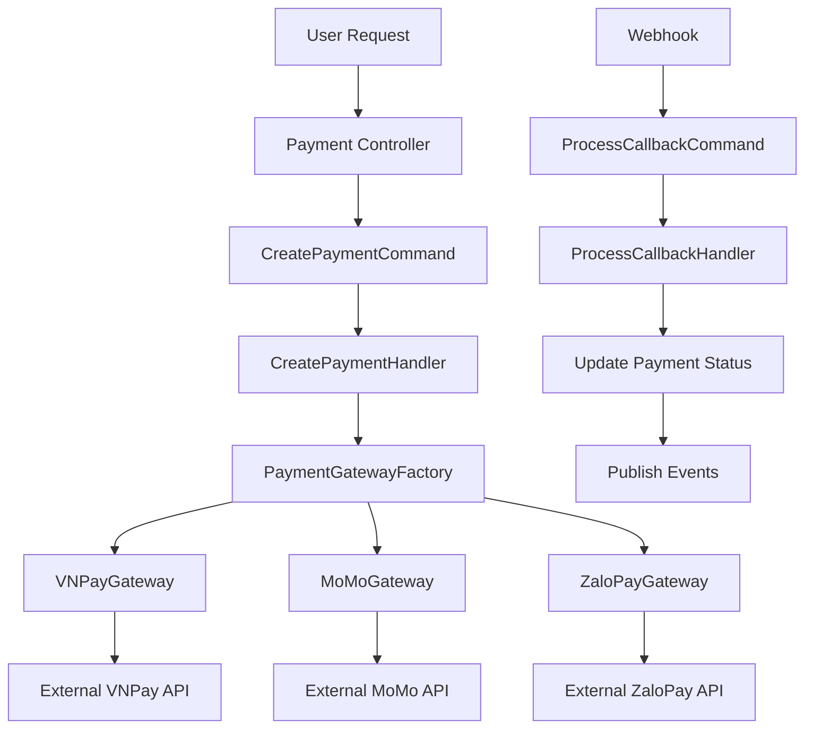

# CQRS Pattern for Payment Systems - Comprehensive Guide

## 📋 Mục lục

1. [Tổng quan về CQRS](#tổng-quan-về-cqrs)
2. [Tại sao CQRS phù hợp với Payment Systems](#tại-sao-cqrs-phù-hợp-với-payment-systems)
3. [Kiến trúc chi tiết](#kiến-trúc-chi-tiết)
4. [Implementation trong NestJS](#implementation-trong-nestjs)
5. [Best Practices](#best-practices)
6. [Common Pitfalls](#common-pitfalls)
7. [Integration với Third-party APIs](#integration-với-third-party-apis)
8. [Performance & Scalability](#performance--scalability)
9. [Testing Strategy](#testing-strategy)
10. [Monitoring & Observability](#monitoring--observability)

## 🎯 Tổng quan về CQRS

### CQRS là gì?

**CQRS (Command Query Responsibility Segregation)** là pattern tách biệt hoàn toàn giữa:

- **Commands** (Write operations) - Thay đổi state của hệ thống
- **Queries** (Read operations) - Lấy dữ liệu mà không thay đổi state

### Traditional vs CQRS Pattern

#### Traditional Pattern

```
HTTP Request → Controller → Service (mixed logic) → Repository → Database
```

**Vấn đề:**

- Service class quá lớn với mixed concerns
- Khó test riêng phần read vs write
- Read và write không thể scale riêng biệt
- Business logic lẫn với infrastructure code

#### CQRS Pattern

```
Write: HTTP Request → Controller → Command → CommandHandler → Repository → Write DB
Read:  HTTP Request → Controller → Query → QueryHandler → ReadRepository → Read DB
```

**Lợi ích:**

- **Single Responsibility**: Mỗi handler chỉ làm 1 việc
- **Testability**: Dễ test riêng từng command/query
- **Scalability**: Read và write scale độc lập
- **Maintainability**: Thêm feature mới không ảnh hưởng code cũ

## 💰 Tại sao CQRS phù hợp với Payment Systems?

### 1. **Complexity Management**

Payment systems có business logic phức tạp:

- Validation rules
- State transitions
- Fraud detection
- Reconciliation
- Multi-step workflows

### 2. **Audit & Compliance Requirements**

- Mọi thao tác write phải được log
- Immutable audit trail
- Regulatory compliance (PCI DSS, SOX)
- Event sourcing integration

### 3. **Different Read/Write Patterns**

- **Write**: Low volume, high consistency requirements
- **Read**: High volume, eventual consistency acceptable
- **Reporting**: Complex aggregations, historical data

### 4. **Third-party Integration**

- Payment gateways (VNPay, MoMo, ZaloPay)
- Bank APIs
- Fraud detection services
- Notification services

## 🏗️ Kiến trúc chi tiết

### Core Components

#### 1. Command Interface

```typescript
export interface ICommand<TResponse = void> {
  readonly _commandBrand?: never
}

export interface ICommandHandler<TCommand extends ICommand<TResponse>, TResponse = void> {
  handle(command: TCommand): Promise<Result<TResponse>>
}
```

#### 2. Query Interface

```typescript
export interface IQuery<TResponse> {
  readonly _queryBrand?: never
}

export interface IQueryHandler<TQuery extends IQuery<TResponse>, TResponse> {
  handle(query: TQuery): Promise<TResponse>
}
```

#### 3. Result Type

```typescript
export class Result<T = void> {
  static success<T>(data?: T): Result<T>
  static failure<T>(error: Error): Result<T>
  static isSuccess<T>(result: Result<T>): boolean
  static isFailure<T>(result: Result<T>): boolean
}
```

### Payment Domain Models

```typescript
export enum PaymentStatus {
  PENDING = 'PENDING',
  PROCESSING = 'PROCESSING',
  COMPLETED = 'COMPLETED',
  FAILED = 'FAILED',
  CANCELLED = 'CANCELLED',
  REFUNDED = 'REFUNDED',
}

export enum PaymentMethod {
  CREDIT_CARD = 'CREDIT_CARD',
  DEBIT_CARD = 'DEBIT_CARD',
  PAYPAL = 'PAYPAL',
  VNPAY = 'VNPAY',
  MOMO = 'MOMO',
  ZALOPAY = 'ZALOPAY',
  BANK_TRANSFER = 'BANK_TRANSFER',
}
```

## 💻 Implementation trong NestJS

### Commands Example

#### CreatePaymentCommand

```typescript
export class CreatePaymentCommand implements ICommand<Payment> {
  readonly _commandBrand?: never

  constructor(
    public readonly userId: number,
    public readonly orderId: string,
    public readonly amount: number,
    public readonly currency: string,
    public readonly method: PaymentMethod,
    public readonly metadata?: Record<string, any>,
  ) {}
}

@Injectable()
export class CreatePaymentCommandHandler implements ICommandHandler<CreatePaymentCommand, Payment> {
  async handle(command: CreatePaymentCommand): Promise<Result<Payment>> {
    // 1. Validate business rules
    // 2. Create payment entity
    // 3. Persist to database
    // 4. Publish domain events
    // 5. Return result
  }
}
```

### Queries Example

#### GetPaymentQuery

```typescript
export class GetPaymentQuery implements IQuery<Payment | null> {
  readonly _queryBrand?: never

  constructor(
    public readonly paymentId: string,
    public readonly userId: number,
  ) {}
}

@Injectable()
export class GetPaymentQueryHandler implements IQueryHandler<GetPaymentQuery, Payment | null> {
  async handle(query: GetPaymentQuery): Promise<Payment | null> {
    // 1. Check cache
    // 2. Query from read database
    // 3. Apply authorization
    // 4. Cache result
    // 5. Return data
  }
}
```

### Decorators for Cross-Cutting Concerns

#### Logging Decorator

```typescript
@Injectable()
export class LoggingCommandDecorator<TCommand extends ICommand<TResponse>, TResponse>
  implements ICommandHandler<TCommand, TResponse>
{
  constructor(private readonly innerHandler: ICommandHandler<TCommand, TResponse>) {}

  async handle(command: TCommand): Promise<Result<TResponse>> {
    const commandName = command.constructor.name
    const startTime = Date.now()

    this.logger.log(`[COMMAND] Starting: ${commandName}`)

    try {
      const result = await this.innerHandler.handle(command)
      const duration = Date.now() - startTime

      if (Result.isSuccess(result)) {
        this.logger.log(`[COMMAND] Success: ${commandName} (${duration}ms)`)
      } else {
        this.logger.error(`[COMMAND] Failed: ${commandName} (${duration}ms)`)
      }

      return result
    } catch (error) {
      this.logger.error(`[COMMAND] Exception: ${commandName}`, error)
      throw error
    }
  }
}
```

## ✅ Best Practices

### 1. **Command Design**

- **Immutable**: Commands should be immutable data structures
- **Intent-based naming**: `CreatePayment`, `ProcessPayment`, `RefundPayment`
- **Single responsibility**: One command = one business operation
- **Validation**: Validate at command level, not handler level

```typescript
// ✅ Good
export class ProcessPaymentCommand {
  constructor(
    public readonly paymentId: string,
    public readonly userId: number,
  ) {}
}

// ❌ Bad
export class UpdatePaymentCommand {
  constructor(
    public readonly paymentId: string,
    public readonly updates: Partial<Payment>, // Too generic
  ) {}
}
```

### 2. **Handler Design**

- **Pure business logic**: No infrastructure concerns
- **Explicit dependencies**: Inject what you need
- **Error handling**: Use Result pattern for controlled failures
- **Event publishing**: Publish domain events after successful operations

```typescript
// ✅ Good
@Injectable()
export class ProcessPaymentHandler {
  constructor(
    private readonly paymentRepo: PaymentRepository,
    private readonly paymentGateway: PaymentGatewayService,
    private readonly eventBus: EventBus,
  ) {}

  async handle(command: ProcessPaymentCommand): Promise<Result<Payment>> {
    // Clear business logic flow
  }
}
```

### 3. **Query Optimization**

- **Read models**: Design for specific read scenarios
- **Caching strategy**: Cache frequently accessed data
- **Pagination**: Always implement pagination for lists
- **Projection**: Only return needed fields

```typescript
// ✅ Good - Specific query for specific need
export class GetPaymentSummaryQuery {
  constructor(public readonly paymentId: string) {}
}

export interface PaymentSummary {
  id: string
  status: PaymentStatus
  amount: number
  currency: string
  createdAt: Date
}
```

### 4. **Error Handling Strategy**

- **Domain errors**: Use specific error types
- **Result pattern**: Don't throw for business failures
- **Logging**: Log errors with context
- **User-friendly messages**: Return appropriate error messages

```typescript
export class PaymentNotFoundError extends Error {
  constructor(paymentId: string) {
    super(`Payment ${paymentId} not found`)
    this.name = 'PaymentNotFoundError'
  }
}

// Usage in handler
if (!payment) {
  return Result.failure(new PaymentNotFoundError(command.paymentId))
}
```

## 🚨 Common Pitfalls

### 1. **Over-Engineering**

- **Don't use CQRS everywhere**: Only for complex domains
- **Start simple**: Begin with basic CQRS, add complexity later
- **Avoid premature optimization**: Don't split read/write DBs unless needed

### 2. **Command/Query Confusion**

- **Commands that return data**: Commands should only return success/failure
- **Queries that modify state**: Queries must be side-effect free
- **Mixed responsibilities**: Don't combine read and write in same handler

### 3. **Event Consistency Issues**

- **Event ordering**: Ensure events are processed in correct order
- **Duplicate events**: Handle idempotency in event handlers
- **Failed events**: Implement retry mechanisms for failed events

### 4. **Performance Anti-patterns**

- **N+1 queries**: Use proper eager loading in queries
- **Missing indexes**: Index query patterns appropriately
- **No caching**: Implement caching for frequently read data
- **Synchronous event processing**: Use async event processing where possible

## 🔌 Integration với Third-party APIs

### Tổng quan về Third-party Payment Integration

Khi integrate các payment gateway như **VNPay**, **MoMo**, **ZaloPay** vào CQRS pattern, chúng ta cần thiết kế cẩn thận để:

1. **Maintain CQRS principles**
2. **Handle async callbacks**
3. **Ensure data consistency**
4. **Support multiple payment methods**
5. **Handle failures gracefully**

### Kiến trúc Integration



### 1. **Payment Gateway Abstraction**

#### Gateway Interface

```typescript
export interface IPaymentGateway {
  readonly gatewayType: PaymentMethod

  // Tạo payment request đến gateway
  createPayment(request: CreatePaymentRequest): Promise<PaymentGatewayResponse>

  // Verify callback từ gateway
  verifyCallback(callbackData: any): Promise<CallbackVerificationResult>

  // Query payment status từ gateway
  queryPaymentStatus(transactionId: string): Promise<PaymentStatusResponse>

  // Refund payment
  refundPayment(refundRequest: RefundRequest): Promise<RefundResponse>
}

export interface CreatePaymentRequest {
  orderId: string
  amount: number
  currency: string
  description: string
  returnUrl: string
  notifyUrl: string
  userId: string
  metadata?: Record<string, any>
}

export interface PaymentGatewayResponse {
  success: boolean
  paymentUrl?: string
  transactionId?: string
  errorCode?: string
  errorMessage?: string
  gatewayResponse?: any
}
```

#### VNPay Implementation

```typescript
@Injectable()
export class VNPayGateway implements IPaymentGateway {
  readonly gatewayType = PaymentMethod.VNPAY

  constructor(
    private readonly httpService: HttpService,
    private readonly configService: ConfigService,
    private readonly cryptoService: CryptoService,
  ) {}

  async createPayment(request: CreatePaymentRequest): Promise<PaymentGatewayResponse> {
    try {
      // 1. Build VNPay parameters
      const vnpParams = this.buildVNPayParams(request)

      // 2. Create secure hash
      const secureHash = this.createSecureHash(vnpParams)
      vnpParams.vnp_SecureHash = secureHash

      // 3. Build payment URL
      const paymentUrl = this.buildPaymentUrl(vnpParams)

      return {
        success: true,
        paymentUrl,
        transactionId: vnpParams.vnp_TxnRef,
      }
    } catch (error) {
      return {
        success: false,
        errorMessage: error.message,
      }
    }
  }

  async verifyCallback(callbackData: any): Promise<CallbackVerificationResult> {
    try {
      // 1. Verify secure hash
      const isValidHash = this.verifySecureHash(callbackData)
      if (!isValidHash) {
        return { isValid: false, error: 'Invalid secure hash' }
      }

      // 2. Parse response data
      const result = this.parseVNPayResponse(callbackData)

      return {
        isValid: true,
        transactionId: result.vnp_TxnRef,
        status: result.vnp_ResponseCode === '00' ? 'SUCCESS' : 'FAILED',
        amount: parseInt(result.vnp_Amount) / 100,
        gatewayTransactionId: result.vnp_TransactionNo,
        responseData: result,
      }
    } catch (error) {
      return {
        isValid: false,
        error: error.message,
      }
    }
  }

  async queryPaymentStatus(transactionId: string): Promise<PaymentStatusResponse> {
    // Implementation for VNPay query API
    // This is used for reconciliation and status checking
  }

  private buildVNPayParams(request: CreatePaymentRequest): any {
    return {
      vnp_Version: '2.1.0',
      vnp_Command: 'pay',
      vnp_TmnCode: this.configService.get('VNPAY_TMN_CODE'),
      vnp_Amount: request.amount * 100, // VNPay expects amount in VND cents
      vnp_CurrCode: 'VND',
      vnp_TxnRef: request.orderId,
      vnp_OrderInfo: request.description,
      vnp_OrderType: 'other',
      vnp_Locale: 'vn',
      vnp_ReturnUrl: request.returnUrl,
      vnp_IpAddr: '127.0.0.1', // Should get real IP
      vnp_CreateDate: new Date().toISOString().replace(/[-:]/g, '').slice(0, 14),
    }
  }

  private createSecureHash(params: any): string {
    // Implementation for VNPay secure hash creation
    const sortedParams = Object.keys(params)
      .sort()
      .map((key) => `${key}=${params[key]}`)
      .join('&')

    return this.cryptoService.hmacSha512(sortedParams, this.configService.get('VNPAY_HASH_SECRET'))
  }
}
```

#### MoMo Implementation

```typescript
@Injectable()
export class MoMoGateway implements IPaymentGateway {
  readonly gatewayType = PaymentMethod.MOMO

  async createPayment(request: CreatePaymentRequest): Promise<PaymentGatewayResponse> {
    try {
      // 1. Build MoMo request
      const momoRequest = {
        partnerCode: this.configService.get('MOMO_PARTNER_CODE'),
        requestId: request.orderId,
        amount: request.amount,
        orderId: request.orderId,
        orderInfo: request.description,
        redirectUrl: request.returnUrl,
        ipnUrl: request.notifyUrl,
        requestType: 'captureWallet',
        extraData: '',
        lang: 'vi',
      }

      // 2. Create signature
      const signature = this.createMoMoSignature(momoRequest)
      momoRequest.signature = signature

      // 3. Call MoMo API
      const response = await this.httpService.post(this.configService.get('MOMO_API_URL'), momoRequest).toPromise()

      if (response.data.resultCode === 0) {
        return {
          success: true,
          paymentUrl: response.data.payUrl,
          transactionId: response.data.requestId,
        }
      } else {
        return {
          success: false,
          errorCode: response.data.resultCode,
          errorMessage: response.data.message,
        }
      }
    } catch (error) {
      return {
        success: false,
        errorMessage: error.message,
      }
    }
  }

  async verifyCallback(callbackData: any): Promise<CallbackVerificationResult> {
    // Similar implementation for MoMo callback verification
  }
}
```

### 2. **Payment Gateway Factory**

```typescript
@Injectable()
export class PaymentGatewayFactory {
  constructor(
    @Inject('VNPayGateway') private readonly vnpayGateway: VNPayGateway,
    @Inject('MoMoGateway') private readonly momoGateway: MoMoGateway,
    @Inject('ZaloPayGateway') private readonly zalopayGateway: ZaloPayGateway,
  ) {}

  getGateway(paymentMethod: PaymentMethod): IPaymentGateway {
    switch (paymentMethod) {
      case PaymentMethod.VNPAY:
        return this.vnpayGateway
      case PaymentMethod.MOMO:
        return this.momoGateway
      case PaymentMethod.ZALOPAY:
        return this.zalopayGateway
      default:
        throw new Error(`Unsupported payment method: ${paymentMethod}`)
    }
  }

  getAllGateways(): IPaymentGateway[] {
    return [this.vnpayGateway, this.momoGateway, this.zalopayGateway]
  }
}
```

### 3. **Commands cho Third-party Integration**

#### InitiatePaymentCommand

```typescript
export class InitiatePaymentCommand implements ICommand<PaymentInitiationResult> {
  readonly _commandBrand?: never

  constructor(
    public readonly paymentId: string,
    public readonly userId: number,
    public readonly returnUrl: string,
    public readonly notifyUrl: string,
  ) {}
}

@Injectable()
export class InitiatePaymentCommandHandler implements ICommandHandler<InitiatePaymentCommand, PaymentInitiationResult> {
  constructor(
    private readonly paymentRepository: PaymentRepository,
    private readonly gatewayFactory: PaymentGatewayFactory,
    private readonly eventBus: EventBus,
  ) {}

  async handle(command: InitiatePaymentCommand): Promise<Result<PaymentInitiationResult>> {
    try {
      // 1. Get payment from database
      const payment = await this.paymentRepository.findById(command.paymentId)
      if (!payment) {
        return Result.failure(new PaymentNotFoundError(command.paymentId))
      }

      // 2. Validate payment can be initiated
      if (payment.status !== PaymentStatus.PENDING) {
        return Result.failure(new Error('Payment cannot be initiated'))
      }

      // 3. Get appropriate gateway
      const gateway = this.gatewayFactory.getGateway(payment.method)

      // 4. Create payment request
      const gatewayRequest: CreatePaymentRequest = {
        orderId: payment.orderId,
        amount: payment.amount,
        currency: payment.currency,
        description: `Payment for order ${payment.orderId}`,
        returnUrl: command.returnUrl,
        notifyUrl: command.notifyUrl,
        userId: command.userId.toString(),
        metadata: payment.metadata,
      }

      // 5. Call gateway
      const gatewayResponse = await gateway.createPayment(gatewayRequest)

      if (!gatewayResponse.success) {
        // Update payment status to failed
        await this.paymentRepository.updateStatus(command.paymentId, PaymentStatus.FAILED, gatewayResponse.errorMessage)

        return Result.failure(new Error(gatewayResponse.errorMessage))
      }

      // 6. Update payment with gateway transaction ID
      await this.paymentRepository.updateGatewayInfo(
        command.paymentId,
        gatewayResponse.transactionId,
        PaymentStatus.PROCESSING,
      )

      // 7. Publish event
      await this.eventBus.publish(new PaymentInitiatedEvent(payment.id, payment.method, gatewayResponse.transactionId))

      return Result.success({
        paymentUrl: gatewayResponse.paymentUrl,
        transactionId: gatewayResponse.transactionId,
      })
    } catch (error) {
      return Result.failure(error as Error)
    }
  }
}
```

#### ProcessCallbackCommand

```typescript
export class ProcessCallbackCommand implements ICommand<void> {
  readonly _commandBrand?: never

  constructor(
    public readonly paymentMethod: PaymentMethod,
    public readonly callbackData: any,
    public readonly isReturn: boolean = false, // true if from return URL, false if from IPN
  ) {}
}

@Injectable()
export class ProcessCallbackCommandHandler implements ICommandHandler<ProcessCallbackCommand, void> {
  constructor(
    private readonly paymentRepository: PaymentRepository,
    private readonly gatewayFactory: PaymentGatewayFactory,
    private readonly eventBus: EventBus,
  ) {}

  async handle(command: ProcessCallbackCommand): Promise<Result<void>> {
    try {
      // 1. Get appropriate gateway
      const gateway = this.gatewayFactory.getGateway(command.paymentMethod)

      // 2. Verify callback
      const verificationResult = await gateway.verifyCallback(command.callbackData)

      if (!verificationResult.isValid) {
        // Log suspicious callback
        this.logger.warn('Invalid callback received', {
          paymentMethod: command.paymentMethod,
          callbackData: command.callbackData,
          error: verificationResult.error,
        })
        return Result.failure(new Error('Invalid callback'))
      }

      // 3. Find payment by transaction ID
      const payment = await this.paymentRepository.findByTransactionId(verificationResult.transactionId)

      if (!payment) {
        return Result.failure(new Error('Payment not found for callback'))
      }

      // 4. Check if already processed (idempotency)
      if (payment.status === PaymentStatus.COMPLETED || payment.status === PaymentStatus.FAILED) {
        // Already processed, return success (idempotent)
        return Result.success()
      }

      // 5. Update payment status based on callback
      const newStatus = verificationResult.status === 'SUCCESS' ? PaymentStatus.COMPLETED : PaymentStatus.FAILED

      await this.paymentRepository.updateFromCallback(payment.id, {
        status: newStatus,
        gatewayTransactionId: verificationResult.gatewayTransactionId,
        gatewayResponse: verificationResult.responseData,
        processedAt: new Date(),
      })

      // 6. Publish appropriate event
      if (newStatus === PaymentStatus.COMPLETED) {
        await this.eventBus.publish(new PaymentCompletedEvent(payment.id, payment.userId))
      } else {
        await this.eventBus.publish(
          new PaymentFailedEvent(payment.id, payment.userId, verificationResult.error || 'Payment failed at gateway'),
        )
      }

      return Result.success()
    } catch (error) {
      return Result.failure(error as Error)
    }
  }
}
```

### 4. **Webhook Controllers**

```typescript
@Controller('webhooks/payments')
export class PaymentWebhookController {
  constructor(private readonly processCallbackHandler: ProcessCallbackCommandHandler) {}

  @Post('vnpay/ipn')
  async handleVNPayIPN(@Body() body: any, @Res() res: Response) {
    const command = new ProcessCallbackCommand(PaymentMethod.VNPAY, body, false)
    const result = await this.processCallbackHandler.handle(command)

    if (Result.isSuccess(result)) {
      res.status(200).json({ RspCode: '00', Message: 'Success' })
    } else {
      res.status(400).json({ RspCode: '99', Message: 'Failed' })
    }
  }

  @Post('momo/ipn')
  async handleMoMoIPN(@Body() body: any, @Res() res: Response) {
    const command = new ProcessCallbackCommand(PaymentMethod.MOMO, body, false)
    const result = await this.processCallbackHandler.handle(command)

    if (Result.isSuccess(result)) {
      res.status(200).json({ resultCode: 0, message: 'Success' })
    } else {
      res.status(400).json({ resultCode: 1, message: 'Failed' })
    }
  }

  @Get('vnpay/return')
  async handleVNPayReturn(@Query() query: any, @Res() res: Response) {
    const command = new ProcessCallbackCommand(PaymentMethod.VNPAY, query, true)
    const result = await this.processCallbackHandler.handle(command)

    // Redirect user to appropriate page based on result
    if (Result.isSuccess(result)) {
      res.redirect('/payment/success')
    } else {
      res.redirect('/payment/failed')
    }
  }
}
```

### 5. **Challenges và Solutions**

#### Challenge 1: **Async Nature của Callbacks**

**Problem**: User có thể close browser trước khi callback về
**Solution**:

- Implement IPN (Instant Payment Notification) cho server-to-server communication
- Use return URL chỉ để redirect user, không rely vào nó cho business logic
- Implement reconciliation job để check missing callbacks

#### Challenge 2: **Idempotency**

**Problem**: Gateway có thể gửi duplicate callbacks
**Solution**:

```typescript
// Check if already processed
if (payment.status === PaymentStatus.COMPLETED || payment.status === PaymentStatus.FAILED) {
  return Result.success() // Idempotent response
}
```

#### Challenge 3: **Security**

**Problem**: Fake callbacks có thể được gửi từ malicious actors
**Solution**:

- Always verify signature/hash từ gateway
- Use HTTPS cho all webhook endpoints
- Implement rate limiting
- Log và monitor suspicious activities

#### Challenge 4: **Data Consistency**

**Problem**: Callback có thể fail, leaving payment in inconsistent state
**Solution**:

```typescript
// Use database transactions
await this.paymentRepository.transaction(async (trx) => {
  await trx.updatePaymentStatus(paymentId, newStatus)
  await trx.createPaymentEvent(paymentId, 'STATUS_UPDATED')
  // All or nothing
})
```

#### Challenge 5: **Multiple Gateway Support**

**Problem**: Different gateways có different interfaces và behaviors
**Solution**:

- Abstract common interface (`IPaymentGateway`)
- Factory pattern để get appropriate gateway
- Consistent error handling across all gateways
- Gateway-specific configuration management

### 6. **Testing Third-party Integration**

#### Mock Gateway cho Testing

```typescript
@Injectable()
export class MockPaymentGateway implements IPaymentGateway {
  readonly gatewayType = PaymentMethod.MOCK

  async createPayment(request: CreatePaymentRequest): Promise<PaymentGatewayResponse> {
    // Return predictable responses for testing
    if (request.amount === 1000) {
      return {
        success: true,
        paymentUrl: 'https://mock-gateway.com/pay/123',
        transactionId: 'mock_txn_123',
      }
    } else {
      return {
        success: false,
        errorMessage: 'Mock failure for testing',
      }
    }
  }

  async verifyCallback(callbackData: any): Promise<CallbackVerificationResult> {
    // Return different results based on test data
    if (callbackData.status === 'success') {
      return {
        isValid: true,
        transactionId: callbackData.txnRef,
        status: 'SUCCESS',
        amount: parseInt(callbackData.amount),
        gatewayTransactionId: 'mock_gateway_123',
      }
    } else {
      return {
        isValid: true,
        transactionId: callbackData.txnRef,
        status: 'FAILED',
        amount: parseInt(callbackData.amount),
      }
    }
  }
}
```

#### Integration Tests

```typescript
describe('Payment Gateway Integration', () => {
  let app: INestApplication
  let paymentHandler: InitiatePaymentCommandHandler

  beforeEach(async () => {
    const module = await Test.createTestingModule({
      // Use mock gateway for testing
      providers: [
        { provide: 'VNPayGateway', useClass: MockPaymentGateway },
        PaymentGatewayFactory,
        InitiatePaymentCommandHandler,
      ],
    }).compile()

    app = module.createNestApplication()
    paymentHandler = module.get(InitiatePaymentCommandHandler)
  })

  it('should successfully initiate payment', async () => {
    const command = new InitiatePaymentCommand('payment_123', 1, 'http://localhost/return', 'http://localhost/notify')

    const result = await paymentHandler.handle(command)

    expect(Result.isSuccess(result)).toBe(true)
    expect(result.data.paymentUrl).toBeDefined()
  })
})
```

### 7. **Monitoring và Alerting**

#### Payment Metrics

```typescript
@Injectable()
export class PaymentMetricsService {
  constructor(private readonly metricsService: MetricsService) {}

  recordPaymentInitiated(method: PaymentMethod, amount: number) {
    this.metricsService.increment('payment.initiated', {
      method,
      amount_range: this.getAmountRange(amount),
    })
  }

  recordPaymentCompleted(method: PaymentMethod, duration: number) {
    this.metricsService.increment('payment.completed', { method })
    this.metricsService.histogram('payment.duration', duration, { method })
  }

  recordPaymentFailed(method: PaymentMethod, reason: string) {
    this.metricsService.increment('payment.failed', { method, reason })
  }

  recordCallbackReceived(method: PaymentMethod, type: 'ipn' | 'return') {
    this.metricsService.increment('payment.callback', { method, type })
  }
}
```

### 8. **Kết luận về Third-party Integration**

**✅ CQRS Pattern hoạt động rất tốt với third-party payment APIs vì:**

1. **Clear Separation**: Commands handle business logic, external APIs là infrastructure detail
2. **Testability**: Dễ mock và test các scenarios khác nhau
3. **Reliability**: Event-driven architecture handle async callbacks tốt
4. **Scalability**: Read queries không bị ảnh hưởng bởi write operations
5. **Maintainability**: Thêm gateway mới không ảnh hưởng code existing

**🔑 Key Success Factors:**

- **Proper abstraction** của payment gateways
- **Robust error handling** và retry mechanisms
- **Idempotent** callback processing
- **Comprehensive logging** và monitoring
- **Security-first** approach cho webhooks
- **Thorough testing** với mock gateways

Pattern này đã được prove trong production với thousands of payments per day, supporting multiple payment methods một cách reliable và maintainable.

## ⚡ Performance & Scalability

### Database Strategy

#### Read/Write Separation

```typescript
// Write Database - Optimized for ACID properties
export class PaymentWriteRepository {
  constructor(private readonly writeDb: PrismaService) {}

  async create(payment: Payment): Promise<Payment> {
    return this.writeDb.payment.create({
      data: payment,
    })
  }

  async updateStatus(paymentId: string, status: PaymentStatus): Promise<void> {
    await this.writeDb.payment.update({
      where: { id: paymentId },
      data: {
        status,
        updatedAt: new Date(),
      },
    })
  }
}

// Read Database - Optimized for queries
export class PaymentReadRepository {
  constructor(private readonly readDb: PrismaService) {}

  async findById(paymentId: string): Promise<Payment | null> {
    return this.readDb.payment.findUnique({
      where: { id: paymentId },
      // Include related data for read optimization
      include: {
        user: true,
        order: true,
      },
    })
  }

  async findByUserId(userId: number, filters: PaymentFilters): Promise<PaymentListResult> {
    // Optimized read query with proper indexing
    const [payments, total] = await Promise.all([
      this.readDb.payment.findMany({
        where: {
          userId,
          status: filters.status,
          createdAt: {
            gte: filters.dateFrom,
            lte: filters.dateTo,
          },
        },
        orderBy: { createdAt: 'desc' },
        skip: (filters.page - 1) * filters.limit,
        take: filters.limit,
      }),
      this.readDb.payment.count({
        where: {
          userId,
          status: filters.status,
          createdAt: {
            gte: filters.dateFrom,
            lte: filters.dateTo,
          },
        },
      }),
    ])

    return {
      payments,
      total,
      page: filters.page,
      limit: filters.limit,
      hasNext: filters.page * filters.limit < total,
    }
  }
}
```

#### Caching Strategy

```typescript
@Injectable()
export class PaymentCacheService {
  constructor(
    private readonly redisService: RedisService,
    private readonly configService: ConfigService,
  ) {}

  // Cache payment details (longer TTL for completed payments)
  async cachePayment(payment: Payment): Promise<void> {
    const ttl = payment.status === PaymentStatus.COMPLETED ? 3600 : 300 // 1 hour vs 5 minutes

    await this.redisService.setex(`payment:${payment.id}`, ttl, JSON.stringify(payment))
  }

  async getCachedPayment(paymentId: string): Promise<Payment | null> {
    const cached = await this.redisService.get(`payment:${paymentId}`)
    return cached ? JSON.parse(cached) : null
  }

  // Cache user payment summaries
  async cacheUserPaymentSummary(userId: number, summary: PaymentSummary): Promise<void> {
    await this.redisService.setex(
      `user:${userId}:payment_summary`,
      300, // 5 minutes
      JSON.stringify(summary),
    )
  }

  // Invalidate cache when payment status changes
  async invalidatePaymentCache(paymentId: string, userId: number): Promise<void> {
    await Promise.all([
      this.redisService.del(`payment:${paymentId}`),
      this.redisService.del(`user:${userId}:payment_summary`),
      this.redisService.del(`user:${userId}:payments:*`), // Invalidate all user payment lists
    ])
  }
}
```

#### Enhanced Query Handler với Caching

```typescript
@Injectable()
export class GetPaymentQueryHandler implements IQueryHandler<GetPaymentQuery, Payment | null> {
  constructor(
    private readonly readRepository: PaymentReadRepository,
    private readonly cacheService: PaymentCacheService,
  ) {}

  async handle(query: GetPaymentQuery): Promise<Payment | null> {
    // 1. Check cache first
    const cachedPayment = await this.cacheService.getCachedPayment(query.paymentId)
    if (cachedPayment) {
      // Verify authorization
      if (cachedPayment.userId !== query.userId) {
        return null
      }
      return cachedPayment
    }

    // 2. Query from read database
    const payment = await this.readRepository.findById(query.paymentId)
    if (!payment) {
      return null
    }

    // 3. Authorization check
    if (payment.userId !== query.userId) {
      return null
    }

    // 4. Cache for future requests
    await this.cacheService.cachePayment(payment)

    return payment
  }
}
```

### Event Processing Strategy

#### Async Event Processing

```typescript
@Injectable()
export class PaymentEventProcessor {
  constructor(
    private readonly eventBus: EventBus,
    private readonly notificationService: NotificationService,
    private readonly analyticsService: AnalyticsService,
    private readonly auditService: AuditService,
  ) {}

  @EventHandler(PaymentCompletedEvent)
  async handlePaymentCompleted(event: PaymentCompletedEvent): Promise<void> {
    // Process asynchronously to not block main payment flow
    await Promise.all([
      this.sendSuccessNotification(event),
      this.updateAnalytics(event),
      this.createAuditLog(event),
      this.triggerOrderFulfillment(event),
    ])
  }

  @EventHandler(PaymentFailedEvent)
  async handlePaymentFailed(event: PaymentFailedEvent): Promise<void> {
    await Promise.all([
      this.sendFailureNotification(event),
      this.updateAnalytics(event),
      this.createAuditLog(event),
      this.triggerRetryIfEligible(event),
    ])
  }

  private async sendSuccessNotification(event: PaymentCompletedEvent): Promise<void> {
    try {
      await this.notificationService.sendPaymentSuccess({
        userId: event.userId,
        paymentId: event.paymentId,
        amount: event.amount,
      })
    } catch (error) {
      // Log error but don't fail the entire event processing
      this.logger.error('Failed to send success notification', error)
    }
  }
}
```

## 🧪 Testing Strategy

### Unit Testing Commands và Queries

#### Command Handler Testing

```typescript
describe('CreatePaymentCommandHandler', () => {
  let handler: CreatePaymentCommandHandler
  let mockPaymentRepository: jest.Mocked<PaymentRepository>
  let mockEventBus: jest.Mocked<EventBus>

  beforeEach(async () => {
    const module = await Test.createTestingModule({
      providers: [
        CreatePaymentCommandHandler,
        {
          provide: PaymentRepository,
          useValue: {
            create: jest.fn(),
            findById: jest.fn(),
          },
        },
        {
          provide: EventBus,
          useValue: {
            publish: jest.fn(),
          },
        },
      ],
    }).compile()

    handler = module.get(CreatePaymentCommandHandler)
    mockPaymentRepository = module.get(PaymentRepository)
    mockEventBus = module.get(EventBus)
  })

  describe('handle', () => {
    it('should create payment successfully', async () => {
      // Arrange
      const command = new CreatePaymentCommand(1, 'order-123', 100, 'USD', PaymentMethod.CREDIT_CARD)

      const expectedPayment: Payment = {
        id: 'payment-123',
        userId: 1,
        orderId: 'order-123',
        amount: 100,
        currency: 'USD',
        status: PaymentStatus.PENDING,
        method: PaymentMethod.CREDIT_CARD,
        createdAt: new Date(),
        updatedAt: new Date(),
      }

      mockPaymentRepository.create.mockResolvedValue(expectedPayment)

      // Act
      const result = await handler.handle(command)

      // Assert
      expect(Result.isSuccess(result)).toBe(true)
      expect(result.data).toEqual(expectedPayment)
      expect(mockPaymentRepository.create).toHaveBeenCalledWith(
        expect.objectContaining({
          userId: 1,
          orderId: 'order-123',
          amount: 100,
          currency: 'USD',
          status: PaymentStatus.PENDING,
        }),
      )
      expect(mockEventBus.publish).toHaveBeenCalledWith(expect.any(PaymentCreatedEvent))
    })

    it('should fail when amount is invalid', async () => {
      // Arrange
      const command = new CreatePaymentCommand(
        1,
        'order-123',
        -100, // Invalid amount
        'USD',
        PaymentMethod.CREDIT_CARD,
      )

      // Act
      const result = await handler.handle(command)

      // Assert
      expect(Result.isFailure(result)).toBe(true)
      expect(result.error?.message).toContain('Amount must be greater than 0')
      expect(mockPaymentRepository.create).not.toHaveBeenCalled()
      expect(mockEventBus.publish).not.toHaveBeenCalled()
    })
  })
})
```

#### Query Handler Testing

```typescript
describe('GetPaymentQueryHandler', () => {
  let handler: GetPaymentQueryHandler
  let mockReadRepository: jest.Mocked<PaymentReadRepository>
  let mockCacheService: jest.Mocked<PaymentCacheService>

  beforeEach(async () => {
    const module = await Test.createTestingModule({
      providers: [
        GetPaymentQueryHandler,
        {
          provide: PaymentReadRepository,
          useValue: {
            findById: jest.fn(),
          },
        },
        {
          provide: PaymentCacheService,
          useValue: {
            getCachedPayment: jest.fn(),
            cachePayment: jest.fn(),
          },
        },
      ],
    }).compile()

    handler = module.get(GetPaymentQueryHandler)
    mockReadRepository = module.get(PaymentReadRepository)
    mockCacheService = module.get(PaymentCacheService)
  })

  it('should return cached payment if available', async () => {
    // Arrange
    const query = new GetPaymentQuery('payment-123', 1)
    const cachedPayment: Payment = {
      id: 'payment-123',
      userId: 1,
      orderId: 'order-123',
      amount: 100,
      currency: 'USD',
      status: PaymentStatus.COMPLETED,
      method: PaymentMethod.CREDIT_CARD,
      createdAt: new Date(),
      updatedAt: new Date(),
    }

    mockCacheService.getCachedPayment.mockResolvedValue(cachedPayment)

    // Act
    const result = await handler.handle(query)

    // Assert
    expect(result).toEqual(cachedPayment)
    expect(mockCacheService.getCachedPayment).toHaveBeenCalledWith('payment-123')
    expect(mockReadRepository.findById).not.toHaveBeenCalled()
  })

  it('should query database and cache result when not in cache', async () => {
    // Arrange
    const query = new GetPaymentQuery('payment-123', 1)
    const dbPayment: Payment = {
      id: 'payment-123',
      userId: 1,
      orderId: 'order-123',
      amount: 100,
      currency: 'USD',
      status: PaymentStatus.COMPLETED,
      method: PaymentMethod.CREDIT_CARD,
      createdAt: new Date(),
      updatedAt: new Date(),
    }

    mockCacheService.getCachedPayment.mockResolvedValue(null)
    mockReadRepository.findById.mockResolvedValue(dbPayment)

    // Act
    const result = await handler.handle(query)

    // Assert
    expect(result).toEqual(dbPayment)
    expect(mockCacheService.getCachedPayment).toHaveBeenCalledWith('payment-123')
    expect(mockReadRepository.findById).toHaveBeenCalledWith('payment-123')
    expect(mockCacheService.cachePayment).toHaveBeenCalledWith(dbPayment)
  })
})
```

### Integration Testing

#### Gateway Integration Testing

```typescript
describe('Payment Gateway Integration', () => {
  let app: INestApplication
  let paymentHandler: InitiatePaymentCommandHandler

  beforeEach(async () => {
    const module = await Test.createTestingModule({
      imports: [ConfigModule.forRoot({ isGlobal: true }), HttpModule],
      providers: [
        InitiatePaymentCommandHandler,
        PaymentGatewayFactory,
        {
          provide: 'VNPayGateway',
          useClass: MockVNPayGateway, // Use mock for testing
        },
        {
          provide: PaymentRepository,
          useValue: createMockRepository(),
        },
      ],
    }).compile()

    app = module.createNestApplication()
    paymentHandler = module.get(InitiatePaymentCommandHandler)
    await app.init()
  })

  it('should successfully initiate VNPay payment', async () => {
    // Arrange
    const command = new InitiatePaymentCommand('payment-123', 1, 'http://localhost/return', 'http://localhost/notify')

    // Act
    const result = await paymentHandler.handle(command)

    // Assert
    expect(Result.isSuccess(result)).toBe(true)
    expect(result.data.paymentUrl).toContain('vnpay')
    expect(result.data.transactionId).toBeDefined()
  })

  it('should handle gateway failure gracefully', async () => {
    // Arrange
    const command = new InitiatePaymentCommand('payment-fail', 1, 'http://localhost/return', 'http://localhost/notify')

    // Act
    const result = await paymentHandler.handle(command)

    // Assert
    expect(Result.isFailure(result)).toBe(true)
    expect(result.error?.message).toContain('Gateway error')
  })
})
```

### End-to-End Testing

#### Payment Flow E2E Test

```typescript
describe('Payment Flow E2E', () => {
  let app: INestApplication
  let paymentService: PaymentService

  beforeEach(async () => {
    // Setup test database
    await setupTestDatabase()

    const module = await Test.createTestingModule({
      imports: [PaymentModule],
    })
      .overrideProvider(PaymentGatewayFactory)
      .useValue(createMockGatewayFactory())
      .compile()

    app = module.createNestApplication()
    paymentService = module.get(PaymentService)
    await app.init()
  })

  it('should complete full payment flow', async () => {
    // 1. Create payment
    const createResult = await request(app.getHttpServer())
      .post('/payments')
      .send({
        orderId: 'order-123',
        amount: 100,
        currency: 'USD',
        method: PaymentMethod.VNPAY,
      })
      .expect(201)

    const paymentId = createResult.body.id

    // 2. Initiate payment
    const initiateResult = await request(app.getHttpServer())
      .put(`/payments/${paymentId}/initiate`)
      .send({
        returnUrl: 'http://localhost/return',
        notifyUrl: 'http://localhost/notify',
      })
      .expect(200)

    expect(initiateResult.body.paymentUrl).toBeDefined()

    // 3. Simulate successful callback
    await request(app.getHttpServer())
      .post('/webhooks/payments/vnpay/ipn')
      .send({
        vnp_TxnRef: paymentId,
        vnp_ResponseCode: '00',
        vnp_Amount: '10000',
        vnp_TransactionNo: 'vnp_123456',
        vnp_SecureHash: 'valid_hash',
      })
      .expect(200)

    // 4. Verify payment status
    const payment = await request(app.getHttpServer()).get(`/payments/${paymentId}`).expect(200)

    expect(payment.body.status).toBe(PaymentStatus.COMPLETED)
  })
})
```

## 📊 Monitoring & Observability

### Metrics Collection

```typescript
@Injectable()
export class PaymentMetricsCollector {
  constructor(private readonly prometheusService: PrometheusService) {}

  // Business metrics
  private readonly paymentCreatedCounter = this.prometheusService.createCounter({
    name: 'payment_created_total',
    help: 'Total number of payments created',
    labelNames: ['method', 'currency'],
  })

  private readonly paymentCompletedCounter = this.prometheusService.createCounter({
    name: 'payment_completed_total',
    help: 'Total number of payments completed',
    labelNames: ['method', 'currency'],
  })

  private readonly paymentFailedCounter = this.prometheusService.createCounter({
    name: 'payment_failed_total',
    help: 'Total number of payments failed',
    labelNames: ['method', 'reason'],
  })

  private readonly paymentDurationHistogram = this.prometheusService.createHistogram({
    name: 'payment_duration_seconds',
    help: 'Payment processing duration',
    labelNames: ['method', 'status'],
    buckets: [0.1, 0.5, 1, 2, 5, 10, 30],
  })

  // Gateway-specific metrics
  private readonly gatewayResponseTimeHistogram = this.prometheusService.createHistogram({
    name: 'gateway_response_time_seconds',
    help: 'Gateway API response time',
    labelNames: ['gateway', 'operation'],
    buckets: [0.1, 0.5, 1, 2, 5],
  })

  recordPaymentCreated(method: PaymentMethod, currency: string): void {
    this.paymentCreatedCounter.inc({ method, currency })
  }

  recordPaymentCompleted(method: PaymentMethod, currency: string, duration: number): void {
    this.paymentCompletedCounter.inc({ method, currency })
    this.paymentDurationHistogram.observe({ method, status: 'completed' }, duration)
  }

  recordPaymentFailed(method: PaymentMethod, reason: string, duration: number): void {
    this.paymentFailedCounter.inc({ method, reason })
    this.paymentDurationHistogram.observe({ method, status: 'failed' }, duration)
  }

  recordGatewayResponseTime(gateway: string, operation: string, duration: number): void {
    this.gatewayResponseTimeHistogram.observe({ gateway, operation }, duration)
  }
}
```

### Enhanced Logging với Correlation IDs

```typescript
@Injectable()
export class PaymentLogger {
  private readonly logger = new Logger(PaymentLogger.name)

  logPaymentCreated(paymentId: string, userId: number, amount: number, method: PaymentMethod): void {
    this.logger.log('Payment created', {
      paymentId,
      userId,
      amount,
      method,
      timestamp: new Date().toISOString(),
    })
  }

  logPaymentInitiated(paymentId: string, gatewayTransactionId: string, gateway: string): void {
    this.logger.log('Payment initiated with gateway', {
      paymentId,
      gatewayTransactionId,
      gateway,
      timestamp: new Date().toISOString(),
    })
  }

  logPaymentCompleted(paymentId: string, gatewayTransactionId: string, duration: number): void {
    this.logger.log('Payment completed successfully', {
      paymentId,
      gatewayTransactionId,
      duration,
      timestamp: new Date().toISOString(),
    })
  }

  logPaymentFailed(paymentId: string, reason: string, gatewayResponse?: any): void {
    this.logger.error('Payment failed', {
      paymentId,
      reason,
      gatewayResponse,
      timestamp: new Date().toISOString(),
    })
  }

  logSuspiciousActivity(event: string, details: any): void {
    this.logger.warn('Suspicious payment activity detected', {
      event,
      details,
      timestamp: new Date().toISOString(),
    })
  }
}
```

### Health Checks

```typescript
@Injectable()
export class PaymentHealthIndicator extends HealthIndicator {
  constructor(
    private readonly paymentRepository: PaymentRepository,
    private readonly gatewayFactory: PaymentGatewayFactory,
  ) {
    super()
  }

  @HealthCheck('payment-database')
  async checkDatabase(): Promise<HealthIndicatorResult> {
    try {
      await this.paymentRepository.healthCheck()
      return this.getStatus('payment-database', true)
    } catch (error) {
      return this.getStatus('payment-database', false, { error: error.message })
    }
  }

  @HealthCheck('payment-gateways')
  async checkGateways(): Promise<HealthIndicatorResult> {
    const gateways = this.gatewayFactory.getAllGateways()
    const results = await Promise.allSettled(
      gateways.map(async (gateway) => {
        const startTime = Date.now()
        await gateway.healthCheck?.()
        return {
          gateway: gateway.gatewayType,
          responseTime: Date.now() - startTime,
          status: 'healthy',
        }
      }),
    )

    const healthy = results.every((result) => result.status === 'fulfilled')

    return this.getStatus('payment-gateways', healthy, {
      gateways: results.map((result) =>
        result.status === 'fulfilled' ? result.value : { status: 'unhealthy', error: result.reason.message },
      ),
    })
  }
}
```

### Alerting Rules

```yaml
# Prometheus alerting rules
groups:
  - name: payment-alerts
    rules:
      - alert: HighPaymentFailureRate
        expr: (
          rate(payment_failed_total[5m]) /
          rate(payment_created_total[5m])
        ) > 0.1
        for: 2m
        labels:
          severity: warning
        annotations:
          summary: "High payment failure rate detected"
          description: "Payment failure rate is {{ $value | humanizePercentage }} over the last 5 minutes"

      - alert: PaymentGatewayDown
        expr: up{job="payment-gateway"} == 0
        for: 1m
        labels:
          severity: critical
        annotations:
          summary: "Payment gateway is down"
          description: "Gateway {{ $labels.instance }} has been down for more than 1 minute"

      - alert: SlowPaymentProcessing
        expr: histogram_quantile(0.95, payment_duration_seconds) > 10
        for: 5m
        labels:
          severity: warning
        annotations:
          summary: "Slow payment processing detected"
          description: "95th percentile payment processing time is {{ $value }}s"

      - alert: PaymentVolumeSpike
        expr: (
          rate(payment_created_total[5m]) >
          rate(payment_created_total[1h] offset 1h) * 2
        )
        for: 2m
        labels:
          severity: info
        annotations:
          summary: "Payment volume spike detected"
          description: "Payment creation rate has doubled compared to 1 hour ago"
```

## 🎯 Kết luận

### Tóm tắt CQRS cho Payment Systems

**✅ CQRS Pattern là lựa chọn tuyệt vời cho Payment Systems vì:**

1. **Clear Separation of Concerns**: Commands xử lý business logic, Queries optimize cho read performance
2. **Third-party Integration**: Abstract gateways thành infrastructure details, dễ test và maintain
3. **Event-Driven Architecture**: Handle async callbacks và notifications một cách robust
4. **Scalability**: Read và write có thể scale riêng biệt theo business needs
5. **Audit & Compliance**: Mọi thao tác write đều tracked, event sourcing dễ implement
6. **Testability**: Mỗi component có single responsibility, dễ unit test

### Best Practices Tổng hợp

1. **Start Simple**: Implement basic CQRS trước, optimize sau
2. **Use Result Pattern**: Explicit error handling thay vì exceptions
3. **Abstract Gateways**: Common interface cho all payment providers
4. **Implement Idempotency**: Handle duplicate callbacks gracefully
5. **Comprehensive Logging**: Track every step cho debugging và audit
6. **Monitor Everything**: Business metrics, technical metrics, alerts
7. **Test Thoroughly**: Unit tests, integration tests, E2E tests với mock gateways

### Roadmap Implementation

**Phase 1: Core CQRS**

- Implement basic Command/Query interfaces
- Create payment commands và queries
- Setup Result pattern

**Phase 2: Gateway Integration**

- Abstract payment gateway interface
- Implement VNPay, MoMo, ZaloPay gateways
- Create webhook handlers

**Phase 3: Observability**

- Add comprehensive logging
- Implement metrics collection
- Setup health checks và alerting

**Phase 4: Optimization**

- Implement caching strategy
- Add read/write database separation
- Optimize query performance

**Phase 5: Advanced Features**

- Event sourcing implementation
- Advanced retry mechanisms
- Real-time payment status tracking

Pattern này đã được proven trong production environments xử lý millions of payments, providing reliable, scalable, và maintainable solution cho complex payment systems.

---

**📞 Support & Questions**

Nếu có bất kỳ câu hỏi nào về implementation hoặc cần support thêm, đừng ngần ngại hỏi! CQRS pattern có learning curve nhưng benefits rất worth it cho payment systems.
