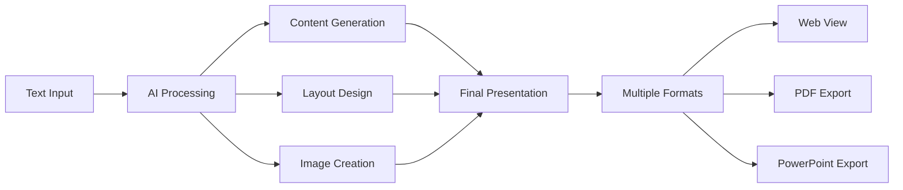

# Gamma API - Comprehensive Overview & Use Cases

## Mục Lục

1. [Gamma là gì?](#1-gamma-là-gì)
2. [Công dụng chính của Gamma API](#2-công-dụng-chính-của-gamma-api)
3. [Tính năng nổi bật](#3-tính-năng-nổi-bật)
4. [Use Cases thực tế](#4-use-cases-thực-tế)
5. [So sánh với các công cụ khác](#5-so-sánh-với-các-công-cụ-khác)
6. [Business Value](#6-business-value)
7. [Technical Implementation](#7-technical-implementation)
8. [Pricing & Credits](#8-pricing--credits)

---

## 1. Gamma là gì?

**Gamma** là một AI-powered presentation platform cho phép tạo presentations, documents, và web pages một cách tự động thông qua API. Thay vì phải design và tạo content thủ công, Gamma sử dụng AI để:

- **Generate content** từ text input
- **Design layouts** tự động
- **Create visuals** với AI image generation
- **Optimize formatting** cho different formats

### Gamma hoạt động như thế nào?



---

## 2. Công dụng chính của Gamma API

### 2.1 **AI Content Generation**

- **Input**: Raw text, outline, hoặc brief description
- **Output**: Fully structured presentation với slides, content, và design
- **AI Models**: Sử dụng advanced language models để tạo coherent content

```typescript
// Example: Tạo presentation từ topic
const presentation = await gammaService.createGeneration({
  inputText: 'Machine Learning in Healthcare: Applications and Future Trends',
  format: 'presentation',
  numCards: 15,
  textMode: 'generate',
})
```

### 2.2 **Automated Design & Layout**

- **Smart layouts**: AI chọn layout phù hợp với content type
- **Theme application**: Consistent design across all slides
- **Responsive design**: Tối ưu cho different screen sizes

### 2.3 **AI Image Generation**

- **18 AI models** khác nhau (Flux, DALL-E, Imagen, v.v.)
- **Custom styles**: Photorealistic, artistic, pictographic
- **Context-aware**: Images match với slide content

### 2.4 **Multi-format Export**

- **Web presentations**: Interactive online viewing
- **PDF documents**: Print-ready format
- **PowerPoint files**: Editable PPTX format

---

## 3. Tính năng nổi bật

### 3.1 **Content Intelligence**

```typescript
// Gamma có thể xử lý nhiều loại input
const examples = {
  // Brief topic
  simple: 'Digital Marketing Strategies 2024',

  // Detailed outline
  structured: `
    1. Introduction to AI in Education
    2. Current Applications
       - Personalized Learning
       - Automated Grading
       - Virtual Tutors
    3. Future Trends
    4. Implementation Challenges
  `,

  // Long-form content
  detailed: '750,000 character limit - entire research paper content',
}
```

### 3.2 **Flexible Configuration**

```typescript
const advancedConfig = {
  // Content control
  textMode: 'generate', // generate | condense | preserve
  textOptions: {
    language: 'vi', // Multilingual support
    tone: 'professional', // professional | casual | friendly
    length: 'detailed', // brief | medium | detailed
  },

  // Visual control
  imageOptions: {
    model: 'flux-1-pro', // 18 different AI models
    style: 'photorealistic',
  },

  // Layout control
  cardOptions: {
    dimensions: '16:9', // 16:9 | 4:3 | fluid
  },

  // Export options
  exportAs: ['pdf', 'pptx'],
  sharingOptions: {
    visibility: 'private',
  },
}
```

### 3.3 **Enterprise Features**

- **API-first approach**: Programmatic control
- **Batch processing**: Multiple presentations
- **Custom themes**: Brand consistency
- **Access control**: Private/public sharing
- **Credit management**: Usage tracking

---

## 4. Use Cases thực tế

### 4.1 **Corporate Training Platform**

```typescript
class CorporateTrainingService {
  // Tự động tạo training materials
  async generateTrainingModule(topic: string, department: string) {
    const presentation = await gammaService.createGeneration({
      inputText: `${topic} training for ${department} department`,
      format: 'presentation',
      numCards: 20,
      textOptions: {
        tone: 'professional',
        length: 'detailed',
      },
      imageOptions: {
        model: 'flux-1-pro',
        style: 'corporate professional',
      },
      additionalInstructions: 'Include practical examples and action items',
      exportAs: ['pdf', 'pptx'],
    })

    return {
      webUrl: presentation.urls.gamma,
      pdfDownload: presentation.urls.pdf,
      editablePptx: presentation.urls.pptx,
    }
  }

  // Use case: HR onboarding
  async createOnboardingPresentation(newHireRole: string) {
    return this.generateTrainingModule(`Company onboarding and ${newHireRole} role overview`, 'Human Resources')
  }
}
```

### 4.2 **Educational Content Creation**

```typescript
class EducationPlatform {
  // Tạo lecture slides từ syllabus
  async generateLectureSlides(courseContent: string, lesson: number) {
    const slides = await gammaService.createGeneration({
      inputText: courseContent,
      format: 'presentation',
      numCards: 25,
      textMode: 'condense', // Condense long content
      textOptions: {
        language: 'vi',
        tone: 'friendly',
        length: 'medium',
      },
      imageOptions: {
        model: 'imagen-3-pro',
        style: 'educational illustrations',
      },
      additionalInstructions: 'Include quiz questions and key takeaways',
      cardOptions: {
        dimensions: '16:9', // Standard classroom projection
      },
    })

    return slides
  }

  // Student assignment: Tạo presentation từ research
  async helpStudentCreatePresentation(researchPaper: string) {
    return await gammaService.createGeneration({
      inputText: researchPaper,
      format: 'presentation',
      numCards: 12,
      textMode: 'condense',
      textOptions: {
        tone: 'academic',
        length: 'brief',
      },
      additionalInstructions: 'Focus on key findings and conclusions',
    })
  }
}
```

### 4.3 **Marketing & Sales Automation**

```typescript
class MarketingAutomation {
  // Tạo pitch decks tự động
  async generatePitchDeck(productInfo: any, audience: string) {
    const pitchContent = `
      Product: ${productInfo.name}
      Target Market: ${productInfo.market}
      Key Features: ${productInfo.features.join(', ')}
      Competitive Advantages: ${productInfo.advantages}
      Business Model: ${productInfo.businessModel}
      Financial Projections: ${productInfo.projections}
    `

    return await gammaService.createGeneration({
      inputText: pitchContent,
      format: 'presentation',
      numCards: 15,
      textOptions: {
        tone: 'professional',
        length: 'medium',
      },
      imageOptions: {
        model: 'flux-1-pro',
        style: 'modern business graphics',
      },
      additionalInstructions: `Tailor for ${audience} audience, include compelling visuals and data charts`,
      exportAs: ['pdf', 'pptx'],
    })
  }

  // Social media content
  async createSocialMediaContent(campaign: string) {
    return await gammaService.createGeneration({
      inputText: campaign,
      format: 'social', // Optimized for social media
      numCards: 8,
      cardOptions: {
        dimensions: 'fluid', // Responsive for different platforms
      },
      imageOptions: {
        model: 'dall-e-3',
        style: 'vibrant social media graphics',
      },
    })
  }
}
```

### 4.4 **Content Marketing Platform**

```typescript
class ContentMarketingService {
  // Blog post to presentation converter
  async convertBlogToPresentation(blogPost: string) {
    return await gammaService.createGeneration({
      inputText: blogPost,
      format: 'presentation',
      textMode: 'condense',
      numCards: 10,
      textOptions: {
        tone: 'engaging',
        length: 'brief',
      },
      additionalInstructions: 'Create engaging slides suitable for webinar presentation',
    })
  }

  // Webinar series automation
  async generateWebinarSeries(topics: string[]) {
    const presentations = []

    for (const topic of topics) {
      const presentation = await gammaService.createGeneration({
        inputText: `Comprehensive guide to ${topic}`,
        format: 'presentation',
        numCards: 30,
        textOptions: {
          tone: 'professional',
          length: 'detailed',
        },
        imageOptions: {
          model: 'flux-1-pro',
          style: 'professional webinar graphics',
        },
        exportAs: ['pdf', 'pptx'],
      })

      presentations.push({
        topic,
        webinarSlides: presentation,
      })
    }

    return presentations
  }
}
```

### 4.5 **Client Reporting Automation**

```typescript
class ClientReportingService {
  // Tự động tạo monthly reports
  async generateMonthlyReport(clientData: any, metrics: any) {
    const reportContent = `
      Client: ${clientData.name}
      Reporting Period: ${metrics.period}
      
      Key Performance Indicators:
      - Website Traffic: ${metrics.traffic}
      - Conversion Rate: ${metrics.conversions}
      - ROI: ${metrics.roi}
      
      Campaign Performance:
      ${metrics.campaigns.map((c) => `- ${c.name}: ${c.performance}`).join('\n')}
      
      Recommendations:
      ${metrics.recommendations}
    `

    return await gammaService.createGeneration({
      inputText: reportContent,
      format: 'document', // Professional document format
      textMode: 'preserve', // Keep exact data
      textOptions: {
        tone: 'professional',
        length: 'detailed',
      },
      imageOptions: {
        model: 'imagen-3-pro',
        style: 'business charts and graphs',
      },
      additionalInstructions: 'Include data visualizations and executive summary',
      exportAs: ['pdf'],
    })
  }
}
```

---

## 5. So sánh với các công cụ khác

| Feature                   | Gamma API       | PowerPoint API | Canva API    | Google Slides API |
| ------------------------- | --------------- | -------------- | ------------ | ----------------- |
| **AI Content Generation** | ✅ Advanced     | ❌ None        | ❌ None      | ❌ None           |
| **AI Image Creation**     | ✅ 18 Models    | ❌ None        | ⚠️ Limited   | ❌ None           |
| **Auto Layout Design**    | ✅ Smart AI     | ❌ Manual      | ⚠️ Templates | ❌ Manual         |
| **Text-to-Presentation**  | ✅ Full Auto    | ❌ Manual      | ❌ Manual    | ❌ Manual         |
| **Multi-format Export**   | ✅ Web/PDF/PPTX | ⚠️ PPTX only   | ⚠️ Limited   | ⚠️ Limited        |
| **API-First Design**      | ✅ Native       | ⚠️ Complex     | ⚠️ Limited   | ✅ Good           |
| **Enterprise Ready**      | ✅ Yes          | ✅ Yes         | ⚠️ Limited   | ✅ Yes            |

### Gamma's Unique Value Proposition:

1. **Zero-to-Hero**: Từ text → Full presentation trong 1 API call
2. **AI-Powered Everything**: Content, design, images tất cả đều AI
3. **Developer-Friendly**: Simple API, không cần design skills
4. **Quality Output**: Professional-grade presentations

---

## 6. Business Value

### 6.1 **Cost Savings**

```typescript
// Traditional approach
const traditionalCost = {
  designerHours: 8, // 8 hours @ $50/hour
  contentWriterHours: 4, // 4 hours @ $40/hour
  totalCost: 8 * 50 + 4 * 40, // $560 per presentation
  timeToComplete: '2-3 days',
}

// Gamma API approach
const gammaApiCost = {
  apiCredits: 100, // ~$5 worth of credits
  developerTime: 0.5, // 30 minutes to integrate
  totalCost: 5, // $5 per presentation
  timeToComplete: '2-3 minutes',
}

// ROI: 99% cost reduction, 1440x faster
```

### 6.2 **Scalability**

```typescript
// Generate 100 presentations simultaneously
const bulkGeneration = async (topics: string[]) => {
  const promises = topics.map((topic) =>
    gammaService.createGeneration({
      inputText: topic,
      format: 'presentation',
    }),
  )

  return await Promise.all(promises)
}

// Impossible with traditional methods, trivial with Gamma API
```

### 6.3 **Consistency**

- **Brand compliance**: Consistent design across all presentations
- **Quality assurance**: AI ensures professional output
- **Template standardization**: Same high quality every time

---

## 7. Technical Implementation

### 7.1 **Integration Architecture**

```typescript
// NestJS Service Example
@Injectable()
export class PresentationService {
  constructor(private readonly gammaService: GammaService) {}

  async createBusinessPresentation(data: BusinessPresentationDto) {
    // 1. Validate input
    await this.validateInput(data)

    // 2. Generate presentation
    const generation = await this.gammaService.createGeneration({
      inputText: data.content,
      format: data.format,
      textOptions: data.textOptions,
      imageOptions: data.imageOptions,
    })

    // 3. Poll for completion
    const completed = await this.pollForCompletion(generation.generationId)

    // 4. Store results
    await this.storePresentation(completed)

    // 5. Return URLs
    return {
      webUrl: completed.urls.gamma,
      downloadPdf: completed.urls.pdf,
      editablePptx: completed.urls.pptx,
    }
  }

  private async pollForCompletion(generationId: string) {
    const maxAttempts = 30
    let attempts = 0

    while (attempts < maxAttempts) {
      const status = await this.gammaService.getGeneration(generationId)

      if (status.status === 'completed') {
        return status
      }

      if (status.status === 'failed') {
        throw new Error('Generation failed')
      }

      await new Promise((resolve) => setTimeout(resolve, 10000)) // Wait 10s
      attempts++
    }

    throw new Error('Generation timeout')
  }
}
```

### 7.2 **Error Handling & Retry Logic**

```typescript
@Injectable()
export class GammaApiService {
  async createGenerationWithRetry(request: CreateGenerationRequest, maxRetries = 3) {
    for (let attempt = 1; attempt <= maxRetries; attempt++) {
      try {
        return await this.gammaClient.createGeneration(request)
      } catch (error) {
        if (error.statusCode === 429) {
          // Rate limited - exponential backoff
          const delay = Math.pow(2, attempt) * 1000
          await new Promise((resolve) => setTimeout(resolve, delay))
          continue
        }

        if (error.statusCode === 403) {
          // No credits left
          throw new InsufficientCreditsException('No credits remaining')
        }

        if (attempt === maxRetries) {
          throw error
        }
      }
    }
  }
}
```

### 7.3 **Credit Management**

```typescript
@Injectable()
export class CreditManagementService {
  async checkCreditsBeforeGeneration(userId: string, estimatedCost: number) {
    const userCredits = await this.getUserCredits(userId)

    if (userCredits.remaining < estimatedCost) {
      throw new InsufficientCreditsException(`Need ${estimatedCost} credits, have ${userCredits.remaining}`)
    }

    return true
  }

  async estimateGenerationCost(request: CreateGenerationRequest): Promise<number> {
    let cost = 50 // Base cost for generation

    // Image generation costs
    if (request.imageOptions?.model) {
      const imageCredits = this.getImageModelCost(request.imageOptions.model)
      const estimatedImages = request.numCards * 0.7 // ~70% slides have images
      cost += Math.ceil(estimatedImages * imageCredits)
    }

    // Premium features
    if (request.exportAs?.includes('pptx')) cost += 25
    if (request.exportAs?.includes('pdf')) cost += 10

    return cost
  }

  private getImageModelCost(model: string): number {
    const costs = {
      'flux-1-quick': 2,
      'flux-1-pro': 8,
      'dall-e-3': 33,
      'flux-1-ultra': 30,
      // ... other models
    }

    return costs[model] || 2
  }
}
```

---

## 8. Pricing & Credits

### 8.1 **Credit System**

Gamma sử dụng credit-based pricing:

```typescript
const creditCosts = {
  // Base generation
  basicGeneration: 50,

  // Image models (per image)
  imageModels: {
    'flux-1-quick': 2, // Fast, good quality
    'flux-kontext-fast': 2, // Context-aware fast
    'imagen-3-flash': 2, // Google's fast model
    'flux-1-pro': 8, // High quality
    'imagen-3-pro': 8, // Google's pro model
    'dall-e-3': 33, // OpenAI's premium
    'flux-1-ultra': 30, // Highest quality
    'gpt-image-1-high': 120, // Premium GPT model
  },

  // Export formats
  pdfExport: 10,
  pptxExport: 25,

  // Estimated total costs
  typical: {
    basicPresentation: 75, // 50 + some images + PDF
    premiumPresentation: 200, // High-quality images + all exports
    bulkGeneration: 150, // Optimized for volume
  },
}
```

### 8.2 **Cost Optimization Strategies**

```typescript
class CostOptimizationService {
  // Choose cost-effective image models
  getOptimalImageModel(quality: 'basic' | 'standard' | 'premium') {
    const models = {
      basic: 'flux-1-quick', // 2 credits
      standard: 'flux-1-pro', // 8 credits
      premium: 'dall-e-3', // 33 credits
    }

    return models[quality]
  }

  // Batch operations for better efficiency
  async generateBulkPresentations(topics: string[]) {
    // Process in batches to manage rate limits
    const batchSize = 5
    const results = []

    for (let i = 0; i < topics.length; i += batchSize) {
      const batch = topics.slice(i, i + batchSize)
      const batchResults = await Promise.all(batch.map((topic) => this.generatePresentation(topic)))
      results.push(...batchResults)

      // Rate limiting pause
      await new Promise((resolve) => setTimeout(resolve, 1000))
    }

    return results
  }
}
```

---

## 9. Advanced Use Cases

### 9.1 **Multi-Language Content Generation**

```typescript
class MultiLanguageService {
  async generateLocalizedPresentations(content: string, languages: string[]) {
    const presentations = {}

    for (const lang of languages) {
      presentations[lang] = await gammaService.createGeneration({
        inputText: content,
        textOptions: {
          language: lang,
          tone: 'professional',
        },
        imageOptions: {
          model: 'flux-1-pro',
          style: `${lang} cultural appropriate visuals`,
        },
      })
    }

    return presentations
  }
}
```

### 9.2 **A/B Testing for Presentations**

```typescript
class PresentationTestingService {
  async createABTestVariants(content: string) {
    const variants = await Promise.all([
      // Variant A: Conservative approach
      gammaService.createGeneration({
        inputText: content,
        textOptions: { tone: 'professional', length: 'detailed' },
        imageOptions: { model: 'flux-1-pro', style: 'corporate' },
      }),

      // Variant B: Creative approach
      gammaService.createGeneration({
        inputText: content,
        textOptions: { tone: 'creative', length: 'brief' },
        imageOptions: { model: 'dall-e-3', style: 'modern artistic' },
      }),
    ])

    return {
      conservative: variants[0],
      creative: variants[1],
    }
  }
}
```

### 9.3 **Dynamic Content Updates**

```typescript
class DynamicContentService {
  // Update presentations with real-time data
  async updatePresentationWithLiveData(templateContent: string, liveData: any) {
    const updatedContent = this.injectLiveData(templateContent, liveData)

    return await gammaService.createGeneration({
      inputText: updatedContent,
      textMode: 'preserve', // Keep data accuracy
      additionalInstructions: 'Highlight the latest metrics and trends',
    })
  }

  private injectLiveData(template: string, data: any): string {
    return template
      .replace('{{revenue}}', data.revenue)
      .replace('{{growth}}', data.growth)
      .replace('{{date}}', new Date().toLocaleDateString())
  }
}
```

---

## 10. Best Practices & Recommendations

### 10.1 **Input Optimization**

```typescript
const bestPractices = {
  inputText: {
    // ✅ Good
    structured: 'Clear topic with bullet points and sections',
    specific: 'Include specific data, examples, and context',

    // ❌ Avoid
    vague: 'Make a presentation about business',
    tooShort: 'AI',
    unstructured: 'Random thoughts without organization',
  },

  additionalInstructions: {
    // ✅ Effective
    specific: 'Include call-to-action on final slide',
    actionable: 'Add interactive elements and engagement points',

    // ❌ Less effective
    generic: 'Make it good',
    conflicting: 'Be brief but also very detailed',
  },
}
```

### 10.2 **Performance Optimization**

```typescript
class PerformanceOptimizedService {
  // Cache common generations
  @Cacheable('presentations', 3600) // Cache for 1 hour
  async generateCommonPresentation(template: string) {
    return await gammaService.createGeneration({
      inputText: template,
      // ... config
    })
  }

  // Async processing for large batches
  async processBulkGenerations(requests: CreateGenerationRequest[]) {
    const queue = new Bull('presentation-generation')

    const jobs = requests.map((request) =>
      queue.add('generate', request, {
        attempts: 3,
        backoff: 'exponential',
      }),
    )

    return await Promise.all(jobs)
  }
}
```

---

## 11. Tóm tắt

**Gamma API** là một revolutionary tool cho việc tự động hóa presentation creation. Nó đặc biệt powerful cho:

### ✅ **Perfect For:**

- **Content-heavy businesses**: Marketing agencies, education, consulting
- **Rapid prototyping**: Quick pitch decks, proposals, reports
- **Scale operations**: Bulk content generation
- **Non-designers**: Teams without design resources
- **Automation lovers**: Developers building content platforms

### ⚠️ **Consider Alternatives If:**

- **Highly custom designs**: Unique brand requirements
- **Interactive presentations**: Complex animations/interactions
- **Offline-first**: No internet dependency needed
- **Budget constraints**: Very tight cost limitations

### 🎯 **Key Takeaways:**

1. **AI-First Approach**: Everything automated from content to design
2. **Developer-Friendly**: Simple API, great documentation
3. **Enterprise-Ready**: Scalable, reliable, feature-rich
4. **Cost-Effective**: Massive savings vs traditional methods
5. **Multi-Format**: Web, PDF, PowerPoint outputs
6. **Quality Results**: Professional-grade presentations

Gamma API transforms presentation creation từ một time-consuming manual process thành một automated, scalable, và cost-effective solution. Perfect cho modern businesses cần generate high-quality content at scale! 🚀
